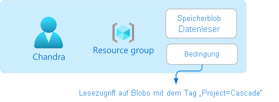

# <a name="what-is-azure-attribute-based-access-control-azure-abac-preview"></a>Was ist die attributbasierte Zugriffssteuerung in Azure (Azure Attribute-Based Access Control, Azure ABAC)? (Vorschauversion)

> [!IMPORTANT]
> Azure RBAC und Azure-Rollenzuweisungsbedingungen befinden sich derzeit in der Vorschauphase.
> Diese Vorschauversion wird ohne Vereinbarung zum Servicelevel bereitgestellt und ist nicht für Produktionsworkloads vorgesehen. Manche Features werden möglicherweise nicht unterstützt oder sind nur eingeschränkt verwendbar.
> Weitere Informationen finden Sie unter [Zusätzliche Nutzungsbestimmungen für Microsoft Azure-Vorschauen](https://azure.microsoft.com/support/legal/preview-supplemental-terms/).

Die attributbasierte Zugriffssteuerung (Attribute-Based Access Control, ABAC) ist ein Autorisierungssystem, bei dem der Zugriff auf der Grundlage von Attributen definiert wird, die Sicherheitsprinzipalen, Ressourcen und der Umgebung zugeordnet sind. Mit ABAC können Sie einem Sicherheitsprinzipal basierend auf Attributen Zugriff auf eine Ressource gewähren. Bei Azure ABAC handelt es sich um die Implementierung von ABAC für Azure.

## <a name="what-are-role-assignment-conditions"></a>Was sind Rollenzuweisungsbedingungen?

Die rollenbasierte Zugriffssteuerung von Azure (Azure Role-Based Access Control, Azure RBAC) ist ein Autorisierungssystem, mit dem Sie verwalten können, welche Benutzer Zugriff auf Azure-Ressourcen haben, welche Aktionen die Benutzer für diese Ressourcen ausführen können und auf welche Bereiche die Benutzer zugreifen können. In den meisten Fällen reicht Azure RBAC für die Zugriffsverwaltung mit Rollendefinitionen und Rollenzuweisungen aus. Es kann jedoch Fälle geben, in denen Sie eine präzisere Zugriffsverwaltung benötigen oder die Verwaltung mehrerer hundert Rollenzuweisungen vereinfachen möchten.

Azure ABAC baut auf Azure RBAC auf und fügt Rollenzuweisungsbedingungen auf der Grundlage von Attributen im Kontext bestimmter Aktionen hinzu. Eine *Rollenzuweisungsbedingung* ist eine zusätzliche Überprüfung, die Sie Ihrer Rollenzuweisung optional hinzufügen können, um eine präzisere Zugriffssteuerung zu ermöglichen. Eine Bedingung dient zum Filtern von Berechtigungen, die im Rahmen der Rollendefinition und Rollenzuweisung gewährt wurden. So können Sie beispielsweise eine Bedingung hinzufügen, die festgelegt, dass ein Objekt über ein bestimmtes Tag verfügen muss, damit das Objekt gelesen werden kann. Bedingungen können nicht dazu verwendet werden, den Zugriff auf bestimmte Ressourcen explizit zu verweigern.

## <a name="why-use-conditions"></a>Gründe für die Verwendung von Bedingungen

Die Verwendung von Rollenzuweisungsbedingungen hat im Wesentlichen drei Vorteile:

- **Präzisere Zugriffssteuerung:** Bei einer Rollenzuweisung wird eine Rollendefinition mit Aktionen und Datenaktionen verwendet, um einem Sicherheitsprinzipal Berechtigungen zu erteilen. Sie können Bedingungen schreiben, um diese Berechtigungen zu filtern und den Zugriff präziser zu steuern. Außerdem können Sie Bedingungen zu bestimmten Aktionen hinzufügen. So können Sie beispielsweise festlegen, dass ein bestimmter Benutzer nur Lesezugriff auf Blobs in Ihrem Abonnement haben soll, wenn die Blobs über das Tag „Project=Blue“ verfügen. 
- **Weniger Rollenzuweisungen:** Die Anzahl von Rollenzuweisungen pro Azure-Abonnement ist aktuell auf 2.000 Rollenzuweisungen begrenzt. Es gibt jedoch Szenarien, in denen Tausende von Rollenzuweisungen erforderlich wären. Alle diese Rollenzuweisungen müssten verwaltet werden. In diesen Szenarien lässt sich die Anzahl von Rollenzuweisungen durch Hinzufügen von Bedingungen ggf. erheblich reduzieren. 
- **Verwendung von Attributen mit spezifischer geschäftlicher Bedeutung:** Bedingungen ermöglichen die Verwendung von Attributen, die für Sie in der Zugriffssteuerung eine spezifische geschäftliche Bedeutung haben. Beispiele für Attribute wären etwa Projektname, Softwareentwicklungsphase und Klassifizierungsebenen. Die Werte dieser Ressourcenattribute sind dynamisch und ändern sich, wenn Benutzer zu anderen Teams oder Projekten wechseln.

## <a name="example-scenarios-for-conditions"></a>Beispielszenarien für Bedingungen

Das Hinzufügen einer Bedingung zu einer Rollenzuweisung kann in verschiedenen Szenarien sinnvoll sein. Die folgende Auflistung enthält einige Beispiele:

- Lesezugriff auf Blobs mit dem Tag „Project=Cascade“
- Neue Blobs müssen das Tag „Project=Cascade“ enthalten.
- Vorhandene Blobs müssen mit mindestens einem Projekt- oder Programmschlüssel gekennzeichnet sein.
- Vorhandene Blobs müssen mit einem Projektschlüssel und dem Wert „Cascade“, „Baker“ oder „Skagit“ gekennzeichnet sein.
- Lesen, Schreiben oder Löschen von Blobs in Containern mit dem Namen „blobs-example-container“
- Lesezugriff auf Blobs in Containern mit dem Namen „blobs-example-container“ und dem Pfad „readonly“
- Schreibzugriff auf Blobs in Containern mit dem Namen „Contosocorp“ und dem Pfad „uploads/contoso“
- Lesezugriff auf Blobs mit dem Tag „Program=Alpine“ und dem Pfad „logs“

Weitere Informationen zur Erstellung dieser Beispiele finden Sie unter [Beispiele für Azure-Rollenzuweisungsbedingungen (Vorschau)](../storage/common/storage-auth-abac-examples.md).

## <a name="where-can-conditions-be-added"></a>Wo können Bedingungen hinzugefügt werden?

Derzeit können Bedingungen zu integrierten oder benutzerdefinierten Rollenzuweisungen hinzugefügt werden, die über [Aktionen für Speicherblobdaten](conditions-format.md#actions) verfügen. Dies umfasst die folgenden integrierten Rollen:

- [Mitwirkender an Speicherblobdaten](built-in-roles.md#storage-blob-data-contributor)
- [Besitzer von Speicherblobdaten](built-in-roles.md#storage-blob-data-owner)
- [Leser von Speicherblobdaten](built-in-roles.md#storage-blob-data-reader)

Bedingungen werden im gleichen Bereich hinzugefügt wie die Rollenzuweisung. Zum Hinzufügen einer Bedingung müssen Sie genau wie bei Rollenzuweisungen über Berechtigungen vom Typ `Microsoft.Authorization/roleAssignments/write` verfügen.

Im Anschluss finden Sie die Speicherattribute, die Sie in Ihren Bedingungen verwenden können:

- Containername
- Blobpfad
- Schlüssel für Blobindextags
- Blobindextags

> [!TIP]
> Von Blobs wird auch das Speichern beliebiger benutzerdefinierter Schlüssel-Wert-Metadaten unterstützt. Metadaten sind zwar mit Blobindextags vergleichbar, für Bedingungen müssen jedoch Blobindextags verwendet werden. Weitere Informationen finden Sie unter [Verwalten und Finden von Azure-Blobdaten mit Blobindextags (Vorschau)](../storage/blobs/storage-manage-find-blobs.md).

## <a name="what-does-a-condition-look-like"></a>Wie sieht eine Bedingung aus?

Bedingungen können neuen oder vorhandenen Rollenzuweisungen hinzugefügt werden. Im Anschluss sehen Sie die Rolle [Storage-Blobdatenleser](built-in-roles.md#storage-blob-data-reader), die einem Benutzer namens Chandra in einem Ressourcengruppenbereich zugewiesen wurde. Außerdem wurde eine Bedingung hinzugefügt, die nur Lesezugriff auf Blobs mit dem Tag „Project=Cascade“ zulässt.



Wenn Chandra versucht, ein Blob ohne das Tag „Project=Cascade“ zu lesen, wird der Zugriff verweigert.


Im Azure-Portal sieht die Bedingung wie folgt aus:


Im Code sieht die Bedingung wie folgt aus:

```
(
    (
        !(ActionMatches{'Microsoft.Storage/storageAccounts/blobServices/containers/blobs/read'}
        AND
        @Request[subOperation] ForAnyOfAnyValues:StringEqualsIgnoreCase {'Blob.Read.WithTagConditions'})
    )
    OR
    (
        @Resource[Microsoft.Storage/storageAccounts/blobServices/containers/blobs/tags:Project<$key_case_sensitive$>] StringEqualsIgnoreCase 'Cascade'
    )
)
```

Weitere Informationen zum Format von Bedingungen finden Sie unter [Format und Syntax von Azure-Rollenzuweisungsbedingungen](conditions-format.md).

## <a name="conditions-and-privileged-identity-management-pim"></a>Bedingungen und Privileged Identity Management (PIM)

Sie können Bedingungen zu Zuweisungen berechtigter Rollen mithilfe von Privileged Identity Management (PIM) hinzufügen. Mit PIM müssen Ihre Endbenutzer eine Rollenzuweisung vom Typ „berechtigt“ aktivieren, um die Berechtigung zum Ausführen bestimmter Aktionen zu erhalten. Mithilfe von Bedingungen in PIM können Sie nicht nur den Zugriff eines Benutzers auf eine Ressource mithilfe von differenzierten Bedingungen einschränken, sondern diesen auch mit einer zeitgebundenen Einstellung, einem Genehmigungsworkflow, einem Überwachungspfad usw. schützen. Weitere Informationen finden Sie unter [Zuweisen von Azure-Ressourcenrollen in Privileged Identity Management](../active-directory/privileged-identity-management/pim-resource-roles-assign-roles.md).

## <a name="terminology"></a>Terminologie

Zum besseren Verständnis von Azure RBAC und Azure ABAC können Sie die folgende Begriffsliste heranziehen:

| Begriff | Definition |
| --- | --- |
| Attributbasierte Zugriffssteuerung (Attribute-Based Access Control, ABAC) | Ein Autorisierungssystem, bei dem der Zugriff auf der Grundlage von Attributen definiert wird, die Sicherheitsprinzipalen, Ressourcen und der Umgebung zugeordnet sind. Mit ABAC können Sie einem Sicherheitsprinzipal basierend auf Attributen Zugriff auf eine Ressource gewähren. |
| Azure ABAC | Die Implementierung von ABAC für Azure. |
| Rollenzuweisungsbedingung | Eine zusätzliche Überprüfung, die Sie Ihrer Rollenzuweisung optional hinzufügen können, um eine präzisere Zugriffssteuerung zu ermöglichen. |
| Attribut | In diesem Kontext ein Schlüssel-Wert-Paar wie „Project=Blue“, wobei „Project“ der Attributschlüssel und „Blue“ der Attributwert ist. Attribute und Tags werden im Zusammenhang mit der Zugriffssteuerung synonym verwendet. |
| expression | Eine Anweisung in einer Bedingung, die als „True“ oder „False“ ausgewertet wird. Ein Ausdruck hat folgendes Format: &lt;Attribut&gt; &lt;Operator&gt; &lt;Wert&gt;. |

## <a name="next-steps"></a>Nächste Schritte

- [Häufig gestellte Fragen zu Azure-Rollenzuweisungsbedingungen (Vorschau)](conditions-faq.md)
- [Beispiel für Azure-Rollenzuweisungsbedingungen (Vorschau)](../storage/common/storage-auth-abac-examples.md)
- [Tutorial: Hinzufügen einer Rollenzuweisungsbedingung zum Einschränken des Zugriffs auf Blobs mit dem Azure-Portal (Vorschau)](../storage/common/storage-auth-abac-portal.md)
