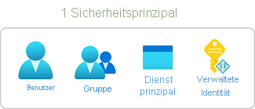
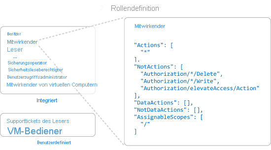
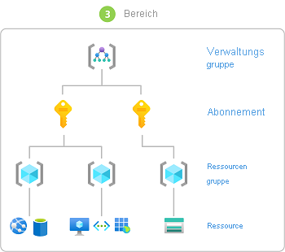
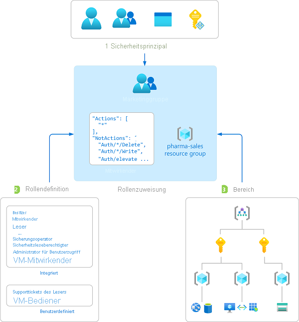
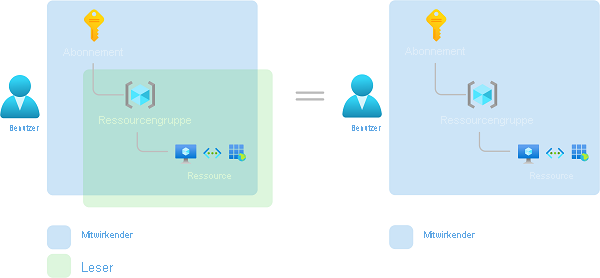

# Was ist die rollenbasierte Zugriffssteuerung in Azure (Azure Role-Based Access Control, Azure RBAC)?

Die Zugriffsverwaltung für Cloudressourcen ist eine wichtige Funktion für jede Organisation, die die Cloud nutzt. Mit der rollenbasierten Zugriffssteuerung in Azure (Azure RBAC) können Sie verwalten, welche Benutzer Zugriff auf Azure-Ressourcen haben, welche Aktionen die Benutzer für diese Ressourcen ausführen können und auf welche Bereiche die Benutzer zugreifen können.

Azure RBAC ist ein Autorisierungssystem, das auf [Azure Resource Manager](../azure-resource-manager/management/overview.md) basiert und eine präzise Verwaltung des Zugriffs auf Azure-Ressourcen ermöglicht.

Dieses Video bietet eine schnelle Übersicht über Azure RBAC.

>[!VIDEO https://www.youtube.com/embed/Dzhm-garKBM]

## Wofür kann ich Azure RBAC verwenden?

Hier sind einige Beispiele für die Verwendungsmöglichkeiten von Azure RBAC:

- Ein Benutzer kann virtuelle Computer in einem Abonnement verwalten, während ein anderer Benutzer virtuelle Netzwerke verwalten kann
- Eine DBA-Gruppe kann SQL-Datenbanken in einem Abonnement verwalten
- Ein Benutzer kann sämtliche Ressourcen in einer Ressourcengruppe verwalten, wie z.B. virtuelle Computer, Websites und Subnetze
- Eine Anwendung kann auf sämtliche Ressourcen in einer Ressourcengruppe zugreifen

## Funktionsweise von Azure RBAC

Sie können den Zugriff auf Ressourcen mit Azure RBAC steuern, indem Sie Azure-Rollen zuweisen. Dies ist ein wesentliches Konzept, das zur Durchsetzung von Berechtigungen verwendet wird. Eine Rollenzuweisung besteht aus drei Elementen: Sicherheitsprinzipal, Rollendefinition und Bereich.

### Sicherheitsprinzipal

Ein *Sicherheitsprinzipal* ist ein Objekt, das einen Benutzer, eine Gruppe, einen Dienstprinzipal oder eine verwaltete Identität darstellt, der bzw. die Zugriff auf Azure-Ressourcen anfordert. Sie können jedem dieser Sicherheitsprinzipale eine Rolle zuweisen.

### Rollendefinition

Eine *Rollendefinition* ist eine Sammlung von Berechtigungen. Sie wird in der Regel einfach *Rolle* genannt. Eine Rollendefinition listet die ausführbaren Vorgänge wie etwa Lesen, Schreiben und Löschen auf. Rollen können auf allgemeiner Ebene erteilt werden (z.B. Benutzer) oder spezifisch sein (z.B. Leser virtueller Computer).

Azure umfasst mehrere [integrierte Rollen](built-in-roles.md), die Sie verwenden können. Mit der Rolle [Mitwirkender von virtuellen Computern](built-in-roles.md#virtual-machine-contributor) können Benutzer beispielsweise virtuelle Computer erstellen und verwalten. Wenn die integrierten Rollen den Ansprüchen Ihrer Organisation nicht entsprechen, können Sie Ihre eigenen [benutzerdefinierten Azure-Rollen](custom-roles.md) erstellen.

Dieses Video bietet eine schnelle Übersicht über integrierte Rollen und benutzerdefinierte Rollen.

>[!VIDEO https://www.youtube.com/embed/I1mefHptRgo]

Mit Datenvorgängen in Azure können Sie Zugriff auf Daten in einem Objekt erteilen. Wenn ein Benutzer z.B. über Lesezugriff auf Daten in einem Speicherkonto verfügt, kann er die Blobs in diesem Speicherkonto lesen.

Weitere Informationen finden Sie unter [Grundlegendes zu Rollendefinitionen für Azure-Ressourcen](role-definitions.md).

### `Scope`

Ein *Bereich* ist der für den Zugriff geltende Ressourcensatz. Wenn Sie eine Rolle zuweisen, können Sie die zulässigen Aktionen durch das Definieren eines Bereichs weiter einschränken. Dies ist hilfreich, wenn Sie einem Benutzer die Rolle [Mitwirkender von Websites](built-in-roles.md#website-contributor) zuweisen möchten, jedoch nur für eine Ressourcengruppe.

In Azure können Sie auf vier Ebenen einen Bereich angeben: [Verwaltungsgruppe](../governance/management-groups/overview.md), Abonnement, [Ressourcengruppe](../azure-resource-manager/management/overview.md#resource-groups) oder Ressource. Bereiche sind in einer Beziehung zwischen über- und untergeordneten Elementen strukturiert. Sie können Rollen auf jeder dieser Bereichsebenen zuweisen.

Weitere Informationen zum Begriff „Bereich“ finden Sie unter [Grundlegendes zum Begriff „Bereich“](scope-overview.md).

### Rollenzuweisungen

Eine *Rollenzuweisung* ist der Prozess, in dem eine Rollendefinition zum Zweck der Zugriffserteilung in einem bestimmten Bereich an einen Benutzer, eine Gruppe, einen Dienstprinzipal oder eine verwaltete Identität gebunden wird. Der Zugriff wird durch Erstellen einer Rollenzuweisung erteilt und durch Entfernen einer Rollenzuweisung widerrufen.

Das folgende Diagramm zeigt ein Beispiel für eine Rollenzuweisung. In diesem Beispiel wurde der Gruppe „Marketing“ die Rolle [Mitwirkender](built-in-roles.md#contributor) für die Ressourcengruppe „Pharmavertrieb“ zugewiesen. Dies bedeutet, dass Benutzer in der Gruppe „Marketing“ in der Ressourcengruppe „Pharmavertrieb“ eine beliebige Azure-Ressource erstellen oder verwalten können. Benutzer der Gruppe „Marketing“ haben keinen Zugriff auf Ressourcen außerhalb der Ressourcengruppe „Pharmavertrieb“, sofern ihnen keine weitere Rolle zugewiesen wurde.

Sie können über das Azure-Portal, die Azure CLI, Azure PowerShell, Azure SDKs oder REST-APIs Rollen zuweisen.

Weitere Informationen finden Sie unter [Schritte zum Hinzufügen einer Rollenzuweisung](role-assignments-steps.md).

## Mehrere Rollenzuweisungen

Was geschieht bei mehreren überlappenden Rollenzuweisungen? Azure RBAC ist ein additives Modell. Die hinzugefügten Rollenzuweisungen stellen daher die Summe Ihrer effektiven Berechtigungen dar. Sehen Sie sich das folgende Beispiel an, in dem einem Benutzer die Rolle „Mitwirkender“ im Abonnementbereich und die Rolle „Leser“ für eine Ressourcengruppe zugewiesen wird. Die Summe der Berechtigungen vom Typ „Mitwirkender“ und der Berechtigungen vom Typ „Leser“ entspricht praktisch der Rolle „Mitwirkender“ für das Abonnement. Daher hat die Zuweisung der Rolle „Leser“ in diesem Fall keine Auswirkung.

## Ablehnungszuweisungen

Früher war Azure RBAC ein Modell, in dem es nur Zulassungen und keine Ablehnungen gab, jetzt unterstützt Azure RBAC jedoch auch Ablehnungszuweisungen auf eingeschränkte Weise. Ähnlich wie eine Rollenzuweisung verknüpft eine *Ablehnungszuweisung* in einem bestimmten Bereich einen Satz von Aktionen mit einem Benutzer, einer Gruppe, einem Dienstprinzipal oder einer verwalteten Identität, um den Zugriff zu verweigern. In einer Rollenzuweisung wird einen Satz von Aktionen definiert, die *zulässig* sind, während in einer Ablehnungszuweisung eine Reihe von Aktionen definiert wird, die *nicht zulässig* sind. Das heißt, Ablehnungszuweisungen blockieren Aktionen für bestimmte Benutzer, auch wenn diese durch eine Rollenzuweisung Zugriff erhalten. Ablehnungszuweisungen haben Vorrang vor Rollenzuweisungen.

Weitere Informationen finden Sie unter [Verstehen von Ablehnungszuweisungen für Azure-Ressourcen](deny-assignments.md).

## Ermitteln des Benutzerzugriffs auf eine Ressource durch Azure RBAC

Im Folgenden finden Sie die allgemeinen Schritte, über die Azure RBAC ermittelt, ob Sie Zugriff auf eine Ressource auf der Verwaltungsebene haben. Es ist hilfreich, dies zu verstehen, wenn Sie versuchen, ein Zugriffsproblem zu behandeln.

1. Ein Benutzer (oder Dienstprinzipal) erhält ein Token für Azure Resource Manager.

    Das Token enthält die Gruppenmitgliedschaften des Benutzers (einschließlich transitiver Gruppenmitgliedschaften).

1. Der Benutzer führt einen REST-API-Aufruf an Azure Resource Manager mit dem angefügten Token durch.

1. Azure Resource Manager ruft alle Rollenzuweisungen und Ablehnungszuweisungen ab, die die Ressource, für die die Aktion ausgeführt wird, betreffen.

1. Azure Resource Manager begrenzt die Rollenzuweisungen, die diesen Benutzer oder seine Gruppe betreffen, und ermittelt, welche Rollen der Benutzer für diese Ressource besitzt.

1. Azure Resource Manager ermittelt, ob die Aktion im API-Aufruf in den Rollen, die der Benutzer für diese Ressource besitzt, enthalten ist.

1. Wenn der Benutzer keine Rolle mit der Aktion als angefordertem Bereich besitzt, wird kein Zugriff gewährt. Andernfalls überprüft Azure Resource Manager, ob eine Ablehnungszuweisung zutrifft.

1. Wenn eine Ablehnungszuweisung zutrifft, wird der Zugriff blockiert. Andernfalls wird der Zugriff gewährt.

## Lizenzanforderungen

[!INCLUDE [Azure AD free license](../../includes/active-directory-free-license.md)]

## Nächste Schritte

- [Zuweisen von Azure-Rollen über das Azure-Portal](role-assignments-portal.md)
- [Grundlegendes zu den verschiedenen Rollen](rbac-and-directory-admin-roles.md)
- [Cloud Adoption Framework: Ressourcenzugriffsverwaltung in Azure](/azure/cloud-adoption-framework/govern/resource-consistency/resource-access-management)
