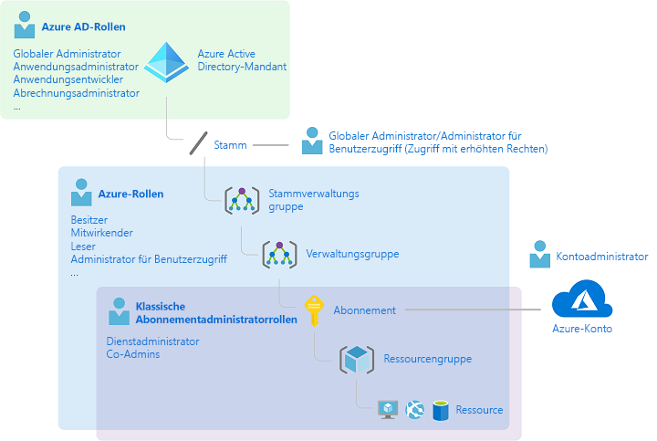
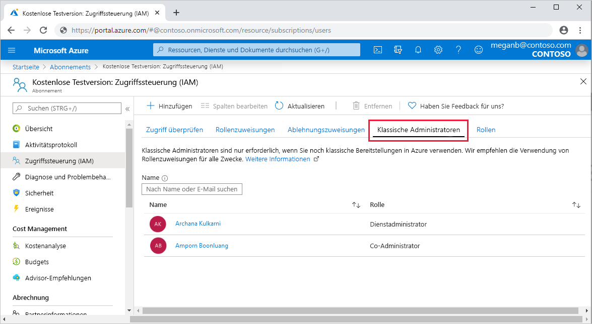
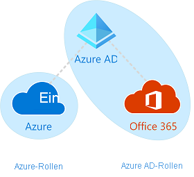

# Administratorrollen für klassische Abonnements, Azure-Rollen und Azure AD-Rollen

Wenn Azure neu für Sie ist, kann es schwierig sein, alle unterschiedlichen Rollen in Azure zu verstehen. In diesem Artikel werden die folgenden Rollen und ihre Verwendung beschrieben:
- Administrator für klassisches Abonnement
- Azure-Rollen
- Azure Active Directory-Rollen (Azure AD)

## Rollenbeziehungen

Es ist hilfreich, sich mit dem Entwicklungsverlauf auszukennen, um die Rollen in Azure besser zu verstehen. Bei der ersten Veröffentlichung von Azure wurde der Zugriff auf Ressourcen mit nur drei Administratorrollen verwaltet: Kontoadministrator, Dienstadministrator und Co-Admin. Später wurde die rollenbasierte Zugriffssteuerung von Azure (Azure Role-Based Access Control, Azure RBAC) hinzugefügt. Die rollenbasierte Zugriffssteuerung in Azure ist ein neueres Autorisierungssystem, mit dem eine präzise Verwaltung des Zugriffs auf Azure-Ressourcen ermöglicht wird. Azure RBAC umfasst viele integrierte Rollen, kann in unterschiedlichen Bereichen zugewiesen werden und ermöglicht es Ihnen, Ihre eigenen benutzerdefinierten Rollen zu erstellen. Für die Verwaltung der Ressourcen in Azure AD, z. B. Benutzer, Gruppen und Domänen, gibt es mehrere Azure AD-Rollen.

Das folgende Diagramm enthält eine allgemeine Darstellung zur Beziehung der Rollen „Administrator für klassisches Abonnement“, „Azure“ und „Azure AD“.

## Administrator für klassisches Abonnement

Kontoadministrator, Dienstadministrator und Co-Administrator sind die drei Rollen für „Administrator für klassisches Abonnement“ in Azure. Administratoren für klassische Abonnements verfügen über Vollzugriff auf das Azure-Abonnement. Sie können Ressourcen über das Azure-Portal, Azure Resource Manager-APIs und APIs des klassischen Azure-Bereitstellungsmodells verwalten. Das Konto, das zum Registrieren für Azure verwendet wird, wird automatisch sowohl als Kontoadministrator als auch als Dienstadministrator eingerichtet. Anschließend können zusätzliche Co-Administratoren hinzugefügt werden. Der Dienstadministrator und die Co-Administratoren haben gleichwertigen Zugriff wie Benutzer, denen für den Abonnementbereich die Rolle „Besitzer“ (eine Azure-Rolle) zugewiesen wurde. In der folgenden Tabelle sind die Unterschiede zwischen diesen drei Rollen für Administratoren für klassische Abonnements beschrieben.

| Administrator für klassisches Abonnement | Begrenzung | Berechtigungen | Notizen |
| --- | --- | --- | --- |
| Kontoadministrator | 1 pro Azure-Konto | <ul><li>Verwalten der Abrechnung im [Azure-Portal](https://portal.azure.com/#blade/Microsoft_Azure_Billing/SubscriptionsBlade)</li><li>Verwalten aller Abonnements in einem Konto</li><li>Erstellen neuer Abonnements</li><li>Kündigen von Abonnements</li><li>Ändern der Abrechnung für ein Abonnement</li><li>Ändern des Dienstadministrators</li></ul> | Vom Konzept her der für die Abrechnung zuständige Besitzer des Abonnements. Der Kontoadministrator kann nicht auf das Azure-Portal zugreifen. |
| Dienstadministrator | 1 pro Azure-Abonnement | <ul><li>Verwalten von Diensten im [Azure-Portal](https://portal.azure.com)</li><li>Kündigen des Abonnements</li><li>Zuweisen von Benutzern zur Rolle „CO-Administrator“</li></ul> | Standardmäßig ist der Kontoadministrator für ein neues Abonnement gleichzeitig auch der Dienstadministrator. Der Dienstadministrator verfügt über gleichwertigen Zugriff wie ein Benutzer, dem für den Abonnementbereich die Rolle „Besitzer“ zugewiesen ist. Der Dienstadministrator hat Vollzugriff auf das Azure-Portal. |
| Co-Administrator | 200 pro Abonnement | <ul><li>Gleiche Zugriffsrechte wie der Dienstadministrator, aber kann die Zuordnung von Abonnements zu Azure-Verzeichnissen nicht ändern</li><li>Zuweisen von Benutzern zur Rolle „Co-Administrator“, aber kann den Dienstadministrator nicht ändern</li></ul> | Der Co-Administrator verfügt über gleichwertigen Zugriff wie ein Benutzer, dem für den Abonnementbereich die Rolle „Besitzer“ zugewiesen ist. |

Im Azure-Portal können Sie auf der Registerkarte **Klassische Administratoren** Co-Administratoren verwalten oder den Dienstadministrator anzeigen.

Im Azure-Portal können Sie auf dem Eigenschaftenblatt Ihres Abonnements den Dienstadministrator anzeigen/ändern oder den Kontoadministrator anzeigen.

Weitere Informationen finden Sie unter [Verwaltung von Azure-Abonnements im klassischen Bereitstellungsmodell](classic-administrators.md).

### Azure-Konto und Azure-Abonnements

Ein Azure-Konto stellt eine Abrechnungsbeziehung dar. Ein Azure-Konto umfasst eine Benutzeridentität, mindestens ein Azure-Abonnement und verschiedene zugeordnete Azure-Ressourcen. Die Person, die das Konto erstellt, ist der Kontoadministrator für alle Abonnements, die unter diesem Konto erstellt werden. Diese Person ist auch der Standard-Dienstadministrator für das Abonnement.

Mit Azure-Abonnements können Sie den Zugriff auf Azure-Ressourcen organisieren. Mit diesen Abonnements können Sie darüber hinaus steuern, wie die Ressourcennutzung gemeldet, abgerechnet und bezahlt wird. Jedes Abonnement kann in Bezug auf Abrechnung und Zahlung unterschiedlich eingerichtet sein, sodass Sie je nach Büro, Abteilung, Projekt usw. verschiedene Abonnements und verschiedene Pläne haben. Jeder Dienst gehört zu einem Abonnement, und die Abonnement-ID kann für programmgesteuerte Vorgänge erforderlich sein.

Jedes Abonnement ist einem Azure AD-Verzeichnis zugeordnet. Sie finden das Verzeichnis, dem das Abonnement zugeordnet ist, indem Sie im Azure-Portal zu **Abonnements** navigieren und ein Abonnement auswählen, um das Verzeichnis anzuzeigen.

Konten und Abonnements werden im [Azure-Portal](https://portal.azure.com/#blade/Microsoft_Azure_Billing/SubscriptionsBlade) verwaltet.

## Azure-Rollen

Die rollenbasierte Zugriffssteuerung in Azure (Azure RBAC) ist ein Autorisierungssystem, das auf [Azure Resource Manager](../azure-resource-manager/management/overview.md) basiert und eine präzise Verwaltung des Zugriffs auf Azure-Ressourcen, z.B. Compute und Speicher, ermöglicht. Azure RBAC umfasst mehr als 70 integrierte Rollen. Es gibt vier grundlegende Azure-Rollen. Die ersten drei Rollen gelten für alle Ressourcentypen:

| Azure-Rolle | Berechtigungen | Notizen |
| --- | --- | --- |
| [Besitzer](built-in-roles.md#owner) | <ul><li>Vollzugriff auf alle Ressourcen</li><li>Delegieren des Zugriffs an andere Personen</li></ul> | Dem Dienstadministrator und den Co-Administratoren wird die Rolle „Besitzer“ für den Abonnementbereich zugewiesen Gilt für alle Ressourcentypen. |
| [Mitwirkender](built-in-roles.md#contributor) | <ul><li>Erstellen und Verwalten aller Arten von Azure-Ressourcen</li><li>Erstellen eines neuen Mandanten in Azure Active Directory</li><li>Kann keinen Zugriff für andere Personen gewähren</li></ul> | Gilt für alle Ressourcentypen. |
| [Leser](built-in-roles.md#reader) | <ul><li>Anzeigen von Azure-Ressourcen</li></ul> | Gilt für alle Ressourcentypen. |
| [Benutzerzugriffsadministrator](built-in-roles.md#user-access-administrator) | <ul><li>Verwalten des Benutzerzugriffs auf Azure-Ressourcen</li></ul> |  |

Die verbleibenden integrierten Rollen ermöglichen die Verwaltung bestimmter Azure-Ressourcen. Mit der Rolle [Mitwirkender von virtuellen Computern](built-in-roles.md#virtual-machine-contributor) können Benutzer beispielsweise virtuelle Computer erstellen und verwalten. Eine Liste mit allen integrierten Rollen finden Sie unter [Integrierte Rollen für die rollenbasierte Zugriffssteuerung in Azure](built-in-roles.md).

Nur das Azure-Portal und die Azure Resource Manager-APIs unterstützen Azure RBAC. Benutzer, Gruppen und Anwendungen, denen Azure-Rollen zugewiesen sind, können die [APIs des klassischen Azure-Bereitstellungsmodells](../azure-resource-manager/management/deployment-models.md) nicht verwenden.

Im Azure-Portal werden Rollenzuweisungen, für die Azure RBAC genutzt wird, auf dem Blatt **Zugriffssteuerung (IAM)** angezeigt. Dieses Blatt ist im gesamten Portal zu finden, z. B. unter Verwaltungsgruppen, Abonnements, Ressourcengruppen und verschiedenen Ressourcen.

Wenn Sie auf die Registerkarte **Rollen** klicken, wird die Liste mit den integrierten und benutzerdefinierten Rollen angezeigt.

Weitere Informationen finden Sie unter [Hinzufügen oder Entfernen von Rollenzuweisungen mithilfe des Azure-Portals](role-assignments-portal.md).

## Azure AD-Rollen

Azure AD-Rollen werden verwendet, um Azure AD-Ressourcen in einem Verzeichnis zu verwalten, z. B. Erstellen oder Bearbeiten von Benutzern, Zuweisen von Administratorrollen für andere Personen, Zurücksetzen von Benutzerkennwörtern, Verwalten von Benutzerlizenzen und Verwalten von Domänen. In der folgenden Tabelle sind einige der wichtigeren Azure AD-Rollen beschrieben:

| Azure AD-Rolle | Berechtigungen | Notizen |
| --- | --- | --- |
| [Globaler Administrator](../active-directory/users-groups-roles/directory-assign-admin-roles.md#company-administrator-permissions) | <ul><li>Verwalten des Zugriffs auf alle administrativen Features in Azure Active Directory und auf Dienste, die im Verbund mit Azure Active Directory genutzt werden</li><li>Zuweisen von Administratorrollen für andere Personen</li><li>Zurücksetzen des Kennworts für alle Benutzer und alle anderen Administratoren</li></ul> | Die Person, die die Anmeldung für den Azure Active Directory-Mandanten vornimmt, wird zu einem globalen Administrator. |
| [Benutzeradministrator](../active-directory/users-groups-roles/directory-assign-admin-roles.md#user-administrator) | <ul><li>Erstellen und Verwalten aller Aspekte von Benutzern und Gruppen</li><li>Verwalten von Supporttickets</li><li>Überwachen der Dienstintegrität</li><li>Ändern von Kennwörtern für Benutzer, Helpdeskadministratoren und andere Benutzeradministratoren</li></ul> |  |
| [Rechnungsadministrator](../active-directory/users-groups-roles/directory-assign-admin-roles.md#billing-administrator) | <ul><li>Tätigen von Einkäufen</li><li>Verwalten von Abonnements</li><li>Verwalten von Supporttickets</li><li>Überwachen der Dienstintegrität</li></ul> |  |

Im Azure-Portal können Sie die Liste mit den Azure AD-Rollen auf dem Blatt **Rollen und Administratoren** anzeigen. Eine Liste mit allen Azure AD-Rollen finden Sie unter [Berechtigungen der Administratorrolle in Azure Active Directory](../active-directory/users-groups-roles/directory-assign-admin-roles.md).

## Unterschiede zwischen Azure-Rollen und Azure AD-Rollen

Grob gesehen werden mit Azure-Rollen Berechtigungen zum Verwalten von Azure-Ressourcen gesteuert, während mit Azure AD-Rollen Berechtigungen zum Verwalten von Azure Active Directory-Ressourcen gesteuert werden. Die folgende Tabelle enthält einen Vergleich einiger Unterschiede.

| Azure-Rollen | Azure AD-Rollen |
| --- | --- |
| Verwalten des Zugriffs auf Azure-Ressourcen | Verwalten des Zugriffs auf Azure Active Directory-Ressourcen |
| Unterstützt benutzerdefinierte Rollen | Unterstützt benutzerdefinierte Rollen |
| Bereich kann auf mehreren Ebenen angegeben werden (Verwaltungsgruppe, Abonnement, Ressourcengruppe, Ressource) | Bereich befindet sich auf Mandantenebene |
| Zugriff auf Rolleninformationen ist per Azure-Portal, Azure CLI, Azure PowerShell, Azure Resource Manager-Vorlagen, REST-API möglich | Zugriff auf Rolleninformationen ist per Azure-Verwaltungsportal, Microsoft 365 Admin Center, Microsoft Graph, Azure AD PowerShell möglich |

### Überlappen sich Azure-Rollen und Azure AD-Rollen?

Standardmäßig wird mit Azure-Rollen und Azure AD-Rollen nicht der gesamte Azure- bzw. Azure AD-Bereich abgedeckt. Aber wenn ein globaler Administrator den Zugriff erweitert, indem er im Azure-Portal den Switch **Zugriffsverwaltung für Azure-Ressourcen** auswählt, wird dem globalen Administrator die Rolle [Benutzerzugriffsadministrator](built-in-roles.md#user-access-administrator) (eine Azure-Rolle) für alle Abonnements eines bestimmten Mandanten gewährt. Die Rolle „Benutzerzugriffsadministrator“ ermöglicht es dem Benutzer, anderen Benutzern Zugriff auf Azure-Ressourcen zu gewähren. Dieser Switch kann hilfreich sein, um wieder Zugriff auf das Abonnement zu erlangen. Weitere Informationen finden Sie unter [Erhöhen der Zugriffsrechte zum Verwalten aller Azure-Abonnements und Verwaltungsgruppen](elevate-access-global-admin.md).

Mit mehreren Azure AD-Rollen sind Azure AD und Microsoft 365 abgedeckt, z. B. bei den Rollen „Globaler Administrator“ und „Benutzeradministrator“. Wenn Sie beispielsweise Mitglied der Rolle „Globaler Administrator“ sind, verfügen Sie über globale Administratorfunktionen in Azure AD und Microsoft 365, z. B. Vornehmen von Änderungen an Microsoft Exchange und Microsoft SharePoint. Standardmäßig hat der globale Administrator aber keinen Zugriff auf Azure-Ressourcen.

## Nächste Schritte

- [Was ist die rollenbasierte Zugriffssteuerung in Azure (Azure Role-Based Access Control, Azure RBAC)?](overview.md)
- [Berechtigungen der Administratorrolle in Azure Active Directory](../active-directory/users-groups-roles/directory-assign-admin-roles.md)
- [Verwaltung von Azure-Abonnements im klassischen Bereitstellungsmodell](classic-administrators.md)
