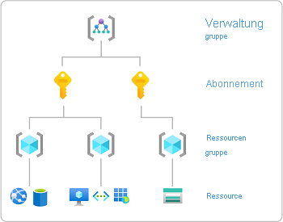

# Zuweisen von Azure-Rollen über das Azure-Portal

[!INCLUDE [Azure RBAC definition grant access](../../includes/role-based-access-control/definition-grant.md)] In diesem Artikel wird die Zuweisung von Rollen über das Azure-Portal beschrieben.

Anweisungen zum Zuweisen von Administratorrollen zu einem Benutzer in Azure Active Directory finden Sie unter [Anzeigen und Zuweisen von Administratorrollen in Azure Active Directory](../active-directory/roles/manage-roles-portal.md).

## Voraussetzungen

[!INCLUDE [Azure role assignment prerequisites](../../includes/role-based-access-control/prerequisites-role-assignments.md)]

## Schritt 1: Ermitteln des erforderlichen Bereichs

[!INCLUDE [Scope for Azure RBAC introduction](../../includes/role-based-access-control/scope-intro.md)]

[!INCLUDE [Scope for Azure RBAC least privilege](../../includes/role-based-access-control/scope-least.md)]Weitere Informationen zum Begriff „Bereich“ finden Sie unter [Grundlegendes zum Begriff „Bereich“](scope-overview.md).

1. Melden Sie sich beim [Azure-Portal](https://portal.azure.com) an.

1. Suchen Sie im oberen Suchfeld nach dem Bereich, für den Sie Zugriff gewähren möchten. Suchen Sie beispielsweise nach **Verwaltungsgruppen**, **Abonnements**, **Ressourcengruppen** oder eine bestimmten Ressource.

    

1. Klicken Sie auf die gewünschte Ressource für diesen Bereich.

    Nachfolgend sehen Sie ein Beispiel für eine Ressourcengruppe.

    

## Schritt 2: Öffnen des Bereichs „Rollenzuweisung hinzufügen“

Die Zuweisung von Rollen zum Gewähren von Zugriff auf Azure-Ressourcen erfolgt in der Regel über die Seite **Zugriffssteuerung (IAM)** . Diese wird auch als Identity & Access Management (IAM) bezeichnet und wird an mehreren Stellen im Azure-Portal angezeigt.

1. Klicken Sie auf **Zugriffssteuerung (IAM)**.

    Die folgende Abbildung zeigt ein Beispiel der Seite „Zugriffssteuerung (IAM)“ für eine Ressourcengruppe.

    

1. Klicken Sie auf die Registerkarte **Rollenzuweisungen**, um die Rollenzuweisungen für diesen Bereich anzuzeigen.

1. Klicken Sie auf **Hinzufügen** > **Rollenzuweisung hinzufügen**.
   Wenn Sie keine Berechtigungen zum Zuweisen von Rollen haben, ist die Option „Rollenzuweisung hinzufügen“ deaktiviert.

   

    Der Bereich „Rollenzuweisung hinzufügen“ wird geöffnet.

   

## Schritt 3: Auswählen der geeigneten Rolle

1. Suchen oder scrollen Sie in der Liste **Rollen**, um die Rolle zu finden, die Sie zuweisen möchten.

    Um Ihnen bei der Ermittlung der entsprechenden Rolle zu helfen, können Sie mit dem Mauszeiger auf das Info-Symbol zeigen, um eine Beschreibung der Rolle anzuzeigen. Weitere Informationen finden Sie im Artikel [Integrierte Azure-Rollen](built-in-roles.md).

   

1. Klicken Sie, um die Rolle auszuwählen.

## Schritt 4: Auswahl zugriffsberechtigter Benutzer

1. Wählen Sie in der Liste **Zugriff zuweisen zu** den Typ des Sicherheitsprinzipals aus, dem Sie den Zugriff zuweisen möchten.

    | type | BESCHREIBUNG |
    | --- | --- |
    | **Benutzer, Gruppe oder Dienstprinzipal** | Wenn Sie die Rolle einem Benutzer, einer Gruppe oder einem Dienstprinzipal (Anwendung) zuweisen möchten, wählen Sie diesen Typ aus. |
    | **Benutzerseitig zugewiesene verwaltete Identität** | Wenn Sie die Rolle einer [benutzerseitig zugewiesenen verwalteten Identität](../active-directory/managed-identities-azure-resources/overview.md) zuweisen möchten, wählen Sie diesen Typ aus. |
    | *Systemseitig zugewiesene verwaltete Identität* | Wenn Sie die Rolle einer [systemseitig zugewiesenen verwalteten Identität](../active-directory/managed-identities-azure-resources/overview.md) zuweisen möchten, wählen Sie die Azure-Dienstinstanz aus, in der sich die verwaltete Identität befindet. |

   

1. Wenn Sie eine benutzerseitig zugewiesene verwaltete Identität oder eine systemseitig zugewiesene verwaltete Identität ausgewählt haben, wählen Sie das **Abonnement** aus, in dem sich die verwaltete Identität befindet.

1. Suchen Sie im Abschnitt **Auswählen** nach dem Sicherheitsprinzipal, indem Sie eine Zeichenfolge eingeben oder durch die Liste scrollen.

   

1. Nachdem Sie den Dienstprinzipal gefunden haben, wählen Sie ihn durch Mausklick aus.

## Schritt 5: Zuweisen einer Rolle

1. Klicken Sie auf **Speichern**, um die Rolle zuzuweisen.

   Nach einigen Augenblicken wird dem Sicherheitsprinzipal die Rolle für den Bereich zugewiesen.

1. Überprüfen Sie auf der Registerkarte **Rollenzuweisungen**, ob die Rollenzuweisung in der Liste angezeigt wird.

    

## Nächste Schritte

- [Zuweisen von Administratorzugriff für ein Azure-Abonnement](role-assignments-portal-subscription-admin.md)
- [Entfernen von Azure-Rollenzuweisungen](role-assignments-remove.md)
- [Behandeln von Problemen bei Azure RBAC](troubleshooting.md)
