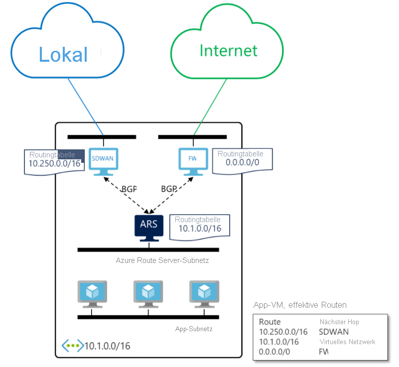

# Was ist Azure Route Server (Vorschau)? 

Azure Route Server vereinfacht das dynamische Routing zwischen Ihrem virtuellen Netzwerkgerät (Network Virtual Appliance, NVA) und Ihrem virtuellen Netzwerk. Sie können Routinginformationen direkt über das Border Gateway Protocol-Routingprotokoll (BGP-Routingprotokoll) zwischen jedem NVA, das das BGP-Routingprotokoll unterstützt, und dem softwaredefinierten Azure-Netzwerk (Software Defined Network, SDN) in Azure Virtual Network (VNet) austauschen, ohne Routingtabellen manuell konfigurieren oder verwalten zu müssen. Azure Route Server ist ein vollständig verwalteter Dienst, der mit Hochverfügbarkeit konfiguriert ist.

> [!IMPORTANT]
> Azure Route Server (Vorschau) befindet sich derzeit in der öffentlichen Vorschauphase.
> Diese Vorschauversion wird ohne Vereinbarung zum Servicelevel bereitgestellt und ist nicht für Produktionsworkloads vorgesehen. Manche Features werden möglicherweise nicht unterstützt oder sind nur eingeschränkt verwendbar.
> Weitere Informationen finden Sie unter [Zusätzliche Nutzungsbestimmungen für Microsoft Azure-Vorschauen](https://azure.microsoft.com/support/legal/preview-supplemental-terms/).

## Wie funktioniert dies?

Im folgenden Diagramm wird die Funktionsweise und Verwendung von Azure Route Server mit einem SDWAN-NVA und einem Sicherheits-NVA in einem virtuellen Netzwerk dargestellt. Nachdem Sie das BGP-Peering eingerichtet haben, empfängt Azure Route Server eine lokale Route (10.250.0.0/16) vom SDWAN-Gerät und eine Standardroute (0.0.0.0/0) von der Firewall. Diese Routen werden dann automatisch auf den virtuellen Computern (Virtual Machines, VMs) im virtuellen Netzwerk konfiguriert. Folglich wird der gesamte an das lokale Netzwerk gerichtete Datenverkehr an das SDWAN-Gerät gesendet. Und der gesamte Datenverkehr in das Internet wird an die Firewall gesendet. In umgekehrter Richtung sendet Azure Route Server die Adresse des virtuellen Netzwerks (10.1.0.0/16) an beide NVAs. Das SDWAN-Gerät kann sie an das lokale Netzwerk weitergeben.

## Hauptvorteile 

Azure Route Server vereinfacht die Konfiguration, Verwaltung und Bereitstellung Ihres NVAs in Ihrem virtuellen Netzwerk.  

* Sie müssen die Routingtabelle auf Ihrem NVA nicht mehr manuell aktualisieren, wenn die Adresse Ihres virtuellen Netzwerks aktualisiert wird. 

* Sie müssen [benutzerdefinierte Routen](../virtual-network/virtual-networks-udr-overview.md) nicht mehr manuell aktualisieren, wenn Ihr NVA neue Routen ankündigt oder alte Routen zurückzieht. 

* Sie müssen aus Gründen der Resilienz oder Leistung keinen Lastenausgleich mehr vor Ihrem NVA konfigurieren. Wenn Sie mehrere Instanzen Ihres NVAs mittels Peering mit Azure Route Server verbinden, können Sie die BGP-Attribute auf Ihrem NVA konfigurieren. Anhand dieser BGP-Attribute erkennt Azure Route Server, welche NVA-Instanz aktiv oder passiv sein soll. 

* Die Schnittstelle zwischen dem NVA und Azure Route Server basiert auf einem allgemeinen Standardprotokoll. Solange Ihr NVA BGP unterstützt, können Sie es mittels Peering mit Azure Route Server verbinden. Weitere Informationen finden Sie unter [Von Route Server unterstützte Routingprotokolle](route-server-faq.md#protocol).

* Sie können Azure Route Server in jedem neuen oder vorhandenen virtuellen Netzwerk bereitstellen. 

## Häufig gestellte Fragen

Häufig gestellte Fragen zu Azure Route Server finden Sie unter [Azure Route Server: Häufig gestellte Fragen](route-server-faq.md).

## Nächste Schritte

- [Erfahren Sie, wie Sie Azure Route Server konfigurieren.](quickstart-configure-route-server-portal.md)
- [Erfahren Sie, wie Azure Route Server mit Azure ExpressRoute und Azure VPN verwendet wird](expressroute-vpn-support.md).
