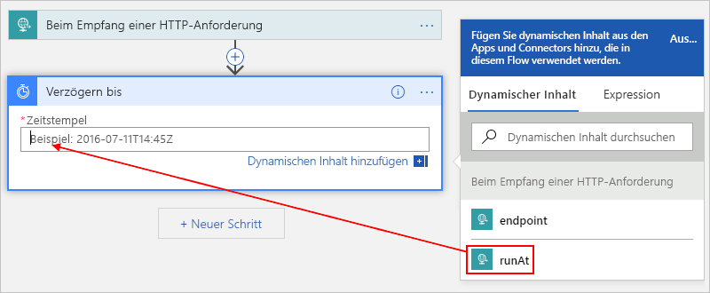
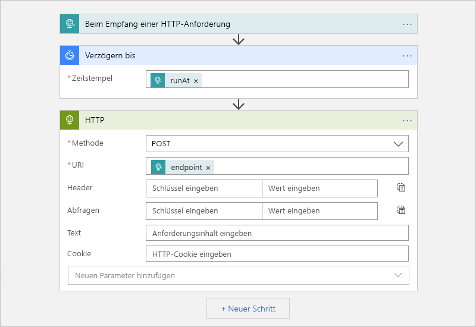

# <a name="migrate-azure-scheduler-jobs-to-azure-logic-apps"></a>Migrieren von Azure Scheduler-Aufträgen zu Azure Logic Apps

> [!IMPORTANT]
> [Azure Logic Apps](../logic-apps/logic-apps-overview.md) ersetzt den Microsoft Azure Scheduler, der [ eingestellt wird](#retire-date). Wenn Sie weiterhin mit den Aufträgen arbeiten möchten, die Sie in Scheduler eingerichtet haben, sollten Sie so bald wie möglich zu Azure Logic Apps migrieren. Führen Sie dazu die in diesem Artikel beschriebenen Schritte aus. 
>
> Scheduler ist nicht mehr in der Azure-Portal verfügbar, aber die [REST-API](/rest/api/scheduler) und [Azure Scheduler-PowerShell-Cmdlets](scheduler-powershell-reference.md) sind weiterhin verfügbar, damit Sie Ihre Aufträge und Auftragssammlungen verwalten können.

In diesem Artikel wird gezeigt, wie Sie einmalige und wiederkehrende Aufträge planen können, indem Sie anstelle von Azure Scheduler automatisierte Workflows mit Azure Logic Apps erstellen. Wenn Sie geplante Aufträge mit Logic Apps erstellen, haben Sie folgende Vorteile:

* Sie können Ihre Aufträge mithilfe eines visuellen Designers und [einsatzbereiter Connectors](../connectors/apis-list.md) von Hunderten von Diensten erstellen, wie z. B. Azure Blob Storage, Azure Service Bus, Office 365 Outlook und SAP.

* Sie verwalten alle geplanten Workloads als erstklassige Azure-Ressourcen. Sie müssen sich keine Gedanken um *Auftragssammlungen* machen, da jede Logik-App eine eigene Azure-Ressource darstellt.

* Sie können mithilfe einer einzelnen Logik-App mehrere einmalige Aufträge ausführen.

* Sie legen Zeitpläne fest, die Zeitzonen unterstützen und automatisch an die Sommerzeit (DST) angepasst werden.

Weitere Informationen finden Sie unter [Was ist Azure Logic Apps?](../logic-apps/logic-apps-overview.md). Alternativ dazu können Sie mit der folgenden Schnellstartanleitung auch Ihre erste Logik-App erstellen: [Schnellstart: Erstellen Ihres ersten automatisierten Workflows mit Azure Logic Apps – Azure-Portal](../logic-apps/quickstart-create-first-logic-app-workflow.md)

## <a name="prerequisites"></a>Voraussetzungen

* Ein Azure-Abonnement. Wenn Sie nicht über ein Azure-Abonnement verfügen, können Sie sich [für ein kostenloses Azure-Konto registrieren](https://azure.microsoft.com/free/).

* Verwenden Sie zum Auslösen Ihrer Logik-App durch Senden von HTTP-Anforderungen ein Tool wie die [Postman-Desktop-App](https://www.getpostman.com/apps).

## <a name="migrate-by-using-a-script"></a>Migrieren mithilfe eines Skripts

Jeder Scheduler-Auftrag ist einzigartig. Daher gibt es für die Migration von Scheduler-Aufträgen zu Azure Logic Apps kein allgemeingültiges Tool. Sie können jedoch [dieses Skript](https://github.com/Azure/logicapps/tree/master/scripts/scheduler-migration) an Ihre Anforderungen anpassen.

## <a name="schedule-one-time-jobs"></a>Planen von einmaligen Aufträgen

Sie können mehrere einmalige Aufträge ausführen, indem Sie eine einzelne Logik-App erstellen.

1. Erstellen Sie im [Azure-Portal](https://portal.azure.com) eine leere Logik-App im Logik-App-Designer.

   Führen Sie die grundlegenden in diesem Artikel aus: [Schnellstart: Erstellen Ihres ersten automatisierten Workflows mit Azure Logic Apps – Azure-Portal](../logic-apps/quickstart-create-first-logic-app-workflow.md).

1. Geben Sie im Suchfeld `when a http request` ein, um den Anforderungstrigger zu suchen. Wählen Sie in der Triggerliste den folgenden Trigger aus: **Beim Empfang einer HTTP-Anforderung**

   

1. Für den Anforderungstrigger können Sie optional ein JSON-Schema angeben, wodurch der Logik-App-Designer die Struktur für die Eingaben, die im eingehenden Aufruf des Anforderungstriggers enthalten sind, erfassen und Ihnen die Auswahl der Ausgaben später in Ihrem Workflow vereinfachen kann.

   Geben Sie im Feld **JSON-Schema für Anforderungstext** das Schema ein, z. B.:

   

   Wenn Sie kein Schema haben, jedoch über eine Beispielnutzlast im JSON-Format verfügen, können Sie aus dieser Nutzlast ein Schema generieren.

   1. Wählen Sie im Anforderungstrigger **Beispielnutzlast zum Generieren eines Schemas verwenden** aus.

   1. Geben Sie unter **Geben oder fügen Sie eine JSON-Beispielnutzlast ein** Ihre Beispielnutzlast ein, und klicken Sie auf **Fertig** . Beispiel:

      

      ```json
      {
         "runat": "2012-08-04T00:00Z",
         "endpoint": "https://www.bing.com"
      }
      ```

1. Wählen Sie unter dem Trigger die Option **Nächster Schritt** aus.

1. Geben Sie im Suchfeld den Begriff `delay until` als Filter ein. Wählen Sie in der Liste mit den Aktionen diese Aktion aus: **Verzögern bis**

   Diese Aktion hält den Workflow Ihrer Logik-App bis zum angegebenen Datum zur jeweiligen Uhrzeit an.

   

1. Geben Sie den Zeitstempel für den Zeitpunkt an, wenn Sie den Logik-App-Workflow starten möchten.

   Wenn Sie in das Feld **Zeitstempel** klicken, wird eine Liste mit dynamischem Inhalt angezeigt, sodass Sie optional eine Ausgabe über den Trigger auswählen können.

   

1. Fügen Sie alle auszuführenden Aktionen hinzu, indem Sie eine Auswahl aus den [Hunderten einsatzbereiten Connectors](../connectors/apis-list.md) treffen.

   Beispielsweise können Sie eine HTTP-Aktion, die eine Anforderung an eine URL sendet, oder Aktionen einschließen, die mit Storage-Warteschlangen, Service Bus-Warteschlangen oder Service Bus-Themen arbeiten:

   

1. Wenn Sie fertig sind, speichern Sie Ihre Logik-App.

   

   Wenn Sie Ihre Logik-App zum ersten Mal speichern, wird die Endpunkt-URL für den Anforderungstrigger Ihrer Logik-App im Feld **URL für 'HTTP Post'** angezeigt. Wenn Sie Ihre Logik-App aufrufen und Eingaben für Ihre Logik-App zur Verarbeitung senden möchten, verwenden Sie diese URL als Aufrufziel.

   

1. Kopieren und speichern Sie diese Endpunkt-URL, um später eine manuelle Anforderung senden zu können, die Ihre Logik-App auslöst.

## <a name="start-a-one-time-job"></a>Starten eines einmaligen Auftrags

Um manuell einen einmaligen Auftrag auszuführen oder auslösen, senden Sie einen Aufruf an die Endpunkt-URL für den Anforderungstrigger Ihrer Logik-App. Geben Sie in diesem Aufruf die zu sendende Eingabe oder Nutzlast an, die Sie weiter oben eventuell durch Angeben eines Schemas beschrieben haben.

Mit der Postman-App können Sie beispielsweise eine POST-Anforderung mit ähnlichen Einstellungen wie in diesem Beispiel erstellen und dann auf **Senden** klicken, um die Anforderung zu erstellen.

| Anforderungsmethode | URL | Body | Header |
|----------------|-----|------|---------|
| **POST** | <*endpoint-URL*> | **raw** <p>**JSON(application/json)** <p>Geben Sie in das Feld **raw** die Nutzlast ein, die in der Anforderung gesendet werden soll. <p>**Hinweis** : Diese Einstellung konfiguriert automatisch die **Header** -Werte. | **Key** : Content-Type <br>**Wert** : „application/json“ |
|||||


Nachdem Sie den Aufruf senden, wird die Antwort Ihrer Logik-App auf der Registerkarte **Text** unter dem Optionsfeld **raw** angezeigt. 

<a name="workflow-run-id"></a>

> [!IMPORTANT]
>
> Wenn Sie den Auftrag später abbrechen möchten, wählen Sie die Registerkarte **Header** aus. Suchen und kopieren Sie den Headerwert **x-ms-workflow-run-id** in der Antwort. 
>
> 

## <a name="cancel-a-one-time-job"></a>Abbrechen eines einmaligen Auftrags

Jeder einmalige Auftrag in Logic Apps wird als einzelne Logik-App-Instanz ausgeführt. Um einen einmaligen Auftrag abzubrechen, können Sie [Workflowausführungen – Abbrechen](/rest/api/logic/workflowruns/cancel) in der Logic Apps-REST-API verwenden. Geben Sie beim Senden eines Aufrufs an den Trigger die [Workflowausführungs-ID](#workflow-run-id) an.

## <a name="schedule-recurring-jobs"></a>Planen wiederkehrender Aufträge

1. Erstellen Sie im [Azure-Portal](https://portal.azure.com) eine leere Logik-App im Logik-App-Designer.

   Führen Sie die grundlegenden in diesem Artikel aus: [Schnellstart: Erstellen Ihres ersten automatisierten Workflows mit Azure Logic Apps – Azure-Portal](../logic-apps/quickstart-create-first-logic-app-workflow.md).

1. Geben Sie im Suchfeld den Begriff „Wiederholung“ als Filter ein. Wählen Sie in der Triggerliste den folgenden Trigger aus: **Serie**

   

1. Bei Bedarf können Sie einen erweiterten Zeitplan einrichten.

   

   Weitere Informationen zu erweiterten Planungsoptionen finden Sie unter [Erstellen und Ausführen von wiederkehrenden Aufgaben und Workflows mit Azure Logic Apps](../connectors/connectors-native-recurrence.md).

1. Fügen Sie andere Aktionen hinzu, indem Sie eine Auswahl aus den [Hunderten einsatzbereiten Connectors](../connectors/apis-list.md) treffen. Wählen Sie unter dem Trigger die Option **Nächster Schritt** aus. Suchen Sie nach den gewünschten Aktionen, und wählen Sie sie aus.

   Beispielsweise können Sie eine HTTP-Aktion, die eine Anforderung an eine URL sendet, oder Aktionen einschließen, die mit Storage-Warteschlangen, Service Bus-Warteschlangen oder Service Bus-Themen arbeiten:

   

1. Wenn Sie fertig sind, speichern Sie Ihre Logik-App.

   

## <a name="advanced-setup"></a>Erweitertes Setup

Im Folgenden werden weitere Möglichkeiten zum Anpassen Ihrer Aufträge vorgestellt.

### <a name="retry-policy"></a>Wiederholungsrichtlinie

Um die Art und Weise zu steuern, mit der eine Aktion bei einem vorübergehenden Fehler in Ihrer Logik-App erneut ausgeführt wird, können Sie die [Wiederholungsrichtlinie](../logic-apps/logic-apps-exception-handling.md#retry-policies) in den Einstellungen für jede Aktion festlegen. Beispiel:

1. Öffnen Sie das Menü der Aktion mithilfe der Auslassungspunkte ( **...** ), und klicken Sie auf **Einstellungen** .

   

1. Wählen Sie die gewünschte Wiederholungsrichtlinie aus. Weitere Informationen zu den einzelnen Richtlinien finden Sie unter [Wiederholungsrichtlinien](../logic-apps/logic-apps-exception-handling.md#retry-policies).

   

## <a name="handle-exceptions-and-errors"></a>Behandeln von Ausnahmen und Fehlern

Wenn bei der Ausführung der Standardaktion ein Fehler in Azure Scheduler auftritt, können Sie eine alterative Aktion ausführen, die die Fehlerbedingung behandelt. In Azure Logic Apps können Sie diese Aufgabe ebenfalls ausführen.

1. Bewegen Sie im Logik-App-Designer oberhalb der Aktion, die verarbeitet werden soll, den Zeiger über den Pfeil zwischen den Schritten, und klicken Sie auf **Parallelen Branch hinzufügen** .

   

1. Suchen Sie die Aktion, die stattdessen als alternative Aktion ausgeführt werden soll, und wählen Sie sie aus.

   

1. Öffnen Sie das Menü der alternativen Aktion mithilfe der Auslassungspunkte ( **...** ), und klicken Sie auf **Ausführung konfigurieren nach** .

   

1. Deaktivieren Sie das Kontrollkästchen der Eigenschaft **ist erfolgreich** . Wählen Sie die folgenden Eigenschaften aus: **ist fehlerhaft** , **wird übersprungen** und **Timeout aufgetreten** .

   

1. Klicken Sie auf **Fertig** , wenn Sie fertig sind.

Weitere Informationen zur Behandlung von Ausnahmen finden Sie unter [Abfangen und Behandeln von Fehlern mit der runAfter-Eigenschaft](../logic-apps/logic-apps-exception-handling.md#control-run-after-behavior).

## <a name="faq"></a>Häufig gestellte Fragen

<a name="retire-date"></a>

**F:** Wann wird Azure Scheduler eingestellt? <br>
**A:** Azure Scheduler wird voraussichtlich am 31. September 2019 vollständig eingestellt. Wichtige Schritte, die Sie vor diesem Datum ausführen sollten, sowie einen detaillierten Zeitplan finden Sie unter [Scheduler-Deaktivierung auf 31. Dezember 2019 verschoben](https://azure.microsoft.com/updates/extending-retirement-date-of-scheduler/). Allgemeine Updates finden Sie unter [Azure-Updates: Scheduler](https://azure.microsoft.com/updates/?product=scheduler).

**F:** Was geschieht mit meinen Auftragssammlungen und Aufträgen, nachdem der Dienst eingestellt wird? <br>
**A:** Alle Scheduler-Auftragssammlungen und -Aufträge werden dann nicht mehr ausgeführt und aus dem System gelöscht.

**F:** Muss ich vor der Migration meiner Scheduler-Aufträge zu Logic Apps Sicherungen bzw. sonstige Aufgaben durchführen? <br>
**A:** Wir empfehlen Ihnen, immer Ihre Arbeiten zu sichern. Stellen Sie sicher, dass die von Ihnen erstellten Logik-Apps wie erwartet ausgeführt werden, bevor Sie Ihre Scheduler-Aufträge löschen oder deaktivieren.

**F:** Gibt es ein Tool, mit dem ich meine Aufträge von Scheduler zu Logic Apps migrieren kann? <br>
**A:** Jeder Scheduler-Auftrag ist einzigartig. Ein universell gültiges Tool gibt es nicht. Sie können jedoch [dieses Skript für die Migration von Azure Scheduler-Aufträgen zu Azure Logic Apps](https://github.com/Azure/logicapps/tree/master/scripts/scheduler-migration) an Ihre Anforderungen anpassen.

**F:** Wo erhalte ich Support für die Migration meiner Scheduler-Aufträge? <br>
**A:** Nachfolgend finden Sie einige Ressourcen, über die Sie Support anfordern können:

**Azure portal**

Wenn Ihr Azure-Abonnement mit einem kostenpflichtigen Supportplan ausgestattet ist, können Sie eine technische Supportanfrage im Azure-Portal erstellen. Andernfalls können Sie eine andere Supportoption auswählen.

1. Wählen Sie im Hauptmenü des [Azure-Portals](https://portal.azure.com)**Hilfe + Support** aus.

1. Wählen Sie im Menü **Support** die Option **Neue Supportanfrage** aus. Geben Sie zu Ihrer Anfrage die folgenden Informationen an:

   | Eigenschaft | Wert |
   |---------|-------|
   | **Problemtyp** | **Technisch** |
   | **Abonnement** | <*Ihr Azure-Abonnement*> |
   | **Service** | Klicken Sie unter **Überwachung & Verwaltung** auf **Scheduler** . Wenn Sie **Scheduler** nicht finden können, wählen Sie zunächst **Alle Dienste** aus. |
   ||| 

1. Wählen Sie die gewünschte Supportoption aus. Wenn Sie über einen kostenpflichtigen Supportplan verfügen, klicken Sie auf **Weiter** .

**Community**

* [Q&A-Seite von Microsoft zu Azure Logic Apps](/answers/topics/azure-logic-apps.html)
* [Stack Overflow](https://stackoverflow.com/questions/tagged/azure-scheduler)

## <a name="next-steps"></a>Nächste Schritte

* [Erstellen und Ausführen von wiederkehrenden Aufgaben und Workflows mit Azure Logic Apps](../connectors/connectors-native-recurrence.md)