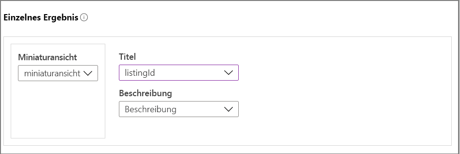
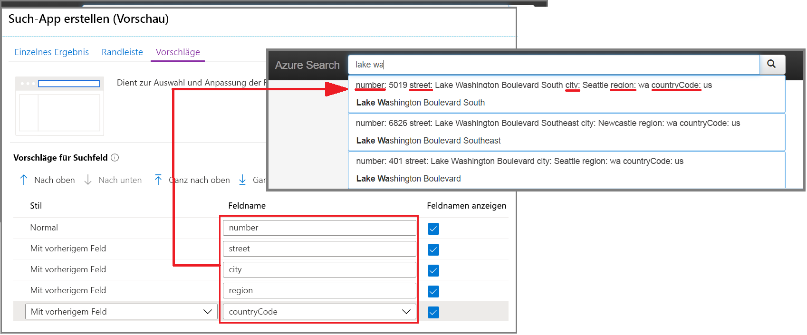
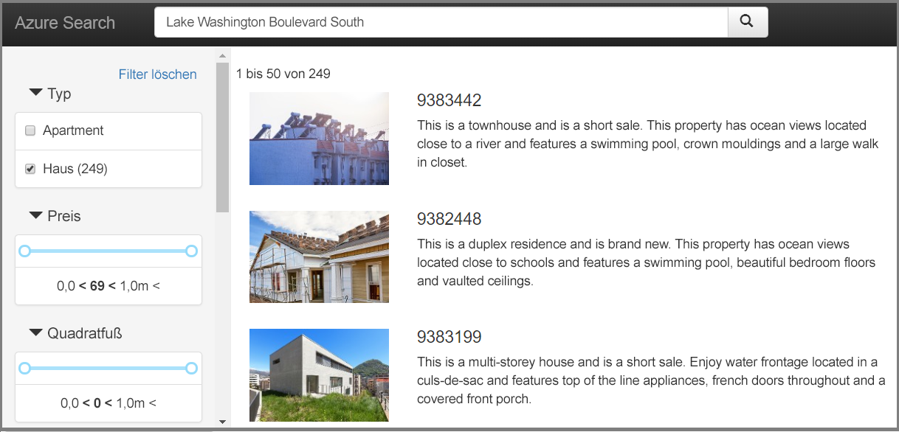

# Schnellstart: Erstellen einer Such-App im Portal (Azure Cognitive Search)

Verwenden Sie den Assistenten **Such-App erstellen** im Portal, um eine herunterladbare, Localhost-ähnliche Web-App zu generieren, die in einem Browser ausgeführt wird. Die generierte App ist abhängig von ihrer Konfiguration sofort einsatzbereit und verfügt über eine Liveverbindung mit einem Remoteindex. Eine Standard-App kann eine Suchleiste, einen Ergebnisbereich, Randleistenfilter und Typeahead-Unterstützung beinhalten.

Wenn Sie kein Azure-Abonnement besitzen, können Sie ein [kostenloses Konto](https://azure.microsoft.com/free/?WT.mc_id=A261C142F) erstellen, bevor Sie beginnen. 

## Voraussetzungen

Es empfiehlt sich, ein Upgrade auf die [aktuelle Version von Microsoft Edge](https://www.microsoft.com/edge) oder auf die derzeit aktuelle Version des Chrome-Browsers von Google durchzuführen.

[Erstellen Sie einen Dienst für die kognitive Azure-Suche](search-create-service-portal.md), oder [suchen Sie nach einem vorhandenen Dienst](https://ms.portal.azure.com/#blade/HubsExtension/BrowseResourceBlade/resourceType/Microsoft.Search%2FsearchServices) in Ihrem aktuellen Abonnement. Für diesen Schnellstart können Sie einen kostenlosen Dienst verwenden. 

[Erstellen Sie einen Index](search-create-index-portal.md) als Grundlage für Ihre Anwendung. 

In dieser Schnellstartanleitung werden die integrierten Immobilienbeispieldaten und der zugehörige Index verwendet, da sie Miniaturbilder enthalten. Führen Sie zum Erstellen des in dieser Übung verwendeten Index den Assistenten **Daten importieren** aus, und verwenden Sie die Datenquelle *realestate-us-sample*.

Wenn der Index bereit ist, fahren Sie mit dem nächsten Schritt fort.

## Starten des Assistenten

1. Melden Sie sich beim [Azure-Portal](https://portal.azure.com) an, und [suchen Sie Ihren Suchdienst](https://ms.portal.azure.com/#blade/HubsExtension/BrowseResourceBlade/resourceType/Microsoft.Search%2FsearchServices).

1. Wählen Sie auf der Übersichtsseite unter den Links in der Mitte der Seite die Option **Indizes** aus. 

1. Wählen Sie in der Liste mit den bereits vorhandenen Indizes den Index *realestate-us-sample-index* aus.

1. Wählen Sie oben auf der Indexseite die Option **Such-App erstellen (Vorschau)** aus, um den Assistenten zu starten.

1. Wählen Sie auf der ersten Seite des Assistenten **CORS aktivieren** (Cross-Origin Resource Sharing; Ressourcenfreigabe zwischen verschiedenen Ursprüngen) aus, um Ihrer Indexdefinition CORS-Unterstützung hinzuzufügen. Dieser Schritt ist zwar optional, ohne ihn stellt Ihre lokale Web-App jedoch keine Verbindung mit dem Remoteindex her.

## Konfigurieren von Suchergebnissen

Der Assistent bietet ein einfaches Layout für gerenderte Suchergebnisse mit Platz für ein Miniaturbild, einen Titel und eine Beschreibung. Diesen Elementen liegt jeweils ein Feld in Ihrem Index zugrunde, das die Daten liefert. 

1. Wählen Sie unter „Miniaturbild“ das Feld *thumbnail* des Index *realestate-us-sample* aus. Dieses Beispiel enthält Miniaturbilder in Form von Bildern mit einer URL-Adresse, die in einem Feld namens *thumbnail* gespeichert sind. Sollte Ihr Index keine Bilder enthalten, lassen Sie dieses Feld leer.

1. Wählen Sie unter „Titel“ ein Feld aus, das die Eindeutigkeit des jeweiligen Dokuments vermittelt. In diesem Beispiel ist die Angebots-ID eine gute Wahl.

1. Wählen Sie unter „Beschreibung“ ein Feld mit Details aus, auf deren Grundlage Benutzer ggf. besser entscheiden können, ob sie zu diesem speziellen Dokument navigieren möchten.

## Hinzufügen einer Randleiste

Der Suchdienst unterstützt die Facettennavigation, und diese wird häufig als Randleiste gerendert. Facetten basieren auf filter- und facettierbaren Feldern, die im Indexschema ausgedrückt werden.

Die Facettennavigation in Azure Cognitive Search ist eine kumulative Filterfunktion. Durch Auswählen mehrerer Filter innerhalb einer einzelnen Kategorie – beispielsweise „Seattle“ und „Bellevue“ unter „City“ (Ort) – werden die Ergebnisse ausgeweitet. Wenn Sie mehrere kategorieübergreifende Filter auswählen, werden die Ergebnisse eingegrenzt.

> [!TIP]
> Das vollständige Indexschema kann im Portal angezeigt werden. Suchen Sie auf der Übersichtsseite des jeweiligen Index nach dem Link **Indexdefinition (JSON)** . Für die Facettennavigation geeignete Felder verfügen über die Attribute „filterable: true“ und „facetable: true“.

Akzeptieren Sie die aktuelle Facettenauswahl, und wechseln Sie zur nächsten Seite.

## Hinzufügen von Typeahead

Die Typeahead-Funktion steht in Form von AutoVervollständigen und Abfragevorschlägen zur Verfügung. Der Assistent unterstützt Abfragevorschläge. Der Suchdienst gibt auf der Grundlage der Tastatureingaben des Benutzers eine Liste vervollständigter Abfragezeichenfolgen zurück, die als Eingabe ausgewählt werden können.

Vorschläge werden für bestimmte Felddefinitionen aktiviert. Der Assistent bietet Optionen, mit denen Sie den Informationsumfang in einem Vorschlag konfigurieren können. 

Im folgenden Screenshot werden die Optionen im Assistenten einer gerenderten Seite in der App gegenübergestellt. Sie sehen, wie die Feldauswahl verwendet und wie mithilfe von „Feldname anzeigen“ gesteuert wird, ob die Beschriftung in den Vorschlag einbezogen wird.

## Erstellen, Herunterladen und Ausführen

1. Wählen Sie **Such-App erstellen** aus, um die HTML-Datei zu generieren.

1. Wählen Sie nach entsprechender Aufforderung die Option **Download your app** (App herunterladen) aus, um die Datei herunterzuladen.

1. Öffnen Sie die Datei. Die daraufhin angezeigte Seite sollte in etwa wie auf dem folgenden Screenshot aussehen. Geben Sie einen Begriff ein, und grenzen Sie die Ergebnisse mithilfe von Filtern ein. 

Der zugrunde liegende Index besteht aus fiktiven, generierten, dokumentübergreifend duplizierten Daten, und die Beschreibungen passen manchmal nicht zum Bild. Wenn Sie eine App auf der Grundlage Ihrer eigenen Indizes erstellen, können Sie ein stimmigeres Ergebnis erwarten.

## Bereinigen von Ressourcen

Wenn Sie in Ihrem eigenen Abonnement arbeiten, sollten Sie sich am Ende eines Projekts überlegen, ob Sie die erstellten Ressourcen noch benötigen. Ressourcen, die weiterhin ausgeführt werden, können Sie Geld kosten. Sie können entweder einzelne Ressourcen oder aber die Ressourcengruppe löschen, um den gesamten Ressourcensatz zu entfernen.

Ressourcen können im Portal über den Link **Alle Ressourcen** oder **Ressourcengruppen** im linken Navigationsbereich gesucht und verwaltet werden.

Denken Sie bei Verwendung eines kostenlosen Diensts an die Beschränkung auf maximal drei Indizes, Indexer und Datenquellen. Sie können einzelne Elemente über das Portal löschen, um unter dem Limit zu bleiben. 

## Nächste Schritte

Die Standard-App eignet sich zwar für eine erste Erkundung und kleinere Aufgaben, Sie sollten sich jedoch frühzeitig mit den APIs vertraut machen, um die Konzepte und den Workflow besser zu verstehen:

> [!div class="nextstepaction"]
> [Erstellen eines Index mit dem .NET SDK](https://docs.microsoft.com/azure/search/search-create-index-dotnet)