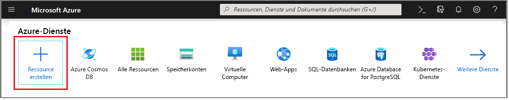
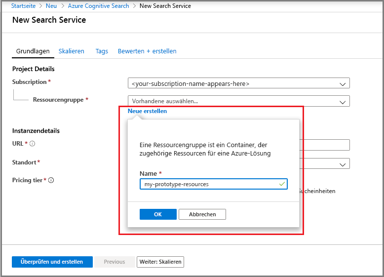
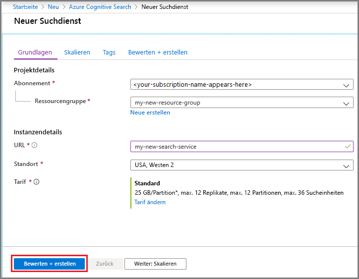
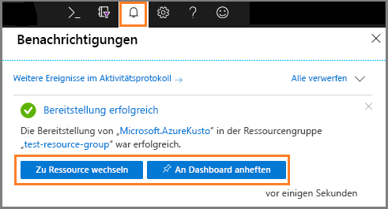
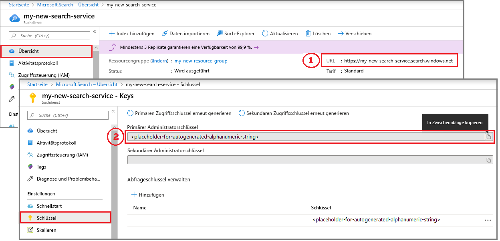
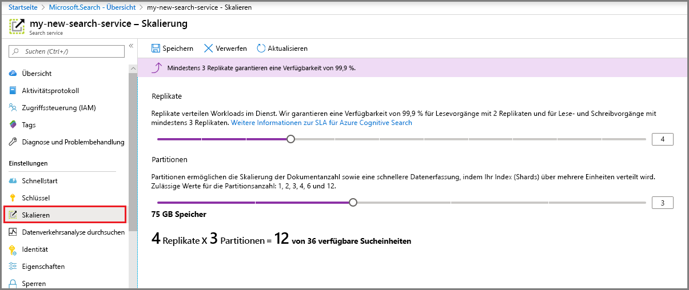

# Schnellstart: Erstellen eines Azure Cognitive Search-Diensts im Portal

Azure Cognitive Search ist eine eigenständige Ressource, die zum Hinzufügen einer Suchoberfläche zu benutzerdefinierten Apps verwendet wird. Azure Cognitive Search kann problemlos in andere Azure-Dienste integriert werden, kann aber auch mit auf Netzwerkservern gehosteten Apps oder mit auf anderen Cloudplattformen ausgeführter Software verwendet werden.

In diesem Artikel erfahren Sie, wie Sie eine Ressource im [Azure-Portal](https://portal.azure.com/) erstellen.

Bevorzugen Sie PowerShell? Verwenden Sie die Azure Resource Manager-[Dienstvorlage](https://azure.microsoft.com/resources/templates/101-azure-search-create/). Hilfe zu den ersten Schritten finden Sie unter [Verwalten des Azure Search-Diensts mit PowerShell](search-manage-powershell.md).

## Abonnieren (kostenlos oder kostenpflichtig)

[Erstellen Sie ein kostenloses Azure-Konto](https://azure.microsoft.com/pricing/free-trial/?WT.mc_id=A261C142F), und verwenden Sie das kostenlose Guthaben, um unsere kostenpflichtigen Azure-Dienste zu testen. Wenn das Guthaben aufgebraucht ist, können Sie das Konto behalten und weiterhin kostenlose Azure-Dienste wie z.B. Websites verwenden. Ihre Kreditkarte wird nur dann belastet, wenn Sie Ihre Einstellungen explizit ändern und mit der Berechnung von Gebühren einverstanden sind.

Alternativ dazu können Sie Ihre [Vorteile für MSDN-Abonnenten aktivieren](https://azure.microsoft.com/pricing/member-offers/msdn-benefits-details/?WT.mc_id=A261C142F). Ihr MSDN-Abonnement beinhaltet ein monatliches Guthaben, das Sie für kostenpflichtige Azure-Dienste verwenden können. 

## Finden der kognitiven Azure-Suche

1. Melden Sie sich beim [Azure-Portal](https://portal.azure.com/) an.
2. Klicken Sie in der oberen linken Ecke auf das Pluszeichen („+ Ressource erstellen“).
3. Suchen Sie mithilfe der Suchleiste nach „kognitive Azure-Suche“, oder navigieren über **Web** > **Azure Cognitive Search** (Kognitive Azure-Suche) zu der Ressource.

## Wählen Sie ein Abonnement.

Falls Sie über mehrere Abonnements verfügen, wählen Sie eines für Ihren Suchdienst aus.

## Festlegen einer Ressourcengruppe

Eine Ressourcengruppe ist ein Container, der verwandte Ressourcen für Ihre Azure-Lösung enthält. Sie ist für den Suchdienst erforderlich. Darüber hinaus ist sie für die Verwaltung aller Aspekte von Ressourcen nützlich, einschließlich der Kosten. Eine Ressourcengruppe kann aus einem Dienst oder einer Kombination aus mehreren Diensten bestehen. Wenn Sie beispielsweise die kognitive Azure-Suche verwenden, um eine Azure Cosmos DB-Datenbank zu indizieren, können Sie beide Dienste zu Verwaltungszwecken zur selben Ressourcengruppe hinzufügen. 

Wenn Sie keine Ressourcen in einer einzigen Gruppe kombinieren oder vorhandene Ressourcengruppen mit Ressourcen gefüllt sind, die in nicht verbundenen Lösungen verwendet werden, erstellen Sie eine neue Ressourcengruppe nur für die Ressource für die kognitive Azure-Suche. 

Im weiteren Verlauf können Sie aktuelle und prognostizierte Kosten insgesamt nachverfolgen oder Gebühren für einzelne Ressourcen anzeigen. Im folgenden Screenshot wird die Art der Kosteninformationen dargestellt, die Sie erwarten können, wenn Sie mehrere Ressourcen in einer Gruppe kombinieren.

> [!TIP]
> Ressourcengruppen vereinfachen die Bereinigung, da durch Löschen einer Gruppe alle darin enthaltenen Dienste gelöscht werden. Bei Prototypprojekten, die mehrere Dienste verwenden, sollten Sie all diese Dienste in die gleiche Ressourcengruppe platzieren, um das Bereinigen nach Abschluss des Projekts zu vereinfachen.

## Benennen des Diensts

Geben Sie in den Instanzdetails im Feld **URL** einen Dienstnamen ein. Der Name ist Teil des URL-Endpunkts, für den API-Aufrufe ausgegeben werden: `https://your-service-name.search.windows.net`. Wenn der Endpunkt beispielsweise `https://myservice.search.windows.net` sein soll, geben Sie `myservice` ein.

Anforderungen an Dienstnamen:

* Er muss innerhalb des Namespaces „search.windows.net“ eindeutig sein
* Er muss zwischen 2 und 60 Zeichen lang sein.
* Sie müssen Kleinbuchstaben, Ziffern oder Bindestriche („-“) verwenden.
* Verwenden Sie keine Bindestriche („-“) als die ersten zwei Zeichen oder als letztes Zeichen.
* Verwenden Sie an keiner Stelle aufeinanderfolgende Bindestriche („--“).

> [!TIP]
> Wenn Sie voraussichtlich mehrere Dienste verwenden werden, empfiehlt es sich als Namenskonvention, die Region (bzw. den Standort) in den Dienstnamen aufzunehmen. Dienste innerhalb derselben Region können Daten kostenlos austauschen. Wenn sich also die kognitive Azure-Suche etwa in „USA, Westen“ befindet und Sie in dieser Region über weitere Dienste verfügen, kann ein Name wie `mysearchservice-westus` Ihnen einen Umweg über die Eigenschaftenseite ersparen, wenn Sie entscheiden, wie Ressourcen kombiniert oder angefügt werden sollen.

## Auswählen eines Standorts

Als Azure-Dienst kann die kognitive Azure-Suche in Rechenzentren auf der ganzen Welt gehostet werden. Sie finden die Liste der unterstützten Regionen in der [Preisübersicht](https://azure.microsoft.com/pricing/details/search/). 

Sie können Bandbreitenkosten minimieren oder sogar ganz vermeiden, indem Sie für mehrere Dienste denselben Standort auswählen. Wenn Sie beispielsweise Daten indizieren, die von einem anderen Azure-Dienst (Azure Storage, Azure Cosmos DB, Azure SQL-Datenbank) bereitgestellt werden, können Sie Bandbreitenkosten vermeiden, indem Sie den Dienst für die kognitive Azure-Suche in derselben Region erstellen (wenn Dienste sich in derselben Region befinden, fallen keine Gebühren für ausgehenden Datenverkehr an).

Wenn Sie KI-Anreicherung verwenden, erstellen Sie Ihren Suchdienst in derselben Region wie Cognitive Services. *Die Bereitstellung der kognitiven Azure-Suche und von Cognitive Services in der gleichen Region ist eine Voraussetzung für KI-Erweiterungen.*

> [!Note]
> „Indien, Mitte“ ist zurzeit für neue Dienste nicht verfügbar. Dienste, die bereits in „Indien, Mitte“ bereitgestellt sind, können ohne Einschränkungen zentral hochskaliert werden, und Ihr Dienst wird in dieser Region vollständig unterstützt. Die Einschränkung für diese Region ist vorübergehend und betrifft nur neue Dienste. Wenn die Einschränkung nicht mehr gilt, wird dieser Hinweis wird entfernt.

## Auswählen eines Tarifs (SKU)

[Die kognitive Azure-Suche wird derzeit in mehreren Tarifen angeboten:](https://azure.microsoft.com/pricing/details/search/) Free, Basic oder Standard. Jeder Tarif verfügt über eigene [Kapazitäten und Grenzwerte](search-limits-quotas-capacity.md). Anleitungen finden Sie unter [Auswählen einer SKU oder eines Tarifs für Azure Search](search-sku-tier.md) .

Für Produktionsworkloads werden in der Regel die Tarife „Basic“ und „Standard“ ausgewählt. Die meisten Kunden beginnen jedoch mit einem kostenlosen Dienst. Die wichtigsten Unterschiede zwischen den Tarifen sind Partitionsgröße und Geschwindigkeit sowie Grenzwerte bei der Anzahl von Objekten, die Sie erstellen können.

Denken Sie daran, dass ein Tarif nicht geändert werden kann, nachdem der Dienst erstellt wurde. Wenn Sie einen höheren oder niedrigeren Tarif benötigen, müssen Sie den Dienst neu erstellen.

## Erstellen des Diensts

Nachdem Sie die erforderlichen Informationen angegeben haben, erstellen Sie den Dienst. 

Ihr Dienst wird innerhalb weniger Minuten bereitgestellt. Sie können den Fortschritt über Azure-Benachrichtigungen überwachen. Heften Sie den Dienst ggf. an Ihr Dashboard an, um in Zukunft einfacher darauf zugreifen zu können.

## Abrufen eines Schlüssels und URL-Endpunkts

Falls Sie nicht das Portal verwenden, müssen Sie den URL-Endpunkt und einen Authentifizierungs-API-Schlüssel angeben, um programmgesteuert auf Ihren neuen Dienst zugreifen zu können.

1. Kopieren Sie rechts auf der Seite **Übersicht** den URL-Endpunkt.

2. Kopieren Sie auf der Seite **Schlüssel** einen der Administratorschlüssel (diese sind gleichwertig). Administrator-API-Schlüssel sind für das Erstellen, Aktualisieren und Löschen von Objekten in Ihrem Dienst erforderlich. Im Gegensatz dazu bieten Abfrageschlüssel Lesezugriff auf den Indexinhalt.

   

Endpunkt und Schlüssel sind für portalbasierte Aufgaben nicht erforderlich. Das Portal ist bereits mit Ihrer Ressource für die kognitive Azure-Suche mit Administratorrechten verknüpft. Eine exemplarische Vorgehensweise für das Portal finden Sie unter [Schnellstart: Erstellen eines Azure Search-Indexes im Azure-Portal](search-get-started-portal.md).

## Skalieren des Diensts

Nach der Bereitstellung Ihres Diensts können Sie ihn Ihren Anforderungen entsprechend skalieren. Wenn Sie für Ihren Dienst für die kognitive Azure-Suche den Standard-Tarif ausgewählt haben, können Sie den Dienst in zwei Dimensionen skalieren: Replikate und Partitionen. Wenn Sie den Basic-Tarif auswählen, können Sie nur Replikate hinzufügen. Wenn Sie den kostenlosen Dienst bereitstellen, ist keine Skalierung verfügbar.

***Partitionen*** ermöglichen Ihrem Dienst das Speichern und Durchsuchen weiterer Dokumente.

***Replikate*** ermöglichen Ihrem Dienst, eine größere Menge von Suchabfragen zu verarbeiten.

Durch das Hinzufügen von Ressourcen wird Ihre monatliche Rechnung höher. Der [Preisrechner](https://azure.microsoft.com/pricing/calculator/) veranschaulicht, wie das Hinzufügen von Ressourcen sich auf die Abrechnung auswirken kann. Denken Sie daran, dass Sie Ressourcen basierend auf der Last anpassen können. Beispielsweise können Sie Ressourcen erhöhen, um einen vollständigen anfänglichen Index zu erstellen. Später können Sie die Ressourcen auf eine Ebene verringern, die sich besser für die inkrementelle Indizierung eignet.

> [!Important]
> Ein Dienst benötigt [2 Replikate für schreibgeschützte SLAs und 3 Replikate für SLAs mit Lese-/Schreibzugriff](https://azure.microsoft.com/support/legal/sla/search/v1_0/).

1. Wechseln Sie im Azure-Portal zur Seite Ihres Suchdiensts.
2. Wählen Sie im linken Navigationsbereich die Optionen **Einstellungen** > **Skalierung** aus.
3. Verwenden Sie den Schieberegler, um Ressourcen jedes Typs hinzuzufügen.

> [!Note]
> In höheren Tarifen stehen pro Partition mehr Speicher und eine höhere Geschwindigkeit zur Verfügung. Weitere Informationen finden Sie unter [Grenzwerte für den Azure Search-Dienst](search-limits-quotas-capacity.md).

## Wann ein zweiter Dienst hinzugefügt werden sollte

Die meisten Kunden verwenden nur einen Dienst, der auf einer Ebene bereitgestellt wird, die das [richtige Gleichgewicht von Ressourcen](search-sku-tier.md) bietet. Ein Dienst kann mehrere Indizes hosten, die der [Obergrenze der von Ihnen ausgewählten Ebene](search-capacity-planning.md) unterliegt, wobei jeder Index vom anderen isoliert ist. In der kognitiven Azure-Suche können Anforderungen nur an einen Index geleitet werden, was das versehentliche oder vorsätzliche Datenabrufrisiko von anderen Indizes im selben Dienst verringert.

Obwohl die meisten Kunden nur einen Dienst nutzen, kann die Dienstredundanz womöglich nötig sein, wenn die operativen Anforderungen Folgendes enthalten:

* Notfallwiederherstellung (Ausfall des Rechenzentrums). Die kognitive Azure-Suche bietet kein sofortiges Failover bei einem Ausfall. Empfehlungen und Anleitungen finden Sie unter [Dienstverwaltung für Azure Search im Azure-Portal](search-manage.md).
* Ihre Untersuchung der mehrinstanzenfähigen Modellierung hat ergeben, dass zusätzliche Dienste die optimale Designlösung sind. Weitere Informationen finden Sie unter [Entwurfsmuster für mehrinstanzenfähige SaaS-Anwendungen und Azure Search](search-modeling-multitenant-saas-applications.md).
* Für global bereitgestellte Anwendungen benötigen Sie möglicherweise eine Instanz für die kognitive Azure-Suche in mehreren Regionen, um die Wartezeit des internationalen Datenverkehrs Ihrer Anwendung zu minimieren.

> [!NOTE]
> Bei der kognitiven Azure-Suche können Sie Index- und Abfragevorgänge nicht trennen. Deshalb sollten Sie auch nie mehrere Dienste für getrennte Workloads erstellen. Ein Index wird immer auf dem Dienst, in dem er erstellt wurde, abgefragt (Sie können keinen Index in einem Dienst erstellen und ihn in einen anderen kopieren).

Ein zweiter Dienst ist für Hochverfügbarkeit nicht vonnöten. Hochverfügbarkeit für Abfragen wird erreicht, wenn Sie zwei oder mehr Replikate im gleichen Dienst verwenden. Replikatupdates sind sequenziell. Das bedeutet, dass mindestens eines betriebsfähig ist, wenn ein Dienstupdate ausgeführt wird. Weitere Informationen zur Verfügbarkeit finden Sie unter [Vereinbarungen zum Servicelevel](https://azure.microsoft.com/support/legal/sla/search/v1_0/).

## Nächste Schritte

Nach dem Bereitstellen eines Diensts können Sie im Portal mit dem Erstellen des ersten Index fortfahren.

> [!div class="nextstepaction"]
> [Schnellstart: Erstellen eines Azure Search-Indexes im Azure-Portal](search-get-started-portal.md)
