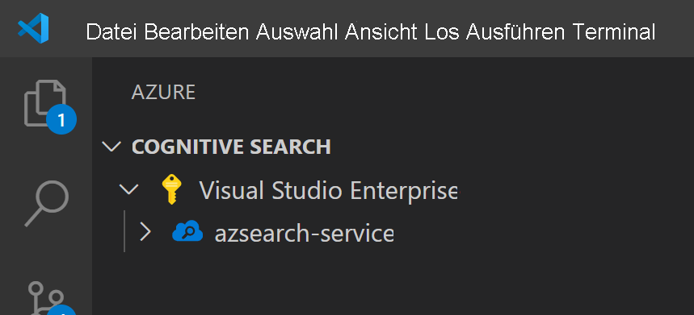
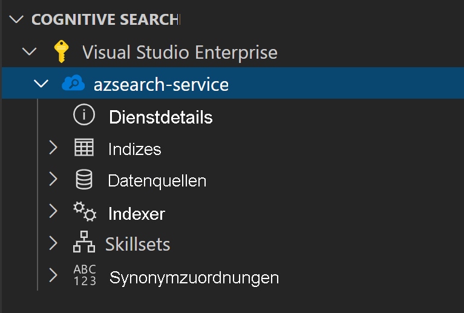
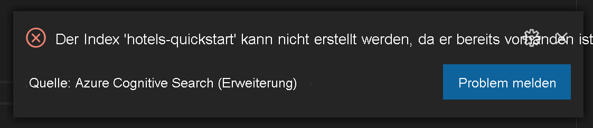
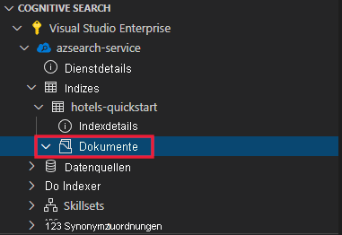
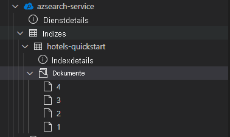
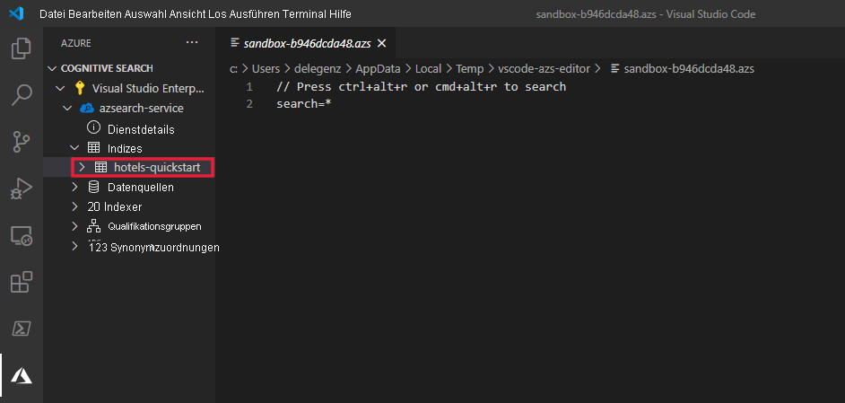

# <a name="get-started-with-visual-studio-code-and-azure-cognitive-search"></a>Erste Schritte mit Visual Studio Code und Azure Cognitive Search

In diesem Artikel wird erläutert, wie Sie mithilfe der [Azure Cognitive Search REST-APIs](/rest/api/searchservice) und eines API-Clients zum Senden und Empfangen von Anforderungen interaktiv REST-API-Anforderungen formulieren. Mit einem API-Client und dieser Anleitung können Sie vor dem Schreiben von Code Anforderungen senden und Antworten anzeigen.

Wenn Sie kein Azure-Abonnement besitzen, können Sie ein [kostenloses Konto](https://azure.microsoft.com/free/?WT.mc_id=A261C142F) erstellen, bevor Sie beginnen.

In diesem Artikel wird eine Visual Studio Code-Erweiterung (Vorschauversion) für Azure Cognitive Search-REST-APIs verwendet.

> [!IMPORTANT] 
> Dieses Feature ist zurzeit als öffentliche Preview verfügbar. Die Vorschaufunktion wird ohne Vereinbarung zum Servicelevel bereitgestellt und ist nicht für Produktionsworkloads vorgesehen. Weitere Informationen finden Sie unter [Zusätzliche Nutzungsbestimmungen für Microsoft Azure-Vorschauen](https://azure.microsoft.com/support/legal/preview-supplemental-terms/). 

## <a name="prerequisites"></a>Voraussetzungen

Für diesen Schnellstart sind die folgenden Dienste und Tools erforderlich. 

+ [Visual Studio Code](https://code.visualstudio.com/download)

+ [Azure Cognitive Search für Visual Studio Code (Vorschauversion)](https://marketplace.visualstudio.com/items?itemName=ms-azuretools.vscode-azurecognitivesearch)

+ [Erstellen Sie einen Dienst für die kognitive Azure-Suche](search-create-service-portal.md), oder [suchen Sie nach einem vorhandenen Dienst](https://ms.portal.azure.com/#blade/HubsExtension/BrowseResourceBlade/resourceType/Microsoft.Search%2FsearchServices) in Ihrem aktuellen Abonnement. Für diesen Schnellstart können Sie einen kostenlosen Dienst verwenden. 

## <a name="copy-a-key-and-url"></a>Kopieren eines Schlüssels und einer URL

Für REST-Aufrufe sind die Dienst-URL und ein Zugriffsschlüssel für jede Anforderung erforderlich. Ein Suchdienst wird mit beidem erstellt. Gehen Sie daher wie folgt vor, um die erforderlichen Informationen zu erhalten, falls Sie Azure Cognitive Search Ihrem Abonnement hinzugefügt haben:

1. [Melden Sie sich beim Azure-Portal an](https://portal.azure.com/), und rufen Sie auf der Seite **Übersicht** Ihres Suchdiensts die URL ab. Ein Beispiel für einen Endpunkt ist `https://mydemo.search.windows.net`.

1. Rufen Sie unter **Einstellungen** > **Schlüssel** einen Administratorschlüssel ab, um Vollzugriff auf den Dienst zu erhalten. Es gibt zwei austauschbare Administratorschlüssel – diese wurden zum Zweck der Geschäftskontinuität bereitgestellt, falls Sie einen Rollover für einen Schlüssel durchführen müssen. Für Anforderungen zum Hinzufügen, Ändern und Löschen von Objekten können Sie den primären oder den sekundären Schlüssel verwenden.


Für alle an Ihren Dienst gesendeten Anforderungen ist ein API-Schlüssel erforderlich. Ein gültiger Schlüssel stellt anforderungsbasiert eine Vertrauensstellung her zwischen der Anwendung, die die Anforderung versendet, und dem Dienst, der sie verarbeitet.

## <a name="install-the-extension"></a>Installieren der Erweiterung

Öffnen Sie zunächst [VS Code](https://code.visualstudio.com). Wählen Sie auf der Aktivitätsleiste die Registerkarte **Erweiterungen** aus, und suchen Sie nach *Azure Cognitive Search*. Suchen Sie in den Suchergebnissen nach der Erweiterung, und wählen Sie **Installieren** aus.


Alternativ können Sie die [Azure Cognitive Search-Erweiterung](https://aka.ms/vscode-search) über den VS Code-Marketplace in einem Webbrowser installieren.

Auf der Aktivitätsleiste sollte eine neue Azure-Registerkarte angezeigt werden, falls sie nicht bereits vorhanden war.


## <a name="connect-to-your-subscription"></a>Verbinden mit Ihrem Abonnement

Wählen Sie **Bei Azure anmelden...** aus, und melden Sie sich bei Ihrem Azure-Konto an.

Daraufhin sollten Ihre Abonnements angezeigt werden. Wählen Sie das Abonnement aus, um eine Liste der Suchdienste im Abonnement anzuzeigen.



Öffnen Sie zum Einschränken der angezeigten Abonnements die Befehlspalette (STRG+UMSCHALT+P oder BEFEHL+UMSCHALT+P), und suchen Sie nach *Azure* oder nach *Abonnements auswählen*. Es stehen auch Befehle für die An- und Abmeldung bei Ihrem Azure-Konto zur Verfügung.

Wenn Sie den Suchdienst erweitern, werden für die einzelnen Cognitive Search-Ressourcen jeweils folgende Strukturelemente angezeigt: Indizes, Datenquellen, Indexer, Skillsets und Synonymzuordnungen.



Diese Strukturelemente können erweitert werden, um alle in Ihrem Suchdienst vorhandenen Ressourcen anzuzeigen.

## <a name="1---create-an-index"></a>1\. Erstellen eines Index

Wenn Sie Azure Cognitive Search verwenden möchten, müssen Sie zunächst einen Suchindex erstellen. Hierzu wird die [REST-API für die Indexerstellung](/rest/api/searchservice/create-index) verwendet. 

Mit der VS Code-Erweiterung müssen Sie sich nur mit dem Text der Anforderung befassen. Diese Schnellstartanleitung enthält eine exemplarische Indexdefinition sowie entsprechende Dokumente.

### <a name="index-definition"></a>Indexdefinition

Bei der folgenden Indexdefinition handelt es sich um ein Beispielschema für fiktive Hotels.

Die Sammlung `fields` definiert die Struktur von Dokumenten im Suchindex. Jedes Feld verfügt über einen Datentyp sowie über eine Reihe zusätzlicher Attribute, die bestimmen, wie das Feld verwendet werden kann.

```json
{
    "name": "hotels-quickstart",
    "fields": [
        {
            "name": "HotelId",
            "type": "Edm.String",
            "key": true,
            "filterable": true
        },
        {
            "name": "HotelName",
            "type": "Edm.String",
            "searchable": true,
            "filterable": false,
            "sortable": true,
            "facetable": false
        },
        {
            "name": "Description",
            "type": "Edm.String",
            "searchable": true,
            "filterable": false,
            "sortable": false,
            "facetable": false,
            "analyzer": "en.lucene"
        },
        {
            "name": "Description_fr",
            "type": "Edm.String",
            "searchable": true,
            "filterable": false,
            "sortable": false,
            "facetable": false,
            "analyzer": "fr.lucene"
        },
        {
            "name": "Category",
            "type": "Edm.String",
            "searchable": true,
            "filterable": true,
            "sortable": true,
            "facetable": true
        },
        {
            "name": "Tags",
            "type": "Collection(Edm.String)",
            "searchable": true,
            "filterable": true,
            "sortable": false,
            "facetable": true
        },
        {
            "name": "ParkingIncluded",
            "type": "Edm.Boolean",
            "filterable": true,
            "sortable": true,
            "facetable": true
        },
        {
            "name": "LastRenovationDate",
            "type": "Edm.DateTimeOffset",
            "filterable": true,
            "sortable": true,
            "facetable": true
        },
        {
            "name": "Rating",
            "type": "Edm.Double",
            "filterable": true,
            "sortable": true,
            "facetable": true
        },
        {
            "name": "Address",
            "type": "Edm.ComplexType",
            "fields": [
                {
                    "name": "StreetAddress",
                    "type": "Edm.String",
                    "filterable": false,
                    "sortable": false,
                    "facetable": false,
                    "searchable": true
                },
                {
                    "name": "City",
                    "type": "Edm.String",
                    "searchable": true,
                    "filterable": true,
                    "sortable": true,
                    "facetable": true
                },
                {
                    "name": "StateProvince",
                    "type": "Edm.String",
                    "searchable": true,
                    "filterable": true,
                    "sortable": true,
                    "facetable": true
                },
                {
                    "name": "PostalCode",
                    "type": "Edm.String",
                    "searchable": true,
                    "filterable": true,
                    "sortable": true,
                    "facetable": true
                },
                {
                    "name": "Country",
                    "type": "Edm.String",
                    "searchable": true,
                    "filterable": true,
                    "sortable": true,
                    "facetable": true
                }
            ]
        }
    ],
    "suggesters": [
        {
            "name": "sg",
            "searchMode": "analyzingInfixMatching",
            "sourceFields": [
                "HotelName"
            ]
        }
    ]
}
```

Klicken Sie zum Erstellen eines neuen Index mit der rechten Maustaste auf **Indizes**, und wählen Sie anschließend **Neuen Index erstellen** aus. Daraufhin wird ein Editor mit einem Namen wie `indexes-new-28c972f661.azsindex` angezeigt. 

Fügen Sie die oben bereitgestellte Indexdefinition in das Fenster ein. Speichern Sie die Datei, und wählen Sie **Hochladen** aus, wenn Sie gefragt werden, ob Sie den Index aktualisieren möchten. Dadurch wird der Index erstellt und in der Strukturansicht verfügbar.


Sollte ein Problem mit Ihrer Indexdefinition vorliegen, wird in der Regel eine Fehlermeldung mit einer Erläuterung des Fehlers angezeigt.



Beheben Sie in diesem Fall das Problem, und speichern Sie die Datei erneut.

## <a name="2---load-documents"></a>2\. Laden von Dokumenten

Das Erstellen und das Auffüllen des Index sind separate Schritte. In Azure Cognitive Search enthält der Index alle durchsuchbaren Daten. In diesem Szenario werden die Daten als JSON-Dokumente bereitgestellt. Für diese Aufgabe wird die [REST-API zum Hinzufügen, Aktualisieren oder Löschen von Dokumenten](/rest/api/searchservice/addupdate-or-delete-documents) verwendet. 

So fügen Sie neue Dokumente in VS Code hinzu:

1. Erweitern Sie den von Ihnen erstellten Index `hotels-quickstart`. Klicken Sie mit der rechten Maustaste auf **Dokumente**, und wählen Sie **Neues Dokument erstellen** aus.

    

2. Dadurch wird ein JSON-Editor geöffnet, in dem das Schema Ihres Indexes abgeleitet wurde.

    

3. Fügen Sie den folgenden JSON-Code ein, und speichern Sie anschließend die Datei. Daraufhin werden Sie aufgefordert, Ihre Änderungen zu bestätigen. Wählen Sie **Hochladen** aus, um die Änderungen zu speichern.

    ```json
    {
        "HotelId": "1",
        "HotelName": "Secret Point Motel",
        "Description": "The hotel is ideally located on the main commercial artery of the city in the heart of New York. A few minutes away is Time's Square and the historic centre of the city, as well as other places of interest that make New York one of America's most attractive and cosmopolitan cities.",
        "Category": "Boutique",
        "Tags": [ "pool", "air conditioning", "concierge" ],
        "ParkingIncluded": false,
        "LastRenovationDate": "1970-01-18T00:00:00Z",
        "Rating": 3.60,
        "Address": {
            "StreetAddress": "677 5th Ave",
            "City": "New York",
            "StateProvince": "NY",
            "PostalCode": "10022",
            "Country": "USA"
        } 
    }
    ```

4. Wiederholen Sie diesen Prozess für die drei restlichen Dokumente.

    Dokument 2:
    ```json
    {
        "HotelId": "2",
        "HotelName": "Twin Dome Motel",
        "Description": "The hotel is situated in a  nineteenth century plaza, which has been expanded and renovated to the highest architectural standards to create a modern, functional and first-class hotel in which art and unique historical elements coexist with the most modern comforts.",
        "Category": "Boutique",
        "Tags": [ "pool", "free wifi", "concierge" ],
        "ParkingIncluded": false,
        "LastRenovationDate": "1979-02-18T00:00:00Z",
        "Rating": 3.60,
        "Address": {
            "StreetAddress": "140 University Town Center Dr",
            "City": "Sarasota",
            "StateProvince": "FL",
            "PostalCode": "34243",
            "Country": "USA"
        } 
    }
    ```

    Dokument 3:
    ```json
    {
        "HotelId": "3",
        "HotelName": "Triple Landscape Hotel",
        "Description": "The Hotel stands out for its gastronomic excellence under the management of William Dough, who advises on and oversees all of the Hotel’s restaurant services.",
        "Category": "Resort and Spa",
        "Tags": [ "air conditioning", "bar", "continental breakfast" ],
        "ParkingIncluded": true,
        "LastRenovationDate": "2015-09-20T00:00:00Z",
        "Rating": 4.80,
        "Address": {
            "StreetAddress": "3393 Peachtree Rd",
            "City": "Atlanta",
            "StateProvince": "GA",
            "PostalCode": "30326",
            "Country": "USA"
        } 
    }
    ```

    Dokument 4:
    ```json
    {
        "HotelId": "4",
        "HotelName": "Sublime Cliff Hotel",
        "Description": "Sublime Cliff Hotel is located in the heart of the historic center of Sublime in an extremely vibrant and lively area within short walking distance to the sites and landmarks of the city and is surrounded by the extraordinary beauty of churches, buildings, shops and monuments. Sublime Cliff is part of a lovingly restored 1800 palace.",
        "Category": "Boutique",
        "Tags": [ "concierge", "view", "24-hour front desk service" ],
        "ParkingIncluded": true,
        "LastRenovationDate": "1960-02-06T00:00:00Z",
        "Rating": 4.60,
        "Address": {
            "StreetAddress": "7400 San Pedro Ave",
            "City": "San Antonio",
            "StateProvince": "TX",
            "PostalCode": "78216",
            "Country": "USA"
        }
    }
    ```

Im Dokumentabschnitt sollten nun alle vier Dokumente verfügbar sein.



## <a name="3---search-an-index"></a>3\. Durchsuchen eines Index

Nach dem Laden des Index und der Dokumente können Sie über die [REST-API zum Durchsuchen von Dokumenten](/rest/api/searchservice/search-documents) Abfragen für sie ausführen.

Gehen Sie dazu in VS Code wie folgt vor:

1. Klicken Sie mit der rechten Maustaste auf den Index, den Sie durchsuchen möchten, und wählen Sie **Index durchsuchen** aus. Daraufhin wird ein Editor mit einem Namen wie `sandbox-b946dcda48.azs` geöffnet.

    

2. Eine einfache Abfrage ist bereits automatisch angegeben. Drücken Sie **STRG+ALT+R** oder **BEFEHL+ALT+R**, um die Abfrage zu übermitteln. Die Ergebnisse werden in einem Fenster auf der linken Seite angezeigt.

    


### <a name="example-queries"></a>Beispielabfragen

Probieren Sie einige andere Abfragebeispiele aus, um ein Gefühl für die Syntax zu bekommen. Weiter unten finden Sie vier weitere Abfragen, die Sie ausprobieren können. Dem gleichen Editor können mehrere Abfragen hinzugefügt werden. Wenn Sie **STRG+ALT+R** oder **BEFEHL+ALT+R** drücken, wird die Zeile übermittelt, in der sich Ihr Cursor befindet.


In der ersten Abfrage wird nach `boutique` gesucht und die Suche mithilfe von `select` auf bestimmte Felder beschränkt. Es ist ein bewährtes Verfahren, nur die Felder per `select` auszuwählen, die Sie benötigen, da das Pullen unnötiger Daten die Latenz Ihrer Abfragen erhöhen kann. In der Abfrage wird außerdem `$count=true` festgelegt, um die Gesamtanzahl der Ergebnisse mit den Suchergebnissen zurückzugeben.

```
// Query example 1 - Search `boutique` with select and return count
search=boutique&$count=true&$select=HotelId,HotelName,Rating,Category
```

In der nächsten Abfrage geben Sie den Suchbegriff `wifi` an und fügen zudem einen Filter hinzu, um nur Ergebnisse zurückzugeben, deren Zustand gleich `'FL'` ist. Die Ergebnisse werden außerdem nach dem `Rating`-Objekt des Hotels sortiert.

```
// Query example 2 - Search with filter, orderBy, select, and count
search=wifi&$filter=Address/StateProvince eq 'FL'&$select=HotelId,HotelName,Rating&$orderby=Rating desc
```

Anschließend wird die Suche mit dem Parameter `searchFields` auf ein einzelnes durchsuchbares Feld beschränkt. Dies ist eine großartige Möglichkeit, Ihre Abfrage effizienter zu gestalten, wenn Sie wissen, dass Sie nur an Übereinstimmungen in bestimmten Feldern interessiert sind.

```
// Query example 3 - Limit searchFields
search=submlime cliff&$select=HotelId,HotelName,Rating&searchFields=HotelName
```

Eine weitere gängige Option, die in eine Abfrage einbezogen werden kann, ist `facets`. Mithilfe von Facetten können Sie Filter auf Ihrer Benutzeroberfläche erstellen, durch die Ihre Benutzern leichter erkennen, nach welchen Werten sie filtern können.

```
// Query example 4 - Take the top two results, and show only HotelName and Category in the results
search=*&$select=HotelId,HotelName,Rating&searchFields=HotelName&facet=Category
```

## <a name="open-index-in-the-portal"></a>Öffnen des Index im Portal

Wenn Sie Ihren Suchdienst im Portal anzeigen möchten, klicken Sie mit der rechten Maustaste auf den Namen des Suchdiensts, und wählen Sie **Im Portal öffnen** aus. Dadurch gelangen Sie zu dem Suchdienst im Azure-Portal.

## <a name="clean-up-resources"></a>Bereinigen von Ressourcen

Wenn Sie in Ihrem eigenen Abonnement arbeiten, sollten Sie sich am Ende eines Projekts überlegen, ob Sie die erstellten Ressourcen noch benötigen. Ressourcen, die weiterhin ausgeführt werden, können Sie Geld kosten. Sie können entweder einzelne Ressourcen oder aber die Ressourcengruppe löschen, um den gesamten Ressourcensatz zu entfernen.

Ressourcen können im Portal über den Link **Alle Ressourcen** oder **Ressourcengruppen** im linken Navigationsbereich gesucht und verwaltet werden.

Denken Sie bei Verwendung eines kostenlosen Diensts an die Beschränkung auf maximal drei Indizes, Indexer und Datenquellen. Sie können einzelne Elemente über das Portal löschen, um unter dem Limit zu bleiben. 

## <a name="next-steps"></a>Nächste Schritte

Nun wissen Sie, wie Sie grundlegende Aufgaben ausführen, und können mit weiteren REST-API-Aufrufen fortfahren, um sich komplexere Features wie Indexer anzusehen oder [eine Anreicherungspipeline einzurichten](cognitive-search-tutorial-blob.md), die der Indizierung Inhaltstransformationen hinzufügt. Als nächsten Schritt empfehlen wir den folgenden Link:

> [!div class="nextstepaction"]
> [Tutorial: Verwenden von REST und KI zum Generieren von durchsuchbarem Inhalt über Azure-Blobs](cognitive-search-tutorial-blob.md)