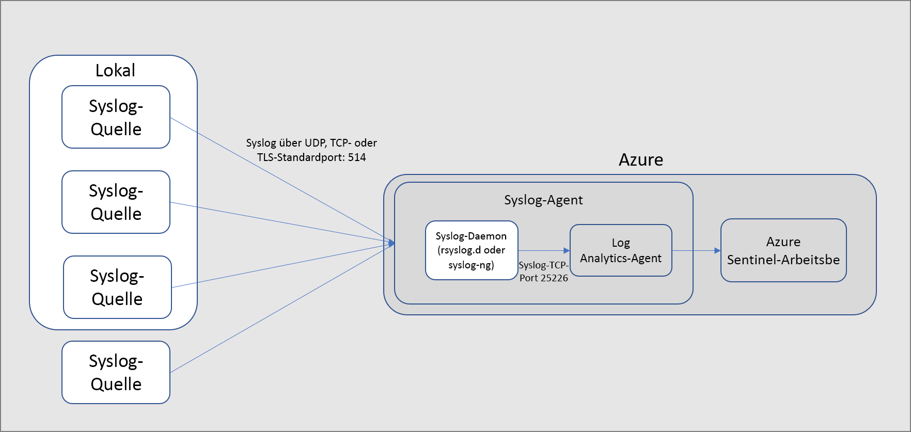
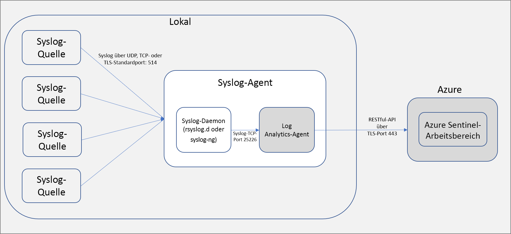

# Verbinden der externen Lösung mithilfe von Common Event Format

Wenn Sie eine Verbindung mit einer externen Lösung herstellen, die CEF-Nachrichten sendet, sind drei Schritte für die Verbindung mit Azure Sentinel erforderlich:

SCHRITT 1: [Verknüpfen mit CEF vor dem Bereitstellen des Agents](connect-cef-agent.md) SCHRITT 2: [Ausführen lösungsspezifischer Schritte](connect-cef-solution-config.md) SCHRITT 3: [Überprüfen der Konnektivität](connect-cef-verify.md)

Dieser Artikel beschreibt die Funktionsweise der Verbindung, führt Voraussetzungen auf und erläutert die Schritte zum Bereitstellen des Agents in Sicherheitslösungen, die zusätzlich zu Syslog CEF-Nachrichten senden. 

> [!NOTE] 
> Daten werden am geografischen Standort des Arbeitsbereichs gespeichert, in dem Sie Azure Sentinel ausführen.

Um diese Verbindung herzustellen, müssen Sie einen Agent auf einem dedizierten Linux-Computer (VM oder lokal) bereitstellen, sodass eine Kommunikation zwischen der Appliance und Azure Sentinel möglich ist. Die folgende Abbildung beschreibt die Einrichtung für eine Linux-VM in Azure.

 

Alternativ gilt diese Einrichtung, wenn Sie einen virtuellen Computer in einer anderen Cloud oder einen lokalen Computer verwenden. 

 

## Sicherheitshinweise

Stellen Sie sicher, dass Sie die Sicherheit des Computers gemäß der Sicherheitsrichtlinie Ihrer Organisation konfigurieren. Beispielsweise können Sie das Netzwerk so konfigurieren, dass es der Sicherheitsrichtlinie für das Unternehmensnetzwerk entspricht, und die Ports und Protokolle im Daemon Ihren Anforderungen entsprechend ändern. Anhand der folgenden Anleitungen können Sie die Sicherheitskonfiguration Ihrer Computer verbessern:   [Sichern virtueller Computer in Azure](../virtual-machines/security-policy.md), [Bewährte Methoden für die Netzwerksicherheit](../security/fundamentals/network-best-practices.md).

Um die TLS-Kommunikation zwischen der Sicherheitslösung und dem Syslog-Computer zu verwenden, müssen Sie den Syslog-Daemon (rsyslog oder syslog-ng) für die Kommunikation in TLS konfigurieren: [Verschlüsseln von Syslog-Datenverkehr mit TLS – rsyslog](https://www.rsyslog.com/doc/v8-stable/tutorials/tls_cert_summary.html), [Verschlüsseln von Protokollmeldungen mit TLS – syslog-ng](https://support.oneidentity.com/technical-documents/syslog-ng-open-source-edition/3.22/administration-guide/60#TOPIC-1209298).

 
## Voraussetzungen
Stellen Sie sicher, dass auf dem Linux-Computer, den Sie als Proxy verwenden, eines der folgenden Betriebssysteme ausgeführt wird:

- 64 Bit
  - CentOS 6 und 7
  - Amazon Linux 2017.09
  - Oracle Linux 6 und 7
  - Red Hat Enterprise Linux Server 6 und 7
  - Debian GNU/Linux 8 und 9
  - Ubuntu Linux 14.04 LTS, 16.04 LTS und 18.04 LTS
  - SUSE Linux Enterprise Server 12
- 32 Bit
   - CentOS 6
   - Oracle Linux 6
   - Red Hat Enterprise Linux Server 6
   - Debian GNU/Linux 8 und 9
   - Ubuntu Linux 14.04 LTS und 16.04 LTS
 
 - Daemonversionen
   - Syslog-ng: 2.1 bis 3.22.1
   - Rsyslog: v8
  
 - Unterstützte Syslog-RFCs
   - Syslog RFC 3164
   - Syslog RFC 5424
 
Stellen Sie sicher, dass Ihr Computer auch die folgenden Anforderungen erfüllt: 
- Berechtigungen
    - Sie müssen über erhöhte Berechtigungen (sudo) auf dem Computer verfügen. 
- Softwareanforderungen
    - Stellen Sie sicher, dass Python auf dem Computer ausgeführt wird.

## Nächste Schritte
In diesem Artikel haben Sie gelernt, wie Sie CEF-Appliances mit Azure Sentinel verbinden. Weitere Informationen zu Azure Sentinel finden Sie in den folgenden Artikeln:
- Erfahren Sie, wie Sie [Einblick in Ihre Daten und potenzielle Bedrohungen erhalten](quickstart-get-visibility.md).
- Beginnen Sie mit der [Erkennung von Bedrohungen mithilfe von Azure Sentinel](tutorial-detect-threats.md).

