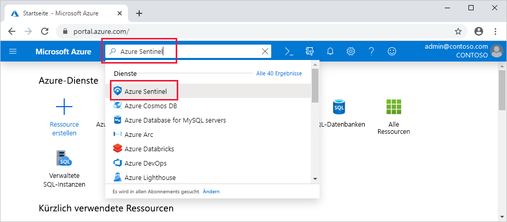

# Schnellstart: Ausführen des Onboardings für Azure Sentinel

In diesem Schnellstart erfahren Sie, wie Sie mit Azure Sentinel loslegen können. 

Wenn Sie Azure Sentinel integrieren wollen, müssen Sie Azure Sentinel zuerst aktivieren und dann eine Verbindung mit Ihren Datenquellen herstellen. Azure Sentinel enthält eine Reihe von Connectors für Microsoft-Lösungen, die vorkonfiguriert verfügbar sind und Echtzeitintegration bieten, u. a. für Microsoft 365 Defender-Lösungen (ehemals Microsoft Threat Protection), Microsoft 365-Quellen (einschließlich Office 365), Azure AD, Microsoft Defender for Identity (ehemals Azure ATP), Microsoft Cloud App Security und Azure Defender-Warnungen vom Azure Security Center. Außerdem stehen integrierte Connectors für Sicherheitslösungen von anderen Anbietern als Microsoft zur Verfügung. Sie können auch Common Event Format (CEF), Syslog oder eine REST-API verwenden, um Ihre Datenquellen mit Azure Sentinel zu verbinden. 

Nachdem Sie die Datenquellen verbunden haben, steht Ihnen ein Katalog von professionell erstellten Arbeitsmappen zur Anzeige der Erkenntnisse, die Sie aus Ihren Daten gewinnen, zur Auswahl. Diese Arbeitsmappen können einfach an Ihre Anforderungen angepasst werden.

>[!IMPORTANT] 
> Informationen zu den Gebühren im Zusammenhang mit Azure Sentinel finden Sie unter [Azure Sentinel – Preise](https://azure.microsoft.com/pricing/details/azure-sentinel/).

## Globale Voraussetzungen

- Aktives Azure-Abonnement: Wenn Sie über keines verfügen, können Sie ein [kostenloses Konto](https://azure.microsoft.com/free/?WT.mc_id=A261C142F) erstellen, bevor Sie beginnen.

- Log Analytics-Arbeitsbereich. Informationen zum Erstellen eines Log Analytics-Arbeitsbereichs finden Sie [hier](../azure-monitor/logs/quick-create-workspace.md). Weitere Informationen zu Log Analytics-Arbeitsbereichen finden Sie unter [Entwerfen Ihrer Azure Monitor-Protokollbereitstellung](../azure-monitor/logs/design-logs-deployment.md).

- Für das Abonnement, in dem sich der Azure Sentinel-Arbeitsbereich befindet, benötigen Sie Berechtigungen für Mitwirkende, um Azure Sentinel zu aktivieren. 
- Für die Ressourcengruppe, zu der der Arbeitsbereich gehört, benötigen Sie entweder Berechtigungen für Mitwirkende oder für Leser, um Azure Sentinel zu verwenden.
- Möglicherweise sind für die Verbindung mit bestimmten Datenquellen zusätzliche Berechtigungen erforderlich.
- Azure Sentinel ist ein kostenpflichtiger Dienst. Preisinformationen finden Sie in den [Informationen zu Azure Sentinel](https://go.microsoft.com/fwlink/?linkid=2104058).

### Geografische Verfügbarkeit und Data Residency

- Azure Sentinel kann für Arbeitsbereiche in den meisten [GA-Regionen von Log Analytics](https://azure.microsoft.com/global-infrastructure/services/?products=monitor) mit Ausnahme der Regionen China und Deutschland (Sovereign) ausgeführt werden. Bisweilen kann das Onboarding des Azure Sentinel-Diensts für neue Log Analytics-Regionen einige Zeit dauern. 

- Von Azure Sentinel generierte Daten, z. B. Incidents, Lesezeichen und Analyseregeln, enthalten ggf. Kundendaten, die aus den Log Analytics-Arbeitsbereichen des Kunden stammen. Diese von Azure Sentinel generierten Daten werden in einer der geografischen Regionen gespeichert, die in der folgenden Tabelle aufgeführt sind (basierend auf der Region, in der sich der Arbeitsbereich befindet):

    | Geografische Region des Arbeitsbereichs | Geografische Region für von Azure Sentinel generierte Daten |
    | --- | --- |
    | USA Indien Brasilien Afrika Korea Vereinigte Arabische Emirate | USA |
    | Europa Frankreich Schweiz | Europa |
    | Australien | Australien |
    | United Kingdom | United Kingdom |
    | Canada | Canada |
    | Japan | Japan |
    |

## Aktivieren von Azure Sentinel 

1. Melden Sie sich beim Azure-Portal an. Achten Sie darauf, dass das Abonnement ausgewählt ist, in dem Azure Sentinel erstellt wird.

1. Suchen Sie nach **Azure Sentinel**, und wählen Sie diese Lösung aus.

   

1. Wählen Sie **Hinzufügen**.

1. Wählen Sie den Arbeitsbereich aus, den Sie verwenden möchten, oder erstellen Sie einen neuen. Sie können Azure Sentinel in mehr als einem Arbeitsbereich ausführen. Die Daten sind aber für einen einzelnen Arbeitsbereich isoliert.

   

   >[!NOTE] 
   > - Standardarbeitsbereiche, die vom Azure Security Center erstellt wurden, werden in der Liste nicht angezeigt. Für diese kann Azure Sentinel nicht installiert werden.
   >

   >[!IMPORTANT]
   >
   > - Nach der Bereitstellung in einem Arbeitsbereich bietet Azure Sentinel **derzeit keine Unterstützung** für das Verschieben dieses Arbeitsbereichs in andere Ressourcengruppen oder Abonnements. 
   >
   >   Haben Sie den Arbeitsbereich bereits verschoben, deaktivieren Sie alle aktiven Regeln unter **Analytics**, und aktivieren Sie sie nach fünf Minuten wieder. Dieser Vorgang sollte in den meisten Fällen wirksam sein. Für die Iteration wird er jedoch nicht unterstützt und auf eigenes Risiko ausgeführt.

1. Wählen Sie **Azure Sentinel hinzufügen** aus.

## Herstellen einer Verbindung mit Datenquellen

Azure Sentinel erfasst Daten aus Diensten und Apps, indem eine Verbindung mit dem Dienst hergestellt wird und die Ereignisse und Protokolle an Azure Sentinel weitergeleitet werden. Für physische und virtuelle Computer können Sie den Log Analytics-Agenten installieren, mit dem die Protokolle gesammelt und an Azure Sentinel weitergeleitet werden. Für Firewalls und Proxys installiert Azure Sentinel den Log Analytics-Agent auf einem Linux-Syslog-Server, über den der Agent die Protokolldateien erfasst und an Azure Sentinel weiterleitet. 
 
1. Wählen Sie im Hauptmenü die Option **Datenconnectors** aus. Der Katalog mit den Datenconnectors wird geöffnet.

1. Der Katalog enthält eine Liste mit allen Datenquellen, mit denen Sie eine Verbindung herstellen können. Wählen Sie eine Datenquelle und dann die Schaltfläche **Connectorseite öffnen** aus.

1. Auf der Connectorseite werden eine Anleitung zum Konfigurieren des Connectors und alle erforderlichen weiteren Hinweise angezeigt. 
Wenn Sie beispielsweise die Datenquelle **Azure Active Directory** auswählen, mit der Sie Protokolle aus Azure AD an Azure Sentinel streamen können, können Sie angeben, welche Arten von Protokollen Sie erhalten möchten: Anmeldeprotokolle und/oder Überwachungsprotokolle.   Führen Sie die Installationsanweisungen aus oder [lesen Sie sich den entsprechenden Verbindungsleitfaden durch](connect-data-sources.md), um weitere Informationen zu erhalten. Weite Informationen zu Datenconnectors finden Sie unter [Herstellen einer Verbindung mit Datenquellen](connect-data-sources.md).

1. Auf der Connectorseite werden auf der Registerkarte **Nächste Schritte** relevante integrierte Arbeitsmappen, Beispielabfragen und Analyseregelvorlagen angezeigt, die zum Datenconnector gehören. Sie können diese Elemente unverändert verwenden oder anpassen. Auf jeden Fall können Sie sofort interessante Erkenntnisse zu Ihren Daten gewinnen.  

Sobald Ihre Datenquellen verbunden wurden, beginnt das Streaming Ihrer Daten zu Azure Sentinel. Sie können dann mit der Arbeit mit Ihren Daten loslegen. Sie können die Protokolle in den [integrierten Arbeitsmappen](quickstart-get-visibility.md) anzeigen und mit der Erstellung von Abfragen in Log Analytics beginnen, um [die Daten zu untersuchen](tutorial-investigate-cases.md).

## Nächste Schritte
In diesem Dokument haben Sie Informationen zum Onboarding und zur Verbindungsherstellung zwischen Datenquellen und Azure Sentinel erhalten. Weitere Informationen zu Azure Sentinel finden Sie in den folgenden Artikeln:
- Erfahren Sie, wie Sie [Einblick in Ihre Daten und potenzielle Bedrohungen erhalten](quickstart-get-visibility.md).
- Beginnen Sie mit der [Erkennung von Bedrohungen mithilfe von Azure Sentinel](tutorial-detect-threats-built-in.md).
- Streamen Sie Daten aus [CEF-Appliances (Common Event Format)](connect-common-event-format.md) an Azure Sentinel.
