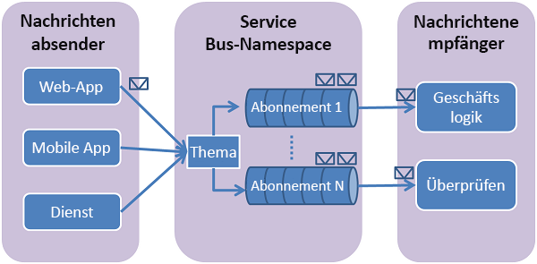

# Erstellen eines Service Bus-Themas und eines oder mehrerer Abonnements dieses Themas im Azure-Portal
In diesem Schnellstart erstellen Sie im Azure-Portal ein Service Bus-Thema und anschließend Abonnements dieses Themas. 

## Was sind Service Bus-Themen und -Abonnements?
Service Bus-Themen und -Abonnements unterstützen ein Modell der Messagingkommunikation über das *Veröffentlichen/Abonnieren* . Bei der Verwendung von Themen und Abonnements kommunizieren die Komponenten einer verteilten Anwendung nicht direkt miteinander, sondern tauschen Nachrichten über ein Thema aus, das als Zwischenstufe fungiert.

Anders als bei Service Bus-Warteschlangen, bei denen jede Nachricht von einem einzelnen Consumer verarbeitet wird, bieten Themen und Abonnements eine 1:n-Kommunikationsform mit einem Veröffentlichungs- und Abonnementmuster. Es ist möglich, mehrere Abonnements zu einem Thema anzumelden. Wenn eine Nachricht an ein Thema gesendet wird, steht sie in jedem Abonnement zur Verfügung, wo sie unabhängig von den anderen Abonnements verarbeitet wird. Ein Themenabonnement ähnelt einer virtuellen Warteschlange, die Kopien der Nachrichten enthält, die an das Thema gesendet wurden. Sie können optional auch Filterregeln für einzelne Abonnements eines Themas anmelden. Auf diese Weise können Sie filtern oder einschränken, welche Nachrichten an ein Thema von welchen Themenabonnements empfangen werden.

Mit Service Bus-Themen und -Abonnements können Sie viele Nachrichten an eine große Anzahl von Benutzern und Anwendungen verarbeiten.

[!INCLUDE [service-bus-create-namespace-portal](../../includes/service-bus-create-namespace-portal.md)]

[!INCLUDE [service-bus-create-topics-three-subscriptions-portal](../../includes/service-bus-create-topics-three-subscriptions-portal.md)]

> [!NOTE]
> Sie können Service Bus-Ressourcen mit dem [Service Bus-Explorer](https://github.com/paolosalvatori/ServiceBusExplorer/) verwalten. Mit dem Service Bus-Explorer können Benutzer eine Verbindung mit einem Service Bus-Namespace herstellen und Messagingentitäten auf einfache Weise verwalten. Das Tool stellt erweiterte Features wie Import-/Exportfunktionen oder Testmöglichkeiten für Themen, Warteschlangen, Abonnements, Relaydienste, Notification Hubs und Event Hubs zur Verfügung. 

## Nächste Schritte
In diesem Artikel haben Sie einen Service Bus-Namespace, ein Thema im Namespace und drei Abonnements für das Thema erstellt. Informationen zum Veröffentlichen von Nachrichten im Thema und zum Abonnieren von Nachrichten aus einem Abonnement finden Sie in den folgenden Schnellstartanleitungen im Abschnitt **Veröffentlichen und Abonnieren von Nachrichten**. 

- [.NET](service-bus-dotnet-how-to-use-topics-subscriptions.md)
- [Java](service-bus-java-how-to-use-topics-subscriptions.md)
- [JavaScript](service-bus-nodejs-how-to-use-topics-subscriptions.md)
- [Python](service-bus-python-how-to-use-topics-subscriptions.md)
- [PHP](service-bus-php-how-to-use-topics-subscriptions.md)
- [Ruby](service-bus-ruby-how-to-use-topics-subscriptions.md)