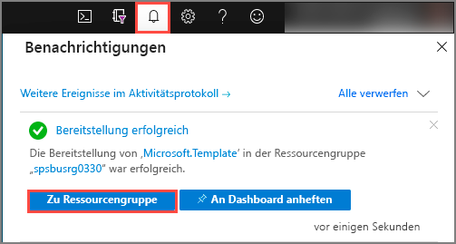
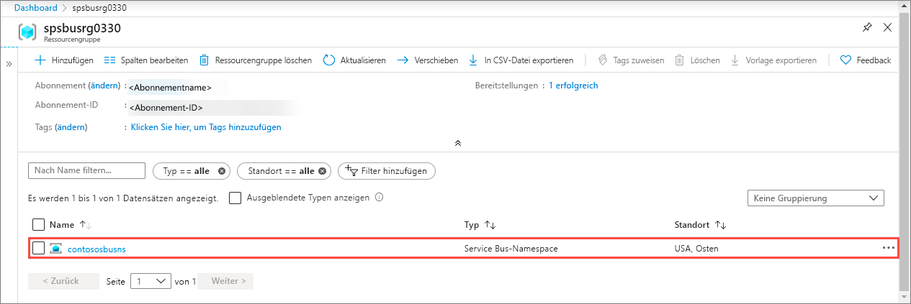
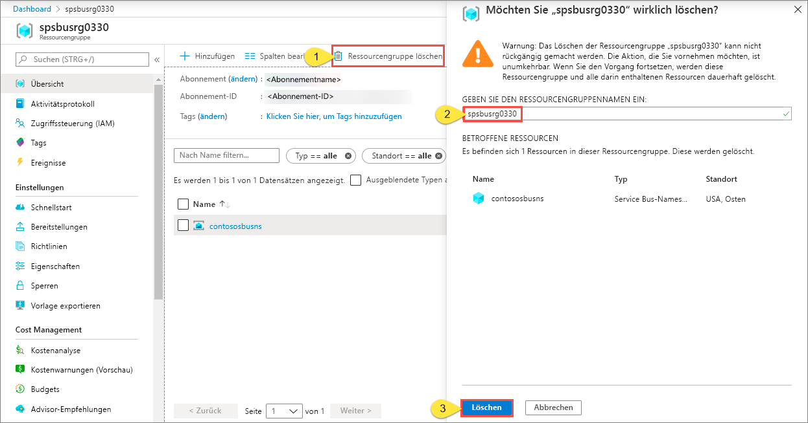

# Schnellstart: Erstellen eines Service Bus-Namespace und einer Warteschlange anhand einer ARM-Vorlage

In diesem Artikel wird beschrieben, wie Sie eine Azure Resource Manager-Vorlage (ARM-Vorlage) verwenden, die einen Service Bus-Namespace und eine Warteschlange innerhalb dieses Namespace erstellt. Dieser Artikel zeigt Ihnen, wie Sie angeben, welche Ressourcen bereitgestellt werden und wie Sie Parameter definieren, die angegeben werden, wenn die Bereitstellung ausgeführt wird. Sie können diese Vorlage für Ihre eigenen Bereitstellungen verwenden oder an Ihre Anforderungen anpassen.

[!INCLUDE [About Azure Resource Manager](../../includes/resource-manager-quickstart-introduction.md)]

Wenn Ihre Umgebung die Voraussetzungen erfüllt und Sie mit der Verwendung von ARM-Vorlagen vertraut sind, klicken Sie auf die Schaltfläche **In Azure bereitstellen**. Die Vorlage wird im Azure-Portal geöffnet.

## Voraussetzungen

Wenn Sie kein Azure-Abonnement besitzen, können Sie ein [kostenloses Konto](https://azure.microsoft.com/free/) erstellen, bevor Sie beginnen.

## Überprüfen der Vorlage

Die in dieser Schnellstartanleitung verwendete Vorlage stammt von der Seite mit den [Azure-Schnellstartvorlagen](https://azure.microsoft.com/resources/templates/201-servicebus-create-queue).

:::code language="json" source="~/quickstart-templates/201-servicebus-create-queue/azuredeploy.json" range="1-75" highlight="31-63":::

In der Vorlage sind die folgenden Ressourcen definiert:

- [**Microsoft.ServiceBus/namespaces**](/azure/templates/microsoft.servicebus/namespaces)
- [**Microsoft.ServiceBus/namespaces/queues**](/azure/templates/microsoft.servicebus/namespaces/queues)

> [!NOTE]
> Die folgenden ARM-Vorlagen stehen zum Herunterladen und Bereitstellen zur Verfügung.
>
> * [Create a Service Bus authorization rule for namespace and queue using an Azure Resource Manager template](service-bus-resource-manager-namespace-auth-rule.md)
> * [Create a Service Bus namespace with topic and subscription using an Azure Resource Manager template (Erstellen eines Service Bus-Namespace mit Thema und Abonnement mit einer Azure Resource Manager-Vorlage)](service-bus-resource-manager-namespace-topic.md)
> * [Erstellen eines Service Bus-Namespaces](service-bus-resource-manager-namespace.md)
> * [Create a Service Bus namespace with topic, subscription, and rule (Erstellen eines Service Bus-Namespace mit Thema, Abonnement und Regel)](service-bus-resource-manager-namespace-topic-with-rule.md)

Informationen zu weiteren Vorlagen finden Sie unter [Azure-Schnellstartvorlagen](https://azure.microsoft.com/resources/templates/?resourceType=Microsoft.Servicebus&pageNumber=1&sort=Popular).

## Bereitstellen der Vorlage

Mit dieser Vorlage stellen Sie einen Service Bus-Namespace mit einer Warteschlange bereit.

[Service Bus-Warteschlangen](service-bus-queues-topics-subscriptions.md#queues) bieten eine FIFO-Nachrichtenzustellung (First In, First Out) an einen Consumer oder an mehrere konkurrierende Consumer.

Klicken Sie auf folgende Schaltfläche, um die Bereitstellung automatisch auszuführen: Erstellen Sie eine neue Ressourcengruppe für die Bereitstellung, um sie später problemlos bereinigen zu können.

## Überprüfen der Bereitstellung

1. Wählen Sie oben **Benachrichtigungen** aus, um den Status der Bereitstellung anzuzeigen. Warten Sie, bis die Bereitstellung erfolgreich abgeschlossen wurde. Wählen Sie dann in der Benachrichtigungsmeldung **Zu Ressourcengruppe wechseln** aus, um zur Seite für die Ressourcengruppe zu navigieren, wo der Service Bus-Namespace angegeben ist. 

    
2. Vergewissern Sie sich, dass Ihr Service Bus-Namespace in der Ressourcenliste enthalten ist. 

    
3. Wählen Sie den Namespace in der Liste aus, um zur Seite **Service Bus-Namespace** zu gelangen. 

## Bereinigen von Ressourcen

1. Navigieren Sie im Azure-Portal zur Seite **Ressourcengruppe** für Ihre Ressourcengruppe.
2. Klicken Sie auf der Symbolleiste auf **Ressourcengruppe löschen**. 
3. Geben Sie den Namen der Ressourcengruppe ein, und wählen Sie **Löschen** aus. 

    

## Nächste Schritte

Lesen Sie das folgende Thema zum Erstellen einer Autorisierungsregel für den Namespace bzw. die Warteschlange:

[Erstellen einer Service Bus-Autorisierungsregel für Namespace und Warteschlange mithilfe einer ARM-Vorlage](service-bus-resource-manager-namespace-auth-rule.md)

In den folgenden Artikeln erfahren Sie, wie Sie diese Ressourcen verwalten:

* [Verwalten von Service Bus mit PowerShell](service-bus-manage-with-ps.md)
* [Service Bus Explorer](https://github.com/paolosalvatori/ServiceBusExplorer/releases)

[Authoring Azure Resource Manager templates]: ../azure-resource-manager/templates/template-syntax.md
[Service Bus namespace and queue template]: https://github.com/Azure/azure-quickstart-templates/blob/master/201-servicebus-create-queue/
[Azure Quickstart Templates]: https://azure.microsoft.com/documentation/templates/?term=service+bus
[Learn more about Service Bus queues]: service-bus-queues-topics-subscriptions.md
[Using Azure PowerShell with Azure Resource Manager]: ../azure-resource-manager/powershell-azure-resource-manager.md
[Using the Azure CLI for Mac, Linux, and Windows with Azure Resource Management]: ../azure-resource-manager/xplat-cli-azure-resource-manager.md
