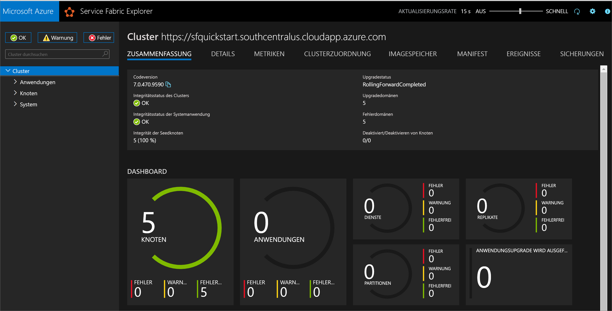
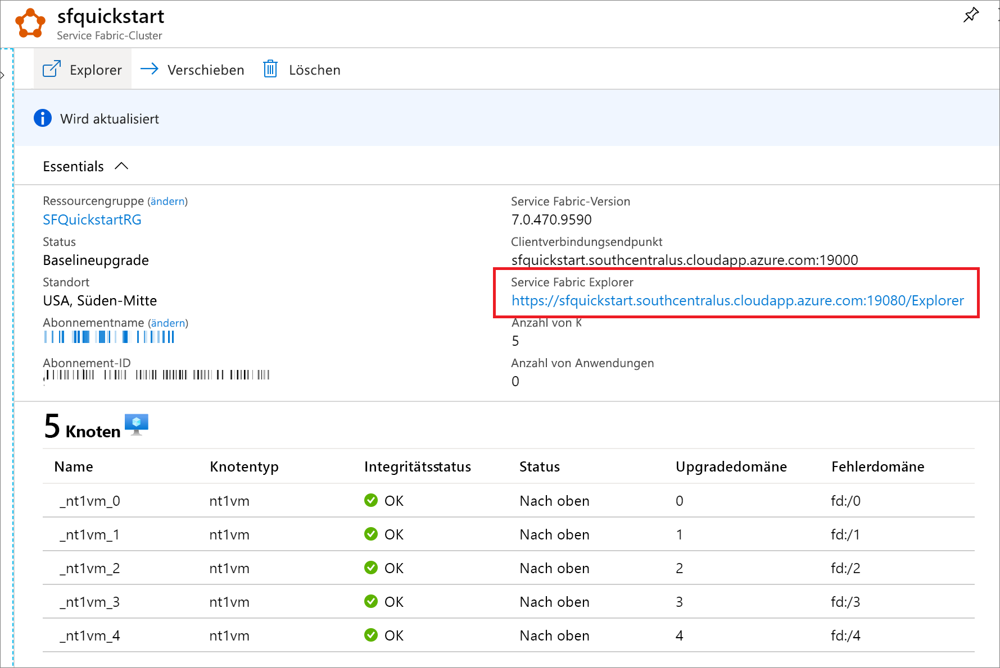

# <a name="quickstart-create-a-service-fabric-cluster-using-resource-manager-template"></a>Schnellstart: Erstellen eines Service Fabric-Clusters mithilfe einer Resource Manager-Vorlage

Azure Service Fabric ist eine Plattform für verteilte Systeme, die das Packen, Bereitstellen und Verwalten skalierbarer und zuverlässiger Microservices und Container vereinfacht. Ein *Service Fabric-Cluster* ist eine vernetzte Gruppe von virtuellen Computern, auf denen Ihre Microservices bereitgestellt und verwaltet werden.

[!INCLUDE [About Azure Resource Manager](../../includes/resource-manager-quickstart-introduction.md)]

Dieser Artikel beschreibt die Bereitstellung eines Service Fabric-Testclusters in Azure mithilfe von Resource Manager. Dieser Windows-Cluster mit fünf Knoten wird mit einem selbstsignierten Zertifikat geschützt und ist daher nur zur Veranschaulichung (und nicht für Produktionsworkloads) gedacht.

Zum Bereitstellen der Vorlage wird Azure PowerShell verwendet. Neben Azure PowerShell können Sie auch das Azure-Portal, die Azure-CLI und die REST-API verwenden. Informationen zu anderen Bereitstellungsmethoden finden Sie unter [Bereitstellen von Vorlagen](../azure-resource-manager/templates/deploy-portal.md).

Wenn Sie kein Azure-Abonnement besitzen, können Sie ein [kostenloses Konto](https://azure.microsoft.com/free/) erstellen, bevor Sie beginnen.

## <a name="prerequisites"></a>Voraussetzungen

### <a name="install-service-fabric-sdk-and-powershell-modules"></a>Installieren des Service Fabric SDK und der PowerShell-Module

Für diese Schnellstartanleitung ist Folgendes erforderlich:

* Installieren Sie das [Service Fabric SDK und das PowerShell-Modul](service-fabric-get-started.md).

* Installieren Sie [Azure PowerShell](https://docs.microsoft.com/powershell/azure/install-Az-ps).

### <a name="download-the-sample-template-and-certificate-helper-script"></a>Herunterladen der Beispielvorlage und des Zertifikathilfsskripts

Klonen Sie das Repository [Azure Resource Manager-Schnellstartvorlagen](https://github.com/Azure/azure-quickstart-templates), oder laden Sie es herunter. Kopieren Sie alternativ die folgenden Dateien aus dem Ordner *service-fabric-secure-cluster-5-node-1-nodetype* lokal:

* [New-ServiceFabricClusterCertificate.ps1](https://raw.githubusercontent.com/Azure/azure-quickstart-templates/master/service-fabric-secure-cluster-5-node-1-nodetype/New-ServiceFabricClusterCertificate.ps1)
* [azuredeploy.json](https://raw.githubusercontent.com/Azure/azure-quickstart-templates/master/service-fabric-secure-cluster-5-node-1-nodetype/azuredeploy.json)
* [azuredeploy.parameters.json](https://raw.githubusercontent.com/Azure/azure-quickstart-templates/master/service-fabric-secure-cluster-5-node-1-nodetype/azuredeploy.parameters.json)

### <a name="sign-in-to-azure"></a>Anmelden bei Azure

Melden Sie sich bei Azure an, und legen Sie das Abonnement fest, das zum Erstellen Ihres Service Fabric-Clusters verwendet werden soll.

```powershell
# Sign in to your Azure account
Login-AzAccount -SubscriptionId "<subscription ID>"
```

### <a name="create-a-self-signed-certificate-stored-in-key-vault"></a>Erstellen eines in Key Vault gespeicherten selbstsignierten Zertifikats

Service Fabric verwendet X.509-Zertifikate, um [einen Cluster zu schützen](./service-fabric-cluster-security.md) und Sicherheitsfunktionen für Anwendungen bereitzustellen, sowie [Key Vault](../key-vault/general/overview.md), um diese Zertifikate zu verwalten. Für eine erfolgreiche Clustererstellung ist ein Clusterzertifikat erforderlich, um die Kommunikation zwischen Knoten zu ermöglichen. Zur Erstellung des Testclusters für diese Schnellstartanleitung wird ein selbstsigniertes Zertifikat für die Clusterauthentifizierung erstellt. Für Produktionsworkloads sind Zertifikate erforderlich, die mit einem korrekt konfigurierten Windows Server-Zertifikatsdienst oder dem einer genehmigten Zertifizierungsstelle (Certificate Authority, CA) erstellt wurden.

```powershell
# Designate unique (within cloudapp.azure.com) names for your resources
$resourceGroupName = "SFQuickstartRG"
$keyVaultName = "SFQuickstartKV"

# Create a new resource group for your Key Vault and Service Fabric cluster
New-AzResourceGroup -Name $resourceGroupName -Location SouthCentralUS

# Create a Key Vault enabled for deployment
New-AzKeyVault -VaultName $KeyVaultName -ResourceGroupName $resourceGroupName -Location SouthCentralUS -EnabledForDeployment

# Generate a certificate and upload it to Key Vault
.\New-ServiceFabricClusterCertificate.ps1
```

Das Skript fordert Sie zur Eingabe der folgenden Werte auf. (Achten Sie darauf, *CertDNSName* und *KeyVaultName* der folgenden Beispielwerte zu ändern.)

* **Kennwort:** Password!1
* **CertDNSName:** *sfquickstart*.southcentralus.cloudapp.azure.com
* **KeyVaultName:** *SFQuickstartKV*
* **KeyVaultSecretName:** clustercert

Vom Skript werden nach dem Abschluss die für die Vorlagenbereitstellung erforderlichen Parameterwerte angegeben. Speichern Sie diese unbedingt in den folgenden Variablen, da sie zum Bereitstellen der Clustervorlage benötigt werden:

```powershell
$sourceVaultId = "<Source Vault Resource Id>"
$certUrlValue = "<Certificate URL>"
$certThumbprint = "<Certificate Thumbprint>"
```

## <a name="create-a-service-fabric-cluster"></a>Erstellen von Service Fabric-Clustern

### <a name="review-the-template"></a>Überprüfen der Vorlage

Die in dieser Schnellstartanleitung verwendete Vorlage stammt von der Seite mit den [Azure-Schnellstartvorlagen](https://azure.microsoft.com/resources/templates/service-fabric-secure-cluster-5-node-1-nodetype/). Die Vorlage für diesen Artikel ist zu lang und kann hier nicht angezeigt werden. Die Vorlage können Sie sich über die Datei [azuredeploy.json](https://raw.githubusercontent.com/Azure/azure-quickstart-templates/master/service-fabric-secure-cluster-5-node-1-nodetype/azuredeploy.json) ansehen.

In der Vorlage wurden mehrere Azure-Ressourcen definiert:

* [Microsoft.Storage/storageAccounts](/azure/templates/microsoft.storage/storageaccounts)
* [Microsoft.Network/virtualNetworks](/azure/templates/microsoft.network/virtualnetworks)
* [Microsoft.Network/publicIPAddresses](/azure/templates/microsoft.network/publicipaddresses)
* [Microsoft.Network/loadBalancers](/azure/templates/microsoft.network/loadbalancers)
* [Microsoft.Compute/virtualMachineScaleSets](/azure/templates/microsoft.compute/virtualmachinescalesets)
* [Microsoft.ServiceFabric/clusters](/azure/templates/microsoft.servicefabric/clusters)

Weitere Vorlagen für Azure Service Fabric finden Sie unter [Azure-Schnellstartvorlagen](https://azure.microsoft.com/resources/templates/?sort=Popular&term=service+fabric).

### <a name="customize-the-parameters-file"></a>Anpassen der Parameterdatei

Öffnen Sie *azuredeploy.parameters.json*, und bearbeiten Sie die Parameterwerte wie folgt:

* **clusterName** entspricht dem Wert, den Sie bei der Erstellung des Clusterzertifikats für *CertDNSName* angegeben haben.
* Der Wert von **adminUserName** unterscheidet sich vom Standardtoken *GEN-UNIQUE*.
* Der Wert von **adminPassword** unterscheidet sich vom Standardtoken *GEN-PASSWORD*.
* **certificateThumbprint**, **sourceVaultResourceId** und **certificateUrlValue** sind leere Zeichenfolgen (`""`).

Beispiel:

```json
{
  "$schema": "https://schema.management.azure.com/schemas/2019-04-01/deploymentParameters.json#",
  "contentVersion": "1.0.0.0",
  "parameters": {
    "clusterName": {
      "value": "sfquickstart"
    },
    "adminUsername": {
      "value": "testadm"
    },
    "adminPassword": {
      "value": "Password#1234"
    },
    "certificateThumbprint": {
      "value": ""
    },
    "sourceVaultResourceId": {
      "value": ""
    },
    "certificateUrlValue": {
      "value": ""
    }
  }
}
```

## <a name="deploy-the-template"></a>Bereitstellen der Vorlage

Speichern Sie die Pfade der Resource Manager-Vorlagendateien und Parameterdateien in Variablen, und stellen Sie anschließend die Vorlage bereit.

```powershell
$templateFilePath = "<full path to azuredeploy.json>"
$parameterFilePath = "<full path to azuredeploy.parameters.json>"

New-AzResourceGroupDeployment `
    -ResourceGroupName $resourceGroupName `
    -TemplateFile $templateFilePath `
    -TemplateParameterFile $parameterFilePath `
    -CertificateThumbprint $certThumbprint `
    -CertificateUrlValue $certUrlValue `
    -SourceVaultResourceId $sourceVaultId `
    -Verbose
```

## <a name="review-deployed-resources"></a>Überprüfen der bereitgestellten Ressourcen

Suchen Sie nach Abschluss der Bereitstellung in der Ausgabe den Wert `managementEndpoint`, und öffnen Sie die Adresse in einem Webbrowser, um Ihren Cluster in [Service Fabric Explorer](./service-fabric-visualizing-your-cluster.md) anzuzeigen.



Den Service Fabric Explorer-Endpunkt finden Sie auch auf dem Blatt für Dienst-Explorer-Ressourcen im Azure-Portal.



## <a name="clean-up-resources"></a>Bereinigen von Ressourcen

Wenn Sie die Ressourcen nicht mehr benötigen, löschen Sie die Ressourcengruppe. Dadurch werden die Ressourcen in der Ressourcengruppe gelöscht.

```powershell
$resourceGroupName = Read-Host -Prompt "Enter the Resource Group name"
Remove-AzResourceGroup -Name $resourceGroupName
Write-Host "Press [ENTER] to continue..."
```

## <a name="next-steps"></a>Nächste Schritte

Weitere Informationen zum Erstellen einer benutzerdefinierten Azure Service Fabric-Clustervorlage finden Sie unter folgendem Link:

> [!div class="nextstepaction"]
> [Erstellen einer Resource Manager-Vorlage für Service Fabric-Cluster](service-fabric-cluster-creation-create-template.md)
