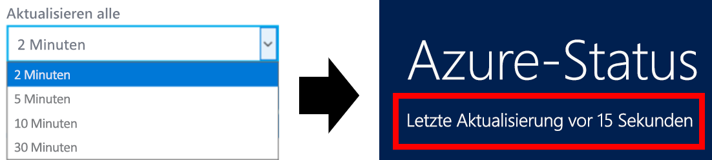

# Azure-Statusübersicht

Der [Azure-Status](https://status.azure.com/status/) bietet Ihnen eine globale Ansicht der Integrität von Azure-Diensten und -Regionen. Mit dem Azure-Status können Sie Informationen zur Dienstverfügbarkeit abrufen. Der Azure-Status steht allgemein zur Verfügung, um alle Dienste, die über ihren Dienstzustand melden, sowie Vorfälle mit weitreichenden Auswirkungen anzuzeigen. Wenn Sie ein aktueller Azure-Benutzer sind, wir empfehlen Ihnen jedoch ausdrücklich, die personalisierte [Azure Service Health](https://aka.ms/azureservicehealth)-Umgebung zu verwenden. Azure Service Health weist alle Ausfälle, bevorstehende geplante Wartungsarbeiten und Dienstempfehlungen aus.

## Azure-Statusupdates

Die Azure-Statusseite wird bei Änderung der Integrität von Azure-Diensten in Echtzeit aktualisiert. Wenn Sie die Azure-Statusseite geöffnet lassen, können Sie die Rate bestimmen, mit der die Seite mit neuen Daten aktualisiert wird. Im oberen Bereich sehen Sie, wann die Seite zuletzt aktualisiert wurde.

## Azure-Statusverlauf

Während die Azure-Statusseite immer die aktuellen Integritätsinformationen anzeigt, finden Sie ältere Ereignisse auf der [Azure Status-Verlaufsseite](https://status.azure.com/status/history/).

Dort werden Ereignisse angezeigt, die bis zu 90 Tage zurückliegen, einschließlich einer vorläufigen Ursache, Entschärfung und nächsten Schritten für Azure.

## RSS-Feed

Außerdem bietet Azure-Status [einen RSS-Feed](https://status.azure.com/status/feed/) von Änderungen der Integrität von Azure-Diensten, den Sie abonnieren können.

## Nächste Schritte

* Erfahren Sie, wie Sie mit [Service Health](./service-health-overview.md) eine personalisiertere Ansicht der Azure-Integrität abrufen können.
* Erfahren Sie, wie Sie eine genauere Ansicht der Integrität Ihrer spezifischen Azure-Ressourcen mit [Resource Health](./resource-health-overview.md) erhalten.
