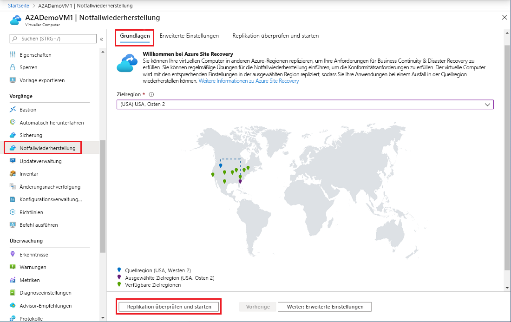
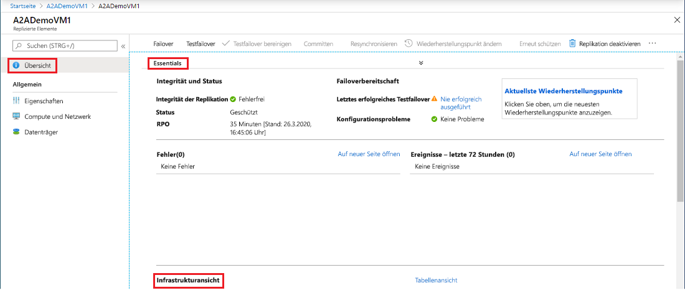
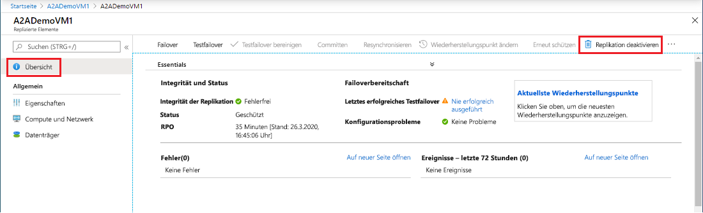

# Einrichten der Notfallwiederherstellung in einer sekundären Azure-Region für einen virtuellen Azure-Computer

Der Dienst [Azure Site Recovery](site-recovery-overview.md) unterstützt Ihre Strategien für Geschäftskontinuität und Notfallwiederherstellung, indem die Verfügbarkeit Ihrer Geschäftsanwendungen bei geplanten und ungeplanten Ausfällen gewährleistet wird. Site Recovery verwaltet und koordiniert die Notfallwiederherstellung von lokalen Computern sowie virtuellen Azure-Computern (VMs), einschließlich Replikation, Failover und Wiederherstellung.

In dieser Schnellstartanleitung erfahren Sie, wie Sie die Notfallwiederherstellung für einen virtuellen Azure-Computer einrichten, indem Sie ihn in einer anderen Azure-Region replizieren.

Wenn Sie kein Azure-Abonnement besitzen, erstellen Sie ein [kostenloses Konto](https://azure.microsoft.com/free/?WT.mc_id=A261C142F), bevor Sie beginnen.

> [!NOTE]
> Dieser Artikel ist als kurze exemplarische Vorgehensweise für neue Benutzer konzipiert. Dabei wird die einfachste Vorgehensweise mit Standardoptionen und minimaler Anpassung verwendet. Eine vollständige exemplarische Vorgehensweise finden Sie im Tutorial [Einrichten der Notfallwiederherstellung für Azure-VMs](azure-to-azure-tutorial-enable-replication.md).

## Anmelden an Azure

Melden Sie sich beim [Azure-Portal](https://portal.azure.com)an.

## Aktivieren der Replikation für die Azure-VM

1. Wählen Sie im Menü des Azure-Portals die Option **Virtuelle Computer** aus, oder suchen Sie auf einer beliebigen Seite nach *Virtuelle Computer*, und wählen Sie diese Option anschließend aus. Wählen Sie den virtuellen Computer aus, den Sie replizieren möchten.
2. Wählen Sie unter **Vorgänge** die Option **Notfallwiederherstellung** aus.
3. Wählen Sie unter **Configure disaster recovery** (Notfallwiederherstellung konfigurieren) > **Zielregion** die Zielregion aus, in die Sie replizieren möchten.
4. Akzeptieren Sie für diesen Schnellstart die anderen Standardeinstellungen.
5. Wählen Sie **Replikation überprüfen und starten** aus. Wählen Sie anschließend **Replikation starten** aus, um einen Auftrag zum Aktivieren der Replikation für die VM zu starten.

   

## Überprüfen der Einstellungen

Nach Abschluss des Replikationsauftrags können Sie den Replikationsstatus überprüfen, die Replikationseinstellungen ändern und die Bereitstellung testen.

1. Wählen Sie im Menü des Azure-Portals die Option **Virtuelle Computer** aus, oder suchen Sie auf einer beliebigen Seite nach *Virtuelle Computer*, und wählen Sie diese Option anschließend aus. Wählen Sie den virtuellen Computer aus, den Sie überprüfen möchten.
2. Wählen Sie unter **Vorgänge** die Option **Notfallwiederherstellung** aus.

   Sie können die Replikationsintegrität, die erstellten Wiederherstellungspunkte und die Quell- und Zielregionen auf der Karte überprüfen.

   

## Bereinigen von Ressourcen

Die Replikation der VM in der primären Region wird beendet, wenn Sie die Replikation der VM deaktivieren:

- Die Quellreplikationseinstellungen werden automatisch bereinigt. Die Site Recovery-Erweiterung, die im Rahmen der Replikation auf dem virtuellen Computer installiert wird, wird dabei nicht entfernt und muss manuell entfernt werden.
- Die Site Recovery-Abrechnung für den virtuellen Computer wird beendet.

Beenden Sie die Replikation wie folgt:

1. Wählen Sie im Menü des Azure-Portals die Option **Virtuelle Computer** aus, oder suchen Sie auf einer beliebigen Seite nach *Virtuelle Computer*, und wählen Sie diese Option anschließend aus. Wählen Sie den virtuellen Computer aus, den Sie ändern möchten.
2. Wählen Sie unter **Notfallwiederherstellung** die Option **Replikation deaktivieren** aus.

   

## Nächste Schritte

In diesem Schnellstart haben Sie eine einzelne VM in eine sekundäre Region repliziert. Versuchen Sie als Nächstes, mehrere virtuelle Azure-Computer unter Verwendung eines Wiederherstellungsplans zu replizieren.

> [!div class="nextstepaction"]
> [Set up disaster recovery for Azure VMs (Einrichten der Notfallwiederherstellung für Azure-VMs)](azure-to-azure-tutorial-enable-replication.md)
