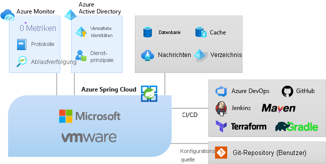

# Was ist Azure Spring Cloud?

Mit Azure Spring Cloud lassen sich Spring Boot-Microserviceanwendungen ganz einfach und ohne Codeänderungen in Azure bereitstellen.  Der Dienst verwaltet die Infrastruktur von Spring Cloud-Anwendungen und ermöglicht es Entwicklern dadurch, sich auf ihren Code zu konzentrieren.  Azure Spring Cloud bietet Lebenszyklusverwaltung durch umfassende Überwachung und Diagnose, Konfigurationsverwaltung, Dienstermittlung, CI/CD-Integration, Blau-Grün-Bereitstellungen und mehr.

## Vorteile von Azure Spring Cloud

Die Bereitstellung von Anwendungen in Azure Spring Cloud hat zahlreiche Vorteile.  Ihre Möglichkeiten:
* Effizientes Migrieren vorhandener Spring-Apps und Verwalten von Cloudskalierung/-kosten
* Verbessern der Agilität und Bereitstellungsgeschwindigkeit durch Modernisieren von Apps mit Spring Cloud-Mustern
* Ausführen von Java auf Cloudniveau und Fördern einer intensiveren Nutzung ohne komplizierte Infrastruktur
* Schnelles Entwickeln und Bereitstellen ohne Containerisierungsabhängigkeiten
* Effizientes und müheloses Überwachen von Produktionsworkloads

Azure Spring Cloud unterstützt sowohl Java [Spring Boot](https://spring.io/projects/spring-boot)- als auch ASP.NET Core-[Steeltoe](https://steeltoe.io/)-Apps. Steeltoe-Unterstützung wird zurzeit als öffentliche Vorschauversion angeboten. Angebote der Public Preview ermöglichen Ihnen das Experimentieren mit neuen Funktionen vor der offiziellen Veröffentlichung. Funktionen und Dienste in der Public Preview sind nicht zur Verwendung in der Produktion bestimmt. Weitere Informationen finden Sie in den [häufig gestellten Fragen](https://azure.microsoft.com/support/faq/). Sie können auch eine [Supportanfrage](../azure-portal/supportability/how-to-create-azure-support-request.md) einreichen.

## Übersicht über die Dienste

Als Teil des Azure-Ökosystems ermöglicht Azure Spring Cloud eine einfache Anbindung an andere Azure-Dienste wie Speicher, Datenbanken, Überwachung und mehr.  

  

* Azure Spring Cloud ist ein vollständig verwalteter Dienst für Spring Boot-Apps, der es Ihnen ermöglicht, sich ganz auf die Erstellung und Ausführung von Apps zu konzentrieren, ohne sich um die Verwaltung der Infrastruktur kümmern zu müssen.

* Stellen Sie einfach Ihre JAR-Dateien oder Ihren Code bereit, und Azure Spring Cloud verknüpft Ihre Apps automatisch mit der Runtime des Spring-Diensts sowie mit dem integrierten App-Lebenszyklus.

* Die Überwachung ist ganz einfach. Nach der Bereitstellung können Sie die App-Leistung überwachen, Fehler beheben und Anwendungen im Handumdrehen verbessern. 

* Vollständige Integration in die Ökosysteme und Dienste von Azure.

* Dank vollständig verwalteter Infrastruktur, integrierter Lebenszyklusverwaltung und müheloser Überwachung ist Azure Spring Cloud bestens für Unternehmen geeignet.

## Übersicht über die Dokumentation
Diese Dokumentation enthält Abschnitte mit ersten Schritten sowie mit Informationen zur Nutzung von Azure Spring Cloud-Diensten.

* Erste Schritte
    * [Starten Ihrer ersten App](spring-cloud-quickstart.md)
    * [Schnellstart: Bereitstellen des Azure Spring Cloud-Diensts](spring-cloud-quickstart-provision-service-instance.md)
    * [Einrichten des Konfigurationsservers]()
    * [Erstellen und Bereitstellen von Apps](spring-cloud-quickstart-deploy-apps.md)
    * [Schnellstart: Überwachen von Azure Spring Cloud-Apps mit Protokollen, Metriken und Ablaufverfolgung](spring-cloud-quickstart-logs-metrics-tracing.md)
* Vorgehensweise
    * [Entwickeln](how-to-prepare-app-deployment.md): Hier erfahren Sie, wie Sie eine bereits vorhandene Java Spring-Anwendung für die Bereitstellung in Azure Spring Cloud vorbereiten. Bei ordnungsgemäßer Konfiguration bietet Azure Spring Cloud stabile Dienste zur Überwachung, Skalierung und Aktualisierung von Java Spring Cloud-Anwendungen.
    * [Bereitstellen](spring-cloud-howto-staging-environment.md): Hier erfahren Sie, wie Sie unter Verwendung des Blau-Grün-Bereitstellungsmusters in Azure Spring Cloud eine Stagingbereitstellung einrichten. Die Blau/Grün-Bereitstellung ist ein Azure DevOps-Muster für Continuous Delivery, bei dem eine vorhandene Version (blau) live bleibt, während eine neue Version (grün) bereitgestellt wird.
    * [Konfigurieren von Apps](spring-cloud-howto-start-stop-delete.md):  Hier erfahren Sie, wie Sie Ihre Azure Spring Cloud-Anwendung starten, beenden und löschen. Außerdem erfahren Sie, wie Sie den Zustand einer Anwendung in Azure Spring Cloud über das Azure-Portal oder mithilfe der Azure CLI ändern.
    * [Skalierung](spring-cloud-howto-scale-manual.md): Hier erfahren Sie, wie Sie mithilfe des Azure Spring Cloud-Dashboards im Azure-Portal oder mithilfe von Einstellungen für die Autoskalierung eine beliebige Microserviceanwendung skalieren. Für die Kommunikation mit externen Ressourcen (beispielsweise Datenbanken, Speicher und Schlüsseltresore) stehen öffentliche IP-Adressen zur Verfügung.
    * [Überwachen von Apps](spring-cloud-howto-distributed-tracing.md): Tools für die verteilte Ablaufverfolgung zum problemlosen Debuggen und Überwachen komplexer Probleme. Azure Spring Cloud integriert Spring Cloud Sleuth in Azure Application Insights. Diese Integration bietet leistungsstarke Funktionen für die verteilte Ablaufverfolgung aus dem Azure-Portal.
    * [Schützen von Apps](spring-cloud-howto-enable-system-assigned-managed-identity.md): Azure-Ressourcen bieten eine automatisch verwaltete Identität in Azure Active Directory. Sie können diese Identität für die Authentifizierung bei jedem Dienst verwenden, der die Azure AD-Authentifizierung unterstützt. Hierfür müssen keine Anmeldeinformationen im Code enthalten sein.
    * [Integration in andere Azure-Dienste](spring-cloud-howto-bind-cosmos.md): Mit Azure Spring Cloud können Sie ausgewählte Azure-Dienste automatisch an Ihre Anwendungen binden, anstatt Ihre Spring Boot-Anwendungen manuell zu konfigurieren. So können Sie Ihre Anwendung beispielsweise an eine Azure Cosmos DB-Datenbank binden.
    * [Automatisieren](spring-cloud-howto-cicd.md): Continuous Integration- und Continuous Delivery-Tools (CI/CD) ermöglichen Ihnen die schnelle Bereitstellung von Updates für vorhandene Anwendungen mit minimalem Aufwand und Risiko. Mit Azure DevOps können Sie diese wichtigen Aufgaben strukturieren und steuern. 
    * [Problembehandlung](spring-cloud-howto-self-diagnose-solve.md): Die Azure Spring Cloud-Diagnose bietet eine interaktive Umgebung, die Sie bei der Behandlung von Problemen mit Apps unterstützt. Es ist keine Konfiguration erforderlich. Im Falle eines Problems gibt die Azure Spring Cloud-Diagnose Aufschluss über die Ursache und stellt Informationen bereit, die Ihnen bei der Behebung helfen.
    * [Migration](/azure/developer/java/migration/migrate-spring-boot-to-azure-spring-cloud): Hier erfahren Sie, wie Sie eine bereits vorhandene Spring Cloud- oder Spring Boot-Anwendung migrieren, um sie in Azure Spring Cloud auszuführen.

 Informationen zu den ersten Schritten finden Sie unter:

> [!div class="nextstepaction"]
> [Spring Cloud-Schnellstart](spring-cloud-quickstart.md)

Beispiele finden Sie auf GitHub: [Azure Spring Cloud-Beispiele](https://github.com/Azure-Samples/Azure-Spring-Cloud-Samples/tree/master/).