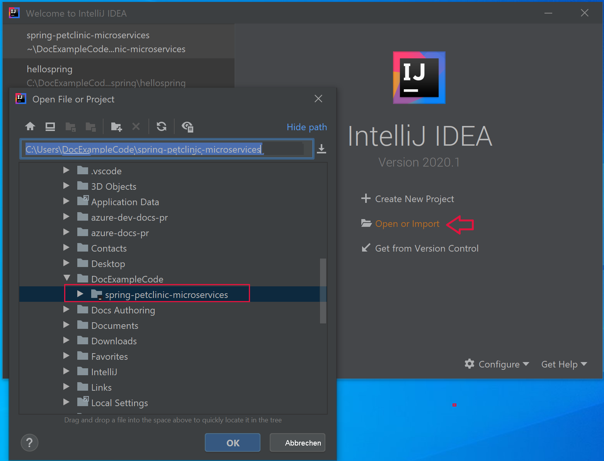
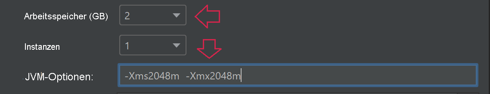
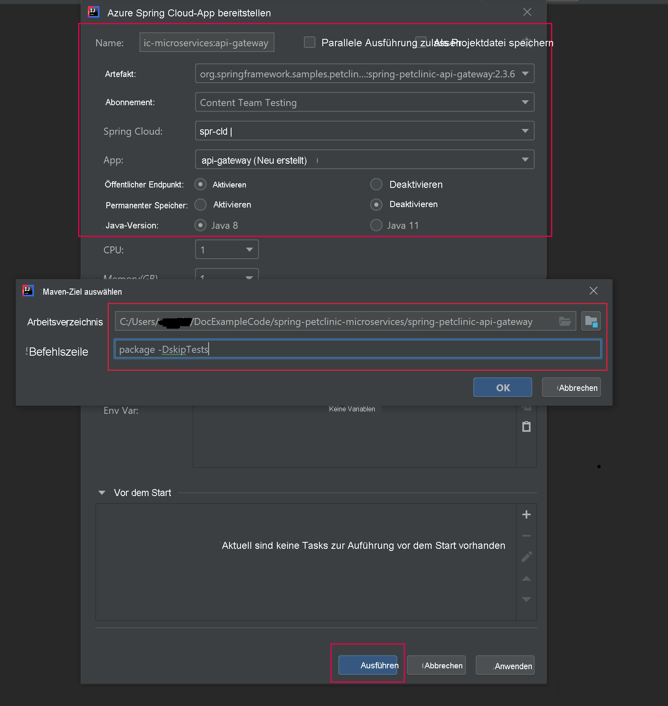

# <a name="quickstart-build-and-deploy-apps-to-azure-spring-cloud"></a>Schnellstart: Erstellen und Bereitstellen von Apps in Azure Spring Cloud

::: zone pivot="programming-language-csharp"
In dieser Schnellstartanleitung erfahren Sie, wie Sie Microserviceanwendungen mithilfe der Azure CLI erstellen und in Azure Spring Cloud bereitstellen.

## <a name="prerequisites"></a>Voraussetzungen

* Absolvieren Sie die vorherigen Schnellstarts in dieser Serie:

  * [Bereitstellen des Azure Spring Cloud-Diensts](./quickstart-provision-service-instance.md)
  * [Einrichten des Azure Spring Cloud-Konfigurationsservers](./quickstart-setup-config-server.md)

## <a name="download-the-sample-app"></a>Herunterladen der Beispiel-App

Wenn Sie bis jetzt Azure Cloud Shell verwendet haben, wechseln Sie zu einer lokalen Eingabeaufforderung, um die folgenden Schritte auszuführen:

1. Erstellen Sie einen neuen Ordner, und klonen Sie das Beispiel-App-Repository.

   ```console
   mkdir source-code
   ```

   ```console
   cd source-code
   ```

   ```console
   git clone https://github.com/Azure-Samples/Azure-Spring-Cloud-Samples
   ```

1. Navigieren Sie zum Repositoryverzeichnis.

   ```console
   cd Azure-Spring-Cloud-Samples
   ```

## <a name="deploy-planetweatherprovider"></a>Bereitstellen von PlanetWeatherProvider

1. Erstellen Sie eine App für das Projekt „PlanetWeatherProvider“ in Ihrer Azure Spring Cloud-Instanz.

   ```azurecli
   az spring-cloud app create --name planet-weather-provider --runtime-version NetCore_31
   ```

   Wenn Sie die automatische Dienstregistrierung aktivieren möchten, müssen Sie der App den gleichen Namen geben, der auch in der Datei *appsettings.json* des Projekts als Wert von `spring.application.name` angegeben ist:

   ```json
   "spring": {
     "application": {
       "name": "planet-weather-provider"
     }
   }
   ```

   Die Ausführung dieses Befehls kann einige Minuten in Anspruch nehmen.

1. Wechseln Sie in das Verzeichnis des Projektordners `PlanetWeatherProvider`.

   ```console
   cd steeltoe-sample/src/planet-weather-provider
   ```

1. Erstellen Sie die Binärdateien und die *ZIP*-Datei, die bereitgestellt werden sollen.

   ```console
   dotnet publish -c release -o ./publish
   ```

   > [!TIP]
   > Die Projektdatei enthält den folgenden XML-Code zum Verpacken der Binärdateien in einer *ZIP*-Datei, nachdem diese in den Ordner *./publish* geschrieben wurden:
   >
   > ```xml
   > <Target Name="Publish-Zip" AfterTargets="Publish">
   >   <ZipDirectory SourceDirectory="$(PublishDir)" DestinationFile="$(MSBuildProjectDirectory)/publish-deploy-planet.zip" Overwrite="true" />
   > </Target>
   > ```

1. Nehmen Sie die Bereitstellung in Azure vor.

   Stellen Sie sicher, dass sich die Eingabeaufforderung im Projektordner befindet, bevor Sie den folgenden Befehl ausführen.

   ```console
   az spring-cloud app deploy -n planet-weather-provider --runtime-version NetCore_31 --main-entry Microsoft.Azure.SpringCloud.Sample.PlanetWeatherProvider.dll --artifact-path ./publish-deploy-planet.zip
   ```

   Die Option `--main-entry` gibt den relativen Pfad vom Stammordner der *ZIP*-Datei zur  *DLL*-Datei an, die den Einstiegspunkt der Anwendung enthält. Nachdem der Dienst die *ZIP*-Datei hochgeladen hat, werden alle Dateien und Ordner extrahiert, und es wird versucht, den Einstiegspunkt in der angegebenen *DLL*-Datei auszuführen.

   Die Ausführung dieses Befehls kann einige Minuten in Anspruch nehmen.

## <a name="deploy-solarsystemweather"></a>Bereitstellen von SolarSystemWeather

1. Erstellen Sie in Ihrer Azure Spring Cloud-Instanz eine weitere App, dieses Mal für das Projekt „SolarSystemWeather“:

   ```azurecli
   az spring-cloud app create --name solar-system-weather --runtime-version NetCore_31
   ```

   `solar-system-weather` ist der Name, der in der Datei *appsettings.json* des Projekts `SolarSystemWeather` angegeben ist.

   Die Ausführung dieses Befehls kann einige Minuten in Anspruch nehmen.

1. Wechseln Sie in das Verzeichnis des Projekts `SolarSystemWeather`.

   ```console
   cd ../solar-system-weather
   ```

1. Erstellen Sie die Binärdateien und die *ZIP*-Datei, die bereitgestellt werden sollen.

   ```console
   dotnet publish -c release -o ./publish
   ```

1. Nehmen Sie die Bereitstellung in Azure vor.

   ```console
   az spring-cloud app deploy -n solar-system-weather --runtime-version NetCore_31 --main-entry Microsoft.Azure.SpringCloud.Sample.SolarSystemWeather.dll --artifact-path ./publish-deploy-solar.zip
   ```
   
   Die Ausführung dieses Befehls kann einige Minuten in Anspruch nehmen.

## <a name="assign-public-endpoint"></a>Zuweisen eines öffentlichen Endpunkts

Senden Sie zum Testen der Anwendung im Browser eine HTTP GET-Anforderung an die Anwendung `solar-system-weather`.  Dazu benötigen Sie einen öffentlichen Endpunkt für die Anforderung.

1. Führen Sie zum Zuweisen des Endpunkts den folgenden Befehl aus:

   ```azurecli
   az spring-cloud app update -n solar-system-weather --assign-endpoint true
   ```

1. Führen Sie zum Abrufen der URL des Endpunkts den folgenden Befehl aus:

   Windows:

   ```azurecli
   az spring-cloud app show -n solar-system-weather -o table
   ```

   Linux:

   ```azurecli
   az spring-cloud app show --name solar-system-weather | grep url
   ```

## <a name="test-the-application"></a>Testen der Anwendung

Senden Sie eine GET-Anforderung an die App `solar-system-weather`. Navigieren Sie in einem Browser zu der öffentlichen URL, an die Sie `/weatherforecast` angefügt haben. Beispiel:

```
https://servicename-solar-system-weather.azuremicroservices.io/weatherforecast
```

Die Ausgabe liegt im JSON-Format vor:

```json
[{"Key":"Mercury","Value":"very warm"},{"Key":"Venus","Value":"quite unpleasant"},{"Key":"Mars","Value":"very cool"},{"Key":"Saturn","Value":"a little bit sandy"}]
```

Diese Antwort zeigt, dass beide Microservice-Apps funktionieren. Die App `SolarSystemWeather` gibt Daten zurück, die sie aus der App `PlanetWeatherProvider` abgerufen hat.
::: zone-end
---
::: zone pivot="programming-language-java"
In diesem Dokument wird erläutert, wie Sie Microserviceanwendungen mithilfe der folgenden Komponenten erstellen und in Azure Spring Cloud bereitstellen:
* Azure CLI
* Maven-Plug-In
* IntelliJ

Führen Sie vor der Bereitstellung mithilfe der Azure CLI oder von Maven die Beispiele aus, die [eine Instanz von Azure Spring Cloud bereitstellen](./quickstart-provision-service-instance.md) und [den Konfigurationsserver einrichten](./quickstart-setup-config-server.md).

## <a name="prerequisites"></a>Voraussetzungen

* [Installation von JDK 8](/java/azure/jdk/)
* [Registrierung für ein Azure-Abonnement](https://azure.microsoft.com/free/)
* (Optional) [Installation der Azure CLI, Version 2.0.67 oder höher](/cli/azure/install-azure-cli) und Installation der Azure Spring Cloud-Erweiterung mit dem Befehl `az extension add --name spring-cloud`
* (Optional) [Installation des Azure-Toolkits für IntelliJ](https://plugins.jetbrains.com/plugin/8053-azure-toolkit-for-intellij/) und [Anmeldung](/azure/developer/java/toolkit-for-intellij/create-hello-world-web-app#installation-and-sign-in)

## <a name="deployment-procedures"></a>Bereitstellungsverfahren

#### <a name="cli"></a>[BEFEHLSZEILENSCHNITTSTELLE (CLI)](#tab/Azure-CLI)

## <a name="build-the-microservices-applications-locally"></a>Lokales Erstellen der Microserviceanwendungen

1. Klonen Sie das Beispiel-App-Repository in Ihrem Azure Cloud-Konto.  Ändern Sie das Verzeichnis, und erstellen Sie das Projekt. 

    ```azurecli
    git clone https://github.com/azure-samples/spring-petclinic-microservices
    cd spring-petclinic-microservices
    mvn clean package -DskipTests -Denv=cloud
    ```
Die Kompilierung des Projekts dauert fünf bis zehn Minuten. Nach Abschluss des Vorgangs sollten die entsprechenden Ordner einzelne JAR-Dateien für jeden Dienst enthalten.

## <a name="create-and-deploy-apps-on-azure-spring-cloud"></a>Erstellen und Bereitstellen von Apps in Azure Spring Cloud

1. Erstellen Sie die zwei zentralen Microservices für PetClinic: API-Gateway und customers-service.

    ```azurecli
    az spring-cloud app create --name api-gateway --instance-count 1 --memory 2 --assign-endpoint
    az spring-cloud app create --name customers-service --instance-count 1 --memory 2
    ```

1. Stellen Sie die im vorherigen Schritt erstellten JAR-Dateien bereit.

    ```azurecli
    az spring-cloud app deploy --name api-gateway --jar-path spring-petclinic-api-gateway/target/spring-petclinic-api-gateway-2.3.6.jar --jvm-options="-Xms2048m -Xmx2048m"
    az spring-cloud app deploy --name customers-service --jar-path spring-petclinic-customers-service/target/spring-petclinic-customers-service-2.3.6.jar --jvm-options="-Xms2048m -Xmx2048m"
    ```

1. Fragen Sie den App-Status nach der Bereitstellung mit dem folgenden Befehl ab:

    ```azurecli
    az spring-cloud app list -o table
    ```

    ```txt
        Name               Location    ResourceGroup    Production Deployment    Public Url                                           Provisioning Status    CPU    Memory    Running Instance    Registered Instance    Persistent Storage
    -----------------  ----------  ---------------  -----------------------  ---------------------------------------------------  ---------------------  -----  --------  ------------------  ---------------------  --------------------
    api-gateway        eastus      xxxxxx-sp         default                  https://<service name>-api-gateway.azuremicroservices.io   Succeeded              1      2         1/1                 1/1                    -     
    customers-service  eastus      <service name>         default                                                                       Succeeded              1      2         1/1                 1/1                    -     
    ```

## <a name="verify-the-services"></a>Überprüfen der Dienste

Greifen Sie über den Browser mit der oben gezeigten **öffentlichen URL** im Format „https://<service name>-api-gateway.azuremicroservices.io“ auf das App-Gateway und customers-service zu.


> [!TIP]
> Zum Beheben von Problemen bei der Bereitstellung können Sie den folgenden Befehl verwenden, um Protokollstreaming in Echtzeit zu erhalten, wenn die App ausgeführt wird: `az spring-cloud app logs --name <app name> -f`.

## <a name="deploy-extra-apps"></a>Bereitstellen zusätzlicher Apps

Damit die PetClinic-App mit allen Features wie Verwaltungsserver, Besuche und Tierärzte funktioniert, können Sie die anderen Apps mit den folgenden Befehlen bereitstellen:

```azurecli
az spring-cloud app create --name admin-server --instance-count 1 --memory 2 --assign-endpoint
az spring-cloud app create --name vets-service --instance-count 1 --memory 2
az spring-cloud app create --name visits-service --instance-count 1 --memory 2
az spring-cloud app deploy --name admin-server --jar-path spring-petclinic-admin-server/target/spring-petclinic-admin-server-2.3.6.jar --jvm-options="-Xms2048m -Xmx2048m"
az spring-cloud app deploy --name vets-service --jar-path spring-petclinic-vets-service/target/spring-petclinic-vets-service-2.3.6.jar --jvm-options="-Xms2048m -Xmx2048m"
az spring-cloud app deploy --name visits-service --jar-path spring-petclinic-visits-service/target/spring-petclinic-visits-service-2.3.6.jar --jvm-options="-Xms2048m -Xmx2048m"
```
#### <a name="maven"></a>[Maven](#tab/Maven)

## <a name="build-the-microservices-applications-locally"></a>Lokales Erstellen der Microserviceanwendungen

1. Klonen Sie das Beispiel-App-Repository in Ihrem Azure Cloud-Konto.  Ändern Sie das Verzeichnis, und erstellen Sie das Projekt. 

    ```azurecli
    git clone https://github.com/azure-samples/spring-petclinic-microservices
    cd spring-petclinic-microservices
    mvn clean package -DskipTests -Denv=cloud
    ```
Die Kompilierung des Projekts dauert fünf bis zehn Minuten. Nach Abschluss des Vorgangs sollten die entsprechenden Ordner einzelne JAR-Dateien für jeden Dienst enthalten.

## <a name="generate-configurations-and-deploy-to-the-azure-spring-cloud"></a>Generieren von Konfigurationen und Bereitstellen in Azure Spring Cloud

1. Generieren Sie Konfigurationen, indem Sie den folgenden Befehl im Stammverzeichnis von PetClinic mit dem übergeordneten POM ausführen. Wenn Sie sich bereits bei der Azure CLI angemeldet haben, werden die Anmeldeinformationen automatisch vom Befehl abgerufen. Andernfalls werden Sie mit Anweisungen zur Eingabeaufforderung angemeldet. Weitere Informationen finden Sie auf unserer [Wiki-Seite](https://github.com/microsoft/azure-maven-plugins/wiki/Authentication).

    ```azurecli
    mvn com.microsoft.azure:azure-spring-cloud-maven-plugin:1.3.0:config
    ```
    
    Sie werden zur Auswahl der folgenden Angaben aufgefordert:
    * **Module:** Wählen Sie `api-gateway` und `customers-service` aus.
    * **Abonnement:** Dies ist das Abonnement, das zum Erstellen einer Azure Spring Cloud-Instanz verwendet wird.
    * **Dienstinstanz:** Dies ist der Name Ihrer Azure Spring Cloud-Instanz.
    * **Öffentlicher Endpunkt:** Geben Sie in der Liste der angegebenen Projekte die Zahl für `api-gateway` ein.  Dadurch erhalten Sie öffentlichen Zugriff.

1. Überprüfen Sie, ob die `appName`-Elemente in den POM-Dateien korrekt sind.
    ```
    <build>
        <plugins>
            <plugin>
                <groupId>com.microsoft.azure</groupId>
                <artifactId>azure-spring-cloud-maven-plugin</artifactId>
                <version>1.3.0</version>
                <configuration>
                    <subscriptionId>xxxxxxxxx-xxxx-xxxx-xxxxxxxxxxxx</subscriptionId>
                    <clusterName>v-spr-cld</clusterName>
                    <appName>customers-service</appName>
    
    ```
    Möglicherweise müssen Sie `appName`-Angaben wie folgt korrigieren:
    * api-gateway
    * customers-service

1. Das POM enthält jetzt die Plug-In-Abhängigkeiten und -Konfigurationen. Stellen Sie die Apps mit dem folgenden Befehl bereit: 

    ```azurecli
    mvn azure-spring-cloud:deploy
    ```
## <a name="verify-the-services"></a>Überprüfen der Dienste

Ein erfolgreicher Bereitstellungsbefehl gibt eine URL im folgenden Format zurück: https://<service name>-spring-petclinic-api-gateway.azuremicroservices.io.  Navigieren Sie damit zum ausgeführten Dienst.


Sie können auch im Azure-Portal navigieren, um die URL zu suchen. 
1. Navigieren Sie zum Dienst.
2. Wählen Sie **Apps** aus.
3. Wählen Sie **api-gateway** aus. 
4. Suchen Sie auf der Seite **api-gateway | Übersicht** nach der URL.

## <a name="deploy-extra-apps"></a>Bereitstellen zusätzlicher Apps

Damit die PetClinic-App mit allen Features wie Verwaltungsserver, Besuche und Tierärzte funktioniert, können Sie die anderen Microservices bereitstellen.   Führen Sie den Konfigurationsbefehl erneut aus, und wählen Sie die folgenden Microservices aus:
* admin-server
* vets-service
* visits-service

Führen Sie anschließend den Befehl `deploy` erneut aus.

#### <a name="intellij"></a>[IntelliJ](#tab/IntelliJ)

## <a name="import-sample-project-in-intellij"></a>Importieren eines Beispielprojekts in IntelliJ

1. Laden Sie das Quellrepository für dieses Tutorial herunter, und entpacken Sie es, oder klonen Sie es mithilfe von Git: `git clone https://github.com/azure-samples/spring-petclinic-microservices`. 

1. Öffnen Sie das IntelliJ-Dialogfeld **Willkommens**, und wählen Sie **Projekt importieren** aus, um den Importassistenten zu öffnen.

1. Wählen Sie den Ordner `spring-petclinic-microservices` aus.

    

### <a name="deploy-api-gateway-app-to-azure-spring-cloud"></a>Bereitstellen der App „api-gateway“ in Azure Spring Cloud
Für die Bereitstellung in Azure müssen Sie sich mit Ihrem Azure-Konto beim Azure-Toolkit für IntelliJ anmelden und Ihr Abonnement auswählen. Anmeldeinformationen finden Sie unter [Installation und Anmeldung](https://docs.microsoft.com/azure/developer/java/toolkit-for-intellij/create-hello-world-web-app#installation-and-sign-in).

1. Klicken Sie im Projektexplorer von IntelliJ mit der rechten Maustaste auf Ihr Projekt, und wählen Sie **Azure** -> **In Azure Spring Cloud bereitstellen** aus.

    

1. Fügen Sie im Feld **Name** die Zeichenfolge *:api-gateway* an den vorhandenen **Namen** an.
1. Wählen Sie im Textfeld **Artefakt** die Option *spring-petclinic-api-gateway-2.3.6* aus.
1. Überprüfen Sie im Textfeld **Abonnement** Ihr Abonnement.
1. Wählen Sie im Textfeld **Spring Cloud** die Instanz von Azure Spring Cloud aus, die Sie unter [Schnellstart: Bereitstellen des Azure Spring Cloud-Diensts](./quickstart-provision-service-instance.md) erstellt haben.
1. Legen Sie **Öffentlicher Endpunkt** auf *Aktivieren* fest.
1. Wählen Sie im Textfeld **App:** die Option **App erstellen...** aus.
1. Geben Sie *api-gateway* ein, und klicken Sie auf **OK**.
1. Geben Sie die Speicher- und JVM-Optionen an.

     

1. Doppelklicken Sie im Abschnitt **Before launch** (Vor dem Start) des Dialogfelds auf *Run Maven Goal* (Maven-Ziel ausführen).
1. Navigieren Sie im Textfeld **Arbeitsverzeichnis** zum Ordner *spring-petclinic-microservices/gateway*.
1. Geben Sie im Textfeld **Befehlszeile** die Zeichenfolge *package -DskipTests* ein. Klicken Sie auf **OK**.

    

1. Starten Sie die Bereitstellung, indem Sie unten im Dialogfeld **Deploy Azure Spring Cloud app** (Azure Spring Cloud-App bereitstellen) auf die Schaltfläche **Ausführen** klicken. Das Plug-In führt den Befehl `mvn package` für die App `api-gateway` aus, und stellt die vom `package`-Befehl generierte JAR-Datei bereit.

### <a name="deploy-customers-service-and-other-apps-to-azure-spring-cloud"></a>Bereitstellen der App „customers-service“ und weiterer Apps in Azure Spring Cloud
Wiederholen Sie die oben beschriebenen Schritte, um `customers-service` und weitere PetClinic-Apps in Azure Spring Cloud bereitzustellen:

1. Ändern Sie die Werte für **Name** und **Artefakt** zur Identifizierung der App `customers-service`.
1. Wählen Sie im Textfeld **App:** die Option **App erstellen...** aus, um die App `customers-service` zu erstellen.
1. Vergewissern Sie sich, dass die Option **Öffentlicher Endpunkt** auf *Deaktiviert* festgelegt ist.
1. Stellen Sie im Abschnitt **Before launch** (Vor dem Start) des Dialogfelds das **Arbeitsverzeichnis** auf den Ordner *petclinic/customers-service* um.
1. Starten Sie die Bereitstellung, indem Sie unten im Dialogfeld **Deploy Azure Spring Cloud app** (Azure Spring Cloud-App bereitstellen) auf die Schaltfläche **Ausführen** klicken. 

## <a name="verify-the-services"></a>Überprüfen der Dienste

Navigieren Sie zur URL im Format `https://<service name>-spring-petclinic-api-gateway.azuremicroservices.io`.


Sie können auch im Azure-Portal navigieren, um die URL zu suchen. 
1. Navigieren Sie zum Dienst.
2. Wählen Sie **Apps** aus.
3. Wählen Sie **api-gateway** aus. 
4. Suchen Sie auf der Seite **api-gateway | Übersicht** nach der URL.

## <a name="deploy-extra-apps"></a>Bereitstellen zusätzlicher Apps
Andere in diesem Beispiel enthaltene Microservices können auf ähnliche Weise bereitgestellt werden. 
* admin-server
* vets-service
* visits-service

::: zone-end

## <a name="next-steps"></a>Nächste Schritte

In dieser Schnellstartanleitung haben Sie Azure-Ressourcen erstellt, für die weiterhin Gebühren anfallen, falls sie in Ihrem Abonnement verbleiben. Wenn Sie nicht mit der nächsten Schnellstartanleitung fortfahren möchten, lesen Sie die Informationen unter [Bereinigen von Ressourcen](./quickstart-logs-metrics-tracing.md#clean-up-resources). Fahren Sie andernfalls mit der nächsten Schnellstartanleitung fort:

> [!div class="nextstepaction"]
> [Protokolle, Metriken und Ablaufverfolgung](./quickstart-logs-metrics-tracing.md)