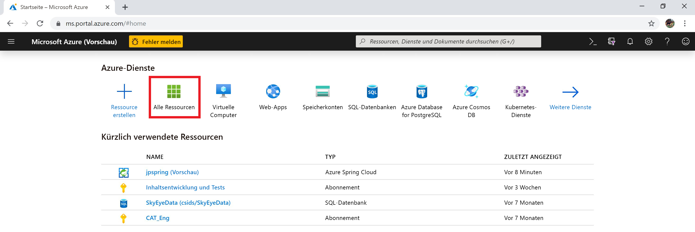
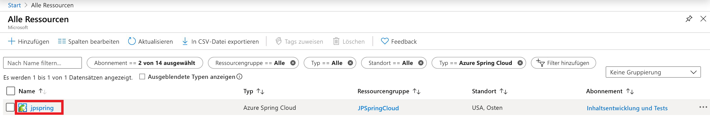
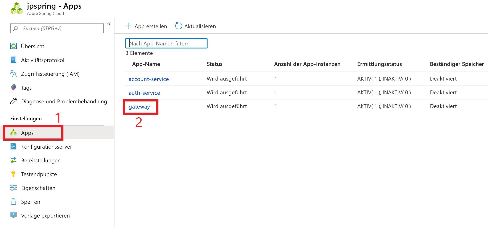
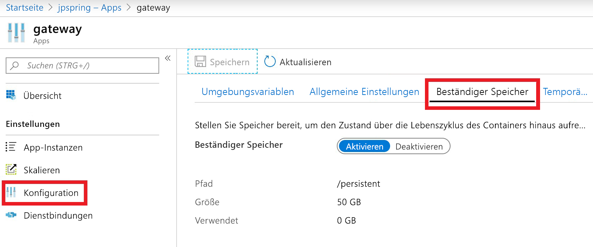

# <a name="use-persistent-storage-in-azure-spring-cloud"></a>Verwenden von beständigem Speicher in Azure Spring Cloud

**Dieser Artikel gilt für:** ✔️ Java ✔️ C#

Azure Spring Cloud bietet zwei Arten von Speicher für Ihre Anwendung: beständigen und temporären Speicher.

Azure Spring Cloud aktiviert standardmäßig temporären Speicher für jede Anwendungsinstanz. Der temporäre Speicher ist im standardmäßigen Einbindungspfad„/tmp“ auf 5 GB pro Instanz beschränkt.

> [!WARNING]
> Durch das Neustarten einer Anwendungsinstanz wird der zugehörige temporäre Speicher dauerhaft gelöscht.

Der beständige Speicher ist ein von Azure verwalteter Dateifreigabecontainer, der pro Anwendung zugeordnet wird. Im beständigen Speicher gespeicherte Daten werden für alle Instanzen einer Anwendung freigegeben. Eine Azure Spring Cloud-Instanz kann maximal zehn Anwendungen mit aktiviertem beständigen Speicher enthalten. Jeder Anwendung werden 50 GB an beständigem Speicher zugeordnet. Der Standardeinbindungspfad für beständigen Speicher lautet „/persistent“.

> [!WARNING]
> Wenn Sie den beständigen Speicher für eine Anwendung deaktivieren, wird die Zuordnung dieses Speichers aufgehoben, und alle gespeicherten Daten gehen verloren.

## <a name="use-the-azure-portal-to-enable-persistent-storage"></a>Aktivieren des beständigen Speichers im Azure-Portal

1. Wählen Sie auf dem **Startbildschirm** des Azure-Portals die Option **Alle Ressourcen** aus.

    >

1. Wählen Sie die Azure Spring Cloud-Ressource aus, für die beständiger Speicher benötigt wird. In diesem Beispiel heißt die Anwendung **upspring**.

    > 

1. Wählen Sie unter der Überschrift **Einstellungen** die Option **Apps** aus.

1. Ihre Azure Spring Cloud-Dienste werden in einer Tabelle angezeigt.  Wählen Sie den Dienst aus, dem Sie beständigen Speicher hinzufügen möchten. In diesem Beispiel ist der Dienst **Gateway** ausgewählt.

    > 

1. Wählen Sie auf der Seite „Konfiguration“ des Diensts die Option **Konfiguration** aus.

1. Wählen Sie die Registerkarte **Beständiger Speicher** aus, und klicken Sie auf **Aktivieren**.

    > 

Wenn der beständige Speicher aktiviert ist, werden Größe und Pfad auf der Konfigurationsseite angezeigt.

## <a name="use-the-azure-cli-to-modify-persistent-storage"></a>Verwenden Sie die Azure-Befehlszeilenschnittstelle, um den beständigen Speicher zu ändern.

Installieren Sie bei Bedarf die Spring Cloud-Erweiterung für die Azure-Befehlszeilenschnittstelle:

```azurecli
az extension add --name spring-cloud
```
Andere Vorgänge:

* Erstellen Sie eine App mit aktiviertem persistenten Speicher:

    ```azurecli
    az spring-cloud app create -n <app> -g <resource-group> -s <service-name> --enable-persistent-storage true
    ```

* Aktivieren Sie beständigen Speicher für eine vorhandene App:

    ```azurecli
    az spring-cloud app update -n <app> -g <resource-group> -s <service-name> --enable-persistent-storage true
    ```

* Deaktivieren Sie beständigen Speicher in einer vorhandenen App:

    ```azurecli
    az spring-cloud app update -n <app> -g <resource-group> -s <service-name> --enable-persistent-storage false
    ```

    > [!WARNING]
    > Wenn Sie den beständigen Speicher einer Anwendung deaktivieren, wird die Zuordnung dieses Speichers aufgehoben, und alle gespeicherten Daten gehen für immer verloren.

## <a name="next-steps"></a>Nächste Schritte

* Erfahren Sie mehr über [Kontingente und Servicepläne für Azure Spring Cloud](spring-cloud-quotas.md).
* Erfahren Sie, wie Sie [eine Anwendung in Azure Spring Cloud skalieren](spring-cloud-tutorial-scale-manual.md).
