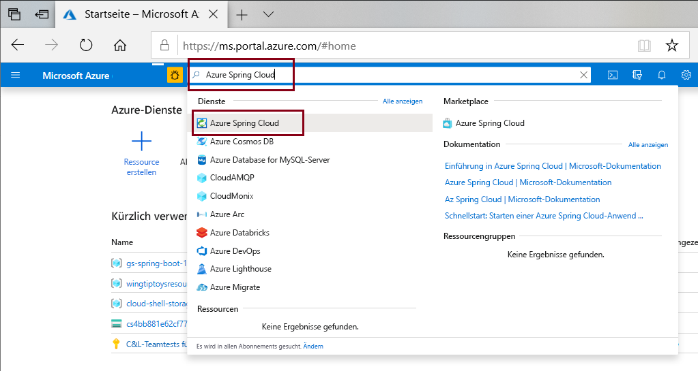
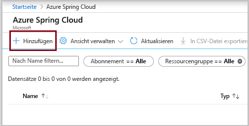
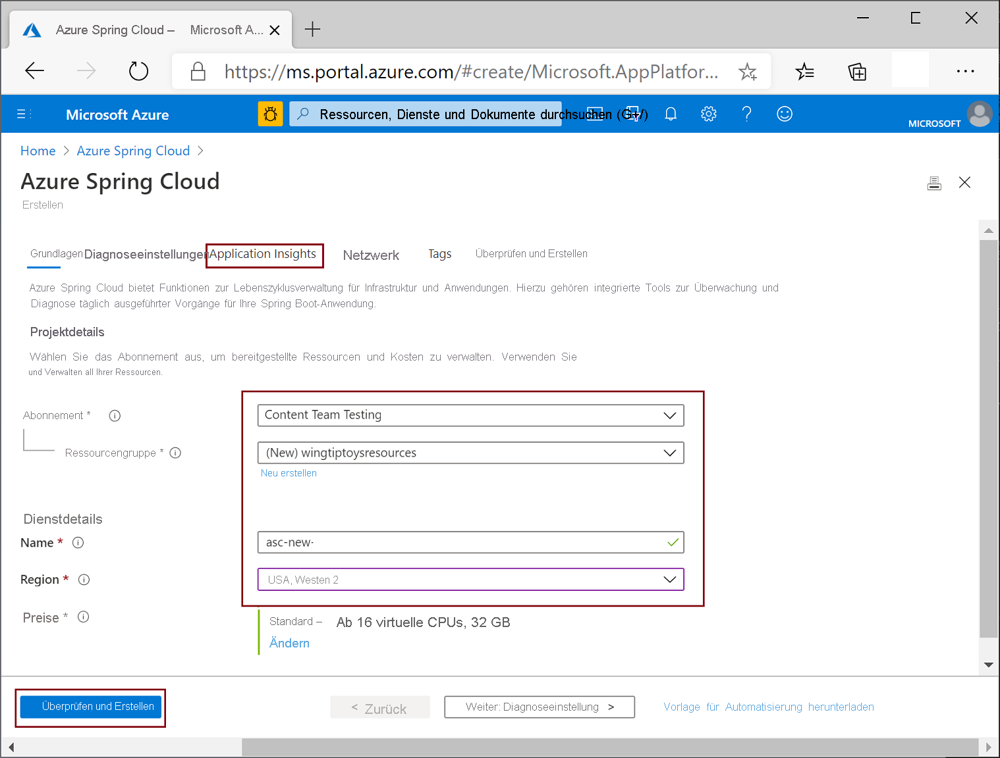

# <a name="quickstart-provision-azure-spring-cloud-service"></a>Schnellstart: Bereitstellen des Azure Spring Cloud-Diensts

::: zone pivot="programming-language-csharp"
In dieser Schnellstartanleitung verwenden Sie die Azure CLI zum Bereitstellen einer Instanz des Azure Spring Cloud-Diensts.

## <a name="prerequisites"></a>Voraussetzungen

* Ein Azure-Konto mit einem aktiven Abonnement. Sie können [kostenlos ein Konto erstellen](https://azure.microsoft.com/free/?WT.mc_id=A261C142F).
* [.NET Core 3.1 SDK](https://dotnet.microsoft.com/download/dotnet-core/3.1). Der Azure Spring Cloud-Dienst unterstützt .NET Core 3.1 und höhere Versionen.
* [Azure CLI Version 2.0.67 oder höher](/cli/azure/install-azure-cli)
* [Git](https://git-scm.com/).

## <a name="install-azure-cli-extension"></a>Installieren der Azure CLI-Erweiterung

Vergewissern Sie sich, dass Sie mindestens Version 2.0.67 der Azure CLI verwenden:

```azurecli
az --version
```

Führen Sie den folgenden Befehl aus, um die Azure Spring Cloud-Erweiterung für die Azure CLI zu installieren:

```azurecli
az extension add --name spring-cloud
```

## <a name="log-in-to-azure"></a>Anmelden an Azure

1. Anmelden bei der Azure CLI

    ```azurecli
    az login
    ```

1. Falls Sie über mehrere Abonnements verfügen, wählen Sie das gewünschte Abonnement für diese Schnellstartanleitung aus.

   ```azurecli
   az account list -o table
   ```

   ```azurecli
   az account set --subscription <Name or ID of a subscription from the last step>
   ```

## <a name="provision-an-instance-of-azure-spring-cloud"></a>Bereitstellen einer Instanz von Azure Spring Cloud

1. Erstellen Sie eine [Ressourcengruppe](../azure-resource-manager/management/overview.md) für Ihren Azure Spring Cloud-Dienst. Der Name der Ressourcengruppe kann alphanumerische Zeichen, Unterstriche, Klammern, Bindestriche, Punkte (außer am Ende) und Unicode-Zeichen enthalten.

   ```azurecli
   az group create --location eastus --name <resource group name>
   ```

1. Stellen Sie eine Instanz des Azure Spring Cloud-Diensts bereit. Der Name der Dienstinstanz muss eindeutig und zwischen 4 und 32 Zeichen lang sein und darf nur Kleinbuchstaben, Ziffern und Bindestriche enthalten. Das erste Zeichen des Dienstnamens muss ein Buchstabe und das letzte Zeichen entweder ein Buchstabe oder eine Ziffer sein.

    ```azurecli
    az spring-cloud create -n <service instance name> -g <resource group name>
    ```

    Die Ausführung dieses Befehls kann mehrere Minuten dauern.

1. Legen Sie den Standardnamen für die Ressourcengruppe und die Dienstinstanz fest, damit Sie diese Werte nicht immer wieder in nachfolgenden Befehlen angeben müssen.

   ```azurecli
   az configure --defaults group=<resource group name>
   ```

   ```azurecli
   az configure --defaults spring-cloud=<service instance name>
   ```
::: zone-end

::: zone pivot="programming-language-java"
Sie können Azure Spring Cloud mithilfe des Azure-Portals oder der Azure CLI instanziieren.  Beide Methoden werden in den folgenden Verfahren näher beschrieben.
## <a name="prerequisites"></a>Voraussetzungen

* [Installation von JDK 8](/java/azure/jdk/)
* [Registrierung für ein Azure-Abonnement](https://azure.microsoft.com/free/)
* (Optional) [Installation der Azure CLI, Version 2.0.67 oder höher](/cli/azure/install-azure-cli) und Installation der Azure Spring Cloud-Erweiterung mit dem Befehl `az extension add --name spring-cloud`
* (Optional) [Installation des Azure-Toolkits für IntelliJ](https://plugins.jetbrains.com/plugin/8053-azure-toolkit-for-intellij/) und [Anmeldung](/azure/developer/java/toolkit-for-intellij/create-hello-world-web-app#installation-and-sign-in)

## <a name="provision-an-instance-of-azure-spring-cloud"></a>Bereitstellen einer Instanz von Azure Spring Cloud

#### <a name="portal"></a>[Portal](#tab/Azure-portal)

Mit dem folgenden Verfahren wird eine Azure Spring Cloud-Instanz über das Azure-Portal erstellt:

1. Öffnen Sie das [Azure-Portal](https://ms.portal.azure.com/) in einem neuen Tab. 

2. Suchen Sie im oberen Suchfeld nach **Azure Spring Cloud**.

3. Wählen Sie in den Ergebnissen **Azure Spring Cloud** aus.

    

4. Klicken Sie auf der Azure Spring Cloud-Seite auf **+ Hinzufügen**.

    

5. Füllen Sie das Formular auf der Azure Spring Cloud-Seite **Erstellen** aus.  Berücksichtigen Sie die folgenden Richtlinien:
    - **Abonnement**: Wählen Sie das Abonnement aus, unter dem diese Ressource abgerechnet werden soll.
    - **Ressourcengruppe**: Die Erstellung neuer Ressourcengruppen für neue Ressourcen ist eine bewährte Methode. Beachten Sie, dass diese später als **\<resource group name\>** verwendet wird.
    - **Dienstdetails/Name**: Geben Sie **\<service instance name\>** an.  Der Name muss zwischen 4 und 32 Zeichen lang sein und darf nur Kleinbuchstaben, Ziffern und Bindestriche enthalten.  Das erste Zeichen des Dienstnamens muss ein Buchstabe und das letzte Zeichen entweder ein Buchstabe oder eine Ziffer sein.
    - **Standort**: Wählen Sie den Speicherort für Ihre Dienstinstanz aus.

    

6. Klicken Sie auf **Überprüfen und erstellen**.

> [!div class="nextstepaction"]
> [Ich bin auf ein Problem gestoßen](https://www.research.net/r/javae2e?tutorial=asc-cli-quickstart&step=public-endpoint)

#### <a name="cli"></a>[BEFEHLSZEILENSCHNITTSTELLE (CLI)](#tab/Azure-CLI)

Im folgenden Verfahren wird die Azure CLI-Erweiterung zum Bereitstellen einer Azure Spring Cloud-Instanz verwendet.

1. Melden Sie sich bei der Azure CLI an, und wählen Sie Ihr aktives Abonnement aus.

    ```azurecli
    az login
    az account list -o table
    az account set --subscription <Name or ID of subscription, skip if you only have 1 subscription>
    ```

1. Bereiten Sie einen Namen für Ihren Azure Spring Cloud-Dienst vor.  Der Name muss zwischen 4 und 32 Zeichen lang sein und darf nur Kleinbuchstaben, Ziffern und Bindestriche enthalten.  Das erste Zeichen des Dienstnamens muss ein Buchstabe und das letzte Zeichen entweder ein Buchstabe oder eine Ziffer sein.

1. Erstellen Sie eine Ressourcengruppe, die Ihren Azure Spring Cloud-Dienst enthält.

    ```azurecli
    az group create --location eastus --name <resource group name>
    ```

    Erfahren Sie mehr über [Azure-Ressourcengruppen](../azure-resource-manager/management/overview.md).

1. Öffnen Sie ein Fenster der Azure-Befehlszeilenschnittstelle, und führen Sie die folgenden Befehle aus, um eine Instanz von Azure Spring Cloud bereitzustellen.

    ```azurecli
    az spring-cloud create -n <service instance name> -g <resource group name>
    ```

    Die Bereitstellung der Dienstinstanz dauert etwa fünf Minuten.
---
::: zone-end

## <a name="next-steps"></a>Nächste Schritte

In dieser Schnellstartanleitung haben Sie Azure-Ressourcen erstellt, für die weiterhin Gebühren anfallen, falls sie in Ihrem Abonnement verbleiben. Wenn Sie nicht mit der nächsten Schnellstartanleitung fortfahren möchten, lesen Sie die Informationen unter [Bereinigen von Ressourcen](spring-cloud-quickstart-logs-metrics-tracing.md#clean-up-resources). Fahren Sie andernfalls mit der nächsten Schnellstartanleitung fort:

> [!div class="nextstepaction"]
> [Einrichten eines Konfigurationsservers](spring-cloud-quickstart-setup-config-server.md)
