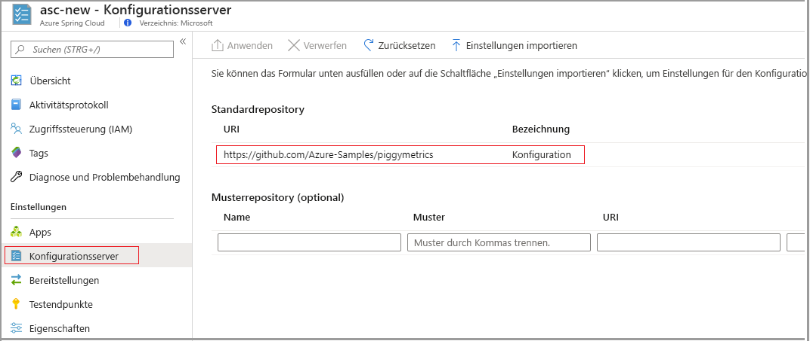

# <a name="set-up-a-spring-cloud-config-server-instance-for-your-service"></a>Einrichten einer Spring Cloud-Konfigurationsserverinstanz für Ihren Dienst

In diesem Artikel wird gezeigt, wie Sie eine Spring Cloud-Konfigurationsserverinstanz mit Ihrem Azure Spring Cloud-Dienst verbinden.

Die Spring Cloud-Konfiguration bietet server- und clientseitige Unterstützung für eine externalisierte Konfiguration in einem verteilten System. Die Konfigurationsserverinstanz bietet Ihnen einen zentralen Ort zum Verwalten externer Eigenschaften für Anwendungen in allen Umgebungen. Weitere Informationen finden Sie in der [Referenz für Spring Cloud-Konfigurationsserver](https://spring.io/projects/spring-cloud-config).

## <a name="prerequisites"></a>Voraussetzungen
* Ein Azure-Abonnement. Wenn Sie kein Azure-Abonnement besitzen, können Sie ein [kostenloses Konto](https://azure.microsoft.com/free/?WT.mc_id=A261C142F) erstellen, bevor Sie beginnen. 
* Einen bereits bereitgestellten und ausgeführten Azure Spring Cloud-Dienst. Informationen zum Einrichten und Starten eines Azure Spring Cloud-Diensts finden Sie unter [Schnellstart: Starten einer Java Spring-Anwendung mit der Azure-Befehlszeilenschnittstelle](spring-cloud-quickstart-launch-app-cli.md).

## <a name="restriction"></a>Einschränkung

Bei der Verwendung eines Konfigurationsservers mit einem Git-Back-End gelten einige Einschränkungen. Einige Eigenschaften werden für den Zugriff auf den Konfigurationsserver und die Dienstermittlung automatisch in Ihre Anwendungsumgebung eingefügt. Wenn Sie diese Eigenschaften auch in den Dateien Ihres Konfigurationsservers konfigurieren, treten unter Umständen Konflikte oder unerwartetes Verhalten auf. Zu den Eigenschaften zählen folgende: 

```yaml
eureka.client.service-url.defaultZone
eureka.client.tls.keystore
server.port
spring.cloud.config.tls.keystore
spring.application.name
spring.jmx.enabled
```

> [!CAUTION]
> Es wird dringend empfohlen, die oben genannten Eigenschaften _nicht_ in die Anwendungsdateien des Konfigurationsservers einzufügen.

## <a name="create-your-config-server-files"></a>Erstellen der Konfigurationsserverdateien

Azure Spring Cloud unterstützt Azure DevOps, GitHub, GitLab und Bitbucket zum Speichern Ihrer Konfigurationsserverdateien. Wenn Sie Ihr Repository vorbereitet haben, erstellen Sie die Konfigurationsdateien anhand der folgenden Anweisungen, und speichern Sie sie dort.

Darüber hinaus sind einige der konfigurierbaren Eigenschaften nur für bestimmte Typen verfügbar. In den folgenden Unterabschnitten sind die Eigenschaften für die einzelnen Repositorytypen aufgeführt.

### <a name="public-repository"></a>Öffentliches Repository

Bei der Verwendung eines öffentlichen Repositorys sind die konfigurierbaren Eigenschaften stärker eingeschränkt.

Alle konfigurierbaren Eigenschaften, die zum Einrichten des öffentlichen Git-Repositorys verwendet werden, sind in der folgenden Tabelle aufgeführt:

> [!NOTE]
> Das Verwenden eines Bindestrichs (-) zum Trennen von Wörtern ist die einzige Namenskonvention, die derzeit unterstützt wird. Beispielsweise können Sie *standard-bezeichnung* verwenden, jedoch nicht *StandardBezeichnung*.

| Eigenschaft        | Erforderlich | Funktion                                                      |
| :-------------- | -------- | ------------------------------------------------------------ |
| `uri`           | Ja    | Der URI des Git-Repositorys, das als Back-End des Konfigurationsservers verwendet wird, beginnt mit *http://* , *https://* , *git@* oder *ssh://* . |
| `default-label` | Nein     | Die Standardbezeichnung für das Git-Repository sollte der *Branchname*, der *Tagname* oder die *Commit-ID* des Repositorys sein. |
| `search-paths`  | Nein     | Ein Array von Zeichenfolgen, die zum Durchsuchen von Unterverzeichnissen des Git-Repositorys verwendet werden |

------

### <a name="private-repository-with-ssh-authentication"></a>Privates Repository mit SSH-Authentifizierung

Alle konfigurierbaren Eigenschaften, die zum Einrichten des privaten Git-Repositorys mit SSH verwendet werden, sind in der folgenden Tabelle aufgeführt:

> [!NOTE]
> Das Verwenden eines Bindestrichs (-) zum Trennen von Wörtern ist die einzige Namenskonvention, die derzeit unterstützt wird. Beispielsweise können Sie *standard-bezeichnung* verwenden, jedoch nicht *StandardBezeichnung*.

| Eigenschaft                   | Erforderlich | Funktion                                                      |
| :------------------------- | -------- | ------------------------------------------------------------ |
| `uri`                      | Ja    | Der URI des Git-Repositorys, das als Konfigurationsserver-Back-End verwendet wird, muss mit *http://* , *https://* , *git@* oder *ssh://* beginnen. |
| `default-label`            | Nein     | Die Standardbezeichnung für das Git-Repository sollte der *Branchname*, der *Tagname* oder die *Commit-ID* des Repositorys sein. |
| `search-paths`             | Nein     | Ein Array von Zeichenfolgen, die zum Durchsuchen von Unterverzeichnissen des Git-Repositorys verwendet werden |
| `private-key`              | Nein     | Der private SSH-Schlüssel für den Zugriff auf das Git-Repository, _erforderlich_, wenn der URI mit *git@* oder *ssh://* beginnt. |
| `host-key`                 | Nein     | Der Hostschlüssel des Git-Repositoryservers. Er darf nicht das Algorithmuspräfix (abgedeckt durch `host-key-algorithm`) enthalten. |
| `host-key-algorithm`       | Nein     | Der Algorithmus für den Hostschlüssel, sollte *ssh-dss*, *ssh-rsa*, *ecdsa-sha2-nistp256*, *ecdsa-sha2-nistp384* oder *ecdsa-sha2-nistp521* sein. Nur *erforderlich*, wenn `host-key` vorhanden ist. |
| `strict-host-key-checking` | Nein     | Gibt an, ob die Konfigurationsserverinstanz nicht gestartet werden kann, wenn das private `host-key`-Element genutzt wird. Muss *true* (Standardwert) oder *false* sein. |

-----

### <a name="private-repository-with-basic-authentication"></a>Privates Repository mit Standardauthentifizierung

Alle konfigurierbaren Eigenschaften, die zum Einrichten des privaten Git-Repositorys mit Standardauthentifizierung verwendet werden, sind unten aufgeführt.

> [!NOTE]
> Das Verwenden eines Bindestrichs (-) zum Trennen von Wörtern ist die einzige Namenskonvention, die derzeit unterstützt wird. Verwenden können Sie beispielsweise *standard-bezeichnung*, aber nicht *StandardBezeichnung*.

| Eigenschaft        | Erforderlich | Funktion                                                      |
| :-------------- | -------- | ------------------------------------------------------------ |
| `uri`           | Ja    | Der URI des Git-Repositorys, das als Konfigurationsserver-Back-End verwendet wird, muss mit *http://* , *https://* , *git@* oder *ssh://* beginnen. |
| `default-label` | Nein     | Die Standardbezeichnung für das Git-Repository sollte der *Branchname*, der *Tagname* oder die *Commit-ID* des Repositorys sein. |
| `search-paths`  | Nein     | Ein Array von Zeichenfolgen, die zum Durchsuchen von Unterverzeichnissen des Git-Repositorys verwendet werden |
| `username`      | Nein     | Der Benutzername, der für den Zugriff auf den Git-Repositoryserver verwendet wird, _erforderlich_, wenn der Git-Repositoryserver `Http Basic Authentication` unterstützt |
| `password`      | Nein     | Das Kennwort, das für den Zugriff auf den Git-Repositoryserver verwendet wird, _erforderlich_, wenn der Git-Repositoryserver `Http Basic Authentication` unterstützt |

> [!NOTE]
> Für viele `Git`-Repositoryserver wird die Verwendung von Token anstelle von Kennwörtern für die HTTP-Standardauthentifizierung unterstützt. In einigen Repositorys, z. B. GitHub, können Token unendlich lange aufbewahrt werden. Für bestimmte Git-Repositoryserver, z. B. Azure DevOps, wird aber erzwungen, dass Token innerhalb einiger Stunden ablaufen. Für Repositorys mit erzwungenem Ablauf von Token sollte nicht die tokenbasierte Authentifizierung mit Azure Spring Cloud genutzt werden.

### <a name="git-repositories-with-pattern"></a>Git-Repositorys mit Muster

Alle konfigurierbaren Eigenschaften, die zum Einrichten von Repositorys mit Muster verwendet werden, sind unten aufgeführt.

> [!NOTE]
> Das Verwenden eines Bindestrichs (-) zum Trennen von Wörtern ist die einzige Namenskonvention, die derzeit unterstützt wird. Verwenden können Sie beispielsweise *standard-bezeichnung*, aber nicht *StandardBezeichnung*.

| Eigenschaft                           | Erforderlich         | Funktion                                                      |
| :--------------------------------- | ---------------- | ------------------------------------------------------------ |
| `repos`                            | Nein             | Eine Zuordnung aus den Einstellungen für ein Git-Repository mit einem angegebenen Namen. |
| `repos."uri"`                      | Ja bei `repos` | Der URI des Git-Repositorys, das als Konfigurationsserver-Back-End verwendet wird, muss mit *http://* , *https://* , *git@* oder *ssh://* beginnen. |
| `repos."name"`                     | Ja bei `repos` | Ein Name zum Identifizieren eines Git-Repositorys, nur _erforderlich_, wenn `repos` vorhanden ist. Beispiel: *team-A*, *team-B*. |
| `repos."pattern"`                  | Nein             | Ein Array von Zeichenfolgen zum Abgleichen eines Anwendungsnamens. Verwenden Sie für jedes Muster das Format `{application}/{profile}` mit Platzhaltern. |
| `repos."default-label"`            | Nein             | Die Standardbezeichnung für das Git-Repository sollte der *Branchname*, der *Tagname* oder die *Commit-ID* des Repositorys sein. |
| `repos."search-paths`"             | Nein             | Ein Array von Zeichenfolgen, die zum Durchsuchen von Unterverzeichnissen des Git-Repositorys verwendet werden |
| `repos."username"`                 | Nein             | Der Benutzername, der für den Zugriff auf den Git-Repositoryserver verwendet wird, _erforderlich_, wenn der Git-Repositoryserver `Http Basic Authentication` unterstützt |
| `repos."password"`                 | Nein             | Das Kennwort, das für den Zugriff auf den Git-Repositoryserver verwendet wird, _erforderlich_, wenn der Git-Repositoryserver `Http Basic Authentication` unterstützt |
| `repos."private-key"`              | Nein             | Der private SSH-Schlüssel für den Zugriff auf das Git-Repository, _erforderlich_, wenn der URI mit *git@* oder *ssh://* beginnt. |
| `repos."host-key"`                 | Nein             | Der Hostschlüssel des Git-Repositoryservers. Er darf nicht das Algorithmuspräfix (abgedeckt durch `host-key-algorithm`) enthalten. |
| `repos."host-key-algorithm"`       | Nein             | Der Algorithmus für den Hostschlüssel, sollte *ssh-dss*, *ssh-rsa*, *ecdsa-sha2-nistp256*, *ecdsa-sha2-nistp384* oder *ecdsa-sha2-nistp521* sein. Nur *erforderlich*, wenn `host-key` vorhanden ist. |
| `repos."strict-host-key-checking"` | Nein             | Gibt an, ob die Konfigurationsserverinstanz nicht gestartet werden kann, wenn das private `host-key`-Element genutzt wird. Muss *true* (Standardwert) oder *false* sein. |

## <a name="attach-your-config-server-repository-to-azure-spring-cloud"></a>Anfügen des Konfigurationsserverrepositorys an Azure Spring Cloud

Nachdem Sie Ihre Konfigurationsdateien in einem Repository gespeichert haben, müssen Sie dieses nun mit Azure Spring Cloud verbinden.

1. Melden Sie sich beim [Azure-Portal](https://portal.azure.com) an.

1. Navigieren Sie zur Seite **Übersicht** von Azure Spring Cloud.

1. Wählen Sie den zu konfigurierenden Dienst aus.

1. Wählen Sie im linken Bereich der Dienstseite unter **Einstellungen** die Registerkarte **Konfigurationsserver** aus.



### <a name="enter-repository-information-directly-to-the-azure-portal"></a>Direkte Eingabe von Repositoryinformationen im Azure-Portal

#### <a name="default-repository"></a>Standardrepository

* **Öffentliches Repository:** Fügen Sie im Abschnitt **Standardrepository** im Feld **URI** den Repository-URI ein.  Legen Sie die **Bezeichnung** auf **config** fest. Stellen Sie sicher, dass die Einstellung **Authentifizierung** den Wert **Public** aufweist, und wählen Sie dann **Anwenden** aus, um den Vorgang abzuschließen. 

* **Privates Repository:** Azure Spring Cloud unterstützt die grundlegende Authentifizierung per Kennwort/Token und SSH.

    * **Standardauthentifizierung:** Fügen Sie im Abschnitt **Standardrepository** im Feld **URI** den Repository-URI ein, und wählen Sie dann die Schaltfläche **Authentifizierung** (Stiftsymbol) aus. Wählen Sie im Bereich **Authentifizierung bearbeiten** in der Dropdownliste **Authentifizierungstyp** die Option **HTTP Basic** aus, und geben Sie dann Ihren Benutzernamen mit dem Kennwort/Token für den Zugriff auf Azure Spring Cloud ein. Wählen Sie **OK** und dann **Anwenden** aus, um die Einrichtung Ihrer Konfigurationsserverinstanz abzuschließen.

    
    
    > [!CAUTION]
    > Einige Git-Repositoryserver, wie z. B. GitHub, verwenden ein *persönliches Token* oder ein *Zugriffstoken* (z. B. ein Kennwort) für die **Standardauthentifizierung**. Dieser Typ von Token kann als Kennwort in Azure Spring Cloud verwendet werden, da es nie abläuft. Für andere Git-Repositoryserver wie Bitbucket und Azure DevOps läuft das *Zugriffstoken* nach einer oder zwei Stunden ab. Dies bedeutet, dass sich diese Option nicht für die Verwendung dieser Repositoryserver mit Azure Spring Cloud eignet.

    * **SSH**: Fügen Sie im Abschnitt **Standardrepository** im Feld **URI** den Repository-URI ein, und wählen Sie dann die Schaltfläche **Authentifizierung** (Stiftsymbol) aus. Wählen Sie im Bereich **Authentifizierung bearbeiten** in der Dropdownliste **Authentifizierungstyp** die Option **SSH** aus, und geben Sie dann Ihren **privaten Schlüssel** ein. Optional können Sie den **Hostschlüssel** und den **Hostschlüsselalgorithmus** angeben. Stellen Sie sicher, dass Sie Ihren öffentlichen Schlüssel in das Repository Ihres Konfigurationsservers einfügen. Wählen Sie **OK** und dann **Anwenden** aus, um die Einrichtung Ihrer Konfigurationsserverinstanz abzuschließen.

    

#### <a name="pattern-repository"></a>Musterrepository

Wenn Sie ein optionales **Musterrepository** verwenden möchten, um den Dienst zu konfigurieren, geben Sie den **URI** und die **Authentifizierung** auf die gleiche Weise an wie beim **Standardrepository**. Geben Sie einen **Namen** für das Muster an, und wählen Sie dann **Anwenden** aus, um es an Ihre Instanz anzufügen. 

### <a name="enter-repository-information-into-a-yaml-file"></a>Eingeben der Repositoryinformationen in eine YAML-Datei

Wenn Sie eine YAML-Datei mit Ihren Repositoryeinstellungen erstellt haben, können Sie die Datei direkt von Ihrem lokalen Computer in Azure Spring Cloud importieren. Eine einfache YAML-Datei für ein privates Repository mit Standardauthentifizierung würde wie folgt aussehen:

```yml
spring:
    cloud:
        config:
            server:
                git:
                    uri: https://github.com/azure-spring-cloud-samples/config-server-repository.git
                    username: <username>
                    password: <password/token>

```

Wählen Sie die Schaltfläche **Einstellungen importieren** und dann die YAML-Datei in Ihrem Projektverzeichnis aus. Wählen Sie **Importieren** aus. Es wird ein `async`-Vorgang von Ihren **Benachrichtigungen** angezeigt. Nach 1 bis 2 Minuten sollte der erfolgreiche Abschluss gemeldet werden.


Die Informationen aus der YAML-Datei sollten im Azure-Portal angezeigt werden. Wählen Sie **Anwenden** aus, um den Vorgang abzuschließen. 


## <a name="delete-your-app-configuration"></a>Löschen Ihrer App-Konfiguration

Nachdem Sie Ihre Konfigurationsdatei gespeichert haben, wird auf der Registerkarte **Konfiguration** die Schaltfläche **Delete app configuration** (App-Konfiguration löschen) angezeigt. Durch Auswählen dieser Schaltfläche werden die vorhandenen Einstellungen vollständig gelöscht. Wählen Sie diese Schaltfläche aus, wenn Sie Ihre Konfigurationsserverinstanz mit einer anderen Quelle verbinden möchten, beispielsweise bei der Migration von GitHub zu Azure DevOps.


## <a name="next-steps"></a>Nächste Schritte

In diesem Artikel haben Sie erfahren, wie Sie Ihre Spring Cloud-Konfigurationsserverinstanz aktivieren und konfigurieren. Weitere Informationen zum Verwalten Ihrer Anwendung finden Sie unter [Skalieren einer Anwendung in Azure Spring Cloud](spring-cloud-tutorial-scale-manual.md).
