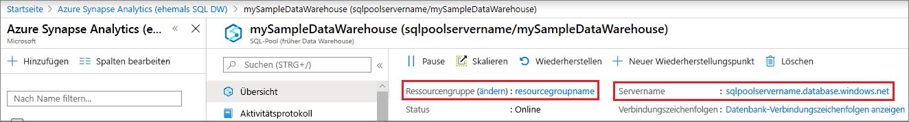
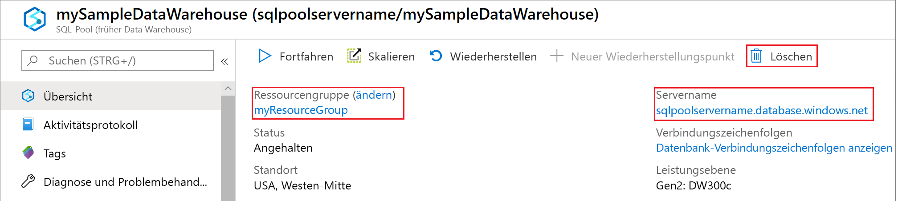

# <a name="quickstart-pause-and-resume-compute-in-azure-synapse-analytics-sql-pool-with-azure-powershell"></a>Schnellstart: Anhalten und Fortsetzen von Computeressourcen im SQL-Pool von Azure Synapse Analytics mit Azure PowerShell

Verwenden Sie Azure PowerShell, um Computeressourcen für den SQL-Pool anzuhalten und Kosten zu sparen. [Setzen Sie die Computeressourcen fort](sql-data-warehouse-manage-compute-overview.md), wenn Sie das Data Warehouse verwenden möchten.

Wenn Sie kein Azure-Abonnement besitzen, können Sie ein [kostenloses Konto](https://azure.microsoft.com/free/) erstellen, bevor Sie beginnen.

## <a name="before-you-begin"></a>Voraussetzungen

[!INCLUDE [updated-for-az](../../includes/updated-for-az.md)]

In dieser Schnellstartanleitung wird vorausgesetzt, dass Sie bereits über einen SQL-Pool verfügen, den Sie anhalten und fortsetzen können. Falls nicht, können Sie mithilfe der Anleitung unter [Erstellen und Verbinden – Portal](create-data-warehouse-portal.md) einen SQL-Pool namens **mySampleDataWarehouse** erstellen.

## <a name="log-in-to-azure"></a>Anmelden an Azure

Melden Sie sich mit dem Befehl [Connect-AzAccount](/powershell/module/az.accounts/connect-azaccount) bei Ihrem Azure-Abonnement an, und befolgen Sie die Anweisungen auf dem Bildschirm.

```powershell
Connect-AzAccount
```

Verwenden Sie [Get-AzSubscription](/powershell/module/az.accounts/get-azsubscription), um zu ermitteln, welches Abonnement Sie verwenden.

```powershell
Get-AzSubscription
```

Falls Sie ein anderes Abonnement als das Standardabonnement verwenden müssen, führen Sie [Set-AzContext](/powershell/module/az.accounts/set-azcontext) aus.

```powershell
Set-AzContext -SubscriptionName "MySubscription"
```

## <a name="look-up-data-warehouse-information"></a>Suche nach Informationen zum Data Warehouse

Suchen Sie nach dem Datenbanknamen, dem Servernamen und der Ressourcengruppe für den SQL-Pool, den Sie anhalten und fortsetzen möchten.

Führen Sie die folgenden Schritte aus, um nach Standortinformationen für Ihren SQL-Pool zu suchen:

1. Melden Sie sich beim [Azure-Portal](https://portal.azure.com/) an.
1. Klicken Sie auf der linken Seite des Azure-Portals auf **Azure Synapse Analytics (vormals SQL DW)** .
1. Wählen Sie auf der Seite **Azure Synapse Analytics (vormals SQL DW)** die Option **mySampleDataWarehouse** aus. Das Data Warehouse wird geöffnet.

    

1. Notieren Sie den Namen des Data Warehouse, das als Datenbankname verwendet wird. Notieren Sie außerdem den Servernamen und die Ressourcengruppe.
1. Verwenden Sie in den PowerShell-Cmdlets nur den ersten Teil des Servernamens. In der obigen Abbildung lautet der vollständige Servername „sqlpoolservername.database.windows.net“. Im PowerShell-Cmdlet wird **sqlpoolservername** als Servername verwendet.

## <a name="pause-compute"></a>Anhalten von Computeressourcen

Um Kosten zu sparen, können Sie Computeressourcen bei Bedarf anhalten und fortsetzen. Wenn Sie die Datenbank z.B. nachts oder am Wochenende nicht verwenden, können Sie sie während dieser Zeiträume anhalten und während des Tages wieder fortsetzen. Für Computeressourcen fallen keine Gebühren an, während die Datenbank angehalten ist. Allerdings wird Ihnen der Speicher weiterhin in Rechnung gestellt.

Wenn Sie eine Datenbank anhalten möchten, verwenden Sie das Cmdlet [Suspend-AzSqlDatabase](/powershell/module/az.sql/suspend-azsqldatabase). Im folgenden Beispiel wird ein Data Warehouse namens **mySampleDataWarehouse** angehalten, das auf einem Server mit dem Namen **sqlpoolservername** gehostet wird. Der Server befindet sich in einer Azure-Ressourcengruppe namens **myResourceGroup**.


```Powershell
Suspend-AzSqlDatabase –ResourceGroupName "myResourceGroup" `
–ServerName "nsqlpoolservername" –DatabaseName "mySampleDataWarehouse"
```

In einer Variation ruft das nächste Beispiel die Datenbank in das $database-Objekt ab. Das Objekt wird dann an [Suspend-AzSqlDatabase](/powershell/module/az.sql/suspend-azsqldatabase) weitergereicht. Die Ergebnisse werden in dem Objekt „resultDatabase“ gespeichert. Der letzte Befehl zeigt die Ergebnisse an.

```Powershell
$database = Get-AzSqlDatabase –ResourceGroupName "myResourceGroup" `
–ServerName "sqlpoolservername" –DatabaseName "mySampleDataWarehouse"
$resultDatabase = $database | Suspend-AzSqlDatabase
$resultDatabase
```

## <a name="resume-compute"></a>Fortsetzen von Computeressourcen

Verwenden Sie das Cmdlet [Resume-AzSqlDatabase](/powershell/module/az.sql/resume-azsqldatabase), um eine Datenbank zu starten. Im folgenden Beispiel wird eine Datenbank namens **mySampleDataWarehouse** gestartet, das auf einem Server mit dem Namen **sqlpoolservername** gehostet wird. Der Server befindet sich in einer Azure-Ressourcengruppe namens **myResourceGroup**.

```Powershell
Resume-AzSqlDatabase –ResourceGroupName "myResourceGroup" `
–ServerName "sqlpoolservername" -DatabaseName "mySampleDataWarehouse"
```

In einer Variation ruft das nächste Beispiel die Datenbank in das $database-Objekt ab. Anschließend wird das Objekt an [Resume-AzSqlDatabase](/powershell/module/az.sql/resume-azsqldatabase) weitergereicht, und die Ergebnisse werden in „$resultDatabase“ gespeichert. Der letzte Befehl zeigt die Ergebnisse an.

```Powershell
$database = Get-AzSqlDatabase –ResourceGroupName "myResourceGroup" `
–ServerName "sqlpoolservername" –DatabaseName "mySampleDataWarehouse"
$resultDatabase = $database | Resume-AzSqlDatabase
$resultDatabase
```

## <a name="check-status-of-your-data-warehouse-operation"></a>Überprüfen des Status Ihres Data Warehouse-Vorgangs

Verwenden Sie zum Überprüfen des Data Warehouse-Status das Cmdlet [Get-AzSqlDatabaseActivity](https://docs.microsoft.com/powershell/module/az.sql/Get-AzSqlDatabaseActivity#description).

```Powershell
Get-AzSqlDatabaseActivity -ResourceGroupName "myResourceGroup" -ServerName "sqlpoolservername" -DatabaseName "mySampleDataWarehouse"
```

## <a name="clean-up-resources"></a>Bereinigen von Ressourcen

Ihnen werden Gebühren für Ihre Data Warehouse-Einheiten und in Ihrem Data Warehouse gespeicherte Daten in Rechnung gestellt. Diese Compute- und Speicherressourcen werden separat in Rechnung gestellt.

- Wenn Sie die Daten im Speicher beibehalten möchten, halten Sie die Computeressourcen an.
- Wenn künftig keine Gebühren mehr anfallen sollen, können Sie den SQL-Pool löschen.

Führen Sie die folgenden Schritte aus, um Ressourcen nach Wunsch zu bereinigen.

1. Melden Sie sich beim [Azure-Portal](https://portal.azure.com) an, und klicken Sie auf Ihren SQL-Pool.

    

2. Zum Anhalten von Computeressourcen klicken Sie auf die Schaltfläche **Anhalten**. Wenn der SQL-Pool angehalten ist, wird die Schaltfläche **Starten** angezeigt.  Klicken Sie zum Fortsetzen der Computeressourcen auf **Starten**.

3. Wenn Sie den SQL-Pool entfernen möchten, damit keine Gebühren für Compute- oder Speicherressourcen anfallen, klicken Sie auf **Löschen**.

4. Wenn Sie die von Ihnen erstellte SQL Server-Instanz entfernen möchten, klicken Sie auf **sqlpoolservername.database.windows.net** und anschließend auf **Löschen**.  Seien Sie bei diesem Löschvorgang vorsichtig, da beim Löschen des Servers auch alle Datenbanken gelöscht werden, die dem Server zugewiesen sind.

5. Zum Entfernen der Ressourcengruppe klicken Sie auf **myResourceGroup**, und klicken Sie dann auf **Ressourcengruppe löschen**.


## <a name="next-steps"></a>Nächste Schritte

Sie haben die Computeressourcen für Ihren SQL-Pool angehalten und fortgesetzt. Weitere Informationen zum SQL-Pool finden Sie im Tutorial zum Laden von Daten.

> [!div class="nextstepaction"]
> [Tutorial: Laden des Datasets „New York Taxis“](load-data-from-azure-blob-storage-using-polybase.md)
