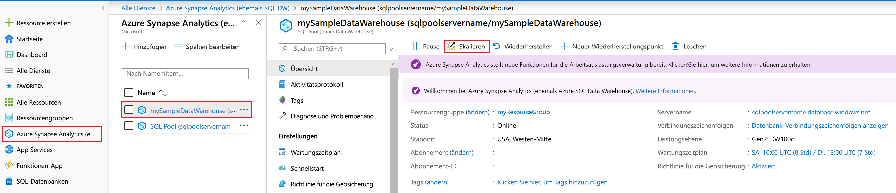
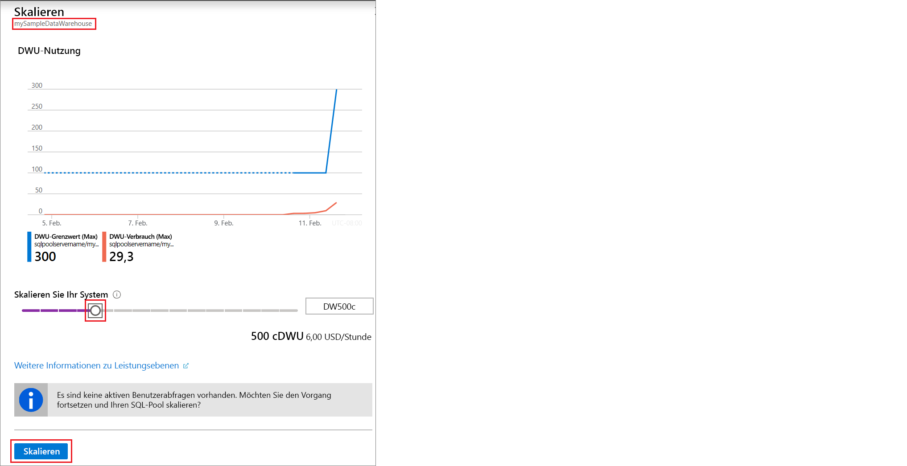

# Schnellstart: Skalieren von Computeressourcen im SQL-Pool von Azure Synapse Analytics über das Azure-Portal

Skalieren Sie Computeressourcen in einem SQL-Pool über das Azure-Portal. [Skalieren Sie Computeressourcen zentral hoch](sql-data-warehouse-manage-compute-overview.md), um eine bessere Leistung zu erzielen, oder skalieren Sie sie zentral herunter, um Kosten einzusparen. 

Wenn Sie kein Azure-Abonnement besitzen, können Sie ein [kostenloses Konto](https://azure.microsoft.com/free/) erstellen, bevor Sie beginnen.

## Melden Sie sich auf dem Azure-Portal an.

Melden Sie sich beim [Azure-Portal](https://portal.azure.com/) an.

## Voraussetzungen

Sie können einen bereits vorhandenen SQL-Pool skalieren oder anhand der Informationen unter [Schnellstart: Erstellen und Abfragen einer Azure SQL Data Warehouse-Instanz im Azure-Portal](create-data-warehouse-portal.md) einen SQL-Pool namens **mySampleDataWarehouse** erstellen.  Mit diesem Schnellstart wird **mySampleDataWarehouse** skaliert.

>[!Note]
>Zum Skalieren muss Ihr SQL-Pool online sein. 

## Skalieren von Computeressourcen

SQL-Pool-Computeressourcen können durch Erhöhen bzw. Verringern von Data Warehouse-Einheiten skaliert werden. Mit dem [Schnellstart: Erstellen und Abfragen einer Azure SQL Data Warehouse-Instanz im Azure-Portal] (create-data-warehouse-portal.md) wurde **mySampleDataWarehouse** erstellt und mit 400 DWUs initialisiert. In den folgenden Schritten werden die DWUs für **mySampleDataWarehouse** angepasst.

So ändern Sie Data Warehouse-Einheiten

1. Klicken Sie auf der linken Seite des Azure-Portals auf **Azure Synapse Analytics (vormals SQL DW)** .
2. Wählen Sie auf der Seite **Azure Synapse Analytics (vormals SQL DW)** die Option **mySampleDataWarehouse** aus. Der SQL-Pool wird geöffnet.
3. Klicken Sie auf **Skalieren**.

    

2. Verschieben Sie im Bereich „Skalieren“ den Schieberegler nach links oder rechts, um die DWU-Einstellung zu ändern. Wählen Sie anschließend „Skalieren“ aus.

    

## Nächste Schritte
In diesem Artikel haben Sie gelernt, wie Sie Computeressourcen für Ihren SQL-Pool skalieren. Weitere Informationen zum SQL-Pool finden Sie im Tutorial zum Laden von Daten.

> [!div class="nextstepaction"]
>[Tutorial: Laden des Datasets „New York Taxis“](load-data-from-azure-blob-storage-using-polybase.md)
