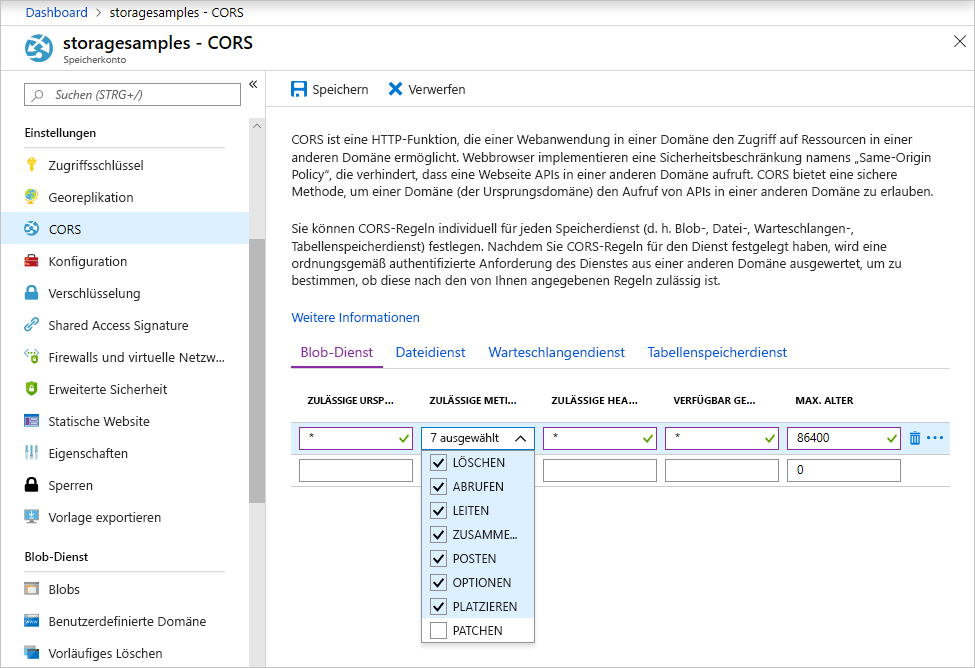

<!-- Customer intent: As a web application developer I want to interface with Azure Blob storage entirely on the client so that I can build a SPA application that is able to upload and delete files on blob storage. -->

# <a name="quickstart-manage-blobs-with-javascript-v12-sdk-in-a-browser"></a>Schnellstart: Verwalten von Blobs mit dem JavaScript v12 SDK in einem Browser

Azure Blob Storage ist für die Speicherung großer Mengen unstrukturierter Daten optimiert. Blobs sind Objekte, die Text oder Binärdaten enthalten können, z. B. Bilder, Dokumente, Streamingmedien und Archivdaten. In diesem Schnellstart erfahren Sie, wie Sie Blobs mithilfe von JavaScript in einem Browser verwalten. Sie werden Blobs hochladen und auflisten sowie Container erstellen und löschen.

Zusätzliche Ressourcen:

* [API-Referenzdokumentation](/javascript/api/@azure/storage-blob)
* [Quellcode der Bibliothek](https://github.com/Azure/azure-sdk-for-js/tree/master/sdk/storage/storage-blob)
* [Paket (npm)](https://www.npmjs.com/package/@azure/storage-blob)
* [Beispiele](https://docs.microsoft.com/azure/storage/common/storage-samples-javascript?toc=%2fazure%2fstorage%2fblobs%2ftoc.json#blob-samples)

## <a name="prerequisites"></a>Voraussetzungen

* [Ein Azure-Konto mit einem aktiven Abonnement](https://azure.microsoft.com/free/?ref=microsoft.com&utm_source=microsoft.com&utm_medium=docs&utm_campaign=visualstudio)
* [Ein Azure-Speicherkonto](../common/storage-account-create.md)
* [Node.js](https://nodejs.org)
* [Microsoft Visual Studio Code](https://code.visualstudio.com)
* Eine Visual Studio Code-Erweiterung für das Debuggen im Browser, z. B.:
    * [Debugger für Microsoft Edge](https://marketplace.visualstudio.com/items?itemName=msjsdiag.debugger-for-edge)
    * [Debugger für Chrome](https://marketplace.visualstudio.com/items?itemName=msjsdiag.debugger-for-chrome)
    * [Debugger für Firefox](https://marketplace.visualstudio.com/items?itemName=firefox-devtools.vscode-firefox-debug)


[!INCLUDE [storage-multi-protocol-access-preview](../../../includes/storage-multi-protocol-access-preview.md)]

## <a name="object-model"></a>Objektmodell

Blob Storage bietet drei Typen von Ressourcen:

* Das Speicherkonto
* Einen Container im Speicherkonto
* Ein Blob im Container

Im folgenden Diagramm ist die Beziehung zwischen diesen Ressourcen dargestellt.


In diesem Schnellstart verwenden Sie die folgenden JavaScript-Klassen, um mit diesen Ressourcen zu interagieren:

* [BlobServiceClient:](/javascript/api/@azure/storage-blob/blobserviceclient) Die `BlobServiceClient`-Klasse ermöglicht Ihnen, Azure Storage-Ressourcen und Blobcontainer zu bearbeiten.
* [ContainerClient:](/javascript/api/@azure/storage-blob/containerclient) Die `ContainerClient`-Klasse ermöglicht Ihnen, Azure Storage-Container und deren Blobs zu bearbeiten.
* [BlockBlobClient](/javascript/api/@azure/storage-blob/blockblobclient): Die `BlockBlobClient`-Klasse ermöglicht Ihnen, Azure Storage-Blobs zu bearbeiten.

## <a name="setting-up"></a>Einrichten

In diesem Abschnitt wird beschrieben, wie ein Projekt zur Verwendung mit der Azure Blob Storage-Clientbibliothek v12 für JavaScript vorbereitet wird.

### <a name="create-a-cors-rule"></a>Erstellen einer CORS-Regel

Damit Ihre Webanwendung vom Client aus auf Blobspeicher zugreifen kann, müssen Sie Ihr Konto so konfigurieren, dass [Cross-Origin Resource Sharing (CORS)](https://docs.microsoft.com/rest/api/storageservices/cross-origin-resource-sharing--cors--support-for-the-azure-storage-services) aktiviert ist.

Wählen Sie im Azure-Portal Ihr Speicherkonto aus. Navigieren Sie zum Definieren einer neuen CORS-Regel zum Abschnitt **Einstellungen** , und wählen Sie **CORS** aus. Im Rahmen dieser Schnellstartanleitung erstellen Sie eine offene CORS-Regel:



In der folgenden Tabelle werden die einzelnen CORS-Einstellungen beschrieben und die Definitionswerte der Regel erläutert:

|Einstellung  |Wert  | BESCHREIBUNG |
|---------|---------|---------|
| **ZULÄSSIGE URSPRÜNGE** | **\*** | Akzeptiert eine kommagetrennte Liste mit Domänen, die als zulässige Ursprünge festgelegt werden. Wenn Sie den Wert auf `*` festlegen, wird allen Domänen Zugriff auf das Speicherkonto gewährt. |
| **ZULÄSSIGE METHODEN** | **DELETE** , **GET** , **HEAD** , **MERGE** , **POST** , **OPTIONS** und **PUT** | Listet die zulässigen HTTP-Verben für das Speicherkonto auf. Wählen Sie für diese Schnellstartanleitung alle verfügbaren Optionen aus. |
| **ZULÄSSIGE HEADER** | **\*** | Definiert eine Liste mit Anforderungsheadern (einschließlich Header mit Präfix), die vom Speicherkonto zugelassen werden. Wenn Sie den Wert auf `*` festlegen, wird allen Headern Zugriff gewährt. |
| **VERFÜGBAR GEMACHTE HEADER** | **\*** | Listet die zulässigen Antwortheader für das Konto auf. Wenn Sie den Wert auf `*` festlegen, kann das Konto einen beliebigen Header senden. |
| **MAX. ALTER** | **86400** | Die maximale Zeit (in Sekunden), für die der Browser die Preflight-OPTIONS-Anforderung zwischenspeichert. Bei Verwendung des Werts *86.400* bleibt der Cache einen ganzen Tag erhalten. |

Nachdem Sie die Felder mit den Werten in dieser Tabelle ausgefüllt haben, klicken Sie auf die Schaltfläche **Speichern** .

> [!IMPORTANT]
> Achten Sie in einer Produktionsumgebung darauf, dass alle verwendeten Einstellungen jeweils nur ein Mindestmaß an Zugriff auf Ihr Speicherkonto gewähren, um einen sicheren Zugriff zu gewährleisten. Die hier beschriebenen CORS-Einstellungen definieren eine gemäßigte Sicherheitsrichtlinie und sind für eine Schnellstartanleitung angemessen. Sie sollten allerdings nicht in der Praxis verwendet werden.

### <a name="create-a-shared-access-signature"></a>Erstellen einer SAS (Shared Access Signature)

Die SAS (Shared Access Signature) wird von dem im Browser ausgeführten Code verwendet, um Azure Blob Storage-Anforderungen zu autorisieren. Mithilfe der SAS kann der Client den Zugriff auf Speicherressourcen ohne Kontozugriffsschlüssel oder Verbindungszeichenfolge autorisieren. Weitere Informationen zur SAS finden Sie unter [Verwenden von Shared Access Signatures (SAS)](../common/storage-sas-overview.md).

Führen Sie die folgenden Schritte aus, um die SAS-URL für den Blob-Dienst abzurufen:

1. Wählen Sie im Azure-Portal Ihr Speicherkonto aus.
2. Navigieren Sie zum Abschnitt **Einstellungen** , und wählen Sie **Shared Access Signature (SAS)** aus.
3. Scrollen Sie nach unten, und klicken Sie auf die Schaltfläche **SAS und Verbindungszeichenfolge generieren** .
4. Scrollen Sie weiter nach unten, und suchen Sie nach dem Feld **SAS-URL für Blob-Dienst** .
5. Klicken Sie ganz rechts neben dem Feld **SAS-URL für Blob-Dienst** auf die Schaltfläche **In Zwischenablage kopieren** .
6. Speichern Sie die kopierte URL zur Verwendung in einem späteren Schritt.

### <a name="add-the-azure-blob-storage-client-library"></a>Hinzufügen der Azure Blob Storage-Clientbibliothek

Erstellen Sie auf Ihrem lokalen Computer einen neuen Ordner mit dem Namen *azure-blobs-js-browser* , und öffnen Sie ihn in Visual Studio Code.

Wählen Sie **Ansicht > Terminal** aus, um ein Konsolenfenster in Visual Studio Code zu öffnen. Führen Sie den folgenden npm-Befehl (Node.js-Paket-Manager) im Terminalfenster aus, um eine Datei [package.json](https://docs.npmjs.com/files/package.json) zu erstellen.

```console
npm init -y
```

Das Azure SDK besteht aus vielen separaten Paketen. Basierend auf den Diensten, die Sie verwenden möchten, können Sie die erforderlichen Pakete auswählen. Führen Sie den folgenden `npm`-Befehl im Terminalfenster aus, um das Paket `@azure/storage-blob` zu installieren.

```console
npm install --save @azure/storage-blob
```

#### <a name="bundle-the-azure-blob-storage-client-library"></a>Bündeln der Azure Blob Storage-Clientbibliothek

Um Azure SDK-Bibliotheken auf einer Website nutzen zu können, konvertieren Sie Ihren Code zur Verwendung im Browser. Hierzu verwenden Sie ein als Bundler bezeichnetes Tool. Durch die Bündelung wird mit [Node.js](https://nodejs.org)-Konventionen geschriebener JavaScript-Code in ein von Browsern lesbares Format konvertiert. In diesem Schnellstartartikel wird der Bundler [Parcel](https://parceljs.org/) verwendet.

Installieren Sie Parcel, indem Sie im Terminalfenster den folgenden `npm`-Befehl ausführen:

```console
npm install -g parcel-bundler
```

Öffnen Sie in Visual Studio Code die Datei *package.json* , und fügen Sie eine `browserlist` zwischen den Einträgen `license` und `dependencies` hinzu. Das Ziel dieser `browserlist` sind die aktuellen Versionen von drei gängigen Browsern. Die vollständige Datei *package.json* sollte jetzt wie folgt aussehen:

:::code language="json" source="~/azure-storage-snippets/blobs/quickstarts/JavaScript/V12/azure-blobs-js-browser/package.json" highlight="12-16":::

Speichern Sie die Datei *package.json* .

### <a name="import-the-azure-blob-storage-client-library"></a>Importieren der Azure Blob Storage-Clientbibliothek

Um Azure SDK-Bibliotheken in JavaScript verwenden zu können, importieren Sie das Paket `@azure/storage-blob`. Erstellen Sie in Visual Studio Code eine neue Datei, die den folgenden JavaScript-Code enthält.

:::code language="javascript" source="~/azure-storage-snippets/blobs/quickstarts/JavaScript/V12/azure-blobs-js-browser/index.js" id="snippet_ImportLibrary":::

Speichern Sie die Datei unter dem Namen *index.js* im Verzeichnis *azure-blobs-js-browser* .

### <a name="implement-the-html-page"></a>Implementieren der HTML-Seite

Erstellen Sie in Visual Studio Code eine neue Datei, und fügen Sie den folgenden HTML-Code hinzu.

:::code language="html" source="~/azure-storage-snippets/blobs/quickstarts/JavaScript/V12/azure-blobs-js-browser/index.html":::

Speichern Sie die Datei unter dem Namen *index.html* im Verzeichnis *azure-blobs-js-browser* .

## <a name="code-examples"></a>Codebeispiele

Im Beispielcode wird gezeigt, wie Sie die folgenden Aufgaben mit der Azure Blob Storage-Clientbibliothek für JavaScript durchführen:

* [Deklarieren von Feldern für Benutzeroberflächenelemente](#declare-fields-for-ui-elements)
* [Hinzufügen Ihrer Speicherkontoinformationen](#add-your-storage-account-info)
* [Erstellen von Clientobjekten](#create-client-objects)
* [Erstellen und Löschen eines Speichercontainers](#create-and-delete-a-storage-container)
* [Auflisten von Blobs](#list-blobs)
* [Hochladen von Blobs](#upload-blobs)
* [Löschen von Blobs](#delete-blobs)

Sie führen den Code aus, nachdem Sie der Datei *index.js* alle Codeausschnitte hinzugefügt haben.

### <a name="declare-fields-for-ui-elements"></a>Deklarieren von Feldern für Benutzeroberflächenelemente

Fügen Sie am Ende der Datei *index.js* den folgenden Code hinzu.

:::code language="JavaScript" source="~/azure-storage-snippets/blobs/quickstarts/JavaScript/V12/azure-blobs-js-browser/index.js" id="snippet_DeclareVariables":::

Speichern Sie die Datei *index.js* .

Dieser Code deklariert Felder für die einzelnen HTML-Elemente und implementiert eine Funktion `reportStatus` zum Anzeigen der Ausgabe.

In den folgenden Abschnitten fügen Sie jeden neuen Block mit JavaScript-Code hinter dem vorherigen Block hinzu.

### <a name="add-your-storage-account-info"></a>Hinzufügen Ihrer Speicherkontoinformationen

Fügen Sie Code für den Zugriff auf Ihr Speicherkonto hinzu. Ersetzen Sie den Platzhalter durch die SAS-URL für den Blob-Dienst, die Sie weiter oben generiert haben. Fügen Sie am Ende der Datei *index.js* den folgenden Code hinzu.

:::code language="javascript" source="~/azure-storage-snippets/blobs/quickstarts/JavaScript/V12/azure-blobs-js-browser/index.js" id="snippet_StorageAcctInfo":::

Speichern Sie die Datei *index.js* .

### <a name="create-client-objects"></a>Erstellen von Clientobjekten

Erstellen Sie für die Interaktion mit dem Azure Blob Storage-Dienst die Objekte [BlobServiceClient](/javascript/api/@azure/storage-blob/blobserviceclient) und [ContainerClient](/javascript/api/@azure/storage-blob/containerclient). Fügen Sie am Ende der Datei *index.js* den folgenden Code hinzu.

:::code language="javascript" source="~/azure-storage-snippets/blobs/quickstarts/JavaScript/V12/azure-blobs-js-browser/index.js" id="snippet_CreateClientObjects":::

Speichern Sie die Datei *index.js* .

### <a name="create-and-delete-a-storage-container"></a>Erstellen und Löschen eines Speichercontainers

Der Speichercontainer wird erstellt und gelöscht, wenn Sie auf der Webseite auf die entsprechende Schaltfläche klicken. Fügen Sie am Ende der Datei *index.js* den folgenden Code hinzu.

:::code language="javascript" source="~/azure-storage-snippets/blobs/quickstarts/JavaScript/V12/azure-blobs-js-browser/index.js" id="snippet_CreateDeleteContainer":::

Speichern Sie die Datei *index.js* .

### <a name="list-blobs"></a>Auflisten von Blobs

Der Inhalt des Speichercontainers wird aufgelistet, wenn Sie auf die Schaltfläche **List files** (Dateien auflisten) klicken. Fügen Sie am Ende der Datei *index.js* den folgenden Code hinzu.

:::code language="javascript" source="~/azure-storage-snippets/blobs/quickstarts/JavaScript/V12/azure-blobs-js-browser/index.js" id="snippet_ListBlobs":::

Speichern Sie die Datei *index.js* .

Dieser Code ruft die Funktion [ContainerClient.listBlobsFlat](/javascript/api/@azure/storage-blob/containerclient#listblobsflat-containerlistblobsoptions-) auf und ruft dann mithilfe eines Iterators den Namen jedes zurückgegebenen [BlobItem](/javascript/api/@azure/storage-blob/blobitem) ab. Für jedes `BlobItem` wird die Liste der **Dateien** mit dem Eigenschaftswert [Name](/javascript/api/@azure/storage-blob/blobitem#name) aktualisiert.

### <a name="upload-blobs"></a>Hochladen von Blobs

Dateien werden in den Speichercontainer hochgeladen, wenn Sie auf die Schaltfläche **Select and upload files** (Dateien auswählen und hochladen) klicken. Fügen Sie am Ende der Datei *index.js* den folgenden Code hinzu.

:::code language="javascript" source="~/azure-storage-snippets/blobs/quickstarts/JavaScript/V12/azure-blobs-js-browser/index.js" id="snippet_UploadBlobs":::

Speichern Sie die Datei *index.js* .

Dieser Code verbindet die Schaltfläche **Select and upload files** (Dateien auswählen und hochladen) mit dem ausgeblendeten `file-input`-Element. Das Schaltflächenereignis `click` löst das Dateieingabeereignis `click` aus und zeigt die Dateiauswahl an. Nachdem Sie Dateien ausgewählt und das Dialogfeld geschlossen haben, tritt das `input`-Ereignis auf, und die `uploadFiles`-Funktion wird aufgerufen. Diese Funktion erstellt ein [BlockBlobClient](/javascript/api/@azure/storage-blob/blockblobclient)-Objekt und ruft dann die nur im Browser verfügbare Funktion [uploadBrowserData](/javascript/api/@azure/storage-blob/blockblobclient#uploadbrowserdata-blob---arraybuffer---arraybufferview--blockblobparalleluploadoptions-) für jede ausgewählte Datei auf. Bei jedem Aufruf wird eine `Promise` (Zusage) zurückgegeben. Jede `Promise` wird einer Liste hinzugefügt. So ist es möglich, auf alle Zusagen zu warten und die Dateien parallel hochzuladen.

### <a name="delete-blobs"></a>Löschen von Blobs

Dateien werden aus dem Speichercontainer gelöscht, wenn Sie auf die Schaltfläche **Delete selected files** (Ausgewählte Dateien löschen) klicken. Fügen Sie am Ende der Datei *index.js* den folgenden Code hinzu.

:::code language="javascript" source="~/azure-storage-snippets/blobs/quickstarts/JavaScript/V12/azure-blobs-js-browser/index.js" id="snippet_DeleteBlobs":::

Speichern Sie die Datei *index.js* .

Dieser Code ruft die Funktion [ContainerClient.deleteBlob](/javascript/api/@azure/storage-blob/containerclient#deleteblob-string--blobdeleteoptions-) auf, um die in der Liste ausgewählten Dateien zu entfernen. Anschließend wird die weiter oben gezeigte `listFiles`-Funktion aufgerufen, um den Inhalt der Liste **Files** (Dateien) zu aktualisieren.

## <a name="run-the-code"></a>Ausführen des Codes

Um den Code im Visual Studio Code-Debugger auszuführen, konfigurieren Sie die Datei *launch.json* für Ihren Browser.

### <a name="configure-the-debugger"></a>Konfigurieren des Debuggers

So richten Sie die Debugger-Erweiterung in Visual Studio Code ein:

1. Wählen Sie **Ausführen > Konfiguration hinzufügen** aus.
2. Wählen Sie **Microsoft Edge** , **Chrome** oder **Firefox** aus, je nachdem, welche Erweiterung Sie zuvor im Abschnitt [Voraussetzungen](#prerequisites) installiert haben.

Durch das Hinzufügen einer neuen Konfiguration wird eine Datei *launch.json* erstellt und im Editor geöffnet. Ändern Sie die Datei *launch.json* wie hier gezeigt, sodass der `url`-Wert `http://localhost:1234/index.html` enthält:

:::code language="json" source="~/azure-storage-snippets/blobs/quickstarts/JavaScript/V12/azure-blobs-js-browser/.vscode/launch.json" highlight="11":::

Speichern Sie die Datei *launch.json* , nachdem Sie sie aktualisiert haben. Diese Konfiguration teilt Visual Studio Code mit, welcher Browser geöffnet und welche URL geladen werden soll.

### <a name="launch-the-web-server"></a>Starten des Webservers

Wählen Sie zum Starten des lokalen Entwicklungswebservers **Ansicht > Terminal** aus, um in Visual Studio Code ein Konsolenfenster zu öffnen, und geben Sie dann den folgenden Befehl ein.

```console
parcel index.html
```

Parcel bündelt Ihren Code und startet einen lokalen Entwicklungsserver für Ihre Seite unter `http://localhost:1234/index.html`. Jedes Mal, wenn Sie die Datei *index.js* speichern, werden die darin vorgenommenen Änderungen automatisch auf dem Entwicklungsserver erstellt und widergespiegelt.

Falls Sie eine Meldung mit dem Hinweis erhalten, dass der **konfigurierte Port 1234 nicht verwendet werden konnte** , können Sie den Port ändern, indem Sie den Befehl `parcel -p <port#> index.html` ausführen. Aktualisieren Sie in der Datei *launch.json* den Port im URL-Pfad entsprechend.

### <a name="start-debugging"></a>Starten des Debugvorgangs

Führen Sie die Seite im Debugger aus, um sich anzusehen, wie Blob Storage funktioniert. Wenn Fehler auftreten, wird die empfangene Fehlermeldung im Bereich **Status** auf der Webseite angezeigt.

Um *index.html* im Browser mit angefügtem Visual Studio Code-Debugger zu öffnen, wählen Sie in Visual Studio Code **Debuggen > Debuggen starten** aus, oder drücken Sie F5.

### <a name="use-the-web-app"></a>Verwenden der Web-App

Sie können die Ergebnisse der API-Aufrufe im [Azure-Portal](https://portal.azure.com) überprüfen, während Sie die folgenden Schritte ausführen.

#### <a name="step-1---create-a-container"></a>Schritt 1: Erstellen eines Containers

1. Wählen Sie in der Web-App **Container erstellen** aus. Der Status gibt an, dass ein Container erstellt wurde.
2. Wählen Sie im Azure-Portal Ihr Speicherkonto aus, um die Erstellung des Containers zu überprüfen. Wählen Sie unter **Blob-Dienst** die Option **Container** aus. Überprüfen Sie, ob der neue Container angezeigt wird. (Möglicherweise müssen Sie **Aktualisieren** auswählen.)

#### <a name="step-2---upload-a-blob-to-the-container"></a>Schritt 2: Hochladen eines Blobs in den Container

1. Erstellen und speichern Sie auf Ihrem lokalen Computer eine Testdatei, z. B. *test.txt* .
2. Klicken Sie in der Web-App auf **Select and upload files** (Dateien auswählen und hochladen).
3. Navigieren Sie zu Ihrer Testdatei, und wählen Sie dann **Öffnen** aus. Der Status gibt an, dass die Datei hochgeladen und die Dateiliste abgerufen wurde.
4. Wählen Sie im Azure-Portal den Namen des zuvor erstellten neuen Containers aus. Überprüfen Sie, ob die Testdatei angezeigt wird.

#### <a name="step-3---delete-the-blob"></a>Schritt 3: Löschen des Blobs

1. Wählen Sie in der Web-App unter **Dateien** die Testdatei aus.
2. Wählen Sie **Delete selected files** (Ausgewählte Dateien löschen) aus. Der Status gibt an, dass die Datei gelöscht wurde und der Container keine Dateien enthält.
3. Wählen Sie im Azure-Portal **Aktualisieren** aus. Überprüfen Sie, ob **Keine Blobs gefunden** angezeigt wird.

#### <a name="step-4---delete-the-container"></a>Schritt 4: Löschen des Containers

1. Wählen Sie in der Web-App **Container löschen** aus. Der Status gibt an, dass der Container gelöscht wurde.
2. Wählen Sie im Azure-Portal oben links im Portalbereich den Link **\<account-name\> | Container** aus.
3. Klicken Sie auf **Aktualisieren** . Der neue Container wird nicht mehr angezeigt.
4. Schließen Sie die Web-App.

### <a name="clean-up-resources"></a>Bereinigen von Ressourcen

Klicken Sie in Visual Studio Code auf die Konsole **Terminal** , und drücken Sie STRG+C, um den Webserver zu beenden.

Um die in diesem Schnellstart erstellten Ressourcen zu bereinigen, wechseln Sie zum [Azure-Portal](https://portal.azure.com), und löschen Sie die Ressourcengruppe, die Sie im Abschnitt [Voraussetzungen](#prerequisites) erstellt haben.

## <a name="next-steps"></a>Nächste Schritte

In diesem Schnellstart wurde beschrieben, wie Sie Blobs mit JavaScript hochladen, auflisten und löschen. Außerdem haben Sie erfahren, wie Sie einen Blob Storage-Container erstellen und löschen.

Tutorials, Beispiele, Schnellstartanleitungen und weiteres Dokumentationsmaterial finden Sie hier:

> [!div class="nextstepaction"]
> [Dokumentation zu Azure für JavaScript](/azure/developer/javascript/)

* Weitere Informationen finden Sie in der [Azure Storage Blob client library for JavaScript](https://github.com/Azure/azure-sdk-for-js/blob/master/sdk/storage/storage-blob) (Azure Storage Blob-Clientbibliothek für JavaScript).
* Blobspeicher-Beispiel-Apps finden Sie unter [Getting started with samples](https://github.com/Azure/azure-sdk-for-js/tree/master/sdk/storage/storage-blob/samples) (Erste Schritte mit Beispielen).
