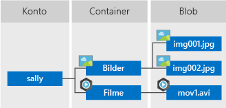

# <a name="quickstart-manage-blobs-with-java-v12-sdk"></a>Schnellstart: Verwalten von Blobs per Java v12 SDK

In dieser Schnellstartanleitung erfahren Sie, wie Sie Blobs mithilfe von Java verwalten. Bei Blobs handelt es sich um Objekte, die große Mengen von Text oder Binärdaten enthalten können, z. B. Bilder, Dokumente, Streamingmedien und Archivdaten. Sie führen das Hochladen, Herunterladen und Auflisten von Blobs durch und erstellen und löschen Container.

Zusätzliche Ressourcen:

* [API-Referenzdokumentation](/java/api/overview/azure/storage-blob-readme)
* [Quellcode der Bibliothek](https://github.com/Azure/azure-sdk-for-java/tree/master/sdk/storage/azure-storage-blob)
* [Maven-Paket](https://mvnrepository.com/artifact/com.azure/azure-storage-blob)
* [Beispiele](../common/storage-samples-java.md?toc=%2fazure%2fstorage%2fblobs%2ftoc.json#blob-samples)

## <a name="prerequisites"></a>Voraussetzungen

- Ein Azure-Konto mit einem aktiven Abonnement. Sie können [kostenlos ein Konto erstellen](https://azure.microsoft.com/free/?ref=microsoft.com&utm_source=microsoft.com&utm_medium=docs&utm_campaign=visualstudio).
- Azure Storage-Konto [Informationen zu Azure-Speicherkonten](../common/storage-account-create.md)
- [Java Development Kit (JDK)](/java/azure/jdk/), Version 8 oder höher.
- [Apache Maven](https://maven.apache.org/download.cgi).

[!INCLUDE [storage-multi-protocol-access-preview](../../../includes/storage-multi-protocol-access-preview.md)]

## <a name="setting-up"></a>Einrichten

In diesem Abschnitt wird beschrieben, wie Sie ein Projekt für die Verwendung mit der Azure Blob Storage-Clientbibliothek v12 für Java vorbereiten.

### <a name="create-the-project"></a>Erstellen des Projekts

Erstellen Sie eine Java-Anwendung mit dem Namen *blob-quickstart-v12*.

1. Verwenden Sie in einem Konsolenfenster (z. B. cmd, PowerShell oder Bash) Maven zum Erstellen einer neuen Konsolen-App mit dem Namen *blob-quickstart-v12*. Geben Sie den folgenden **mvn**-Befehl ein, um ein „Hallo Welt!“ -Java-Projekt zu erstellen.

    # <a name="powershell"></a>[PowerShell](#tab/powershell)

    ```powershell
    mvn archetype:generate `
        --define interactiveMode=n `
        --define groupId=com.blobs.quickstart `
        --define artifactId=blob-quickstart-v12 `
        --define archetypeArtifactId=maven-archetype-quickstart `
        --define archetypeVersion=1.4
    ```

    # <a name="bash"></a>[Bash](#tab/bash)

    ```bash
    mvn archetype:generate \
        --define interactiveMode=n \
        --define groupId=com.blobs.quickstart \
        --define artifactId=blob-quickstart-v12 \
        --define archetypeArtifactId=maven-archetype-quickstart \
        --define archetypeVersion=1.4
    ```

    ---

1. Die Ausgabe der Erstellung des Projekts sollte in etwa wie folgt aussehen:

    ```console
    [INFO] Scanning for projects...
    [INFO]
    [INFO] ------------------< org.apache.maven:standalone-pom >-------------------
    [INFO] Building Maven Stub Project (No POM) 1
    [INFO] --------------------------------[ pom ]---------------------------------
    [INFO]
    [INFO] >>> maven-archetype-plugin:3.1.2:generate (default-cli) > generate-sources @ standalone-pom >>>
    [INFO]
    [INFO] <<< maven-archetype-plugin:3.1.2:generate (default-cli) < generate-sources @ standalone-pom <<<
    [INFO]
    [INFO]
    [INFO] --- maven-archetype-plugin:3.1.2:generate (default-cli) @ standalone-pom ---
    [INFO] Generating project in Batch mode
    [INFO] ----------------------------------------------------------------------------
    [INFO] Using following parameters for creating project from Archetype: maven-archetype-quickstart:1.4
    [INFO] ----------------------------------------------------------------------------
    [INFO] Parameter: groupId, Value: com.blobs.quickstart
    [INFO] Parameter: artifactId, Value: blob-quickstart-v12
    [INFO] Parameter: version, Value: 1.0-SNAPSHOT
    [INFO] Parameter: package, Value: com.blobs.quickstart
    [INFO] Parameter: packageInPathFormat, Value: com/blobs/quickstart
    [INFO] Parameter: version, Value: 1.0-SNAPSHOT
    [INFO] Parameter: package, Value: com.blobs.quickstart
    [INFO] Parameter: groupId, Value: com.blobs.quickstart
    [INFO] Parameter: artifactId, Value: blob-quickstart-v12
    [INFO] Project created from Archetype in dir: C:\QuickStarts\blob-quickstart-v12
    [INFO] ------------------------------------------------------------------------
    [INFO] BUILD SUCCESS
    [INFO] ------------------------------------------------------------------------
    [INFO] Total time:  7.056 s
    [INFO] Finished at: 2019-10-23T11:09:21-07:00
    [INFO] ------------------------------------------------------------------------
        ```

1. Switch to the newly created *blob-quickstart-v12* folder.

   ```console
   cd blob-quickstart-v12
   ```

1. Erstellen Sie im Verzeichnis *blob-quickstart-v12* ein weiteres Verzeichnis namens *data*. In diesem werden die Blobdatendateien erstellt und gespeichert.

    ```console
    mkdir data
    ```

### <a name="install-the-package"></a>Installieren des Pakets

Öffnen Sie die Datei *pom.xml* in Ihrem Text-Editor. Fügen Sie der Gruppe „dependencies“ das folgende Abhängigkeitselement hinzu.

```xml
<dependency>
    <groupId>com.azure</groupId>
    <artifactId>azure-storage-blob</artifactId>
    <version>12.6.0</version>
</dependency>
```

### <a name="set-up-the-app-framework"></a>Einrichten des App-Frameworks

Über das Projektverzeichnis:

1. Navigieren Sie zum Verzeichnis */src/main/java/com/blobs/quickstart*.
1. Öffnen Sie die Datei *App.java* im Editor.
1. Löschen Sie die Anweisung `System.out.println("Hello world!");`.
1. Fügen Sie Anweisungen vom Typ `import` hinzu.

Der Code lautet wie folgt:

```java
package com.blobs.quickstart;

/**
 * Azure blob storage v12 SDK quickstart
 */
import com.azure.storage.blob.*;
import com.azure.storage.blob.models.*;
import java.io.*;

public class App
{
    public static void main( String[] args ) throws IOException
    {
    }
}
```

[!INCLUDE [storage-quickstart-credentials-include](../../../includes/storage-quickstart-credentials-include.md)]

## <a name="object-model"></a>Objektmodell

Azure Blob Storage ist für die Speicherung großer Mengen unstrukturierter Daten optimiert. Unstrukturierte Daten sind Daten, die keinem bestimmten Datenmodell und keiner bestimmten Definition entsprechen (also beispielsweise Text- oder Binärdaten). Blob Storage bietet drei Typen von Ressourcen:

* Das Speicherkonto
* Einen Container im Speicherkonto
* Ein Blob im Container

Im folgenden Diagramm ist die Beziehung zwischen diesen Ressourcen dargestellt.



Verwenden Sie die folgenden Java-Klassen zur Interaktion mit folgenden Ressourcen:

* [BlobServiceClient:](/java/api/com.azure.storage.blob.blobserviceclient) Die `BlobServiceClient`-Klasse ermöglicht Ihnen, Azure Storage-Ressourcen und Blobcontainer zu bearbeiten. Das Speicherkonto stellt den Namespace der obersten Ebene für den Blob-Dienst bereit.
* [BlobServiceClientBuilder](/java/api/com.azure.storage.blob.blobserviceclientbuilder): Die `BlobServiceClientBuilder`-Klasse stellt eine Fluent-Generator-API bereit, um die Konfiguration und Instanziierung von `BlobServiceClient`-Objekten zu unterstützen.
* [BlobContainerClient](/java/api/com.azure.storage.blob.blobcontainerclient): Die `BlobContainerClient`-Klasse ermöglicht Ihnen, Azure Storage-Container und deren Blobs zu bearbeiten.
* [BlobClient](/java/api/com.azure.storage.blob.blobclient): Die `BlobClient`-Klasse ermöglicht Ihnen, Azure Storage-Blobs zu bearbeiten.
* [BlobItem](/java/api/com.azure.storage.blob.models.blobitem): Die `BlobItem`-Klasse stellt einzelne Blobs dar, die durch einen Aufruf von [listBlobs](/java/api/com.azure.storage.blob.blobcontainerclient.listblobs) zurückgegeben werden.

## <a name="code-examples"></a>Codebeispiele

Mit den Beispielcodeausschnitten wird veranschaulicht, wie folgende Vorgänge mit der Azure Blob Storage-Clientbibliothek für Java durchgeführt werden:

* [Abrufen der Verbindungszeichenfolge](#get-the-connection-string)
* [Container erstellen](#create-a-container)
* [Hochladen von Blobs in einen Container](#upload-blobs-to-a-container)
* [Auflisten der Blobs in einem Container](#list-the-blobs-in-a-container)
* [Herunterladen von Blobs](#download-blobs)
* [Löschen eines Containers](#delete-a-container)

### <a name="get-the-connection-string"></a>Abrufen der Verbindungszeichenfolge

Der folgende Code ruft die Verbindungszeichenfolge für das Speicherkonto aus der Umgebungsvariable ab, die im Abschnitt [Konfigurieren der Speicherverbindungszeichenfolge](#configure-your-storage-connection-string) erstellt wurde.

Fügen Sie diesen Code in der `Main`-Methode hinzu:

```java
System.out.println("Azure Blob Storage v12 - Java quickstart sample\n");

// Retrieve the connection string for use with the application. The storage
// connection string is stored in an environment variable on the machine
// running the application called AZURE_STORAGE_CONNECTION_STRING. If the environment variable
// is created after the application is launched in a console or with
// Visual Studio, the shell or application needs to be closed and reloaded
// to take the environment variable into account.
String connectStr = System.getenv("AZURE_STORAGE_CONNECTION_STRING");
```

### <a name="create-a-container"></a>Erstellen eines Containers

Legen Sie einen Namen für den neuen Container fest. Der folgende Code hängt einen UUID-Wert an den Containernamen an, damit dieser eindeutig ist.

> [!IMPORTANT]
> Die Containernamen müssen klein geschrieben werden. Weitere Informationen zum Benennen von Containern und Blobs finden Sie unter [Naming and Referencing Containers, Blobs, and Metadata](/rest/api/storageservices/naming-and-referencing-containers--blobs--and-metadata) (Benennen von Containern, Blobs und Metadaten und Verweisen auf diese).

Erstellen Sie als nächstes eine Instanz der [BlobContainerClient](/java/api/com.azure.storage.blob.blobcontainerclient)-Klasse, und rufen Sie dann die [create](/java/api/com.azure.storage.blob.blobcontainerclient.create)-Methode auf, um den Container tatsächlich in Ihrem Speicherkonto zu erstellen.

Fügen Sie diesen Code am Ende der `Main`-Methode hinzu:

```java
// Create a BlobServiceClient object which will be used to create a container client
BlobServiceClient blobServiceClient = new BlobServiceClientBuilder().connectionString(connectStr).buildClient();

//Create a unique name for the container
String containerName = "quickstartblobs" + java.util.UUID.randomUUID();

// Create the container and return a container client object
BlobContainerClient containerClient = blobServiceClient.createBlobContainer(containerName);
```

### <a name="upload-blobs-to-a-container"></a>Hochladen von Blobs in einen Container

Der folgende Codeausschnitt führt folgende Aktionen durch:

1. Erstellen einer Textdatei im lokalen Verzeichnis *data*
1. Abrufen eines Verweises auf ein [BlobClient](/java/api/com.azure.storage.blob.blobclient)-Objekt durch Aufrufen der [getBlobClient](/java/api/com.azure.storage.blob.blobcontainerclient.getblobclient)-Methode für den Container aus dem Abschnitt [Erstellen eines Containers](#create-a-container)
1. Hochladen der lokalen Textdatei in das Blob durch Aufrufen der [uploadFromFile](/java/api/com.azure.storage.blob.blobclient.uploadfromfile)-Methode Mit dieser Methode wird das Blob erstellt, falls es nicht vorhanden ist, oder überschrieben, sofern es bereits vorhanden ist.

Fügen Sie diesen Code am Ende der `Main`-Methode hinzu:

```java
// Create a local file in the ./data/ directory for uploading and downloading
String localPath = "./data/";
String fileName = "quickstart" + java.util.UUID.randomUUID() + ".txt";
File localFile = new File(localPath + fileName);

// Write text to the file
FileWriter writer = new FileWriter(localPath + fileName, true);
writer.write("Hello, World!");
writer.close();

// Get a reference to a blob
BlobClient blobClient = containerClient.getBlobClient(fileName);

System.out.println("\nUploading to Blob storage as blob:\n\t" + blobClient.getBlobUrl());

// Upload the blob
blobClient.uploadFromFile(localPath + fileName);
```

### <a name="list-the-blobs-in-a-container"></a>Auflisten der Blobs in einem Container

Listen Sie die Blobs im Container auf, indem Sie die [listBlobs](/java/api/com.azure.storage.blob.blobcontainerclient.listblobs)-Methode aufrufen. In diesem Fall wurde dem Container nur ein Blob hinzugefügt, sodass beim Auflisten auch nur ein Blob zurückgegeben wird.

Fügen Sie diesen Code am Ende der `Main`-Methode hinzu:

```java
System.out.println("\nListing blobs...");

// List the blob(s) in the container.
for (BlobItem blobItem : containerClient.listBlobs()) {
    System.out.println("\t" + blobItem.getName());
}
```

### <a name="download-blobs"></a>Herunterladen von Blobs

Laden Sie das zuvor erstellte Blob herunter, indem Sie die [downloadToFile](/java/api/com.azure.storage.blob.specialized.blobclientbase.downloadtofile)-Methode aufrufen. Im Beispielcode wird das Suffix „DOWNLOAD“ an den Dateinamen angefügt, damit beide Dateien im lokalen Dateisystem angezeigt werden können.

Fügen Sie diesen Code am Ende der `Main`-Methode hinzu:

```java
// Download the blob to a local file
// Append the string "DOWNLOAD" before the .txt extension so that you can see both files.
String downloadFileName = fileName.replace(".txt", "DOWNLOAD.txt");
File downloadedFile = new File(localPath + downloadFileName);

System.out.println("\nDownloading blob to\n\t " + localPath + downloadFileName);

blobClient.downloadToFile(localPath + downloadFileName);
```

### <a name="delete-a-container"></a>Löschen eines Containers

Im folgenden Code werden die mit der App erstellten Ressourcen bereinigt, indem der gesamte Container mit der [delete](/java/api/com.azure.storage.blob.blobcontainerclient.delete)-Methode gelöscht wird. Außerdem werden die von der App erstellten lokalen Dateien gelöscht.

Die App wird unterbrochen, um auf Benutzereingaben zu warten, indem `System.console().readLine()` aufgerufen wird, bevor Blob, Container und lokale Dateien gelöscht werden. Dies ist eine gute Möglichkeit, um zu überprüfen, ob die Ressourcen richtig erstellt wurden, bevor sie gelöscht werden.

Fügen Sie diesen Code am Ende der `Main`-Methode hinzu:

```java
// Clean up
System.out.println("\nPress the Enter key to begin clean up");
System.console().readLine();

System.out.println("Deleting blob container...");
containerClient.delete();

System.out.println("Deleting the local source and downloaded files...");
localFile.delete();
downloadedFile.delete();

System.out.println("Done");
```

## <a name="run-the-code"></a>Ausführen des Codes

Mit dieser App wird in Ihrem lokalen Ordner eine Testdatei erstellt und in Blob Storage hochgeladen. Anschließend werden im Beispiel die Blobs im Container aufgelistet, und die Datei wird mit einem neuen Namen heruntergeladen, damit Sie die alte und neue Datei vergleichen können.

Navigieren Sie zum Verzeichnis, das die Datei *pom.xml* enthält, und kompilieren Sie das Projekt mit dem folgenden `mvn`-Befehl.

```console
mvn compile
```

Erstellen Sie dann das Paket.

```console
mvn package
```

Führen Sie die App mit dem folgenden `mvn`-Befehl aus.

```console
mvn exec:java -Dexec.mainClass="com.blobs.quickstart.App" -Dexec.cleanupDaemonThreads=false
```

Die Ausgabe der App sieht etwa wie das folgende Beispiel aus:

```output
Azure Blob Storage v12 - Java quickstart sample

Uploading to Blob storage as blob:
        https://mystorageacct.blob.core.windows.net/quickstartblobsf9aa68a5-260e-47e6-bea2-2dcfcfa1fd9a/quickstarta9c3a53e-ae9d-4863-8b34-f3d807992d65.txt

Listing blobs...
        quickstarta9c3a53e-ae9d-4863-8b34-f3d807992d65.txt

Downloading blob to
        ./data/quickstarta9c3a53e-ae9d-4863-8b34-f3d807992d65DOWNLOAD.txt

Press the Enter key to begin clean up

Deleting blob container...
Deleting the local source and downloaded files...
Done
```

Überprüfen Sie den Ordner *data* vor dem Start der Bereinigung auf die beiden Dateien. Sie können sie öffnen und sich vergewissern, dass sie identisch sind.

Nachdem Sie die Dateien erfolgreich überprüft haben, drücken Sie die **EINGABETASTE**, um die Testdateien zu löschen und die Demo zu beenden.

## <a name="next-steps"></a>Nächste Schritte

In dieser Schnellstartanleitung wurde beschrieben, wie Sie Blobs per Java hochladen, herunterladen und auflisten.

Weitere Beispiel-Apps für Blob Storage finden Sie unter:

> [!div class="nextstepaction"]
> [Azure Blob Storage SDK v12: Java-Beispiele](https://github.com/Azure/azure-sdk-for-java/tree/master/sdk/storage/azure-storage-blob/src/samples/java/com/azure/storage/blob)

* Weitere Informationen finden Sie unter [Azure SDK für Java](https://github.com/Azure/azure-sdk-for-java/blob/master/README.md).
* Tutorials, Beispiele, Schnellstartanleitungen und weiteres Dokumentationsmaterial finden Sie unter [Azure für Java-Cloudentwickler](/azure/developer/java/).
