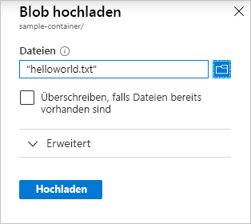

# Schnellstart: Hochladen, Herunterladen und Auflisten von Blobs mit dem Azure-Portal

In dieser Schnellstartanleitung erfahren Sie, wie Sie über das [Azure-Portal](https://portal.azure.com/) einen Container in Azure Storage erstellen und Blockblobs in diesen Container hochladen bzw. daraus herunterladen.

## Voraussetzungen

[!INCLUDE [storage-quickstart-prereq-include](../../../includes/storage-quickstart-prereq-include.md)]

## Erstellen eines Containers

Führen Sie die folgenden Schritte aus, um einen Container über das Azure-Portal zu erstellen:

1. Navigieren Sie im Azure-Portal zu Ihrem neuen Speicherkonto.
2. Scrollen Sie im linken Menü für das Speicherkonto zum Abschnitt **Blob-Dienst**, und wählen Sie **Container** aus.
3. Wählen Sie die Schaltfläche **+ Container**.
4. Geben Sie einen Namen für den neuen Container ein. Der Containername muss klein geschrieben werden, mit einem Buchstaben oder einer Zahl beginnen und darf nur Buchstaben, Zahlen und Bindestriche (-) enthalten. Weitere Informationen zu Container- und Blobnamen finden Sie unter [Naming and Referencing Containers, Blobs, and Metadata](https://docs.microsoft.com/rest/api/storageservices/naming-and-referencing-containers--blobs--and-metadata) (Benennen von Containern, Blobs und Metadaten und Verweisen auf diese).
5. Legen Sie die öffentliche Zugriffsebene für den Container fest. Die Standardebene ist **Private (no anonymous access)** (Privat (kein anonymer Zugriff)).
6. Wählen Sie **OK** aus, um den Container zu erstellen.

    

## Hochladen eines Blockblobs

Blockblobs bestehen aus Datenblöcken, die zusammen ein Blob bilden. In den meisten Blob Storage-Szenarien werden Blockblobs verwendet. Blockblobs eignen sich perfekt zum Speichern von Text und Binärdaten in der Cloud. Hierzu zählen beispielsweise Dateien, Bilder und Videos. In dieser Schnellstartanleitung erfahren Sie, wie Sie Blockblobs verwenden.

Gehen Sie wie folgt vor, um über das Azure-Portal ein Blockblob in Ihren neuen Container hochzuladen:

1. Navigieren Sie im Azure-Portal zu dem Container, den Sie im vorherigen Abschnitt erstellt haben.
1. Wählen Sie den Container aus, um eine Liste mit den darin enthaltenen Blobs anzuzeigen. Da dieser Container neu ist, enthält er noch keine Blobs.
1. Wählen Sie die Schaltfläche **Hochladen** aus, um das Uploadblatt zu öffnen, und navigieren Sie in Ihrem lokalen Dateisystem zu einer Datei, um sie als Blockblob hochzuladen. Im Abschnitt **Erweitert** können optional weitere Einstellungen für den Uploadvorgang konfiguriert werden.

    

1. Wählen Sie die Schaltfläche **Hochladen** aus, um das Blob hochzuladen.
1. Laden Sie auf diese Weise beliebig viele Blobs hoch. Wie Sie sehen, werden die neuen Blobs nun innerhalb des Containers aufgeführt.

## Herunterladen eines Blockblobs

Sie können ein Blockblob herunterladen, um es im Browser anzuzeigen oder in Ihrem lokalen Dateisystem zu speichern. Gehen Sie zum Herunterladen eines Blockblobs wie folgt vor:

1. Navigieren Sie zu der Liste mit den Blobs, die Sie im vorherigen Abschnitt hochgeladen haben.
1. Klicken Sie mit der rechten Maustaste auf den Blob, den Sie herunterladen möchten, und wählen Sie **Herunterladen** aus.

    

## Löschen eines Blockblobs

Sie können ein Blockblob herunterladen, um es im Browser anzuzeigen oder in Ihrem lokalen Dateisystem zu speichern. Gehen Sie zum Herunterladen eines Blockblobs wie folgt vor:

1. Navigieren Sie zu der Liste mit den Blobs, die Sie im vorherigen Abschnitt hochgeladen haben.
1. Wählen Sie die zu löschenden Blobs und anschließend auf der oberen Aktionsleiste die Option **Löschen** aus.

## Bereinigen von Ressourcen

Wenn Sie alle Ressourcen entfernen möchten, die Sie im Rahmen dieser Schnellstartanleitung erstellt haben, löschen Sie einfach den Container. Die Blobs im Container werden ebenfalls gelöscht.

So löschen Sie den Container:

1. Navigieren Sie im Azure-Portal zu der Liste mit den Containern in Ihrem Speicherkonto.
1. Wählen Sie den zu löschenden Container aus.
1. Wählen Sie die Schaltfläche **Mehr** ( **...** ) und dann **Löschen**.
1. Bestätigen Sie, dass Sie den Container löschen möchten.

## Nächste Schritte

In diesem Schnellstart haben Sie gelernt, wie Sie mit dem Azure-Portal Dateien zwischen einem lokalen Datenträger und Azure Blob Storage übertragen. Weitere Informationen zum Arbeiten mit Blob Storage finden Sie in der exemplarischen Vorgehensweise zu Blob Storage.

> [!div class="nextstepaction"]
> [Gewusst wie: Blob Storage-Vorgänge](storage-dotnet-how-to-use-blobs.md)
