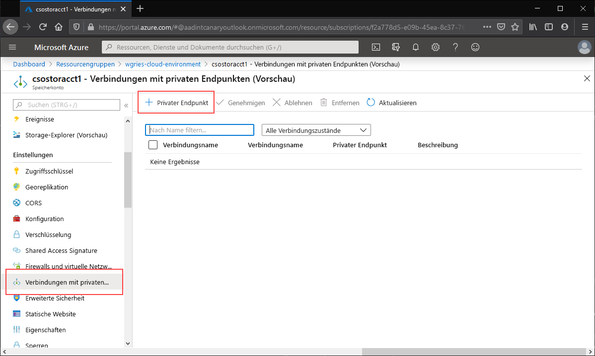
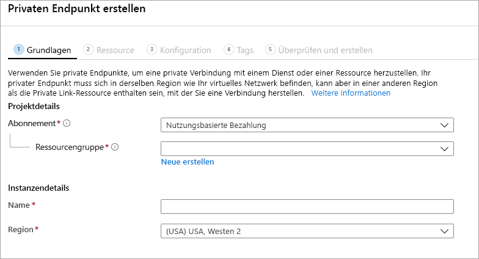
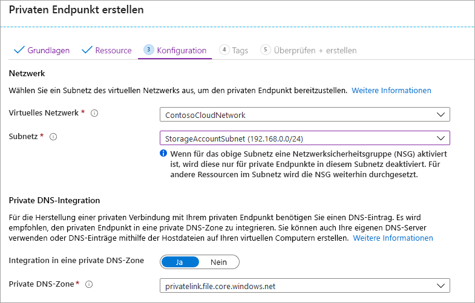
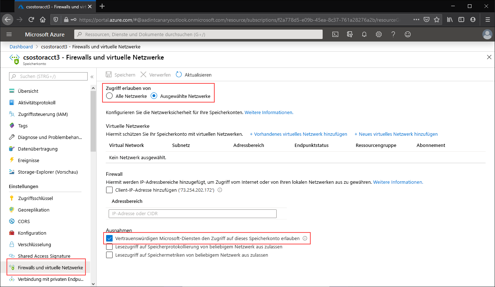
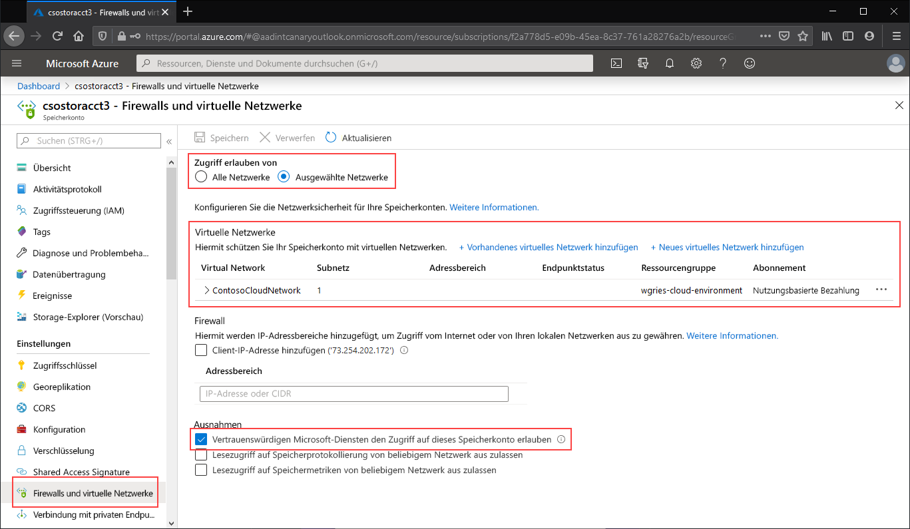

# <a name="configuring-azure-files-network-endpoints"></a>Konfigurieren von Azure Files-Netzwerkendpunkten
Azure Files verfügt über zwei Arten von Endpunkten für den Zugriff auf Azure-Dateifreigaben: 
- Öffentliche Endpunkte mit einer öffentlichen IP-Adresse, auf die von jedem Ort der Welt aus zugegriffen werden kann.
- Private Endpunkte, die in einem virtuellen Netzwerk vorhanden sind und eine private IP-Adresse im Adressraum des virtuellen Netzwerks aufweisen.

Öffentliche und private Endpunkte befinden sich unter dem Azure-Speicherkonto. Ein Speicherkonto ist ein Verwaltungskonstrukt, das einen gemeinsam genutzten Pool mit Speicherplatz darstellt, in dem Sie mehrere Dateifreigaben sowie weitere Speicherressourcen wie Blobcontainer oder Warteschlangen bereitstellen können.

In diesem Artikel geht es um die Konfiguration der Endpunkte eines Speicherkontos für den direkten Zugriff auf die Azure-Dateifreigabe. Die meisten Details in diesem Dokument gelten auch in Bezug darauf, wie die Azure-Dateisynchronisierung mit öffentlichen und privaten Endpunkten für das Speicherkonto interagiert. Weitere Informationen zu den Netzwerkaspekten für eine Bereitstellung der Azure-Dateisynchronisierung finden Sie aber unter [Konfigurieren der Proxy- und Firewalleinstellungen der Dateisynchronisierung](storage-sync-files-firewall-and-proxy.md).

Wir empfehlen Ihnen, vor dem Lesen dieses Leitfadens den Artikel [Azure Files – Überlegungen zum Netzwerkbetrieb](storage-files-networking-overview.md) zu lesen.

## <a name="prerequisites"></a>Voraussetzungen
- In diesem Artikel wird davon ausgegangen, dass Sie bereits ein Azure-Abonnement erstellt haben. Wenn Sie noch kein Abonnement haben, können Sie ein [kostenloses Konto](https://azure.microsoft.com/free/?WT.mc_id=A261C142F) erstellen, bevor Sie beginnen.
- In diesem Artikel wird davon ausgegangen, dass Sie bereits eine Azure-Dateifreigabe in einem Speicherkonto erstellt haben, mit dem aus der lokalen Umgebung eine Verbindung hergestellt werden soll. Informationen zum Erstellen einer Azure-Dateifreigabe finden Sie unter [Erstellen einer Azure-Dateifreigabe](storage-how-to-create-file-share.md).
- Falls Sie Azure PowerShell verwenden möchten, [installieren Sie die neueste Version](https://docs.microsoft.com/powershell/azure/install-az-ps).
- Falls Sie die Azure CLI verwenden möchten, [installieren Sie die neueste Version](https://docs.microsoft.com/cli/azure/install-azure-cli?view=azure-cli-latest).

## <a name="create-a-private-endpoint"></a>Erstellen eines privaten Endpunkts
Die Erstellung eines privaten Endpunkts für Ihr Speicherkonto führt dazu, dass die folgenden Azure-Ressourcen bereitgestellt werden:

- **Ein privater Endpunkt**: Eine Azure-Ressource, die den privaten Endpunkt des Speicherkontos darstellt. Sie können sich dies wie eine Ressource vorstellen, über die ein Speicherkonto und eine Netzwerkschnittstelle miteinander verbunden werden.
- **Eine Netzwerkschnittstelle (NIC)** : Die Netzwerkschnittstelle, über die eine private IP-Adresse im angegebenen virtuellen Netzwerk bzw. Subnetz verwaltet wird. Dies ist genau die gleiche Ressource, die bei der Bereitstellung eines virtuellen Computers bereitgestellt wird. Sie wird aber nicht einer VM zugewiesen, sondern befindet sich im Besitz des privaten Endpunkts.
- **Eine private DNS-Zone**: Falls Sie für dieses virtuelle Netzwerk noch keinen privaten Endpunkt bereitgestellt haben, wird für Ihr virtuelles Netzwerk eine neue private DNS-Zone bereitgestellt. Für das Speicherkonto in dieser DNS-Zone wird auch ein DNS-A-Eintrag erstellt. Wenn Sie in diesem virtuellen Netzwerk bereits einen privaten Endpunkt bereitgestellt haben, wird der vorhandenen DNS-Zone ein neuer A-Eintrag für das Speicherkonto hinzugefügt. Die Bereitstellung einer DNS-Zone ist zwar optional, aber sehr zu empfehlen. Diese Vorgehensweise ist zwingend erforderlich, wenn Sie Ihre Azure-Dateifreigaben mit einem AD-Dienstprinzipal oder per FileREST-API bereitstellen.

> [!Note]  
> In diesem Artikel wird das Speicherkonto-DNS-Suffix für die öffentlichen Azure-Regionen (`core.windows.net`) verwendet. Dieser Kommentar gilt auch für Azure Sovereign Clouds wie etwa die Azure US Government-Cloud und die Azure China-Cloud. Verwenden Sie einfach die entsprechenden Suffixe für Ihre Umgebung. 

# <a name="portal"></a>[Portal](#tab/azure-portal)
Navigieren Sie zu dem Speicherkonto, für das Sie einen privaten Endpunkt erstellen möchten. Wählen Sie im Inhaltsverzeichnis für das Speicherkonto die Option **Private Endpunktverbindungen** und dann **+ Privater Endpunkt** aus, um einen neuen privaten Endpunkt zu erstellen. 



Im anschließend angezeigten Assistenten müssen mehrere Seiten ausgefüllt werden.

Wählen Sie auf dem Blatt **Grundlagen** die gewünschte Ressourcengruppe, den Namen und die Region für Ihren privaten Endpunkt aus. Diese können beliebig sein und müssen nicht mit dem Speicherkonto übereinstimmen. Allerdings müssen Sie den privaten Endpunkt in derselben Region erstellen wie das virtuelle Netzwerk, in dem Sie den privaten Endpunkt erstellen möchten.



Wählen Sie auf dem Blatt **Ressourcen** das Optionsfeld für **Verbindung mit einer Azure-Ressource im eigenen Verzeichnis herstellen** aus. Wählen Sie als **Ressourcentyp** **Microsoft.Storage/storageAccounts** aus. Das Feld **Ressourcen** ist das Speicherkonto mit der Azure-Dateifreigabe, mit der Sie eine Verbindung herstellen möchten. Die untergeordnete Zielressource ist **file**, da es sich hier um Azure Files handelt.

Auf dem Blatt **Konfiguration** können Sie das spezifische virtuelle Netzwerk und das Subnetz auswählen, dem Sie Ihren privaten Endpunkt hinzufügen möchten. Wählen Sie das oben erstellte virtuelle Netzwerk aus. Sie müssen ein anderes Subnetz als das Subnetz auswählen, zu dem Sie oben Ihren Dienstendpunkt hinzugefügt haben. Das Blatt „Konfiguration“ enthält auch die Informationen zum Erstellen bzw. Aktualisieren der privaten DNS-Zone. Wir empfehlen Ihnen die Verwendung der Standardzone `privatelink.file.core.windows.net`.



Klicken Sie auf **Überprüfen + Erstellen**, um den privaten Endpunkt zu erstellen. 

Wenn Sie in Ihrem virtuellen Netzwerk über einen virtuellen Computer verfügen oder die DNS-Weiterleitung wie [hier](storage-files-networking-dns.md) beschrieben konfiguriert haben, können Sie testen, ob Ihr privater Endpunkt richtig eingerichtet wurde. Führen Sie hierzu die folgenden Befehle über PowerShell, die Befehlszeile oder das Terminal (für Windows, Linux oder macOS) aus. Sie müssen `<storage-account-name>` durch den entsprechenden Speicherkontonamen ersetzen:

```
nslookup <storage-account-name>.file.core.windows.net
```

Falls alles richtig funktioniert hat, sollte die folgende Ausgabe (Beispiel für Windows) angezeigt werden, wobei `192.168.0.5` die private IP-Adresse des privaten Endpunkts in Ihrem virtuellen Netzwerk ist:

```Output
Server:  UnKnown
Address:  10.2.4.4

Non-authoritative answer:
Name:    storageaccount.privatelink.file.core.windows.net
Address:  192.168.0.5
Aliases:  storageaccount.file.core.windows.net
```

# <a name="powershell"></a>[PowerShell](#tab/azure-powershell)
Für die Erstellung eines privaten Endpunkts für Ihr Speicherkonto müssen Sie zuerst einen Verweis auf Ihr Speicherkonto und das Subnetz des virtuellen Netzwerks einrichten, dem Sie den privaten Endpunkt hinzufügen möchten. Ersetzen Sie unten `<storage-account-resource-group-name>`, `<storage-account-name>`, `<vnet-resource-group-name>`, `<vnet-name>` und `<vnet-subnet-name>` entsprechend:

```PowerShell
$storageAccountResourceGroupName = "<storage-account-resource-group-name>"
$storageAccountName = "<storage-account-name>"
$virtualNetworkResourceGroupName = "<vnet-resource-group-name>"
$virtualNetworkName = "<vnet-name>"
$subnetName = "<vnet-subnet-name>"

# Get storage account reference, and throw error if it doesn't exist
$storageAccount = Get-AzStorageAccount `
        -ResourceGroupName $storageAccountResourceGroupName `
        -Name $storageAccountName `
        -ErrorAction SilentlyContinue

if ($null -eq $storageAccount) {
    $errorMessage = "Storage account $storageAccountName not found "
    $errorMessage += "in resource group $storageAccountResourceGroupName."
    Write-Error -Message $errorMessage -ErrorAction Stop
}

# Get virtual network reference, and throw error if it doesn't exist
$virtualNetwork = Get-AzVirtualNetwork `
        -ResourceGroupName $virtualNetworkResourceGroupName `
        -Name $virtualNetworkName `
        -ErrorAction SilentlyContinue

if ($null -eq $virtualNetwork) {
    $errorMessage = "Virtual network $virtualNetworkName not found "
    $errorMessage += "in resource group $virtualNetworkResourceGroupName."
    Write-Error -Message $errorMessage -ErrorAction Stop
}

# Get reference to virtual network subnet, and throw error if it doesn't exist
$subnet = $virtualNetwork | `
    Select-Object -ExpandProperty Subnets | `
    Where-Object { $_.Name -eq $subnetName }

if ($null -eq $subnet) {
    Write-Error `
            -Message "Subnet $subnetName not found in virtual network $virtualNetworkName." `
            -ErrorAction Stop
}
```

Für die Erstellung eines privaten Endpunkts müssen Sie eine Private Link-Dienstverbindung mit dem Speicherkonto erstellen. Die Private Link-Dienstverbindung ist eine Voraussetzung für die Erstellung des privaten Endpunkts. 

```PowerShell
# Disable private endpoint network policies
$subnet.PrivateEndpointNetworkPolicies = "Disabled"
$virtualNetwork | Set-AzVirtualNetwork | Out-Null

# Create a private link service connection to the storage account.
$privateEndpointConnection = New-AzPrivateLinkServiceConnection `
        -Name "$storageAccountName-Connection" `
        -PrivateLinkServiceId $storageAccount.Id `
        -GroupId "file"

# Create a new private endpoint.
$privateEndpoint = New-AzPrivateEndpoint `
        -ResourceGroupName $storageAccountResourceGroupName `
        -Name "$storageAccountName-PrivateEndpoint" `
        -Location $virtualNetwork.Location `
        -Subnet $subnet `
        -PrivateLinkServiceConnection $privateEndpointConnection `
        -ErrorAction Stop
```

Die Erstellung einer privaten Azure DNS-Zone ermöglicht es, dass der Originalname des Speicherkontos, z. B. `storageaccount.file.core.windows.net`, in die private IP-Adresse im virtuellen Netzwerk aufgelöst wird. Diese Vorgehensweise ist für die Erstellung eines privaten Endpunkts zwar optional, aber für die Bereitstellung der Azure-Dateifreigabe mit einem AD-Benutzerprinzipal oder per Zugriff über die REST-API ist dies zwingend erforderlich.  

```PowerShell
# Get the desired storage account suffix (core.windows.net for public cloud).
# This is done like this so this script will seamlessly work for non-public Azure.
$storageAccountSuffix = Get-AzContext | `
    Select-Object -ExpandProperty Environment | `
    Select-Object -ExpandProperty StorageEndpointSuffix

# For public cloud, this will generate the following DNS suffix:
# privatelink.file.core.windows.net.
$dnsZoneName = "privatelink.file.$storageAccountSuffix"

# Find a DNS zone matching desired name attached to this virtual network.
$dnsZone = Get-AzPrivateDnsZone | `
    Where-Object { $_.Name -eq $dnsZoneName } | `
    Where-Object {
        $privateDnsLink = Get-AzPrivateDnsVirtualNetworkLink `
                -ResourceGroupName $_.ResourceGroupName `
                -ZoneName $_.Name `
                -ErrorAction SilentlyContinue
        
        $privateDnsLink.VirtualNetworkId -eq $virtualNetwork.Id
    }

if ($null -eq $dnsZone) {
    # No matching DNS zone attached to virtual network, so create new one.
    $dnsZone = New-AzPrivateDnsZone `
            -ResourceGroupName $virtualNetworkResourceGroupName `
            -Name $dnsZoneName `
            -ErrorAction Stop

    $privateDnsLink = New-AzPrivateDnsVirtualNetworkLink `
            -ResourceGroupName $virtualNetworkResourceGroupName `
            -ZoneName $dnsZoneName `
            -Name "$virtualNetworkName-DnsLink" `
            -VirtualNetworkId $virtualNetwork.Id `
            -ErrorAction Stop
}
```

Nachdem Sie nun über einen Verweis auf die private DNS-Zone verfügen, müssen Sie einen A-Eintrag für Ihr Speicherkonto erstellen.

```PowerShell
$privateEndpointIP = $privateEndpoint | `
    Select-Object -ExpandProperty NetworkInterfaces | `
    Select-Object @{ 
        Name = "NetworkInterfaces"; 
        Expression = { Get-AzNetworkInterface -ResourceId $_.Id } 
    } | `
    Select-Object -ExpandProperty NetworkInterfaces | `
    Select-Object -ExpandProperty IpConfigurations | `
    Select-Object -ExpandProperty PrivateIpAddress

$privateDnsRecordConfig = New-AzPrivateDnsRecordConfig `
        -IPv4Address $privateEndpointIP

New-AzPrivateDnsRecordSet `
        -ResourceGroupName $virtualNetworkResourceGroupName `
        -Name $storageAccountName `
        -RecordType A `
        -ZoneName $dnsZoneName `
        -Ttl 600 `
        -PrivateDnsRecords $privateDnsRecordConfig `
        -ErrorAction Stop | `
    Out-Null
```

Falls Sie in Ihrem virtuellen Netzwerk über einen virtuellen Computer verfügen oder die DNS-Weiterleitung wie [hier](storage-files-networking-dns.md) beschrieben konfiguriert haben, können Sie mit den folgenden Befehlen testen, ob Ihr privater Endpunkt richtig eingerichtet wurde:

```PowerShell
$storageAccountHostName = [System.Uri]::new($storageAccount.PrimaryEndpoints.file) | `
    Select-Object -ExpandProperty Host

Resolve-DnsName -Name $storageAccountHostName
```

Falls alles gut funktioniert hat, sollte die folgende Ausgabe angezeigt werden, wobei `192.168.0.5` die private IP-Adresse des privaten Endpunkts in Ihrem virtuellen Netzwerk ist:

```Output
Name                             Type   TTL   Section    NameHost
----                             ----   ---   -------    --------
storageaccount.file.core.windows CNAME  60    Answer     storageaccount.privatelink.file.core.windows.net
.net

Name       : storageaccount.privatelink.file.core.windows.net
QueryType  : A
TTL        : 600
Section    : Answer
IP4Address : 192.168.0.5
```

# <a name="azure-cli"></a>[Azure-Befehlszeilenschnittstelle](#tab/azure-cli)
Für die Erstellung eines privaten Endpunkts für Ihr Speicherkonto müssen Sie zuerst einen Verweis auf Ihr Speicherkonto und das Subnetz des virtuellen Netzwerks einrichten, dem Sie den privaten Endpunkt hinzufügen möchten. Ersetzen Sie unten `<storage-account-resource-group-name>`, `<storage-account-name>`, `<vnet-resource-group-name>`, `<vnet-name>` und `<vnet-subnet-name>` entsprechend:

```bash
storageAccountResourceGroupName="<storage-account-resource-group-name>"
storageAccountName="<storage-account-name>"
virtualNetworkResourceGroupName="<vnet-resource-group-name>"
virtualNetworkName="<vnet-name>"
subnetName="<vnet-subnet-name>"

# Get storage account ID 
storageAccount=$(az storage account show \
        --resource-group $storageAccountResourceGroupName \
        --name $storageAccountName \
        --query "id" | \
    tr -d '"')

# Get virtual network ID
virtualNetwork=$(az network vnet show \
        --resource-group $virtualNetworkResourceGroupName \
        --name $virtualNetworkName \
        --query "id" | \
    tr -d '"')

# Get subnet ID
subnet=$(az network vnet subnet show \
        --resource-group $virtualNetworkResourceGroupName \
        --vnet-name $virtualNetworkName \
        --name $subnetName \
        --query "id" | \
    tr -d '"')
```

Für die Erstellung eines privaten Endpunkts müssen Sie zunächst sicherstellen, dass die Netzwerkrichtlinie für den privaten Endpunkt des Subnetzes auf „Deaktiviert“ festgelegt ist. Anschließend können Sie mit dem Befehl `az network private-endpoint create` einen privaten Endpunkt erstellen.

```bash
# Disable private endpoint network policies
az network vnet subnet update \
        --ids $subnet \
        --disable-private-endpoint-network-policies \
        --output none

# Get virtual network location
region=$(az network vnet show \
        --ids $virtualNetwork \
        --query "location" | \
    tr -d '"')

# Create a private endpoint
privateEndpoint=$(az network private-endpoint create \
        --resource-group $virtualNetworkResourceGroupName \
        --name "$storageAccountName-PrivateEndpoint" \
        --location $region \
        --subnet $subnet \
        --private-connection-resource-id $storageAccount \
        --group-ids "file" \
        --connection-name "$storageAccountName-Connection" \
        --query "id" | \
    tr -d '"')
```

Die Erstellung einer privaten Azure DNS-Zone ermöglicht es, dass der Originalname des Speicherkontos, z. B. `storageaccount.file.core.windows.net`, in die private IP-Adresse im virtuellen Netzwerk aufgelöst wird. Diese Vorgehensweise ist für die Erstellung eines privaten Endpunkts zwar optional, aber für die Bereitstellung der Azure-Dateifreigabe mit einem AD-Benutzerprinzipal oder per Zugriff über die REST-API ist dies zwingend erforderlich.  

```bash
# Get the desired storage account suffix (core.windows.net for public cloud).
# This is done like this so this script will seamlessly work for non-public Azure.
storageAccountSuffix=$(az cloud show \
        --query "suffixes.storageEndpoint" | \
    tr -d '"')

# For public cloud, this will generate the following DNS suffix:
# privatelink.file.core.windows.net.
dnsZoneName="privatelink.file.$storageAccountSuffix"

# Find a DNS zone matching desired name attached to this virtual network.
possibleDnsZones=$(az network private-dns zone list \
        --query "[?name == '$dnsZoneName'].id" \
        --output tsv)

for possibleDnsZone in $possibleDnsZones
do
    possibleResourceGroupName=$(az resource show \
            --ids $possibleDnsZone \
            --query "resourceGroup" | \
        tr -d '"')
    
    link=$(az network private-dns link vnet list \
            --resource-group $possibleResourceGroupName \
            --zone-name $dnsZoneName \
            --query "[?virtualNetwork.id == '$virtualNetwork'].id" \
            --output tsv)
    
    if [ -z $link ]
    then
        1 > /dev/null
    else 
        dnsZoneResourceGroup=$possibleResourceGroupName
        dnsZone=$possibleDnsZone
        break
    fi  
done

if [ -z $dnsZone ]
then
    # No matching DNS zone attached to virtual network, so create a new one
    dnsZone=$(az network private-dns zone create \
            --resource-group $virtualNetworkResourceGroupName \
            --name $dnsZoneName \
            --query "id" | \
        tr -d '"')
    
    az network private-dns link vnet create \
            --resource-group $resourceGroupName \
            --zone-name $zoneName \
            --name "$virtualNetworkName-DnsLink" \
            --virtual-network $virtualNetwork \
            --registration-enabled false \
            --output none
fi
```

Nachdem Sie nun über einen Verweis auf die private DNS-Zone verfügen, müssen Sie einen A-Eintrag für Ihr Speicherkonto erstellen.

```bash
privateEndpointNIC=$(az network private-endpoint show \
        --ids $privateEndpoint \
        --query "networkInterfaces[0].id" | \
    tr -d '"')

privateEndpointIP=$(az network nic show \
        --ids $privateEndpointNIC \
        --query "ipConfigurations[0].privateIpAddress" | \
    tr -d '"')

az network private-dns record-set a create \
        --resource-group $dnsZoneResourceGroup \
        --zone-name $dnsZoneName \
        --name $storageAccountName \
        --output none

az network private-dns record-set a add-record \
        --resource-group $dnsZoneResourceGroup \
        --zone-name $dnsZoneName \
        --record-set-name $storageAccountName \
        --ipv4-address $privateEndpointIP \
        --output none
```

Falls Sie in Ihrem virtuellen Netzwerk über einen virtuellen Computer verfügen oder die DNS-Weiterleitung wie [hier](storage-files-networking-dns.md) beschrieben konfiguriert haben, können Sie mit den folgenden Befehlen testen, ob Ihr privater Endpunkt richtig eingerichtet wurde:

```bash
httpEndpoint=$(az storage account show \
        --resource-group $storageAccountResourceGroupName \
        --name $storageAccountName \
        --query "primaryEndpoints.file" | \
    tr -d '"')

hostName=$(echo $httpEndpoint | cut -c7-$(expr length $httpEndpoint) | tr -d "/")
nslookup $hostName
```

Falls alles gut funktioniert hat, sollte die folgende Ausgabe angezeigt werden, wobei `192.168.0.5` die private IP-Adresse des privaten Endpunkts in Ihrem virtuellen Netzwerk ist. Beachten Sie, dass Sie dennoch „storageaccount.file.core.windows.net“ verwenden sollten, um zu Ihrer Dateifreigabe im privatelink-Pfad zu zählen.

```Output
Server:         127.0.0.53
Address:        127.0.0.53#53

Non-authoritative answer:
storageaccount.file.core.windows.net      canonical name = storageaccount.privatelink.file.core.windows.net.
Name:   storageaccount.privatelink.file.core.windows.net
Address: 192.168.0.5
```

---

## <a name="restrict-access-to-the-public-endpoint"></a>Einschränken des Zugriffs auf den öffentlichen Endpunkt
Sie können den Zugriff auf den öffentlichen Endpunkt mit den Firewalleinstellungen für das Speicherkonto einschränken. Im Allgemeinen beschränken die meisten Firewallrichtlinien für Speicherkonten den Netzwerkzugriff auf ein virtuelles Netzwerk (oder auf mehrere). Der Speicherkontozugriff kann auf zwei Arten auf ein virtuelles Netzwerk beschränkt werden:

- [Erstellen eines oder mehrerer privater Endpunkte für das Speicherkonto](#create-a-private-endpoint) und Beschränken des gesamten Zugriffs auf den öffentlichen Endpunkt. Dadurch wird sichergestellt, dass nur von Datenverkehr aus den gewünschten virtuellen Netzwerken auf die Azure-Dateifreigaben im Speicherkonto zugegriffen werden kann.
- Beschränken des öffentlichen Endpunkts auf ein einzelnes virtuelles Netzwerk (oder auf mehrere): Hierzu werden sogenannte *Dienstendpunkte* des virtuellen Netzwerks verwendet. Wenn Sie den Datenverkehr für ein Speicherkonto über einen Dienstendpunkt beschränken, erfolgt der Zugriff auf das Speicherkonto weiterhin über die öffentliche IP-Adresse.

### <a name="restrict-all-access-to-the-public-endpoint"></a>Einschränken des gesamten Zugriffs auf den öffentlichen Endpunkt
Wenn der gesamte Zugriff auf den öffentlichen Endpunkt eingeschränkt ist, kann auf das Speicherkonto über die privaten Endpunkte weiterhin zugegriffen werden. Andernfalls werden gültige Anforderungen, die an den öffentlichen Endpunkt des Speicherkontos gesendet werden, abgelehnt. 

# <a name="portal"></a>[Portal](#tab/azure-portal)
Navigieren Sie zu dem Speicherkonto, für das Sie den gesamten Zugriff auf den öffentlichen Endpunkt einschränken möchten. Wählen Sie im Inhaltsverzeichnis des Speicherkontos den Eintrag **Firewalls und virtuelle Netzwerke** aus.

Wählen Sie oben auf der Seite das Optionsfeld **Ausgewählte Netzwerke** aus. Hierdurch werden einige Einstellungen zum Steuern der Einschränkung des öffentlichen Endpunkts eingeblendet. Aktivieren Sie **Vertrauenswürdigen Microsoft-Diensten den Zugriff auf dieses Speicherkonto erlauben**, um für vertrauenswürdige Microsoft-Erstanbieterdienste, z. B. die Azure-Dateisynchronisierung, den Zugriff auf das Speicherkonto zuzulassen.



# <a name="powershell"></a>[PowerShell](#tab/azure-powershell)
Mit dem folgenden PowerShell-Befehl wird der gesamte Datenverkehr an den öffentlichen Endpunkt des Speicherkontos abgelehnt. Beachten Sie, dass für diesen Befehl der Parameter `-Bypass` auf `AzureServices` festgelegt ist. Hierdurch können vertrauenswürdige Erstanbieterdienste, z. B. die Azure-Dateisynchronisierung, über den öffentlichen Endpunkt auf das Speicherkonto zugreifen.

```PowerShell
# This assumes $storageAccount is still defined from the beginning of this of this guide.
$storageAccount | Update-AzStorageAccountNetworkRuleSet `
        -DefaultAction Deny `
        -Bypass AzureServices `
        -WarningAction SilentlyContinue `
        -ErrorAction Stop | `
    Out-Null
```

# <a name="azure-cli"></a>[Azure-Befehlszeilenschnittstelle](#tab/azure-cli)
Mit dem folgenden CLI-Befehl wird der gesamte Datenverkehr an den öffentlichen Endpunkt des Speicherkontos abgelehnt. Beachten Sie, dass für diesen Befehl der Parameter `-bypass` auf `AzureServices` festgelegt ist. Hierdurch können vertrauenswürdige Erstanbieterdienste, z. B. die Azure-Dateisynchronisierung, über den öffentlichen Endpunkt auf das Speicherkonto zugreifen.

```bash
# This assumes $storageAccountResourceGroupName and $storageAccountName 
# are still defined from the beginning of this guide.
az storage account update \
    --resource-group $storageAccountResourceGroupName \
    --name $storageAccountName \
    --bypass "AzureServices" \
    --default-action "Deny" \
    --output none
```
---

### <a name="restrict-access-to-the-public-endpoint-to-specific-virtual-networks"></a>Einschränken des Zugriffs auf den öffentlichen Endpunkt auf bestimmte virtuelle Netzwerke
Wenn Sie das Speicherkonto auf bestimmte virtuelle Netzwerke einschränken, lassen Sie Anforderungen an den öffentlichen Endpunkt aus den angegebenen virtuellen Netzwerken zu. Hierzu werden sogenannte *Dienstendpunkte* des virtuellen Netzwerks verwendet. Die Nutzung ist mit oder ohne private Endpunkte möglich.

# <a name="portal"></a>[Portal](#tab/azure-portal)
Navigieren Sie zu dem Speicherkonto, für das Sie den öffentlichen Endpunkt auf bestimmte virtuelle Netzwerke einschränken möchten. Wählen Sie im Inhaltsverzeichnis des Speicherkontos den Eintrag **Firewalls und virtuelle Netzwerke** aus. 

Wählen Sie oben auf der Seite das Optionsfeld **Ausgewählte Netzwerke** aus. Hierdurch werden einige Einstellungen zum Steuern der Einschränkung des öffentlichen Endpunkts eingeblendet. Klicken Sie auf **+ Vorhandenes virtuelles Netzwerk hinzufügen**, um das jeweilige virtuelle Netzwerk auszuwählen, für das der Zugriff auf das Speicherkonto über den öffentlichen Endpunkt zulässig sein soll. Hierfür müssen ein virtuelles Netzwerk und ein zugehöriges Subnetz ausgewählt werden. 

Aktivieren Sie **Vertrauenswürdigen Microsoft-Diensten den Zugriff auf dieses Speicherkonto erlauben**, um für vertrauenswürdige Microsoft-Erstanbieterdienste, z. B. die Azure-Dateisynchronisierung, den Zugriff auf das Speicherkonto zuzulassen.



# <a name="powershell"></a>[PowerShell](#tab/azure-powershell)
Zum Einschränken des Zugriffs auf den öffentlichen Endpunkt des Speicherkontos auf bestimmte virtuelle Netzwerke mit Dienstendpunkten müssen wir zunächst Informationen zum Speicherkonto und virtuellen Netzwerk sammeln. Geben Sie die Werte für `<storage-account-resource-group>`, `<storage-account-name>`, `<vnet-resource-group-name>`, `<vnet-name>` und `<subnet-name>` ein, um diese Informationen zu sammeln.

```PowerShell
$storageAccountResourceGroupName = "<storage-account-resource-group>"
$storageAccountName = "<storage-account-name>"
$restrictToVirtualNetworkResourceGroupName = "<vnet-resource-group-name>"
$restrictToVirtualNetworkName = "<vnet-name>"
$subnetName = "<subnet-name>"

$storageAccount = Get-AzStorageAccount `
        -ResourceGroupName $storageAccountResourceGroupName `
        -Name $storageAccountName `
        -ErrorAction Stop

$virtualNetwork = Get-AzVirtualNetwork `
        -ResourceGroupName $restrictToVirtualNetworkResourceGroupName `
        -Name $restrictToVirtualNetworkName `
        -ErrorAction Stop

$subnet = $virtualNetwork | `
    Select-Object -ExpandProperty Subnets | `
    Where-Object { $_.Name -eq $subnetName }

if ($null -eq $subnet) {
    Write-Error `
            -Message "Subnet $subnetName not found in virtual network $restrictToVirtualNetworkName." `
            -ErrorAction Stop
}
```

Damit der Datenverkehr aus dem virtuellen Netzwerk von der Azure-Netzwerkfabric zugelassen wird und an den öffentlichen Endpunkt des Speicherkontos fließen kann, muss für das Subnetz des virtuellen Netzwerks der Dienstendpunkt `Microsoft.Storage` verfügbar gemacht werden. Mit den folgenden PowerShell-Befehlen wird der Dienstendpunkt `Microsoft.Storage` dem Subnetz hinzugefügt, falls er noch nicht vorhanden ist.

```PowerShell
$serviceEndpoints = $subnet | `
    Select-Object -ExpandProperty ServiceEndpoints | `
    Select-Object -ExpandProperty Service

if ($serviceEndpoints -notcontains "Microsoft.Storage") {
    if ($null -eq $serviceEndpoints) {
        $serviceEndpoints = @("Microsoft.Storage")
    } elseif ($serviceEndpoints -is [string]) {
        $serviceEndpoints = @($serviceEndpoints, "Microsoft.Storage")
    } else {
        $serviceEndpoints += "Microsoft.Storage"
    }

    $virtualNetwork = $virtualNetwork | Set-AzVirtualNetworkSubnetConfig `
            -Name $subnetName `
            -AddressPrefix $subnet.AddressPrefix `
            -ServiceEndpoint $serviceEndpoints `
            -WarningAction SilentlyContinue `
            -ErrorAction Stop | `
        Set-AzVirtualNetwork `
            -ErrorAction Stop
}
```

Der letzte Schritt zum Einschränken des Datenverkehrs für das Speicherkonto ist das Erstellen einer Netzwerkregel und das Hinzufügen zum Netzwerkregelsatz des Speicherkontos.

```PowerShell
$networkRule = $storageAccount | Add-AzStorageAccountNetworkRule `
    -VirtualNetworkResourceId $subnet.Id `
    -ErrorAction Stop

$storageAccount | Update-AzStorageAccountNetworkRuleSet `
        -DefaultAction Deny `
        -Bypass AzureServices `
        -VirtualNetworkRule $networkRule `
        -WarningAction SilentlyContinue `
        -ErrorAction Stop | `
    Out-Null
```

# <a name="azure-cli"></a>[Azure-Befehlszeilenschnittstelle](#tab/azure-cli)
Zum Einschränken des Zugriffs auf den öffentlichen Endpunkt des Speicherkontos auf bestimmte virtuelle Netzwerke mit Dienstendpunkten müssen wir zunächst Informationen zum Speicherkonto und virtuellen Netzwerk sammeln. Geben Sie die Werte für `<storage-account-resource-group>`, `<storage-account-name>`, `<vnet-resource-group-name>`, `<vnet-name>` und `<subnet-name>` ein, um diese Informationen zu sammeln.

```bash
storageAccountResourceGroupName="<storage-account-resource-group>"
storageAccountName="<storage-account-name>"
restrictToVirtualNetworkResourceGroupName="<vnet-resource-group-name>"
restrictToVirtualNetworkName="<vnet-name>"
subnetName="<subnet-name>"

storageAccount=$(az storage account show \
        --resource-group $storageAccountResourceGroupName \
        --name $storageAccountName \
        --query "id" | \
    tr -d '"')

virtualNetwork=$(az network vnet show \
        --resource-group $restrictToVirtualNetworkResourceGroupName \
        --name $restrictToVirtualNetworkName \
        --query "id" | \
    tr -d '"')

subnet=$(az network vnet subnet show \
        --resource-group $restrictToVirtualNetworkResourceGroupName \
        --vnet-name $restrictToVirtualNetworkName \
        --name $subnetName \
        --query "id" | \
    tr -d '"')
```

Damit der Datenverkehr aus dem virtuellen Netzwerk von der Azure-Netzwerkfabric zugelassen wird und an den öffentlichen Endpunkt des Speicherkontos fließen kann, muss für das Subnetz des virtuellen Netzwerks der Dienstendpunkt `Microsoft.Storage` verfügbar gemacht werden. Mit den folgenden CLI-Befehlen wird der Dienstendpunkt `Microsoft.Storage` dem Subnetz hinzugefügt, falls er noch nicht vorhanden ist.

```bash
serviceEndpoints=$(az network vnet subnet show \
        --resource-group $restrictToVirtualNetworkResourceGroupName \
        --vnet-name $restrictToVirtualNetworkName \
        --name $subnetName \
        --query "serviceEndpoints[].service" \
        --output tsv)

foundStorageServiceEndpoint=false
for serviceEndpoint in $serviceEndpoints
do
    if [ $serviceEndpoint = "Microsoft.Storage" ]
    then
        foundStorageServiceEndpoint=true
    fi
done

if [ $foundStorageServiceEndpoint = false ] 
then
    serviceEndpointList=""

    for serviceEndpoint in $serviceEndpoints
    do
        serviceEndpointList+=$serviceEndpoint
        serviceEndpointList+=" "
    done
    
    serviceEndpointList+="Microsoft.Storage"

    az network vnet subnet update \
            --ids $subnet \
            --service-endpoints $serviceEndpointList \
            --output none
fi
```

Der letzte Schritt zum Einschränken des Datenverkehrs für das Speicherkonto ist das Erstellen einer Netzwerkregel und das Hinzufügen zum Netzwerkregelsatz des Speicherkontos.

```bash
az storage account network-rule add \
        --resource-group $storageAccountResourceGroupName \
        --account-name $storageAccountName \
        --subnet $subnet \
        --output none

az storage account update \
        --resource-group $storageAccountResourceGroupName \
        --name $storageAccountName \
        --bypass "AzureServices" \
        --default-action "Deny" \
        --output none
```

---

## <a name="see-also"></a>Weitere Informationen
- [Azure Files – Überlegungen zum Netzwerkbetrieb](storage-files-networking-overview.md)
- [Konfigurieren der DNS-Weiterleitung für Azure Files](storage-files-networking-dns.md)
- [Konfigurieren eines Site-to-Site-VPN zur Verwendung mit Azure Files](storage-files-configure-s2s-vpn.md)
