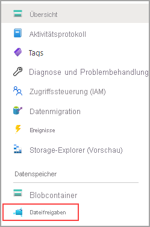

# Schnellstart: Erstellen und Verwalten einer Azure Files-Freigabe mit virtuellen Windows-Computern

Der Artikel zeigt die grundlegenden Schritte zur Erstellung und Verwendung einer Azure Files-Freigabe. Der Schwerpunkt dieser Schnellstartanleitung liegt auf der schnellen Einrichtung einer Azure Files-Freigabe, damit Sie sich mit der Funktionsweise des Diensts vertraut machen können. Sollten Sie eine ausführlichere Anleitung für die Erstellung und Verwendung von Azure-Dateifreigaben in Ihrer Umgebung benötigen, finden Sie diese unter [Verwenden einer Azure-Dateifreigabe mit Windows](storage-how-to-use-files-windows.md).

Wenn Sie kein Azure-Abonnement besitzen, können Sie ein [kostenloses Konto](https://azure.microsoft.com/free/?WT.mc_id=A261C142F) erstellen, bevor Sie beginnen.

## Anmelden bei Azure

Melden Sie sich beim [Azure-Portal](https://portal.azure.com) an.

## Vorbereiten der Umgebung

In dieser Schnellstartanleitung wird Folgendes eingerichtet:

- Ein Azure-Speicherkonto und eine Azure-Dateifreigabe
- Ein virtueller Computer mit Windows Server 2016 Datacenter

### Erstellen eines Speicherkontos

Um eine Azure-Dateifreigabe verwenden zu können, müssen Sie zunächst ein Azure-Speicherkonto erstellen. Ein Speicherkonto vom Typ „Allgemein v2“ bietet Zugriff auf sämtliche Azure Storage-Dienste: Blobs, Dateien, Warteschlangen und Tabellen. In dieser Schnellstartanleitung wird ein universelles v2-Speicherkonto erstellt. Die Schritte für die Erstellung einer anderen Art von Speicherkonto sind jedoch ähnlich. Ein Speicherkonto kann eine unbegrenzte Anzahl von Freigaben enthalten. Auf einer Freigabe kann eine unbegrenzte Anzahl von Dateien gespeichert werden, bis die Kapazitätsgrenzen des Speicherkontos erreicht sind.

[!INCLUDE [storage-create-account-portal-include](../../../includes/storage-create-account-portal-include.md)]

### Erstellen einer Azure-Dateifreigabe

Als Nächstes erstellen Sie eine Dateifreigabe.

1. Wählen Sie nach Abschluss der Bereitstellung des Azure-Speicherkontos die Option **Zu Ressource wechseln** aus.
1. Wählen Sie im Speicherkontobereich die Option **Dateifreigaben** aus.

    

1. Klicken Sie auf **+ Dateifreigabe**.

    

1. Nennen Sie die neue Dateifreigabe *qsfileshare*, geben Sie unter **Kontingent** den Wert „1“ ein, lassen Sie **Transaktion optimiert** aktiviert, und wählen Sie anschließend **Erstellen** aus. Das Kontingent kann auf bis zu 5 TiB festgelegt werden (100 TiB bei Aktivierung großer Dateifreigaben). Für diese Schnellstartanleitung ist jedoch 1 GiB ausreichend.
1. Erstellen Sie auf Ihrem lokalen Computer eine neue TXT-Datei namens *qsTestFile*.
1. Wählen Sie die neue Dateifreigabe und anschließend am Speicherort der Dateifreigabe **Hochladen** aus.

    

1. Navigieren Sie zu dem Speicherort, an dem Sie die TXT-Datei erstellt haben, und wählen Sie *qsTestFile.txt* und anschließend **Hochladen** aus.

Sie haben nun ein Azure-Speicherkonto und eine Dateifreigabe mit einer einzelnen Datei in Azure erstellt. Als Nächstes erstellen Sie den virtuellen Azure-Computer mit Windows Server 2016 Datacenter, der in dieser Schnellstartanleitung den lokalen Server darstellt.

### Bereitstellen einer VM

1. Erweitern Sie als Nächstes das Menü auf der linken Seite des Portals, und wählen Sie im Azure-Portal oben links die Option **Ressource erstellen**.
1. Suchen Sie im Suchfeld oberhalb der Liste mit den **Azure Marketplace**-Ressourcen nach **Windows Server 2016 Datacenter**, und wählen Sie den Eintrag aus.
1. Wählen Sie auf der Registerkarte **Grundlagen** unter **Projektdetails** die Ressourcengruppe aus, die Sie für diese Schnellstartanleitung erstellt haben.

   

1. Geben Sie dem virtuellen Computer unter **Instanzendetails** den Namen *qsVM*.
1. Übernehmen Sie die Standardeinstellungen für **Region**, **Verfügbarkeitsoptionen**, **Image** und **Größe**.
1. Fügen Sie unter **Administratorkonto** einen **Benutzernamen** hinzu, und geben Sie ein **Kennwort** für den virtuellen Computer ein.
1. Wählen Sie unter **Regeln für eingehende Ports** die Option **Ausgewählte Ports zulassen** aus, und wählen Sie dann **RDP (3389)** und **HTTP** aus der Dropdownliste aus.
1. Klicken Sie auf **Überprüfen + erstellen**.
1. Klicken Sie auf **Erstellen**. Das Erstellen eines neuen virtuellen Computers dauert einige Minuten.

1. Wählen Sie nach der Bereitstellung des virtuellen Computers die Option **Zu Ressource wechseln** aus.

Sie haben jetzt einen neuen virtuellen Computer erstellt und einen Datenträger angefügt. Nun müssen Sie eine Verbindung mit dem virtuellen Computer herstellen.

### Herstellen einer Verbindung mit Ihrer VM

1. Wählen Sie auf der Eigenschaftenseite des virtuellen Computers die Option **Verbinden** aus.

   

1. Übernehmen Sie auf der Seite zum **Herstellen der Verbindung mit dem virtuellen Computer** die Standardoptionen, um über die **IP-Adresse** und die **Portnummer** *3389* eine Verbindung herzustellen. Wählen Sie anschließend **RDP-Datei herunterladen** aus.
1. Öffnen Sie die heruntergeladene RDP-Datei, und klicken Sie auf **Verbinden**, wenn Sie dazu aufgefordert werden.
1. Wählen Sie im Fenster **Windows-Sicherheit** die Option **Weitere Optionen** und dann **Anderes Konto verwenden** aus. Geben Sie den Benutzernamen im Format *localhost\<Benutzername>* ein. &lt;<Benutzername>&gt; ist hierbei der VM-Administratorbenutzername, den Sie für den virtuellen Computer erstellt haben. Geben Sie das Kennwort ein, das Sie für den virtuellen Computer erstellt haben, und wählen Sie anschließend **OK** aus.

   

1. Während des Anmeldevorgangs wird unter Umständen eine Zertifikatwarnung angezeigt. Wählen Sie **Ja** oder **Weiter** aus, um die Verbindung zu erstellen.

## Zuordnen der Azure-Dateifreigabe zu einem Windows-Laufwerk

1. Navigieren Sie im Azure-Portal zur Dateifreigabe *qsfileshare*, und wählen Sie **Verbinden** aus.
1. Wählen Sie einen Laufwerkbuchstaben aus, kopieren Sie dann den Inhalt des zweiten Felds, und fügen Sie ihn in **Editor** ein.

   :::image type="content" source="media/storage-how-to-use-files-windows/files-portal-mounting-cmdlet-resize.png" alt-text="Screenshot: Inhalt des Felds, den Sie kopieren und in Editor einfügen müssen" lightbox="media/storage-how-to-use-files-windows/files-portal-mounting-cmdlet-resize.png":::

1. Öffnen Sie auf dem virtuellen Computer **PowerShell**, und fügen Sie den Inhalt aus **Editor** ein. Drücken Sie dann die EINGABETASTE, um den Befehl auszuführen. Das Laufwerk sollte zugeordnet werden.

## Erstellen einer Freigabemomentaufnahme

Nach dem Zuordnen des Laufwerks können Sie eine Momentaufnahme erstellen.

1. Navigieren Sie im Portal zu Ihrer Dateifreigabe, und wählen Sie **Momentaufnahmen** und dann **+ Momentaufnahme hinzufügen** aus.

   

1. Öffnen Sie auf dem virtuellen Computer die Datei *qstestfile.txt*, geben Sie „this file has been modified“ (Diese Datei wurde geändert.) ein, speichern Sie die Datei, und schließen Sie sie.
1. Erstellen Sie eine weitere Momentaufnahme.

## Durchsuchen einer Freigabemomentaufnahme

1. Wählen Sie in Ihrer Dateifreigabe die Option **Momentaufnahmen** aus.
1. Wählen Sie auf dem Blatt **Momentaufnahmen** die erste Momentaufnahme in der Liste aus.

   

1. Öffnen Sie diese Momentaufnahme, und wählen Sie *qsTestFile.txt* aus.

## Wiederherstellen aus einer Momentaufnahme

1. Klicken Sie auf dem Blatt der Dateifreigabemomentaufnahme mit der rechten Maustaste auf *qsTestFile*, und wählen Sie **Wiederherstellen** aus.

    :::image type="content" source="media/storage-files-quick-create-use-windows/restore-share-snapshot.png" alt-text="Screenshot: Blatt „Momentaufnahme“, ausgewählte Option „qstestfile“ und hervorgehobene Option „Wiederherstellen“":::

1. Wählen Sie **Originaldatei überschreiben** aus.

   

1. Öffnen Sie die Datei auf dem virtuellen Computer. Die unveränderte Version wurde wiederhergestellt.

## Löschen einer Freigabemomentaufnahme

1. Wählen Sie in Ihrer Dateifreigabe die Option **Momentaufnahmen** aus.
1. Wählen Sie auf dem Blatt **Momentaufnahmen** die letzte Momentaufnahme in der Liste und dann **Löschen** aus.

   

## Verwenden einer Freigabemomentaufnahme unter Windows

Die Momentaufnahmen Ihrer eingebundenen Azure-Dateifreigabe können genau wie lokale VSS-Momentaufnahmen auf der Registerkarte „Vorherige Versionen“ angezeigt werden.

1. Navigieren Sie im Datei-Explorer zu der eingebundenen Freigabe.

   

1. Klicken Sie mit der rechten Maustaste auf *qsTestFile.txt*, und wählen Sie im Menü die Option **Eigenschaften** aus.

   

1. Wählen Sie **Vorherige Versionen** aus, um die Liste der Freigabemomentaufnahmen für dieses Verzeichnis anzuzeigen.

1. Wählen Sie **Öffnen** aus, um die Momentaufnahme zu öffnen.

   

## Wiederherstellen aus einer vorherigen Version

1. Wählen Sie **Wiederherstellen** aus. Dadurch wird der Inhalt des gesamten Verzeichnisses rekursiv an den ursprünglichen Speicherort zum Erstellungszeitpunkt der Freigabemomentaufnahme kopiert.

   
    
    > [!NOTE]
    > Wenn sich Ihre Datei nicht geändert hat, wird keine vorherige Version davon angezeigt, weil die Version der Datei der Momentaufnahme entspricht. Dies ist die gleiche Vorgehensweise wie auf einem Windows-Dateiserver.

## Bereinigen von Ressourcen

[!INCLUDE [storage-files-clean-up-portal](../../../includes/storage-files-clean-up-portal.md)]

## Nächste Schritte

> [!div class="nextstepaction"]
> [Verwenden einer Azure-Dateifreigabe mit Windows](storage-how-to-use-files-windows.md)
