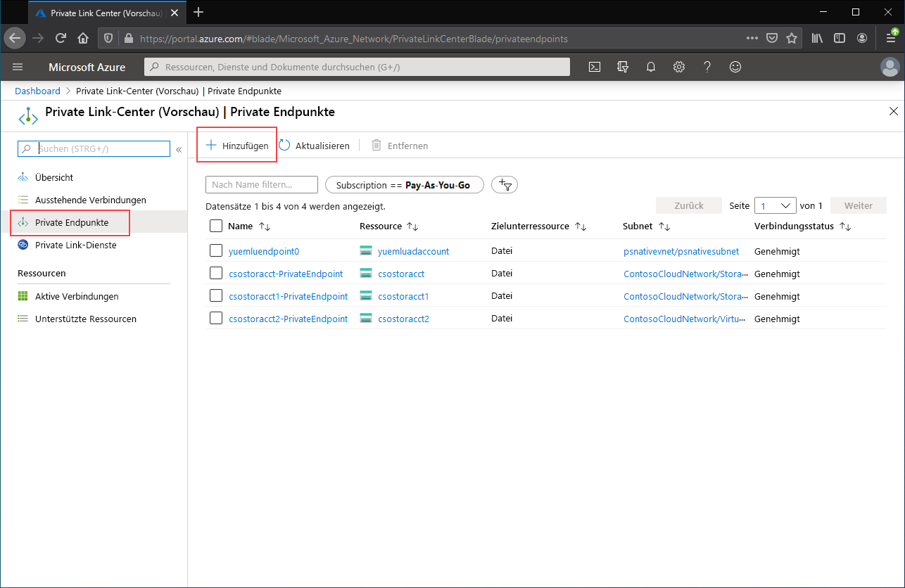
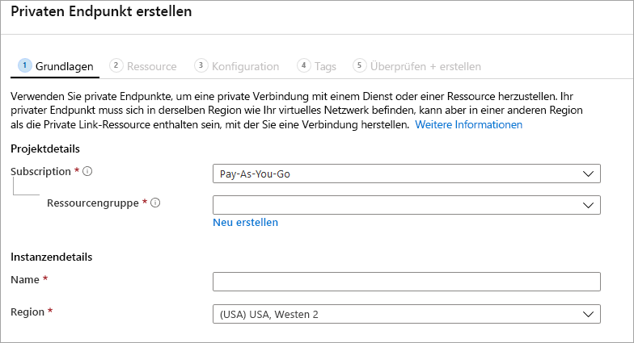

# <a name="configuring-azure-file-sync-network-endpoints"></a>Konfigurieren von Netzwerkendpunkten für die Azure-Dateisynchronisierung
Azure Files und die Azure-Dateisynchronisierung verfügen über zwei Arten von Endpunkten für den Zugriff auf Azure-Dateifreigaben: 
- Öffentliche Endpunkte mit einer öffentlichen IP-Adresse, auf die von jedem Ort der Welt aus zugegriffen werden kann.
- Private Endpunkte, die in einem virtuellen Netzwerk vorhanden sind und eine private IP-Adresse im Adressraum des virtuellen Netzwerks aufweisen.

Für Azure Files und die Azure-Dateisynchronisierung werden mit den Azure-Verwaltungsobjekten, dem Speicherkonto bzw. dem Speichersynchronisierungsdienst sowohl die öffentlichen als auch die privaten Endpunkte gesteuert. Das Speicherkonto ist ein Verwaltungskonstrukt, das einen gemeinsam genutzten Pool mit Speicherplatz darstellt, in dem Sie mehrere Dateifreigaben sowie weitere Speicherressourcen wie Blobcontainer oder Warteschlangen bereitstellen können. Der Speichersynchronisierungsdienst ist ein Verwaltungskonstrukt für registrierte Server. Hierbei handelt es sich um Windows-Dateiserver mit einer etablierten Vertrauensstellung mit der Azure-Dateisynchronisierung und mit Synchronisierungsgruppen, mit denen die Topologie der Synchronisierungsbeziehung definiert wird. 

In diesem Artikel wird beschrieben, wie Sie die Netzwerkendpunkte für Azure Files und für die Azure-Dateisynchronisierung konfigurieren. Weitere Informationen zum Konfigurieren von Netzwerkendpunkten für den direkten Zugriff auf Azure-Dateifreigaben (anstelle der lokalen Zwischenspeicherung bei der Azure-Dateisynchronisierung) finden Sie unter [Konfigurieren von Azure Files-Netzwerkendpunkten](storage-files-networking-endpoints.md).

Wir empfehlen Ihnen, vor dem Lesen dieses Leitfadens den Artikel [Azure-Dateisynchronisierung – Überlegungen zum Netzwerkbetrieb](storage-sync-files-networking-overview.md) zu lesen.

## <a name="prerequisites"></a>Voraussetzungen 
In diesem Artikel wird Folgendes vorausgesetzt:
- Sie verfügen über ein Azure-Abonnement. Wenn Sie noch kein Abonnement haben, können Sie ein [kostenloses Konto](https://azure.microsoft.com/free/?WT.mc_id=A261C142F) erstellen, bevor Sie beginnen.
- Sie haben bereits eine Azure-Dateifreigabe in einem Speicherkonto erstellt, mit dem von der lokalen Umgebung aus eine Verbindung hergestellt werden soll. Informationen zum Erstellen einer Azure-Dateifreigabe finden Sie unter [Erstellen einer Azure-Dateifreigabe](storage-how-to-create-file-share.md).
- Sie haben bereits einen Speichersynchronisierungsdienst erstellt und Ihren Windows-Dateiserver dafür registriert. Informationen zum Bereitstellen der Azure-Dateisynchronisierung finden Sie unter [Bereitstellen der Azure-Dateisynchronisierung](storage-sync-files-deployment-guide.md).

Außerdem zu beachten:
- Falls Sie Azure PowerShell verwenden möchten, [installieren Sie die neueste Version](/powershell/azure/install-az-ps).
- Falls Sie die Azure CLI verwenden möchten, [installieren Sie die neueste Version](/cli/azure/install-azure-cli?view=azure-cli-latest).

## <a name="create-the-private-endpoints"></a>Erstellen der privaten Endpunkte
Beim Erstellen eines privaten Endpunkts für eine Azure-Ressource werden die folgenden Ressourcen bereitgestellt:

- **Ein privater Endpunkt**: Eine Azure-Ressource, die entweder den privaten Endpunkt für das Speicherkonto oder für den Speichersynchronisierungsdienst darstellt. Sie können sich dies wie eine Ressource vorstellen, über die Ihre Azure-Ressource und eine Netzwerkschnittstelle miteinander verbunden werden.
- **Eine Netzwerkschnittstelle (NIC)** : Die Netzwerkschnittstelle, über die eine private IP-Adresse im angegebenen virtuellen Netzwerk bzw. Subnetz verwaltet wird. Dies ist genau die gleiche Ressource, die bei der Bereitstellung eines virtuellen Computers bereitgestellt wird. Sie wird aber nicht einer VM zugewiesen, sondern befindet sich im Besitz des privaten Endpunkts.
- **Eine private DNS-Zone**: Falls Sie für dieses virtuelle Netzwerk noch keinen privaten Endpunkt bereitgestellt haben, wird für Ihr virtuelles Netzwerk eine neue private DNS-Zone bereitgestellt. Ein DNS-A-Eintrag wird für die Azure-Ressource in dieser DNS-Zone ebenfalls erstellt. Wenn Sie in diesem virtuellen Netzwerk bereits einen privaten Endpunkt bereitgestellt haben, wird der vorhandenen DNS-Zone ein neuer A-Eintrag für die Azure-Ressource hinzugefügt. Die Bereitstellung einer DNS-Zone ist optional, aber diese Vorgehensweise wird dringend empfohlen, um die erforderliche DNS-Verwaltung zu vereinfachen.

> [!Note]  
> In diesem Artikel werden die DNS-Suffixe für die öffentlichen Azure-Regionen verwendet. Dies sind `core.windows.net` für Speicherkonten und `afs.azure.net` für Speichersynchronisierungsdienste. Dieser Kommentar gilt auch für Azure Sovereign Clouds, z. B. die Azure US Government-Cloud. Fügen Sie einfach die entsprechenden Suffixe für Ihre Umgebung ein.

### <a name="create-the-storage-account-private-endpoint"></a>Erstellen des privaten Endpunkts für das Speicherkonto
# <a name="portal"></a>[Portal](#tab/azure-portal)
[!INCLUDE [storage-files-networking-endpoints-private-portal](../../../includes/storage-files-networking-endpoints-private-portal.md)]

Wenn Sie in Ihrem virtuellen Netzwerk über einen virtuellen Computer verfügen oder die DNS-Weiterleitung wie unter [Konfigurieren der DNS-Weiterleitung für Azure Files](storage-files-networking-dns.md) beschrieben konfiguriert haben, können Sie testen, ob Ihr privater Endpunkt richtig eingerichtet wurde. Führen Sie hierzu die folgenden Befehle über PowerShell, die Befehlszeile oder das Terminal (für Windows, Linux oder macOS) aus. Sie müssen `<storage-account-name>` durch den entsprechenden Speicherkontonamen ersetzen:

```
nslookup <storage-account-name>.file.core.windows.net
```

Falls alles richtig funktioniert hat, sollte die folgende Ausgabe (Beispiel für Windows) angezeigt werden, wobei `192.168.0.5` die private IP-Adresse des privaten Endpunkts in Ihrem virtuellen Netzwerk ist:

```Output
Server:  UnKnown
Address:  10.2.4.4

Non-authoritative answer:
Name:    storageaccount.privatelink.file.core.windows.net
Address:  192.168.0.5
Aliases:  storageaccount.file.core.windows.net
```

# <a name="powershell"></a>[PowerShell](#tab/azure-powershell)
[!INCLUDE [storage-files-networking-endpoints-private-powershell](../../../includes/storage-files-networking-endpoints-private-powershell.md)]

Falls Sie in Ihrem virtuellen Netzwerk über einen virtuellen Computer verfügen oder die DNS-Weiterleitung wie unter [Konfigurieren der DNS-Weiterleitung für Azure Files](storage-files-networking-dns.md) beschrieben konfiguriert haben, können Sie mit den folgenden Befehlen testen, ob Ihr privater Endpunkt richtig eingerichtet wurde:

```PowerShell
$storageAccountHostName = [System.Uri]::new($storageAccount.PrimaryEndpoints.file) | `
    Select-Object -ExpandProperty Host

Resolve-DnsName -Name $storageAccountHostName
```

Falls alles gut funktioniert hat, sollte die folgende Ausgabe angezeigt werden, wobei `192.168.0.5` die private IP-Adresse des privaten Endpunkts in Ihrem virtuellen Netzwerk ist:

```Output
Name                             Type   TTL   Section    NameHost
----                             ----   ---   -------    --------
storageaccount.file.core.windows CNAME  60    Answer     storageaccount.privatelink.file.core.windows.net
.net

Name       : storageaccount.privatelink.file.core.windows.net
QueryType  : A
TTL        : 600
Section    : Answer
IP4Address : 192.168.0.5
```

# <a name="azure-cli"></a>[Azure-Befehlszeilenschnittstelle](#tab/azure-cli)
[!INCLUDE [storage-files-networking-endpoints-private-cli](../../../includes/storage-files-networking-endpoints-private-cli.md)]

Falls Sie in Ihrem virtuellen Netzwerk über einen virtuellen Computer verfügen oder die DNS-Weiterleitung wie unter [Konfigurieren der DNS-Weiterleitung für Azure Files](storage-files-networking-dns.md) beschrieben konfiguriert haben, können Sie mit den folgenden Befehlen testen, ob Ihr privater Endpunkt richtig eingerichtet wurde:

```bash
httpEndpoint=$(az storage account show \
        --resource-group $storageAccountResourceGroupName \
        --name $storageAccountName \
        --query "primaryEndpoints.file" | \
    tr -d '"')

hostName=$(echo $httpEndpoint | cut -c7-$(expr length $httpEndpoint) | tr -d "/")
nslookup $hostName
```

Falls alles gut funktioniert hat, sollte die folgende Ausgabe angezeigt werden, wobei `192.168.0.5` die private IP-Adresse des privaten Endpunkts in Ihrem virtuellen Netzwerk ist:

```Output
Server:         127.0.0.53
Address:        127.0.0.53#53

Non-authoritative answer:
storageaccount.file.core.windows.net      canonical name = storageaccount.privatelink.file.core.windows.net.
Name:   storageaccount.privatelink.file.core.windows.net
Address: 192.168.0.5
```

---

### <a name="create-the-storage-sync-private-endpoint"></a>Erstellen des privaten Endpunkts für die Speichersynchronisierung
> [!Important]  
> Um private Endpunkte für die Speichersynchronisierungsdienst-Ressource verwenden zu können, müssen Sie mindestens Version 10.1 des Azure-Dateisynchronisierungs-Agents nutzen. Für Agent-Versionen, die älter als 10.1 sind, werden private Endpunkte unter dem Speichersynchronisierungsdienst nicht unterstützt. Alle früheren Agent-Versionen unterstützen private Endpunkte für die Speicherkontoressource.

# <a name="portal"></a>[Portal](#tab/azure-portal)
Navigieren Sie zum **Private Link-Center**, indem Sie oben im Azure-Portal in der Suchleiste den Suchbegriff *Private Link* eingeben. Wählen Sie im Inhaltsverzeichnis des Private Link-Centers die Option **Private Endpunkte** und dann **+ Hinzufügen** aus, um einen neuen privaten Endpunkt zu erstellen.

[](media/storage-sync-files-networking-endpoints/create-storage-sync-private-endpoint-0.png#lightbox)

Im anschließend angezeigten Assistenten müssen mehrere Seiten ausgefüllt werden.

Wählen Sie auf dem Blatt **Grundlagen** die gewünschte Ressourcengruppe, den Namen und die Region für Ihren privaten Endpunkt aus. Dies können beliebig ausgewählte Angaben sein, die nicht mit den Angaben für den Speichersynchronisierungsdienst übereinstimmen müssen. Allerdings müssen Sie den privaten Endpunkt in derselben Region wie das virtuelle Netzwerk erstellen, in dem Sie den privaten Endpunkt erstellen möchten.



Wählen Sie auf dem Blatt **Ressourcen** das Optionsfeld für **Verbindung mit einer Azure-Ressource im eigenen Verzeichnis herstellen** aus. Wählen Sie unter **Ressourcentyp** die Option **Microsoft.StorageSync/storageSyncServices** aus. 

Auf dem Blatt **Konfiguration** können Sie das spezifische virtuelle Netzwerk und das Subnetz auswählen, dem Sie Ihren privaten Endpunkt hinzufügen möchten. Wählen Sie dasselbe virtuelle Netzwerk wie oben für das Speicherkonto aus. Das Blatt „Konfiguration“ enthält auch die Informationen zum Erstellen bzw. Aktualisieren der privaten DNS-Zone.

Klicken Sie auf **Überprüfen + Erstellen**, um den privaten Endpunkt zu erstellen.

Sie können testen, ob Ihr privater Endpunkt richtig eingerichtet wurde, indem Sie über PowerShell die folgenden Befehle ausführen. 

```powershell
$privateEndpointResourceGroupName = "<your-private-endpoint-resource-group>"
$privateEndpointName = "<your-private-endpoint-name>"

Get-AzPrivateEndpoint `
        -ResourceGroupName $privateEndpointResourceGroupName `
        -Name $privateEndpointName `
        -ErrorAction Stop | `
    Select-Object -ExpandProperty NetworkInterfaces | `
    Select-Object -ExpandProperty Id | `
    ForEach-Object { Get-AzNetworkInterface -ResourceId $_ } | `
    Select-Object -ExpandProperty IpConfigurations | `
    Select-Object -ExpandProperty PrivateLinkConnectionProperties | `
    Select-Object -ExpandProperty Fqdns | `
    ForEach-Object { Resolve-DnsName -Name $_ } | `
    Format-List
```

Wenn alles richtig funktioniert hat, sollte die folgende Ausgabe angezeigt werden, in der `192.168.1.4`, `192.168.1.5`, `192.168.1.6` und `192.168.1.7` für die privaten IP-Adressen stehen, die dem privaten Endpunkt zugewiesen sind:

```Output
Name     : mysssmanagement.westus2.afs.azure.net
Type     : CNAME
TTL      : 60
Section  : Answer
NameHost : mysssmanagement.westus2.privatelink.afs.azure.net


Name       : mysssmanagement.westus2.privatelink.afs.azure.net
QueryType  : A
TTL        : 60
Section    : Answer
IP4Address : 192.168.1.4

Name     : myssssyncp.westus2.afs.azure.net
Type     : CNAME
TTL      : 60
Section  : Answer
NameHost : myssssyncp.westus2.privatelink.afs.azure.net


Name       : myssssyncp.westus2.privatelink.afs.azure.net
QueryType  : A
TTL        : 60
Section    : Answer
IP4Address : 192.168.1.5

Name     : myssssyncs.westus2.afs.azure.net
Type     : CNAME
TTL      : 60
Section  : Answer
NameHost : myssssyncs.westus2.privatelink.afs.azure.net


Name       : myssssyncs.westus2.privatelink.afs.azure.net
QueryType  : A
TTL        : 60
Section    : Answer
IP4Address : 192.168.1.6

Name     : mysssmonitoring.westus2.afs.azure.net
Type     : CNAME
TTL      : 60
Section  : Answer
NameHost : mysssmonitoring.westus2.privatelink.afs.azure.net


Name       : mysssmonitoring.westus2.privatelink.afs.azure.net
QueryType  : A
TTL        : 60
Section    : Answer
IP4Address : 192.168.1.7

```

# <a name="powershell"></a>[PowerShell](#tab/azure-powershell)
Zum Erstellen eines privaten Endpunkts für Ihren Speichersynchronisierungsdienst benötigen Sie zunächst einen Verweis auf den Speichersynchronisierungsdienst. Achten Sie darauf, dass Sie `<storage-sync-service-resource-group>` und `<storage-sync-service>` durch die entsprechenden Werte für Ihre Umgebung ersetzen. Bei den folgenden PowerShell-Befehlen wird vorausgesetzt, dass Sie die oben verwendeten Informationen für das virtuelle Netzwerk bereits eingefügt haben. 

```powershell
$storageSyncServiceResourceGroupName = "<storage-sync-service-resource-group>"
$storageSyncServiceName = "<storage-sync-service>"

$storageSyncService = Get-AzStorageSyncService `
        -ResourceGroupName $storageSyncServiceResourceGroupName `
        -Name $storageSyncServiceName `
        -ErrorAction SilentlyContinue

if ($null -eq $storageSyncService) {
    $errorMessage = "Storage Sync Service $storageSyncServiceName not found "
    $errorMessage += "in resource group $storageSyncServiceResourceGroupName."
    Write-Error -Message $errorMessage -ErrorAction Stop
}
```

Für die Erstellung eines privaten Endpunkts müssen Sie eine Private Link-Dienstverbindung mit dem Speichersynchronisierungsdienst herstellen. Die Private Link-Verbindung ist eine Voraussetzung für die Erstellung des privaten Endpunkts.

```PowerShell 
# Disable private endpoint network policies
$subnet.PrivateEndpointNetworkPolicies = "Disabled"
$virtualNetwork = $virtualNetwork | `
    Set-AzVirtualNetwork -ErrorAction Stop

# Create a private link service connection to the storage account.
$privateEndpointConnection = New-AzPrivateLinkServiceConnection `
        -Name "$storageSyncServiceName-Connection" `
        -PrivateLinkServiceId $storageSyncService.ResourceId `
        -GroupId "Afs" `
        -ErrorAction Stop

# Create a new private endpoint.
$privateEndpoint = New-AzPrivateEndpoint `
        -ResourceGroupName $storageSyncServiceResourceGroupName `
        -Name "$storageSyncServiceName-PrivateEndpoint" `
        -Location $virtualNetwork.Location `
        -Subnet $subnet `
        -PrivateLinkServiceConnection $privateEndpointConnection `
        -ErrorAction Stop
```

Die Erstellung einer Zone mit privatem Azure-DNS ermöglicht es, dass Hostnamen für den Speichersynchronisierungsdienst, z. B. `mysssmanagement.westus2.afs.azure.net`, in die richtigen privaten IP-Adressen für den Speichersynchronisierungsdienst im virtuellen Netzwerk aufgelöst werden. Dies ist in Bezug auf die Erstellung eines privaten Endpunkts zwar optional, aber dennoch unbedingt erforderlich, wenn der Azure-Dateisynchronisierungs-Agent auf den Speichersynchronisierungsdienst zugreifen soll. 

```powershell
# Get the desired Storage Sync Service suffix (afs.azure.net for public cloud).
# This is done like this so this script will seamlessly work for non-public Azure.
$azureEnvironment = Get-AzContext | `
    Select-Object -ExpandProperty Environment | `
    Select-Object -ExpandProperty Name

switch($azureEnvironment) {
    "AzureCloud" {
        $storageSyncSuffix = "afs.azure.net"
    }

    "AzureUSGovernment" {
        $storageSyncSuffix = "afs.azure.us"
    }
    
    default {
        Write-Error 
                -Message "The Azure environment $_ is not currently supported by Azure File Sync." `
                -ErrorAction Stop
    }
}

# For public cloud, this will generate the following DNS suffix:
# privatelink.afs.azure.net
$dnsZoneName = "privatelink.$storageSyncSuffix"

# Find a DNS zone matching desired name attached to this virtual network.
$dnsZone = Get-AzPrivateDnsZone | `
    Where-Object { $_.Name -eq $dnsZoneName } | `
    Where-Object {
        $privateDnsLink = Get-AzPrivateDnsVirtualNetworkLink `
                -ResourceGroupName $_.ResourceGroupName `
                -ZoneName $_.Name `
                -ErrorAction SilentlyContinue
        
        $privateDnsLink.VirtualNetworkId -eq $virtualNetwork.Id
    }

if ($null -eq $dnsZone) {
    # No matching DNS zone attached to virtual network, so create new one.
    $dnsZone = New-AzPrivateDnsZone `
            -ResourceGroupName $virtualNetworkResourceGroupName `
            -Name $dnsZoneName `
            -ErrorAction Stop

    $privateDnsLink = New-AzPrivateDnsVirtualNetworkLink `
            -ResourceGroupName $virtualNetworkResourceGroupName `
            -ZoneName $dnsZoneName `
            -Name "$virtualNetworkName-DnsLink" `
            -VirtualNetworkId $virtualNetwork.Id `
            -ErrorAction Stop
}
```
Nachdem Sie nun über einen Verweis auf die private DNS-Zone verfügen, müssen Sie einen A-Eintrag für Ihren Speichersynchronisierungsdienst erstellen.

```PowerShell 
$privateEndpointIpFqdnMappings = $privateEndpoint | `
    Select-Object -ExpandProperty NetworkInterfaces | `
    Select-Object -ExpandProperty Id | `
    ForEach-Object { Get-AzNetworkInterface -ResourceId $_ } | `
    Select-Object -ExpandProperty IpConfigurations | `
    ForEach-Object { 
        $privateIpAddress = $_.PrivateIpAddress; 
        $_ | `
            Select-Object -ExpandProperty PrivateLinkConnectionProperties | `
            Select-Object -ExpandProperty Fqdns | `
            Select-Object `
                @{ 
                    Name = "PrivateIpAddress"; 
                    Expression = { $privateIpAddress } 
                }, `
                @{ 
                    Name = "FQDN"; 
                    Expression = { $_ } 
                } 
    }

foreach($ipFqdn in $privateEndpointIpFqdnMappings) {
    $privateDnsRecordConfig = New-AzPrivateDnsRecordConfig `
        -IPv4Address $ipFqdn.PrivateIpAddress
    
    $dnsEntry = $ipFqdn.FQDN.Substring(0, 
        $ipFqdn.FQDN.IndexOf(".", $ipFqdn.FQDN.IndexOf(".") + 1))

    New-AzPrivateDnsRecordSet `
            -ResourceGroupName $virtualNetworkResourceGroupName `
            -Name $dnsEntry `
            -RecordType A `
            -ZoneName $dnsZoneName `
            -Ttl 600 `
            -PrivateDnsRecords $privateDnsRecordConfig `
            -ErrorAction Stop | `
        Out-Null
}
```

# <a name="azure-cli"></a>[Azure-Befehlszeilenschnittstelle](#tab/azure-cli)
Zum Erstellen eines privaten Endpunkts für Ihren Speichersynchronisierungsdienst benötigen Sie zunächst einen Verweis auf den Speichersynchronisierungsdienst. Achten Sie darauf, dass Sie `<storage-sync-service-resource-group>` und `<storage-sync-service>` durch die entsprechenden Werte für Ihre Umgebung ersetzen. Bei den folgenden CLI-Befehlen wird vorausgesetzt, dass Sie die oben verwendeten Informationen für das virtuelle Netzwerk bereits eingefügt haben. 

```bash
storageSyncServiceResourceGroupName="<storage-sync-service-resource-group>"
storageSyncServiceName="<storage-sync-service>"

storageSyncService=$(az resource show \
        --resource-group $storageSyncServiceResourceGroupName \
        --name $storageSyncServiceName \
        --resource-type "Microsoft.StorageSync/storageSyncServices" \
        --query "id" | \
    tr -d '"')

storageSyncServiceRegion=$(az resource show \
        --resource-group $storageSyncServiceResourceGroupName \
        --name $storageSyncServiceName \
        --resource-type "Microsoft.StorageSync/storageSyncServices" \
        --query "location" | \
    tr -d '"')
```

Für die Erstellung eines privaten Endpunkts müssen Sie zunächst sicherstellen, dass die Netzwerkrichtlinie für den privaten Endpunkt des Subnetzes auf „Deaktiviert“ festgelegt ist. Anschließend können Sie mit dem Befehl `az network private-endpoint create` einen privaten Endpunkt erstellen.

```bash
# Disable private endpoint network policies
az network vnet subnet update \
        --ids $subnet \
        --disable-private-endpoint-network-policies \
        --output none

# Get virtual network location
region=$(az network vnet show \
        --ids $virtualNetwork \
        --query "location" | \
    tr -d '"')

# Create a private endpoint
privateEndpoint=$(az network private-endpoint create \
        --resource-group $storageSyncServiceResourceGroupName \
        --name "$storageSyncServiceName-PrivateEndpoint" \
        --location $region \
        --subnet $subnet \
        --private-connection-resource-id $storageSyncService \
        --group-id "Afs" \
        --connection-name "$storageSyncServiceName-Connection" \
        --query "id" | \
    tr -d '"')
```

Die Erstellung einer Zone mit privatem Azure-DNS ermöglicht es, dass Hostnamen für den Speichersynchronisierungsdienst, z. B. `mysssmanagement.westus2.afs.azure.net`, in die richtigen privaten IP-Adressen für den Speichersynchronisierungsdienst im virtuellen Netzwerk aufgelöst werden. Dies ist in Bezug auf die Erstellung eines privaten Endpunkts zwar optional, aber dennoch unbedingt erforderlich, wenn der Azure-Dateisynchronisierungs-Agent auf den Speichersynchronisierungsdienst zugreifen soll. 

```bash
# Get the desired storage account suffix (afs.azure.net for public cloud).
# This is done like this so this script will seamlessly work for non-public Azure.
azureEnvironment=$(az cloud show \
        --query "name" |
    tr -d '"')

storageSyncSuffix=""
if [ $azureEnvironment == "AzureCloud" ]
then
    storageSyncSuffix="afs.azure.net"
elif [ $azureEnvironment == "AzureUSGovernment" ]
then
    storageSyncSuffix="afs.azure.us"
else
    echo "Unsupported Azure environment $azureEnvironment."
fi

# For public cloud, this will generate the following DNS suffix:
# privatelinke.afs.azure.net.
dnsZoneName="privatelink.$storageSyncSuffix"

# Find a DNS zone matching desired name attached to this virtual network.
possibleDnsZones=""
possibleDnsZones=$(az network private-dns zone list \
        --query "[?name == '$dnsZoneName'].id" \
        --output tsv)

dnsZone=""
possibleDnsZone=""
for possibleDnsZone in $possibleDnsZones
do
    possibleResourceGroupName=$(az resource show \
            --ids $possibleDnsZone \
            --query "resourceGroup" | \
        tr -d '"')
    
    link=$(az network private-dns link vnet list \
            --resource-group $possibleResourceGroupName \
            --zone-name $dnsZoneName \
            --query "[?virtualNetwork.id == '$virtualNetwork'].id" \
            --output tsv)
    
    if [ -z $link ]
    then
        echo "1" > /dev/null
    else 
        dnsZoneResourceGroup=$possibleResourceGroupName
        dnsZone=$possibleDnsZone
        break
    fi  
done

if [ -z $dnsZone ]
then
    # No matching DNS zone attached to virtual network, so create a new one
    dnsZone=$(az network private-dns zone create \
            --resource-group $virtualNetworkResourceGroupName \
            --name $dnsZoneName \
            --query "id" | \
        tr -d '"')
    
    az network private-dns link vnet create \
            --resource-group $virtualNetworkResourceGroupName \
            --zone-name $dnsZoneName \
            --name "$virtualNetworkName-DnsLink" \
            --virtual-network $virtualNetwork \
            --registration-enabled false \
            --output none
    
    dnsZoneResourceGroup=$virtualNetworkResourceGroupName
fi
```

Nachdem Sie nun über einen Verweis auf die private DNS-Zone verfügen, müssen Sie einen A-Eintrag für Ihren Speichersynchronisierungsdienst erstellen.

```bash
privateEndpointNIC=$(az network private-endpoint show \
        --ids $privateEndpoint \
        --query "networkInterfaces[0].id" | \
    tr -d '"')

privateIpAddresses=$(az network nic show \
        --ids $privateEndpointNIC \
        --query "ipConfigurations[].privateIpAddress" \
        --output tsv) 

hostNames=$(az network nic show \
        --ids $privateEndpointNIC \
        --query "ipConfigurations[].privateLinkConnectionProperties.fqdns[]" \
        --output tsv)

i=0
for privateIpAddress in $privateIpAddresses
do
    j=0
    targetHostName=""
    for hostName in $hostNames
    do
        if [ $i == $j ]
        then
            targetHostName=$hostName
            break
        fi

        j=$(expr $j + 1)
    done

    endpointName=$(echo $targetHostName | \
        cut -c1-$(expr $(expr index $targetHostName ".") - 1))

    az network private-dns record-set a create \
        --resource-group $dnsZoneResourceGroup \
        --zone-name $dnsZoneName \
        --name "$endpointName.$storageSyncServiceRegion" \
        --output none
    
    az network private-dns record-set a add-record \
        --resource-group $dnsZoneResourceGroup \
        --zone-name $dnsZoneName \
        --record-set-name "$endpointName.$storageSyncServiceRegion" \
        --ipv4-address $privateIpAddress \
        --output none

    i=$(expr $i + 1)
done
```
---

## <a name="restrict-access-to-the-public-endpoints"></a>Einschränken des Zugriffs auf die öffentlichen Endpunkte
Sie können den Zugriff auf die öffentlichen Endpunkte des Speicherkontos und des Speichersynchronisierungsdiensts einschränken. Die Einschränkung des Zugriffs auf den öffentlichen Endpunkt sorgt für zusätzliche Sicherheit, indem sichergestellt wird, dass nur Netzwerkpakete von genehmigten Orten akzeptiert werden. 

### <a name="restrict-access-to-the-storage-account-public-endpoint"></a>Beschränken des Zugriffs auf den öffentlichen Endpunkt des Speicherkontos
Der Zugriff auf den öffentlichen Endpunkt wird in den Firewalleinstellungen für das Speicherkonto beschränkt. Im Allgemeinen beschränken die meisten Firewallrichtlinien für Speicherkonten den Netzwerkzugriff auf ein virtuelles Netzwerk (oder auf mehrere). Der Speicherkontozugriff kann auf zwei Arten auf ein virtuelles Netzwerk beschränkt werden:

- [Erstellen eines oder mehrerer privater Endpunkte für das Speicherkonto](#create-the-storage-account-private-endpoint) und Deaktivieren des Zugriffs auf den öffentlichen Endpunkt. Dadurch wird sichergestellt, dass nur von Datenverkehr aus den gewünschten virtuellen Netzwerken auf die Azure-Dateifreigaben im Speicherkonto zugegriffen werden kann.
- Beschränken des öffentlichen Endpunkts auf ein einzelnes virtuelles Netzwerk (oder auf mehrere): Hierzu werden sogenannte *Dienstendpunkte* des virtuellen Netzwerks verwendet. Wenn Sie den Datenverkehr für ein Speicherkonto über einen Dienstendpunkt beschränken, erfolgt der Zugriff auf das Speicherkonto weiterhin über die öffentliche IP-Adresse.

#### <a name="disable-access-to-the-storage-account-public-endpoint"></a>Deaktivieren des Zugriffs auf den öffentlichen Endpunkt des Speicherkontos
Wenn der gesamte Zugriff auf den öffentlichen Endpunkt deaktiviert wird, kann über die entsprechenden privaten Endpunkte weiterhin auf das Speicherkonto zugegriffen werden. Andernfalls werden gültige Anforderungen, die an den öffentlichen Endpunkt des Speicherkontos gesendet werden, abgelehnt. 

# <a name="portal"></a>[Portal](#tab/azure-portal)
[!INCLUDE [storage-files-networking-endpoints-public-disable-portal](../../../includes/storage-files-networking-endpoints-public-disable-portal.md)]

# <a name="powershell"></a>[PowerShell](#tab/azure-powershell)
[!INCLUDE [storage-files-networking-endpoints-public-disable-powershell](../../../includes/storage-files-networking-endpoints-public-disable-powershell.md)]

# <a name="azure-cli"></a>[Azure-Befehlszeilenschnittstelle](#tab/azure-cli)
[!INCLUDE [storage-files-networking-endpoints-public-disable-cli](../../../includes/storage-files-networking-endpoints-public-disable-cli.md)]

---

#### <a name="restrict-access-to-the-storage-account-public-endpoint-to-specific-virtual-networks"></a>Beschränken des Zugriffs auf den öffentlichen Endpunkt des Speicherkontos auf bestimmte virtuelle Netzwerke
Wenn Sie das Speicherkonto auf bestimmte virtuelle Netzwerke beschränken, lassen Sie Anforderungen an den öffentlichen Endpunkt aus den angegebenen virtuellen Netzwerken zu. Hierzu werden sogenannte *Dienstendpunkte* des virtuellen Netzwerks verwendet. Die Nutzung ist mit oder ohne private Endpunkte möglich.

# <a name="portal"></a>[Portal](#tab/azure-portal)
[!INCLUDE [storage-files-networking-endpoints-public-restrict-portal](../../../includes/storage-files-networking-endpoints-public-restrict-portal.md)]

# <a name="powershell"></a>[PowerShell](#tab/azure-powershell)
[!INCLUDE [storage-files-networking-endpoints-public-restrict-powershell](../../../includes/storage-files-networking-endpoints-public-restrict-powershell.md)]

# <a name="azure-cli"></a>[Azure-Befehlszeilenschnittstelle](#tab/azure-cli)
[!INCLUDE [storage-files-networking-endpoints-public-restrict-cli](../../../includes/storage-files-networking-endpoints-public-restrict-cli.md)]

---

### <a name="disable-access-to-the-storage-sync-service-public-endpoint"></a>Deaktivieren des Zugriffs auf den öffentlichen Endpunkt des Speichersynchronisierungsdiensts
Mit der Azure-Dateisynchronisierung können Sie den Zugriff auf bestimmte virtuelle Netzwerke nur über private Endpunkte beschränken. Die Verwendung von Dienstendpunkten für die Beschränkung des Zugriffs auf den öffentlichen Endpunkt auf bestimmte virtuelle Netzwerke wird von der Azure-Dateisynchronisierung nicht unterstützt. Dies bedeutet, dass der öffentliche Endpunkt des Speichersynchronisierungsdiensts den Status „Aktiviert“ oder „Deaktiviert“ haben kann.

# <a name="portal"></a>[Portal](#tab/azure-portal)
Dies ist über das Azure-Portal nicht möglich. Die Registerkarten für Azure PowerShell bzw. die Azure CLI enthalten eine Anleitung zum Deaktivieren des öffentlichen Endpunkts für den Speichersynchronisierungsdienst. 

# <a name="powershell"></a>[PowerShell](#tab/azure-powershell)
Zum Deaktivieren des Zugriffs auf den öffentlichen Endpunkt des Speichersynchronisierungsdiensts legen wir die `incomingTrafficPolicy`-Eigenschaft für den Speichersynchronisierungsdienst auf `AllowVirtualNetworksOnly` fest. Legen Sie `incomingTrafficPolicy` stattdessen auf `AllowAllTraffic` fest, wenn Sie den Zugriff auf den öffentlichen Endpunkt des Speichersynchronisierungsdiensts aktivieren möchten. Achten Sie darauf, dass Sie `<storage-sync-service-resource-group>` und `<storage-sync-service>` entsprechend ersetzen.

```powershell
$storageSyncServiceResourceGroupName = "<storage-sync-service-resource-group>"
$storageSyncServiceName = "<storage-sync-service>"

$storageSyncService = Get-AzResource `
        -ResourceGroupName $storageSyncServiceResourceGroupName `
        -ResourceName $storageSyncServiceName `
        -ResourceType "Microsoft.StorageSync/storageSyncServices"

$storageSyncService.Properties.incomingTrafficPolicy = "AllowVirtualNetworksOnly"
$storageSyncService = $storageSyncService | Set-AzResource -Confirm:$false -Force
```

# <a name="azure-cli"></a>[Azure-Befehlszeilenschnittstelle](#tab/azure-cli)
Zum Deaktivieren des Zugriffs auf den öffentlichen Endpunkt des Speichersynchronisierungsdiensts legen wir die `incomingTrafficPolicy`-Eigenschaft für den Speichersynchronisierungsdienst auf `AllowVirtualNetworksOnly` fest. Legen Sie `incomingTrafficPolicy` stattdessen auf `AllowAllTraffic` fest, wenn Sie den Zugriff auf den öffentlichen Endpunkt des Speichersynchronisierungsdiensts aktivieren möchten. Achten Sie darauf, dass Sie `<storage-sync-service-resource-group>` und `<storage-sync-service>` entsprechend ersetzen.

```bash
storageSyncServiceResourceGroupName="<storage-sync-service-resource-group>"
storageSyncServiceName="<storage-sync-service>"

az resource update \
        --resource-group $storageSyncServiceResourceGroupName \
        --name $storageSyncServiceName \
        --resource-type "Microsoft.StorageSync/storageSyncServices" \
        --set "properties.incomingTrafficPolicy=AllowVirtualNetworksOnly" \
        --output none
```
---

## <a name="see-also"></a>Weitere Informationen
- [Planung für die Bereitstellung einer Azure-Dateisynchronisierung](storage-sync-files-planning.md)
- [Bereitstellen der Azure-Dateisynchronisierung](storage-sync-files-deployment-guide.md)
