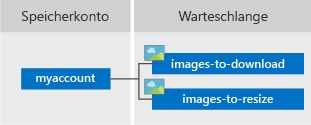

# <a name="quickstart-azure-queue-storage-client-library-v12-for-java"></a>Schnellstart: Azure Queue Storage-Clientbibliothek v12 für Java

Beginnen Sie mit dem Einsatz der Azure Queue Storage-Clientbibliothek v12 für Java. Azure Queue Storage ist ein Dienst für die Speicherung einer großen Anzahl von Nachrichten, die später abgerufen und verarbeitet werden. Führen Sie die nachfolgenden Schritte aus, um das Paket zu installieren und den Beispielcode für grundlegende Aufgaben zu testen.

Mit der Azure Queue Storage-Clientbibliothek v12 für Java können Sie Folgendes ausführen:

* Erstellen einer Warteschlange
* Hinzufügen von Nachrichten zu einer Warteschlange
* Einsehen von Nachrichten in einer Warteschlange
* Aktualisieren einer Nachricht in einer Warteschlange
* Empfangen und Löschen von Nachrichten aus einer Warteschlange
* Löschen einer Warteschlange

Zusätzliche Ressourcen:

* [API-Referenzdokumentation](/java/api/overview/azure/storage-queue-readme)
* [Quellcode der Bibliothek](https://github.com/Azure/azure-sdk-for-java/tree/master/sdk/storage/azure-storage-queue)
* [Maven-Paket](https://mvnrepository.com/artifact/com.azure/azure-storage-queue)
* [Beispiele](../common/storage-samples-java.md?toc=%252fazure%252fstorage%252fqueues%252ftoc.json#queue-samples)

## <a name="prerequisites"></a>Voraussetzungen

* [Java Development Kit (JDK)](/java/azure/jdk/), Version 8 oder höher
* [Apache Maven](https://maven.apache.org/download.cgi)
* Azure-Abonnement – [Erstellen eines kostenlosen Kontos](https://azure.microsoft.com/free/)
* Azure Storage-Konto – [Erstellen eines Speicherkontos](../common/storage-account-create.md)

## <a name="setting-up"></a>Einrichten

In diesem Abschnitt wird beschrieben, wie Sie ein Projekt zur Verwendung mit der Azure Queue Storage-Clientbibliothek v12 für Java vorbereiten.

### <a name="create-the-project"></a>Erstellen des Projekts

Erstellen Sie eine Java-Anwendung mit dem Namen *queues-quickstart-v12* .

1. Verwenden Sie Maven in einem Konsolenfenster (z. B. der Befehlszeile, PowerShell oder Bash), um eine neue Konsolen-App mit dem Namen *queues-quickstart-v12* zu erstellen. Geben Sie den folgenden **mvn** -Befehl ein, um ein „Hallo Welt!“ -Java-Projekt zu erstellen.

   ```console
   mvn archetype:generate -DgroupId=com.queues.quickstart \
                          -DartifactId=queues-quickstart-v12 \
                          -DarchetypeArtifactId=maven-archetype-quickstart \
                          -DarchetypeVersion=1.4 \
                          -DinteractiveMode=false
   ```

1. Die Ausgabe der Erstellung des Projekts sollte in etwa wie folgt aussehen:

    ```console
    [INFO] Scanning for projects...
    [INFO]
    [INFO] ------------------< org.apache.maven:standalone-pom >-------------------
    [INFO] Building Maven Stub Project (No POM) 1
    [INFO] --------------------------------[ pom ]---------------------------------
    [INFO]
    [INFO] >>> maven-archetype-plugin:3.1.2:generate (default-cli) > generate-sources @ standalone-pom >>>
    [INFO]
    [INFO] <<< maven-archetype-plugin:3.1.2:generate (default-cli) < generate-sources @ standalone-pom <<<
    [INFO]
    [INFO]
    [INFO] --- maven-archetype-plugin:3.1.2:generate (default-cli) @ standalone-pom ---
    [INFO] Generating project in Batch mode
    [INFO] ----------------------------------------------------------------------------
    [INFO] Using following parameters for creating project from Archetype: maven-archetype-quickstart:1.4
    [INFO] ----------------------------------------------------------------------------
    [INFO] Parameter: groupId, Value: com.queues.quickstart
    [INFO] Parameter: artifactId, Value: queues-quickstart-v12
    [INFO] Parameter: version, Value: 1.0-SNAPSHOT
    [INFO] Parameter: package, Value: com.queues.quickstart
    [INFO] Parameter: packageInPathFormat, Value: com/queues/quickstart
    [INFO] Parameter: version, Value: 1.0-SNAPSHOT
    [INFO] Parameter: package, Value: com.queues.quickstart
    [INFO] Parameter: groupId, Value: com.queues.quickstart
    [INFO] Parameter: artifactId, Value: queues-quickstart-v12
    [INFO] Project created from Archetype in dir: C:\quickstarts\queues\queues-quickstart-v12
    [INFO] ------------------------------------------------------------------------
    [INFO] BUILD SUCCESS
    [INFO] ------------------------------------------------------------------------
    [INFO] Total time:  6.394 s
    [INFO] Finished at: 2019-12-03T09:58:35-08:00
    [INFO] ------------------------------------------------------------------------
    ```

1. Wechseln Sie zum neu erstellten Verzeichnis *queues-quickstart-v12* .

   ```console
   cd queues-quickstart-v12
   ```

### <a name="install-the-package"></a>Installieren des Pakets

Öffnen Sie die Datei *pom.xml* in Ihrem Text-Editor. Fügen Sie der Gruppe „dependencies“ das folgende Abhängigkeitselement hinzu.

```xml
<dependency>
  <groupId>com.azure</groupId>
  <artifactId>azure-storage-queue</artifactId>
  <version>12.0.1</version>
</dependency>
```

### <a name="set-up-the-app-framework"></a>Einrichten des App-Frameworks

Über das Projektverzeichnis:

1. Navigieren Sie zum Verzeichnis */src/main/java/com/queues/quickstart* .
1. Öffnen Sie die Datei *App.java* im Editor.
1. Löschen Sie die Anweisung `System.out.println("Hello world!");`.
1. Fügen Sie Anweisungen vom Typ `import` hinzu.

Der Code lautet wie folgt:

```java
package com.queues.quickstart;

/**
 * Azure queue storage v12 SDK quickstart
 */
import com.azure.storage.queue.*;
import com.azure.storage.queue.models.*;
import java.io.*;
import java.time.*;

public class App
{
    public static void main( String[] args ) throws IOException
    {
    }
}
```

[!INCLUDE [storage-quickstart-credentials-include](../../../includes/storage-quickstart-credentials-include.md)]

## <a name="object-model"></a>Objektmodell

Azure Queue Storage ist ein Dienst für die Speicherung einer großen Anzahl von Nachrichten. Eine Warteschlangennachricht kann bis zu 64 KB groß sein. Eine Warteschlange kann Millionen Nachrichten enthalten, bis die maximale Kapazität eines Speicherkontos erreicht ist. Warteschlangen werden häufig verwendet, um ein Arbeits-Backlog zur asynchronen Verarbeitung zu erstellen. Queue Storage bietet drei Arten von Ressourcen:

* Das Speicherkonto
* Eine Warteschlange im Speicherkonto
* Nachrichten in der Warteschlange

Im folgenden Diagramm ist die Beziehung zwischen diesen Ressourcen dargestellt.



Verwenden Sie die folgenden Java-Klassen zur Interaktion mit folgenden Ressourcen:

* [QueueClientBuilder](/java/api/com.azure.storage.queue.queueclientbuilder): Die `QueueClientBuilder`-Klasse konfiguriert und instanziiert ein `QueueClient`-Objekt.
* [QueueServiceClient](/java/api/com.azure.storage.queue.queueserviceclient): Mit dem `QueueServiceClient` können Sie alle Warteschlangen in Ihrem Speicherkonto verwalten.
* [QueueClient](/java/api/com.azure.storage.queue.queueclient): Mit der `QueueClient`-Klasse können Sie eine einzelne Warteschlange und die darin enthaltenen Nachrichten verwalten und bearbeiten.
* [QueueMessageItem](/java/api/com.azure.storage.queue.models.queuemessageitem): Die `QueueMessageItem`-Klasse repräsentiert die einzelnen Objekte, die beim Aufrufen von [receiveMessages](/java/api/com.azure.storage.queue.queueclient.receivemessages) in einer Warteschlange zurückgegeben werden.

## <a name="code-examples"></a>Codebeispiele

Diese Beispielcodeausschnitte veranschaulichen, wie folgende Vorgänge mit der Azure Queue Storage-Clientbibliothek für Java ausgeführt werden:

* [Abrufen der Verbindungszeichenfolge](#get-the-connection-string)
* [Erstellen einer Warteschlange](#create-a-queue)
* [Hinzufügen von Nachrichten zu einer Warteschlange](#add-messages-to-a-queue)
* [Einsehen von Nachrichten in einer Warteschlange](#peek-at-messages-in-a-queue)
* [Aktualisieren einer Nachricht in einer Warteschlange](#update-a-message-in-a-queue)
* [Empfangen und Löschen von Nachrichten aus einer Warteschlange](#receive-and-delete-messages-from-a-queue)
* [Löschen einer Warteschlange](#delete-a-queue)

### <a name="get-the-connection-string"></a>Abrufen der Verbindungszeichenfolge

Der unten gezeigte Code ruft die Verbindungszeichenfolge für das Speicherkonto ab. Die Verbindungszeichenfolge ist in der Umgebungsvariable gespeichert, die Sie im Abschnitt [Konfigurieren der Speicherverbindungszeichenfolge](#configure-your-storage-connection-string) erstellt haben.

Fügen Sie diesen Code in der `main`-Methode hinzu:

```java
System.out.println("Azure Queues storage v12 - Java quickstart sample\n");

// Retrieve the connection string for use with the application. The storage
// connection string is stored in an environment variable on the machine
// running the application called AZURE_STORAGE_CONNECTION_STRING. If the environment variable
// is created after the application is launched in a console or with
// Visual Studio, the shell or application needs to be closed and reloaded
// to take the environment variable into account.
String connectStr = System.getenv("AZURE_STORAGE_CONNECTION_STRING");
```

### <a name="create-a-queue"></a>Erstellen einer Warteschlange

Legen Sie einen Namen für die neue Warteschlange fest. Der folgende Code hängt einen GUID-Wert an den Warteschlangennamen an, damit dieser eindeutig ist.

> [!IMPORTANT]
> Warteschlangennamen dürfen nur Kleinbuchstaben, Ziffern und Bindestriche enthalten und müssen mit einem Buchstaben oder einer Ziffer beginnen. Vor und nach jedem Bindestrich muss ein Zeichen stehen, das kein Bindestrich ist. Der Name muss außerdem zwischen 3 und 63 Zeichen lang sein. Weitere Informationen zum Benennen von Warteschlangen finden Sie unter [Benennen von Warteschlangen und Metadaten](/rest/api/storageservices/naming-queues-and-metadata).


Erstellen Sie eine Instanz der [QueueClient](/java/api/com.azure.storage.queue.queueclient)-Klasse. Rufen Sie dann die [create](/java/api/com.azure.storage.queue.queueclient.create)-Methode auf, um die Warteschlange in Ihrem Speicherkonto zu erstellen.

Fügen Sie diesen Code am Ende der `main`-Methode hinzu:

```java
// Create a unique name for the queue
String queueName = "quickstartqueues-" + java.util.UUID.randomUUID();

System.out.println("Creating queue: " + queueName);

// Instantiate a QueueClient which will be
// used to create and manipulate the queue
QueueClient queueClient = new QueueClientBuilder()
                                .connectionString(connectStr)
                                .queueName(queueName)
                                .buildClient();

// Create the queue
queueClient.create();
```

### <a name="add-messages-to-a-queue"></a>Hinzufügen von Nachrichten zu einer Warteschlange

Der folgende Codeausschnitt fügt der Warteschlange durch Aufrufen der [sendMessage](/java/api/com.azure.storage.queue.queueclient.sendmessage)-Methode Nachrichten hinzu. Darüber hinaus wird ein [SendMessageResult](/java/api/com.azure.storage.queue.models.sendmessageresult) gespeichert, das von einem `sendMessage`-Aufruf zurückgegeben wird. Das Ergebnis wird später im Programm zum Aktualisieren der Nachricht verwendet.

Fügen Sie diesen Code am Ende der `main`-Methode hinzu:

```java
System.out.println("\nAdding messages to the queue...");

// Send several messages to the queue
queueClient.sendMessage("First message");
queueClient.sendMessage("Second message");

// Save the result so we can update this message later
SendMessageResult result = queueClient.sendMessage("Third message");
```

### <a name="peek-at-messages-in-a-queue"></a>Einsehen von Nachrichten in einer Warteschlange

Durch Aufrufen der [peekMessages](/java/api/com.azure.storage.queue.queueclient.peekmessages)-Methode können Sie die Nachrichten in der Warteschlange einsehen. Die `peelkMessages`-Methode ruft mindestens eine Nachricht vom Anfang der Warteschlange ab, ändert aber nicht die Sichtbarkeit der Nachricht.

Fügen Sie diesen Code am Ende der `main`-Methode hinzu:

```java
System.out.println("\nPeek at the messages in the queue...");

// Peek at messages in the queue
queueClient.peekMessages(10, null, null).forEach(
    peekedMessage -> System.out.println("Message: " + peekedMessage.getMessageText()));
```

### <a name="update-a-message-in-a-queue"></a>Aktualisieren einer Nachricht in einer Warteschlange

Aktualisieren Sie den Inhalt einer Nachricht, indem Sie die [updateMessage](/java/api/com.azure.storage.queue.queueclient.updatemessage)-Methode aufrufen. Die `updateMessage`-Methode kann das Sichtbarkeitstimeout und den Inhalt einer Nachricht ändern. Beim Nachrichteninhalt muss es sich um eine UTF-8-codierte Zeichenfolge handeln, die bis zu 64 KB groß sein darf. Übergeben Sie die Nachrichten-ID und die pop-Bestätigung zusammen mit dem neuen Inhalt für die Nachricht mithilfe des weiter oben im Code gespeicherten `SendMessageResult`-Objekts. Die Nachrichten-ID und die pop-Bestätigung identifizieren die Nachricht, die aktualisiert werden soll.

```java
System.out.println("\nUpdating the third message in the queue...");

// Update a message using the result that
// was saved when sending the message
queueClient.updateMessage(result.getMessageId(),
                          result.getPopReceipt(), 
                          "Third message has been updated",
                          Duration.ofSeconds(1));
```

### <a name="receive-and-delete-messages-from-a-queue"></a>Empfangen und Löschen von Nachrichten aus einer Warteschlange

Laden Sie zuvor hinzugefügte Nachrichten durch Aufrufen der [receiveMessages](/java/api/com.azure.storage.queue.queueclient.receivemessages)-Methode herunter. Der Beispielcode löscht auch Nachrichten aus der Warteschlange, nachdem sie empfangen und verarbeitet wurden. In diesem Fall besteht die Verarbeitung nur darin, dass die Nachricht in der Konsole angezeigt wird.

Die App wird angehalten und wartet auf Benutzereingaben, indem `System.console().readLine();` aufgerufen wird, bevor die Nachrichten empfangen und gelöscht werden. Überprüfen Sie im [Azure-Portal](https://portal.azure.com), ob die Ressourcen ordnungsgemäß erstellt wurden, bevor sie gelöscht werden. Alle Nachrichten, die nicht explizit gelöscht werden, werden schlussendlich wieder in der Warteschlange angezeigt und ggf. erneut verarbeitet.

Fügen Sie diesen Code am Ende der `main`-Methode hinzu:

```java
System.out.println("\nPress Enter key to receive messages and delete them from the queue...");
System.console().readLine();

// Get messages from the queue
queueClient.receiveMessages(10).forEach(
    // "Process" the message
    receivedMessage -> {
        System.out.println("Message: " + receivedMessage.getMessageText());

        // Let the service know we're finished with
        // the message and it can be safely deleted.
        queueClient.deleteMessage(receivedMessage.getMessageId(), receivedMessage.getPopReceipt());
    }
);
```

### <a name="delete-a-queue"></a>Löschen einer Warteschlange

Der folgende Code bereinigt die von der App erstellten Ressourcen, indem die Warteschlange mithilfe der [delete](/java/api/com.azure.storage.queue.queueclient.delete)-Methode gelöscht wird.

Fügen Sie diesen Code am Ende der `main`-Methode hinzu:

```java
System.out.println("\nPress Enter key to delete the queue...");
System.console().readLine();

// Clean up
System.out.println("Deleting queue: " + queueClient.getQueueName());
queueClient.delete();

System.out.println("Done");
```

## <a name="run-the-code"></a>Ausführen des Codes

Diese App erstellt drei Nachrichten und fügt sie einer Azure-Warteschlange hinzu. Der Code listet die Nachrichten in der Warteschlange auf, ruft sie ab und löscht sie, bevor er letztendlich die Warteschlange löscht.

Navigieren Sie im Konsolenfenster zu Ihrem Anwendungsverzeichnis, erstellen Sie die Anwendung, und führen Sie sie aus.

```console
mvn compile
```

Erstellen Sie dann das Paket.

```console
mvn package
```

Führen Sie die App mit dem folgenden `mvn`-Befehl aus.

```console
mvn exec:java -Dexec.mainClass="com.queues.quickstart.App" -Dexec.cleanupDaemonThreads=false
```

Die Ausgabe der App sieht etwa wie das folgende Beispiel aus:

```output
Azure Queues storage v12 - Java quickstart sample

Adding messages to the queue...

Peek at the messages in the queue...
Message: First message
Message: Second message
Message: Third message

Updating the third message in the queue...

Press Enter key to receive messages and delete them from the queue...

Message: First message
Message: Second message
Message: Third message has been updated

Press Enter key to delete the queue...

Deleting queue: quickstartqueues-fbf58f33-4d5a-41ac-ac0e-1a05d01c7003
Done
```

Wenn die App vor dem Empfangen von Nachrichten angehalten wird, überprüfen Sie Ihr Speicherkonto im [Azure-Portal](https://portal.azure.com). Überprüfen Sie, ob sich in der Warteschlange Nachrichten befinden.

Drücken Sie die **EINGABETASTE** , um Nachrichten zu empfangen und zu löschen. Wenn Sie dazu aufgefordert werden, drücken Sie erneut die **EINGABETASTE** , um die Warteschlange zu löschen und die Demo zu beenden.

## <a name="next-steps"></a>Nächste Schritte

In dieser Schnellstartanleitung haben Sie gelernt, wie Sie mithilfe von Java-Code eine Warteschlange erstellen und dieser Nachrichten hinzufügen. Danach haben Sie erfahren, wie Sie Nachrichten einsehen, abrufen und löschen. Zum Schluss haben Sie gelernt, wie Sie eine Nachrichtenwarteschlange löschen.

Tutorials, Beispiele, Schnellstartanleitungen und weiteres Dokumentationsmaterial finden Sie hier:

> [!div class="nextstepaction"]
> [Azure für Java-Cloudentwickler](/azure/developer/java/)

* Weitere Beispiel-Apps für Azure Queue Storage finden Sie bei den [
Beispielen für die Azure Queue Storage SDK-Clientbibliothek v12 für Java](https://github.com/Azure/azure-sdk-for-java/tree/master/sdk/storage/azure-storage-queue/src/samples/java/com/azure/storage/queue).