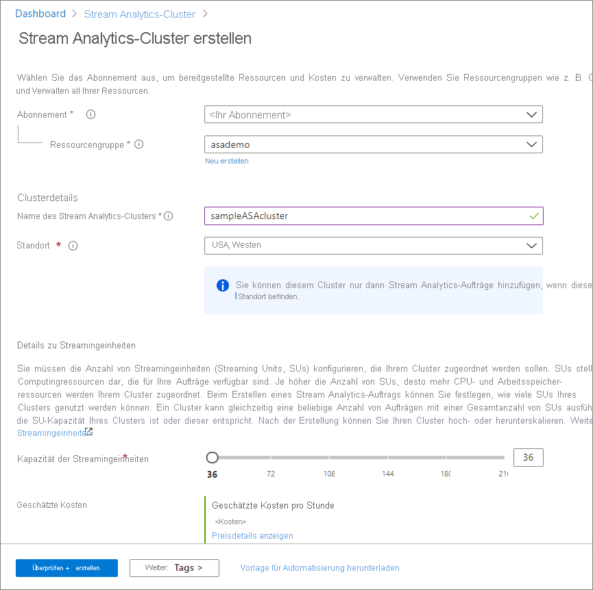

# Schnellstart: Erstellen eines dedizierten Azure Stream Analytics-Clusters mithilfe des Azure-Portals

Verwenden Sie das Azure-Portal, um einen Azure Stream Analytics-Cluster zu erstellen. Ein [Stream Analytics-Cluster](cluster-overview.md) ist eine Bereitstellung mit nur einem Mandanten, die für komplexe und anspruchsvolle Streamingverwendungsfälle genutzt werden kann. Sie können mehrere Stream Analytics-Aufträge in einem Stream Analytics-Cluster ausführen.

## Voraussetzungen

* Ein Azure-Konto mit einem aktiven Abonnement. Sie können [kostenlos ein Konto erstellen](https://azure.microsoft.com/free/?WT.mc_id=A261C142F).
* Abschluss von [Schnellstart: Erstellen eines Stream Analytics-Auftrags mithilfe des Azure-Portals](stream-analytics-quick-create-portal.md).

## Erstellen eines Stream Analytics-Clusters

In diesem Abschnitt erstellen Sie eine Stream Analytics-Clusterressource.

1. Melden Sie sich beim [Azure-Portal](https://portal.azure.com) an.

1. Wählen Sie **Ressource erstellen**. Geben Sie im Suchfeld *Marketplace durchsuchen* **Stream Analytics-Cluster** ein, und wählen Sie die Option aus. Wählen Sie anschließend **Hinzufügen**.

   :::image type="content" source="./media/create-cluster/search-result.png" alt-text="Suchergebnis zu Stream Analytics-Cluster":::

1. Geben Sie auf der Seite **Stream Analytics-Cluster erstellen** die grundlegenden Einstellungen für Ihren neuen Cluster ein.

   |Einstellung|Wert|Beschreibung |
   |---|---|---|
   |Subscription|Abonnementname|Wählen Sie das Azure-Abonnement aus, das Sie für diesen Stream Analytics-Cluster verwenden möchten. |
   |Ressourcengruppe|Ressourcengruppenname|Wählen Sie eine Ressourcengruppe aus, oder wählen Sie **Neu erstellen** aus, und geben Sie einen eindeutigen Namen für die Ressourcengruppe ein. |
   |Clustername|Ein eindeutiger Name|Geben Sie einen Namen zur Identifizierung des Stream Analytics-Clusters ein.|
   |Ort|Die Region, die Ihren Datenquellen und Senken am nächsten ist|Wählen Sie den geografischen Standort aus, in dem Sie Ihren Stream Analytics-Cluster hosten möchten. Verwenden Sie den Standort, der Ihren Datenquellen und Senken am nächsten liegt, um Analysen mit geringer Latenz zu verwenden.|
   |Kapazität der Streamingeinheit|36 bis 216 |Bestimmen Sie die Größe des Clusters, indem Sie einschätzen, wie viele Stream Analytics-Aufträge ausgeführt werden sollen und wie viele SUs der Auftrag benötigt. Sie können mit 36 SUs beginnen und später nach Bedarf zentral hoch- oder herunterskalieren.|

   

1. Klicken Sie auf **Überprüfen + erstellen**. Sie können den Abschnitt **Tags** überspringen.

1. Überprüfen Sie die Clustereinstellungen, und wählen Sie anschließend **Erstellen** aus. Die Clustererstellung ist ein zeitintensiver Vorgang und dauert ungefähr 60 Minuten. Warten Sie, bis auf der Portalseite **Ihre Bereitstellung wurde abgeschlossen.** angezeigt wird. In der Zwischenzeit können Sie [Stream Analytics-Aufträge](stream-analytics-quick-create-portal.md#create-a-stream-analytics-job) erstellen und entwickeln, die Sie auf diesem Cluster ausführen möchten, sofern noch nicht geschehen.

1. Wählen Sie **Zu Ressource wechseln** aus, um zur Seite „Stream Analytics-Cluster“ zu wechseln.

## Löschen des Clusters

Sie können Ihren Stream Analytics-Cluster löschen, wenn Sie keine Stream Analytics-Aufträge darauf ausführen möchten. Löschen Sie den Cluster mithilfe der folgenden Schritte im Azure-Portal:

1. Wechseln Sie zu **Stream Analytics-Aufträge** unter **Einstellungen**, und beenden Sie alle Aufträge, die ausgeführt werden.

1. Wechseln Sie zur **Übersicht** Ihres Clusters. Wählen Sie **Löschen** aus, und befolgen Sie die Anweisungen zum Löschen Ihres Clusters.

## Nächste Schritte

In dieser Schnellstartanleitung wurde beschrieben, wie Sie einen Azure Stream Analytics-Cluster erstellen. Fahren Sie mit dem nächsten Artikel fort, um zu erfahren, wie Sie einen Stream Analytics -Auftrag in Ihrem Cluster ausführen:

> [!div class="nextstepaction"]
> [Verwalten von Stream Analytics-Aufträgen in einem Stream Analytics-Cluster](manage-jobs-cluster.md)
