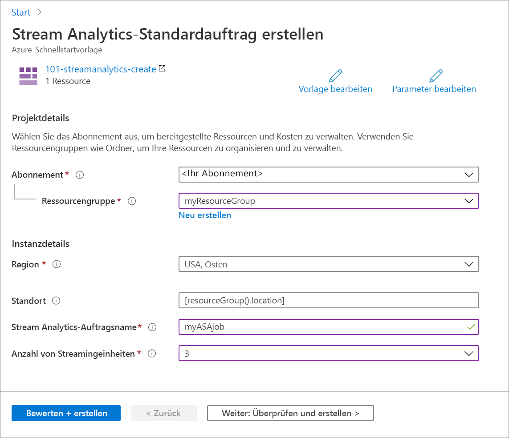

# <a name="quickstart-create-an-azure-stream-analytics-job-by-using-an-arm-template"></a>Schnellstart: Erstellen eines Azure Stream Analytics-Auftrags mithilfe einer ARM-Vorlage

In dieser Schnellstartanleitung verwenden Sie eine Azure Resource Manager-Vorlage (ARM-Vorlage), um einen Azure Stream Analytics-Auftrag zu erstellen. Nachdem der Auftrag erstellt wurde, überprüfen Sie die Bereitstellung.

[!INCLUDE [About Azure Resource Manager](../../includes/resource-manager-quickstart-introduction.md)]

Wenn Ihre Umgebung die Voraussetzungen erfüllt und Sie mit der Verwendung von ARM-Vorlagen vertraut sind, klicken Sie auf die Schaltfläche **In Azure bereitstellen**. Die Vorlage wird im Azure-Portal geöffnet.

[](https://portal.azure.com/#create/Microsoft.Template/uri/https%3A%2F%2Fraw.githubusercontent.com%2FAzure%2Fazure-quickstart-templates%2Fmaster%2F101-streamanalytics-create%2Fazuredeploy.json)

## <a name="prerequisites"></a>Voraussetzungen

Damit Sie die Anweisungen in diesem Artikel ausführen können, benötigen Sie Folgendes:

* Ein Azure-Abonnement ([kostenloses Abonnement erstellen](https://azure.microsoft.com/free/)).

## <a name="review-the-template"></a>Überprüfen der Vorlage

Die in dieser Schnellstartanleitung verwendete Vorlage stammt von der Seite mit den [Azure-Schnellstartvorlagen](https://azure.microsoft.com/resources/templates/101-streamanalytics-create/).

:::code language="json" source="~/quickstart-templates/101-streamanalytics-create/azuredeploy.json":::

Die in der Vorlage definierte Azure-Ressource ist [Microsoft.StreamAnalytics/StreamingJobs](/azure/templates/microsoft.streamanalytics/streamingjobs): Erstellen eines Azure Stream Analytics-Auftrags.

## <a name="deploy-the-template"></a>Bereitstellen der Vorlage

In diesem Abschnitt erstellen Sie mithilfe der ARM-Vorlage einen Azure Stream Analytics-Auftrag.

1. Klicken Sie auf das folgende Bild, um sich bei Azure anzumelden und eine Vorlage zu öffnen. Die Vorlage erstellt einen Azure Stream Analytics-Auftrag.

   [](https://portal.azure.com/#create/Microsoft.Template/uri/https%3A%2F%2Fraw.githubusercontent.com%2FAzure%2Fazure-quickstart-templates%2Fmaster%2F101-streamanalytics-create%2Fazuredeploy.json)

2. Geben Sie die erforderlichen Werte für die Erstellung Ihres Azure Stream Analytics-Auftrags an.

   

   Geben Sie außerdem die folgenden Werte an:

   |Eigenschaft  |BESCHREIBUNG  |
   |---------|---------|
   |**Abonnement**     | Wählen Sie in der Dropdownliste Ihr Azure-Abonnement aus.        |
   |**Ressourcengruppe**     | Geben Sie an, ob Sie eine neue Ressourcengruppe erstellen oder eine vorhandene Ressourcengruppe verwenden möchten. Eine Ressourcengruppe ist ein Container, der verwandte Ressourcen für eine Azure-Lösung enthält. Weitere Informationen finden Sie in der [Übersicht über den Azure Resource Manager](../azure-resource-manager/management/overview.md). |
   |**Region**     | Wählen Sie **USA, Osten** aus. Informationen zu weiteren verfügbaren Regionen finden Sie unter [Verfügbare Produkte nach Region](https://azure.microsoft.com/regions/services/).        |
   |**Stream Analytics-Auftragsname**     | Geben Sie einen Namen für Ihren Stream Analytics-Auftrag an.      |
   |**Anzahl von Streamingeinheiten**     |  Wählen Sie die Anzahl Ihrer benötigten Streamingeinheiten aus. Weitere Informationen finden Sie unter [Überblick über Streamingeinheiten und Informationen zu Anpassungen](stream-analytics-streaming-unit-consumption.md).       |

3. Wählen Sie **Überprüfen + erstellen** und danach **Erstellen** aus.

## <a name="review-deployed-resources"></a>Überprüfen der bereitgestellten Ressourcen

Sie können entweder das Azure-Portal nutzen, um den Azure Stream Analytics-Auftrag zu überprüfen, oder das unten angegebene Azure CLI- oder Azure PowerShell-Skript, um die Ressource aufzulisten.

### <a name="azure-cli"></a>Azure CLI

```azurecli-interactive
echo "Enter your Azure Stream Analytics job name:" &&
read streamAnalyticsJobName &&
echo "Enter the resource group where the Azure Stream Analytics job exists:" &&
read resourcegroupName &&
az stream-analytics job show -g $resourcegroupName -n $streamAnalyticsJobName
```

### <a name="azure-powershell"></a>Azure PowerShell

```azurepowershell-interactive
$resourceGroupName = Read-Host -Prompt "Enter the resource group name where your Azure Stream Analytics job exists"
(Get-AzResource -ResourceType "Microsoft.StreamAnalytics/StreamingJobs" -ResourceGroupName $resourceGroupName).Name
 Write-Host "Press [ENTER] to continue..."
```

## <a name="clean-up-resources"></a>Bereinigen von Ressourcen

Falls Sie mit weiteren Tutorials fortfahren möchten, empfiehlt es sich ggf., diese Ressourcen nicht zu bereinigen. Wenn Sie die Ressourcen nicht mehr benötigen, löschen Sie die Ressourcengruppe. Dadurch wird auch der Azure Stream Analytics-Auftrag gelöscht. Die Ressourcengruppe kann über die Azure-Befehlszeilenschnittstelle oder mithilfe von Azure PowerShell gelöscht werden:

### <a name="azure-cli"></a>Azure CLI

```azurecli-interactive
echo "Enter the Resource Group name:" &&
read resourceGroupName &&
az group delete --name $resourceGroupName &&
echo "Press [ENTER] to continue ..."
```

### <a name="azure-powershell"></a>Azure PowerShell

```azurepowershell-interactive
$resourceGroupName = Read-Host -Prompt "Enter the Resource Group name"
Remove-AzResourceGroup -Name $resourceGroupName
Write-Host "Press [ENTER] to continue..."
```

## <a name="next-steps"></a>Nächste Schritte

In dieser Schnellstartanleitung haben Sie mithilfe einer ARM-Vorlage einen Azure Stream Analytics-Auftrag erstellt und die Bereitstellung überprüft. Fahren Sie mit dem nächsten Artikel fort, um zu erfahren, wie Sie eine ARM-Vorlage für einen vorhandenen Auftrag mithilfe von VS Code exportieren.

> [!div class="nextstepaction"]
> [Exportieren einer ARM-Vorlage für einen Azure Stream Analytics-Auftrag](resource-manager-export.md)
