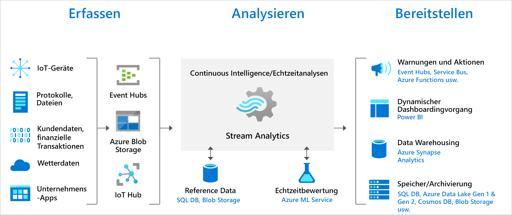

# Was ist Azure Stream Analytics?

Azure Stream Analytics ist eine Engine für Analysen in Echtzeit und die Verarbeitung komplexer Ereignisse, die entwickelt wurde, um große Mengen schneller Streamingdaten aus mehreren Quellen gleichzeitig zu analysieren und zu verarbeiten. In Informationen aus einer Reihe von Eingabequellen wie Geräten, Sensoren, Clickstreams, Feeds sozialer Medien und Anwendungen können Muster und Beziehungen identifiziert werden. Diese Muster können verwendet werden, Aktionen und Workflows wie das Erstellen von Warnungen, das Senden von Informationen per Feed an ein Berichterstellungstool oder das Speichern transformierter Informationen zur späteren Verwendung auszulösen. Außerdem ist Stream Analytics in der Azure IoT Edge-Laufzeit verfügbar, wo es die Verarbeitung von Daten auf IoT-Geräten ermöglicht. 

Die folgenden Szenarien sind Beispiele für Situationen, in denen Azure Stream Analytics verwenden werden kann:

* Analysieren von Telemetriedatenströmen von IoT-Geräten in Echtzeit
* Analyse von Webprotokollen/Clickstreams
* Geoanalysen für das Flottenmanagement und fahrerlose Fahrzeuge
* Remoteüberwachung und Predictive Maintenance für Objekte mit hohem Wert
* Echtzeitanalysen von POS-Daten (Point of Sale) für die Bestandskontrolle und Anomalieerkennung

## Funktionsweise von Stream Analytics

Ein Azure Stream Analytics-Auftrag besteht aus einer Eingabe, Abfrage und Ausgabe. Stream Analytics erfasst Daten aus Azure Event Hubs (einschließlich Azure Event Hubs von Apache Kafka), Azure IoT Hub oder Azure Blob Storage. Mit der Abfrage, die auf SQL (Structured Query Language) basiert, können Streamingdaten über einen bestimmten Zeitraum einfach gefiltert, sortiert, aggregiert und verknüpft werden. Sie können diese SQL-Sprache auch mit JavaScript und benutzerdefinierten C#-Funktionen (UDFs) erweitern. Sie können die Optionen für die Ereignisreihenfolge und die Dauer der Zeitfenster bei der Durchführung von Aggregationsvorgängen mithilfe einfacher Sprachkonstrukte und/oder Konfigurationen einfach anpassen.

Zu jedem Auftrag gehören eine oder mehrere Ausgaben für die transformierten Daten. Sie können die Reaktion auf die analysierten Informationen steuern. Beispielsweise können Sie folgende Aktionen ausführen:

* Senden von Daten an Dienste wie Azure Functions, Service Bus Topics oder Queues, um Kommunikation oder benutzerdefinierte Workflows nachgelagert auszulösen.
* Senden von Daten an ein Power BI-Dashboard für die Echtzeitvisualisierung
* Speichern von Daten in anderen Azure Storage-Diensten (z. B. Azure Data Lake, Azure Synapse Analytics usw.) zum Trainieren eines Machine Learning-Modells basierend auf Verlaufsdaten oder zum Durchführen von Batchanalysen.

In der folgenden Abbildung ist zu sehen, wie Daten an Stream Analytics gesendet, analysiert und für andere Aktionen wie Speicherung oder Darstellung weitergeleitet werden:

## Wichtige Funktionen und Vorteile

Azure Stream Analytics ist benutzerfreundlich, flexibel, zuverlässig und auf jede Auftragsgröße skalierbar. Dieses Modul steht übergreifend für mehrere Azure-Regionen zur Verfügung. In der folgenden Abbildung sind die wichtigsten Funktionen von Azure Stream Analytics dargestellt:

## Einfacher Einstieg

Der Einstieg in Azure Stream Analytics ist einfach. Es sind nur wenige Klicks erforderlich, um eine Verbindung mit mehreren Quellen oder Senken herzustellen und so eine End-to-End-Pipeline zu erstellen. Stream Analytics kann Verbindungen mit [Azure Event Hubs](/azure/event-hubs/) und [Azure IoT Hub](/azure/iot-hub/) zur Datenstromerfassung und mit [Azure Blob Storage](/azure/storage/common/storage-introduction) zur Erfassung von Verlaufsdaten herstellen. Die Auftragseingabe kann auch statische oder langsam veränderliche Referenzdaten von Azure Blob Storage oder [SQL-Datenbank](stream-analytics-use-reference-data.md#azure-sql-database) enthalten, die Sie mit Streamingdaten verknüpfen können, um Suchvorgänge durchzuführen.

Stream Analytics kann Auftragsausgaben an viele Speichersysteme leiten, z.B. [Azure Blob Storage](/azure/storage/common/storage-introduction), [Azure SQL-Datenbank](/azure/sql-database/), [Azure Data Lake Storage](/azure/data-lake-store/) und [Azure Cosmos DB](/azure/cosmos-db/introduction). Sie können Batchanalysen für gespeicherte Ausgaben mit Azure HDInsight ausführen oder die Ausgabe an einen anderen Dienst senden, z. B. Event Hubs zur Verarbeitung oder [Power BI](https://docs.microsoft.com/power-bi/) für Echtzeitvisualisierungen.

Die gesamte Liste von Stream Analytics-Ausgaben finden Sie unter [Grundlegendes zu den Ausgaben von Azure Stream Analytics](stream-analytics-define-outputs.md).

## Produktivität der Programmierer

Azure Stream Analytics verwendet eine einfache SQL-basierte Abfragesprache, die mit leistungsstarken zeitlichen Einschränkungen versehen wurde, um Daten während der Übertragung zu analysieren. Zum Definieren von Auftragstransformationen verwenden Sie eine einfache, deklarative [Stream Analytics-Abfragesprache](https://docs.microsoft.com/stream-analytics-query/stream-analytics-query-language-reference), mit der Sie komplexe temporale Abfragen und Analysen mithilfe von einfachen SQL-Konstrukten erstellen können. Da die Stream Analytics-Abfragesprache mit der SQL-Sprache konsistent ist, genügt die Vertrautheit mit SQL zum Erstellen von Aufträgen. Sie können Aufträge auch mit Entwicklertools wie Azure PowerShell, [Stream Analytics Visual Studio-Tools](stream-analytics-tools-for-visual-studio-install.md), der [Visual Studio Code-Erweiterung für Stream Analytics](quick-create-visual-studio-code.md) oder Azure Resource Manager-Vorlagen erstellen. Die Nutzung von Entwicklertools ermöglicht Ihnen die Offlineentwicklung von Transformationsabfragen und die Verwendung der [CI/CD-Pipeline](stream-analytics-tools-for-visual-studio-cicd.md) zum Übermitteln von Aufträgen an Azure.

Die Stream Analytics-Abfragesprache verfügt über viele verschiedene Funktionen zum Analysieren und Verarbeiten von Streamingdaten. Diese Abfragesprache unterstützt die einfache Datenbearbeitung, Aggregations- und Analysefunktionen, [räumliche Funktionen](https://docs.microsoft.com/azure/stream-analytics/stream-analytics-geospatial-functions), [Musterabgleich](https://docs.microsoft.com/stream-analytics-query/match-recognize-stream-analytics) und [Anomalieerkennung](https://docs.microsoft.com/azure/stream-analytics/stream-analytics-machine-learning-anomaly-detection). Sie können Abfragen im Portal bearbeiten und anhand von Stichprobendaten testen, die aus einem Livestream extrahiert werden.

Sie können die Funktionen der Abfragesprache erweitern, indem Sie zusätzliche Funktionen definieren und aufrufen. Sie können Funktionsaufrufe in Azure Machine Learning definieren, um Azure Machine Learning-Lösungen zu nutzen, und benutzerdefinierte JavaScript- oder C#-Funktionen oder benutzerdefinierte Aggregate integrieren, um im Rahmen einer Stream Analytics-Abfrage komplexe Berechnungen durchzuführen.

## Vollständige Verwaltung

Azure Stream Analytics ist ein vollständig verwaltetes serverloses Angebot (PaaS) in Azure. Sie müssen zum Ausführen Ihrer Aufträge weder Hardware bereitstellen noch Cluster verwalten oder das Betriebssystem oder andere Software aktualisieren. Azure Stream Analytics verwaltet Ihren Auftrag vollständig, sodass Sie sich auf Ihre Geschäftslogik konzentrieren können, nicht auf die Infrastruktur.

## Ausführung in der Cloud oder im Intelligent Edge-Bereich

Für umfangreiche Analysen kann Azure Stream Analytics in der Cloud ausgeführt werden, und für Analysen mit sehr niedriger Latenz ist die Ausführung auf IoT Edge möglich. Azure Stream Analytics verwendet in der Cloud und in Edge dieselben Tools und dieselbe Abfragesprache, sodass Entwickler echte Hybridarchitekturen für die Datenstromverarbeitung erstellen können. 

## Niedrige Gesamtkosten

Stream Analytics ist ein kostenoptimierter Clouddienst. Es fallen keine Anfangskosten an. Sie bezahlen nur für die [verbrauchten Streamingeinheiten](stream-analytics-streaming-unit-consumption.md). Es sind keine Mindestabnahme und keine Clusterbereitstellungen erforderlich, und Sie können den Auftrag basierend auf Ihren Geschäftsanforderungen hoch- oder herunterskalieren.

## Geeignet für unternehmenskritische Workloads

Azure Stream Analytics ist in mehreren Regionen auf der ganzen Welt verfügbar und dank seiner Zuverlässigkeit, Sicherheit und Compliance für die Ausführung unternehmenskritischer Workloads geeignet.

### Zuverlässigkeit

Für Azure Stream Analytics wird die Exactly-Once-Ereignisverarbeitung (genau einmal) und die At-Least-Once-Zustellung (mindestens einmal) von Ereignissen garantiert, sodass Ereignisse niemals verloren gehen. Die Exactly-Once-Verarbeitung wird mit ausgewählter Ausgabe garantiert, wie unter [Event Delivery Guarantees (Azure Stream Analytics)](/stream-analytics-query/event-delivery-guarantees-azure-stream-analytics) (Garantien zur Ereignisbereitstellung (Azure Stream Analytics)) beschrieben.

Azure Stream Analytics verfügt über integrierte Wiederherstellungsfunktionen für den Fall, dass für ein Ereignis ein Fehler auftritt. Stream Analytics verfügt außerdem über integrierte Prüfpunkte, um den Zustand Ihres Auftrags aufrecht zu erhalten und wiederholbare Ergebnisse zu liefern.

Als verwalteter Dienst wird für Stream Analytics eine Ereignisverarbeitung mit einer Verfügbarkeit von 99,9 % (minutengenau) garantiert. Weitere Informationen finden Sie auf der Seite [SLA für Stream Analytics](https://azure.microsoft.com/support/legal/sla/stream-analytics/v1_0/). 

### Sicherheit

Azure Stream Analytics verschlüsselt jegliche ein- und ausgehende Kommunikation und unterstützt TLS 1.2. Integrierte Prüfpunkte werden ebenfalls verschlüsselt. Die eingehenden Daten werden von Stream Analytics nicht gespeichert, da die gesamte Verarbeitung im Arbeitsspeicher stattfindet.

### Compliance

Azure Stream Analytics erfüllt die Anforderungen mehrerer Compliancezertifizierungen, wie in der [Übersicht über die Azure-Compliance](https://gallery.technet.microsoft.com/Overview-of-Azure-c1be3942) beschrieben. 

## Leistung

Stream Analytics kann pro Sekunde Millionen von Ereignissen verarbeiten und Ergebnisse mit äußerst kurzer Wartezeit liefern. Sie können vertikal und horizontal hochskalieren, um große Echtzeitanwendungen und komplexe Anwendungen für die Ereignisverarbeitung zu nutzen. Stream Analytics unterstützt eine höhere Leistung mittels Partitionierung, damit komplexe Abfragen parallelisiert und auf mehreren Streamingknoten ausgeführt werden können. Azure Stream Analytics basiert auf [Trill](https://github.com/Microsoft/Trill), einem Hochleistungsanalysemodul für In-Memory-Streaming, das in Zusammenarbeit mit der Forschungsabteilung von Microsoft entwickelt wurde.

## Nächste Schritte

Sie haben einen Überblick über Azure Stream Analytics erhalten. Nun können Sie tiefer einsteigen und Ihren ersten Stream Analytics-Auftrag erstellen:

* [Erstellen eines Stream Analytics-Auftrags mithilfe des Azure-Portals](stream-analytics-quick-create-portal.md)
* [Erstellen eines Stream Analytics-Auftrags mithilfe von Azure PowerShell](stream-analytics-quick-create-powershell.md)
* [Erstellen eines Stream Analytics-Auftrags mithilfe von Visual Studio](stream-analytics-quick-create-vs.md)
* [Erstellen eines Stream Analytics-Auftrags mithilfe von Visual Studio Code](quick-create-visual-studio-code.md)
