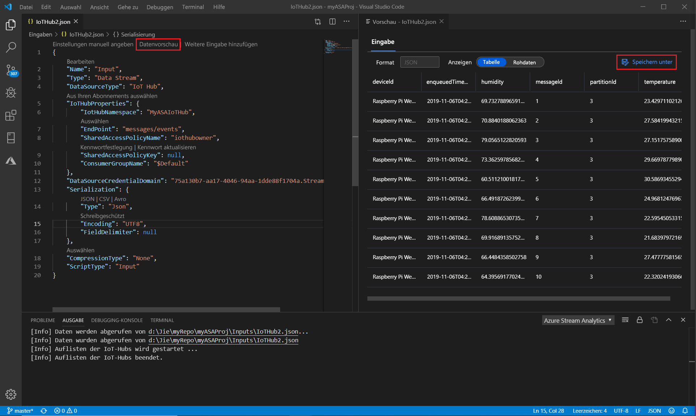

# Lokales Testen von Stream Analytics-Abfragen mit Beispieldaten mithilfe von Visual Studio Code

Mithilfe von Azure Stream Analytics-Tools für Visual Studio Code können Sie Ihre Stream Analytics-Aufträge lokal mit Beispieldaten testen. Sie finden die Abfrageergebnisse in JSON-Dateien im Ordner **LocalRunOutputs** des Projekts.

## Voraussetzungen

* Installieren Sie [.NET Core SDK](https://dotnet.microsoft.com/download), und starten Sie Visual Studio Code neu.

* In diesem [Schnellstarttutorial](quick-create-vs-code.md) erfahren Sie, wie ein Stream Analytics-Auftrags mithilfe von Visual Studio Code erstellt wird.

## Vorbereiten der Beispieldaten

Bereiten Sie zuerst Dateien mit Beispieldaten für die Eingabe vor. Wenn auf Ihrem Computer bereits Dateien mit Beispieldaten vorhanden sind, können Sie diesen Schritt überspringen und mit dem nächsten Schritt fortfahren.

1. Klicken Sie in der Eingabekonfigurationsdatei in der Zeile oben auf **Vorschau der Daten**. Es werden einige Eingabedaten aus dem IoT Hub abgerufen und im Vorschaufenster angezeigt. Dieser Vorgang kann einige Zeit in Anspruch nehmen.

2. Sobald die Daten angezeigt werden, klicken Sie auf **Speichern unter**, um die Daten in einer lokalen Datei zu speichern.

 

## Definieren einer lokalen Eingabe

1. Klicken Sie im Stream Analytics-Projekt im Ordner „Eingaben“ auf **input.json**. Wählen Sie dann aus der oberen Zeile **Lokale Eingabe hinzufügen** aus.

    

    Sie können auch **STRG+UMSCHALT+P** auswählen, um die Befehlspalette zu öffnen und **ASA einzugeben: Eingabe hinzufügen** ein.

   

2. Wählen Sie **Local Input** (Lokale Eingabe) aus.

    

3. Wählen Sie **+ New Local Input** (+ Neue lokale Eingabe) aus.

    

4. Geben Sie die gleichen Eingabealias ein, die Sie in Ihrer Abfrage verwendet haben.

    

5. Geben Sie in der neu generierten Datei **LocalInput_Input.json** den Dateipfad ein, in dem sich Ihre lokale Datendatei befindet.

    

6. Wählen Sie **Datenvorschau** aus, um eine Vorschau der Eingabedaten anzuzeigen. Der Serialisierungstyp für Ihre Daten wird automatisch erkannt, wenn es sich um JSON oder CSV handelt. Verwenden Sie die Auswahl, um Ihre Daten im **Tabellen**- oder **Roh**format anzuzeigen. Die folgende Tabelle ist ein Beispiel für Daten im **Tabellenformat**:

     

    Die folgende Tabelle ist ein Beispiel für Daten im **Rohformat**:

    

## Lokales Ausführen von Abfragen

Gehen Sie zurück zum Abfrage-Editor, und wählen Sie **Lokal ausführen** aus. Wählen Sie dann in der Dropdownliste **Lokale Eingabe verwenden** aus.

Das Ergebnis wird im Fenster rechts dargestellt. Klicken Sie zum erneuten Testen auf **Ausführen**. Sie können auch **In Ordner öffnen** auswählen, um die Ergebnisdateien im Datei-Explorer anzuzeigen und Sie mit anderen Tools zu öffnen. Beachten Sie, dass die Ergebnisdateien nur im JSON-Format verfügbar sind.

## Nächste Schritte

* [Lokales Testen von Azure Stream Analytics-Aufträgen mit Liveeingabe unter Verwendung von Visual Studio Code](visual-studio-code-local-run-live-input.md)

* [Erkunden von Azure Stream Analytics-Aufträgen mit Visual Studio Code (Vorschauversion)](visual-studio-code-explore-jobs.md)
