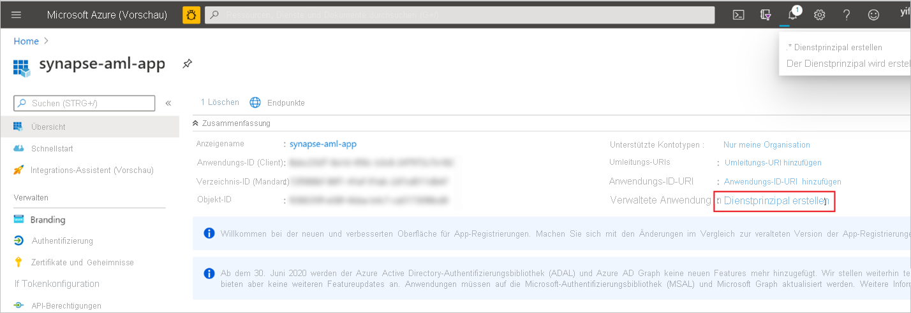

# Schnellstart: Erstellen eines neuen verknüpften Azure Machine Learning-Diensts in Synapse

In dieser Schnellstartanleitung wird ein Azure Synapse Analytics-Arbeitsbereich mit einem Azure Machine Learning-Arbeitsbereich verknüpft. Durch das Verknüpfen dieser Arbeitsbereiche können Sie Azure Machine Learning aus verschiedenen Erfahrungen in Synapse nutzen.

Beispielsweise ermöglicht diese Verknüpfung mit einem Azure Machine Learning-Arbeitsbereich folgende Erfahrungen:

- Ausführen Ihrer Azure Machine Learning-Pipelines als Schritt in Ihren Synapse-Pipelines. Weitere Informationen finden Sie unter [Ausführen von Azure Machine Learning-Pipelines](/azure/data-factory/transform-data-machine-learning-service).

- Anreichern Ihrer Daten mit Vorhersagen, indem Sie ein Machine Learning-Modell aus der Azure Machine Learning-Modellregistrierung einbinden und das Modell in Synapse SQL-Pools bewerten. Weitere Informationen finden Sie im [Tutorial: Assistent für die Bewertung von Machine Learning-Modellen für Synapse SQL-Pools](tutorial-sql-pool-model-scoring-wizard.md).

## Voraussetzungen

- Azure-Abonnement – [Erstellen eines kostenlosen Kontos](https://azure.microsoft.com/free/)
- Als Standardspeicher konfigurierter [Synapse Analytics-Arbeitsbereich](../get-started-create-workspace.md) mit einem ADLS Gen2-Speicherkonto. Sie müssen **Mitwirkender an Storage-Blobdaten** des ADLS Gen2-Dateisystems sein, mit dem Sie arbeiten.
- [Azure Machine Learning-Arbeitsbereich](/azure/machine-learning/how-to-manage-workspace).
- Sie benötigen Berechtigungen zum Erstellen eines Dienstprinzipals und Geheimnisses (oder müssen dies von jemandem mit den benötigten Berechtigungen anfordern), die Sie zum Erstellen des verknüpften Diensts verwenden können. Beachten Sie, dass diesem Dienstprinzipal die Rolle „Mitwirkender“ im Azure Machine Learning-Arbeitsbereich zugewiesen werden muss.

## Melden Sie sich auf dem Azure-Portal an.

Melden Sie sich beim [Azure-Portal](https://portal.azure.com/)

## Erstellen eines Dienstprinzipals

In diesem Schritt wird ein neuer Dienstprinzipal erstellt. Wenn Sie einen vorhandenen Dienstprinzipal verwenden möchten, können Sie diesen Schritt überspringen.
1. Öffnen Sie das Azure-Portal. 

1. Wechseln Sie zu **Azure Active Directory** -> **App-Registrierungen**.

1. Klicken Sie auf **Neue Registrierung**. Befolgen Sie dann die Anleitung in der Benutzeroberfläche, um eine neue Anwendung zu registrieren.

1. Nach der Registrierung der Anwendung: Generieren Sie ein Geheimnis für die Anwendung. Wechseln Sie zu **Ihre Anwendung** -> **Zertifikat und Geheimnis**. Klicken Sie auf **Geheimen Clientschlüssel hinzufügen**, um ein Geheimnis zu generieren. Bewahren Sie das Geheimnis sicher auf, es wird später verwendet.

   

1. Erstellen Sie einen Dienstprinzipal für die Anwendung. Wechseln Sie zu **Ihre Anwendung** -> **Übersicht**, und klicken Sie dann auf **Dienstprinzipal erstellen**. In einigen Fällen wird dieser Dienstprinzipal automatisch erstellt.

   

1. Fügen Sie den Dienstprinzipal als „Mitwirkender“ des Azure Machine Learning-Arbeitsbereichs hinzu. Beachten Sie, dass hierfür erforderlich ist, dass Sie Besitzer der Ressourcengruppe sind, zu der der Azure Machine Learning-Arbeitsbereich gehört.

   

## Erstellen eines verknüpften Diensts

1. Wechseln Sie in dem Synapse-Arbeitsbereich, in dem Sie den neuen verknüpften Dienst „Azure Machine Learning“ erstellen möchten, zu **Verwaltung** -> **Verknüpfter Dienst**, und erstellen Sie einen neuen verknüpften Dienst mit dem Typ „Azure Machine Learning“.

   

2. Füllen Sie das Formular aus:

   - Dienstprinzipal-ID: Dies ist die **Anwendungs(client)-ID** der Anwendung.
  
     > [!NOTE]
     > Dies ist nicht der Name der Anwendung. Sie finden diese ID auf der Übersichtsseite der Anwendung. Dabei sollte es sich um eine lange Zeichenfolge handeln, die in etwa wie folgt aussieht: „81707eac-ab38-406u-8f6c-10ce76a568d5“.

   - Dienstprinzipalschlüssel: Das Geheimnis, das Sie im vorherigen Abschnitt generiert haben.

3. Klicken Sie auf **Verbindung testen**, um zu überprüfen, ob die Konfiguration korrekt ist. Wenn der Verbindungstest bestanden wird, klicken Sie auf **Speichern**.

   Wenn der Verbindungstest fehlschlägt, stellen Sie sicher, dass die Dienstprinzipal-ID und das Geheimnis korrekt sind, und versuchen Sie es noch mal.

## Nächste Schritte

- [Tutorial: Assistent für die Bewertung von Machine Learning-Modellen: Dedizierter SQL-Pool](tutorial-sql-pool-model-scoring-wizard.md)
- [Machine Learning-Funktionen in Azure Synapse Analytics](what-is-machine-learning.md)
