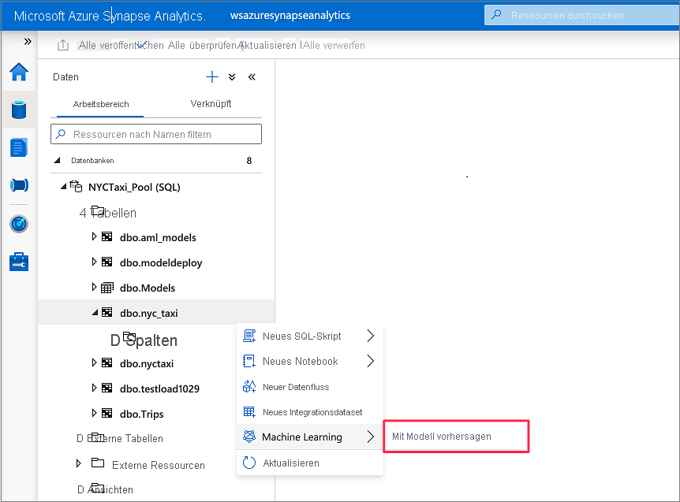

# <a name="tutorial-machine-learning-model-scoring-wizard-preview-for-dedicated-sql-pools"></a>Tutorial: Assistent für die Bewertung von Machine Learning-Modellen (Vorschauversion) für dedizierte SQL-Pools

Hier erfahren Sie, wie Sie Ihre Daten in dedizierten SQL-Pools mit Predictive Machine Learning-Modellen problemlos erweitern können. Die Modelle, die Ihre Datenanalysten erstellen, stehen Ihren Datenexperten jetzt bequem für Predictive Analytics zur Verfügung. Ein Datenexperte in Azure Synapse Analytics kann einfach ein Modell aus der Azure Machine Learning-Modellregistrierung für die Bereitstellung in Azure Synapse SQL-Pools auswählen und Vorhersagen starten, um die Daten anzureichern.

In diesem Tutorial lernen Sie Folgendes:

> [!div class="checklist"]
> - Trainieren eines Predictive Machine Learning-Modells und Registrieren des Modells in der Azure Machine Learning-Modellregistrierung
> - Verwenden des Assistenten für die SQL-Bewertung zum Starten von Vorhersagen in einem dedizierten SQL-Pool

Wenn Sie kein Azure-Abonnement besitzen, können Sie ein [kostenloses Konto](https://azure.microsoft.com/free/) erstellen, bevor Sie beginnen.

## <a name="prerequisites"></a>Voraussetzungen

- [Azure Synapse Analytics-Arbeitsbereich](../get-started-create-workspace.md) mit einem als Standardspeicher konfigurierten Azure Data Lake Storage Gen2-Speicherkonto. Für das hier verwendete Data Lake Storage Gen2-Dateisystem müssen Sie über die Rolle *Mitwirkender an Storage-Blobdaten* verfügen.
- Dedizierter SQL-Pool in Ihrem Azure Synapse Analytics-Arbeitsbereich. Ausführliche Informationen finden Sie unter [Erstellen eines dedizierten SQL-Pools](../quickstart-create-sql-pool-studio.md).
- Verknüpfter Azure Machine Learning-Dienst in Ihrem Azure Synapse Analytics-Arbeitsbereich. Ausführliche Informationen finden Sie unter [Erstellen eines verknüpften Azure Machine Learning-Diensts in Azure Synapse](quickstart-integrate-azure-machine-learning.md).

## <a name="sign-in-to-the-azure-portal"></a>Melden Sie sich auf dem Azure-Portal an.

Melden Sie sich beim [Azure-Portal](https://portal.azure.com/) an.

## <a name="train-a-model-in-azure-machine-learning"></a>Training eines Modells in Azure Machine Learning

Vergewissern Sie sich zunächst, dass Ihre Version von sklearn 0.20.3 ist.

Überprüfen Sie vor dem Ausführen aller Zellen im Notebook, ob die Compute-Instanz ausgeführt wird.


1. Navigieren Sie zu Ihrem Azure Machine Learning-Arbeitsbereich.

1. Laden Sie [Predict NYC Taxi Tips.ipynb](https://go.microsoft.com/fwlink/?linkid=2144301) (Vorhersage von Taxi-Trinkgeldern in NYC) herunter.

1. Öffnen Sie den Azure Machine Learning-Arbeitsbereich in [Azure Machine Learning Studio](https://ml.azure.com).

1. Navigieren Sie zu **Notebooks** > **Dateien hochladen**. Wählen Sie dann die von Ihnen heruntergeladene Datei **Predict NYC Taxi Tips.ipynb** aus, und laden Sie sie hoch.
   

1. Nachdem das Notebook hochgeladen und geöffnet wurde, wählen Sie **Alle Zellen ausführen** aus.

   Eine der Zellen schlägt möglicherweise fehl, und Sie werden aufgefordert, sich bei Azure zu authentifizieren. Halten Sie in den Zellenausgaben danach Ausschau, und authentifizieren Sie sich in Ihrem Browser, indem Sie dem Link folgen und den Code eingeben. Führen Sie dann das Notebook erneut aus.

1. Mit dem Notebook wird ein ONNX-Modell trainiert und bei MLflow registriert. Wechseln Sie zu **Modelle**, um zu überprüfen, ob das neue Modell ordnungsgemäß registriert wurde.
   

1. Wenn Sie das Notebook ausführen, werden die Testdaten auch in eine CSV-Datei exportiert. Laden Sie die CSV-Datei auf Ihr lokales System herunter. Später importieren Sie die CSV-Datei in einen dedizierten SQL-Pool und verwenden die Daten zum Testen des Modells.

   Die CSV-Datei wird im selben Ordner wie Ihre Notebook-Datei erstellt. Klicken Sie im Datei-Explorer auf **Aktualisieren**, wenn sie nicht sofort angezeigt wird.

   

## <a name="launch-predictions-with-the-sql-scoring-wizard"></a>Starten von Vorhersagen mit dem Assistenten für SQL-Bewertungen

1. Öffnen Sie den Azure Synapse-Arbeitsbereich mit Synapse Studio.

1. Navigieren Sie zu **Daten** > **Verknüpft** > **Speicherkonten**. Laden Sie `test_data.csv` in das Standardspeicherkonto hoch.

   

1. Wechseln Sie zu **Entwickeln** > **SQL-Skripts**. Erstellen Sie ein neues SQL-Skript, um `test_data.csv` in Ihren dedizierten SQL-Pool zu laden.

   > [!NOTE]
   > Aktualisieren Sie die Datei-URL in diesem Skript, bevor Sie es ausführen.

   ```SQL
   IF NOT EXISTS (SELECT * FROM sys.objects WHERE NAME = 'nyc_taxi' AND TYPE = 'U')
   CREATE TABLE dbo.nyc_taxi
   (
       tipped int,
       fareAmount float,
       paymentType int,
       passengerCount int,
       tripDistance float,
       tripTimeSecs bigint,
       pickupTimeBin nvarchar(30)
   )
   WITH
   (
       DISTRIBUTION = ROUND_ROBIN,
       CLUSTERED COLUMNSTORE INDEX
   )
   GO
   
   COPY INTO dbo.nyc_taxi
   (tipped 1, fareAmount 2, paymentType 3, passengerCount 4, tripDistance 5, tripTimeSecs 6, pickupTimeBin 7)
   FROM '<URL to linked storage account>/test_data.csv'
   WITH
   (
       FILE_TYPE = 'CSV',
       ROWTERMINATOR='0x0A',
       FIELDQUOTE = '"',
       FIELDTERMINATOR = ',',
       FIRSTROW = 2
   )
   GO
   
   SELECT TOP 100 * FROM nyc_taxi
   GO
   ```

   

1. Wechseln Sie zu **Daten** > **Arbeitsbereich**. Öffnen Sie den Assistenten für die SQL-Bewertung, indem Sie mit der rechten Maustaste auf die Tabelle der dedizierten SQL-Pools klicken. Wählen Sie **Machine Learning** > **Enrich with existing model** (Mit vorhandenem Modell anreichern) aus.

   > [!NOTE]
   > Die Machine Learning-Option wird nur angezeigt, wenn Sie einen verknüpften Dienst für Azure Machine Learning erstellt haben. (Informationen hierzu finden Sie am Anfang dieses Tutorials unter [Voraussetzungen](#prerequisites).)

   

1. Wählen Sie einen verknüpften Azure Machine Learning-Arbeitsbereich im Dropdownfeld aus. Mit diesem Schritt wird eine Liste von Machine Learning-Modellen aus der Modellregistrierung des ausgewählten Azure Machine Learning-Arbeitsbereichs geladen. Zurzeit werden nur ONNX-Modelle unterstützt, daher werden in diesem Schritt nur ONNX-Modelle angezeigt.

1. Wählen Sie das soeben trainierte Modell und dann **Weiter** aus.

   

1. Ordnen Sie die Tabellenspalten den Modelleingaben zu, und geben Sie die Modellausgaben an. Wenn das Modell im MLflow-Format gespeichert wurde und die Modellsignatur aufgefüllt ist, wird die Zuordnung automatisch für Sie durchgeführt, wobei eine auf der Ähnlichkeit von Namen basierende Logik verwendet wird. Die Schnittstelle unterstützt auch eine manuelle Zuordnung.

   Wählen Sie **Weiter**.

   

1. Der generierte T-SQL-Code wird mit einer gespeicherten Prozedur umschlossen. Aus diesem Grund müssen Sie den Namen einer gespeicherten Prozedur angeben. Die Modellbinärdatei, einschließlich der Metadaten (Version, Beschreibung usw.), wird physisch aus Azure Machine Learning in eine Tabelle mit dedizierten SQL-Pools kopiert. Daher müssen Sie angeben, in welcher Tabelle das Modell gespeichert werden soll. 

   Sie können entweder **Vorhandene Tabelle** oder **Neu erstellen** auswählen. Wählen Sie nach Abschluss des Vorgangs **Modell bereitstellen + Skript öffnen** aus, um das Modell bereitzustellen und ein T-SQL-Vorhersageskript zu generieren.

   

1. Nachdem das Skript generiert wurde, wählen Sie **Ausführen** aus, um die Bewertung auszuführen und Vorhersagen zu erhalten.

   

## <a name="next-steps"></a>Nächste Schritte

- [Schnellstart: Erstellen eines neuen verknüpften Azure Machine Learning-Diensts in Azure Synapse](quickstart-integrate-azure-machine-learning.md)
- [Machine Learning-Funktionen in Azure Synapse Analytics](what-is-machine-learning.md)
