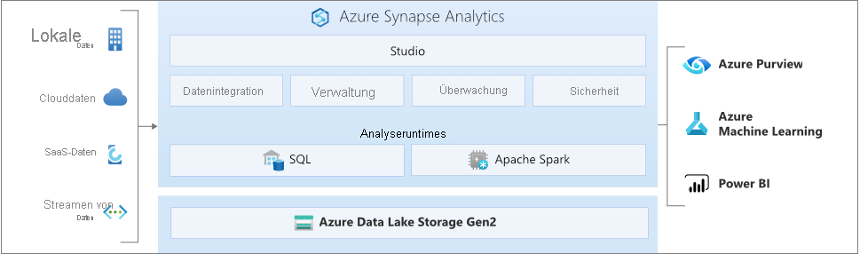

# Was ist Azure Synapse Analytics?

**Azure Synapse** ist ein integrierter Unternehmensanalysedienst zur schnelleren Gewinnung von Erkenntnissen aus Data Warehouses und Big Data-Systemen. In Azure Synapse ist die jeweils beste Technologie aus unterschiedlichen Bereichen vereint: **SQL**-Technologie für Data Warehousing in Unternehmen, **Spark**-Technologie für Big Data-Zwecke, **Pipelines** für die Datenintegration und ETL/ELT sowie eine tiefe Integration in andere Azure-Dienste, z. B. **Power BI**, **Cosmos DB** und **Azure ML**.

## Branchenführendes SQL

**Synapse SQL** ist ein System für verteilte Abfragen für T-SQL, mit dem Data Warehousing- und Datenvirtualisierungsszenarien realisiert werden können und T-SQL auf Streaming- und Machine Learning-Szenarien erweitert wird.

* Synapse SQL bietet sowohl **serverlose** als auch **dedizierte** Ressourcenmodelle. Erstellen Sie dedizierte SQL-Pools zur Reservierung von Rechenleistung für in SQL-Tabellen gespeicherte Daten, um von planbarer Leistung und planbaren Kosten zu profitieren. Für ungeplante Workloads oder Workloads mit Bedarfsspitzen kann der stets verfügbare, serverlose SQL-Endpunkt verwendet werden.
* Nutzen Sie die integrierten **Streamingfunktionen**, um Daten aus Clouddatenquellen in SQL-Tabellen zu übertragen.
* Integrieren Sie mithilfe von **Machine Learning**-Modellen KI in SQL, um Daten per [T-SQL-Vorhersagefunktion (PREDICT)](/sql/t-sql/queries/predict-transact-sql?view=azure-sqldw-latest&preserve-view=true) zu bewerten.

## Branchenübliches Apache Spark

**Apache Spark für Azure Synapse** bietet eine tiefe und nahtlose Integration von Apache Spark – der beliebtesten Open-Source-basierten Big Data-Engine für Datenaufbereitung, Datentechnik, ETL und maschinelles Lernen.

* ML-Modelle mit SparkML-Algorithmen und AzureML-Integration für Apache Spark 2.4 mit integrierter Unterstützung von Linux Foundation Delta Lake
* Vereinfachtes Ressourcenmodell, bei dem Sie sich nicht mehr mit der Verwaltung von Clustern auseinandersetzen müssen
* Schneller Spark-Start und aggressive automatische Skalierung
* Nutzung Ihrer C#-Kenntnisse und Wiederverwendung von bereits vorhandenem .NET-Code in einer Spark-Anwendung dank integrierter Unterstützung von .NET für Spark

## Arbeiten mit Data Lake

Azure Synapse beseitigt die herkömmlichen Technologiebarrieren bei der gemeinsamen Verwendung von SQL und Spark. Beide Lösungen können nach Bedarf und Kenntnisstand miteinander kombiniert werden.

* Tabellen, die auf Dateien im Data Lake definiert sind, werden nahtlos entweder von Spark oder Hive genutzt.
* SQL und Spark können zur direkten Erkundung und Analyse von gespeicherten Parquet-, CSV-, TSV- und JSON-Dateien im Data Lake verwendet werden.
* Schnelles, skalierbares Laden von Daten zwischen SQL- und Spark-Datenbanken

## Integrierte Datenintegration

In Azure Synapse sind die gleiche Datenintegrationsengine und die gleichen Umgebungen integriert wie in Azure Data Factory, was die Erstellung umfangreicher bedarfsorientierter ETL-Pipelines ermöglicht, ohne Azure Synapse Analytics zu verlassen.

* Erfassen von Daten aus über 90 Datenquellen
* Kein Programmieraufwand für ETL dank Datenflussaktivitäten
* Orchestrieren von Notebooks, Spark-Aufträgen, gespeicherten Prozeduren, SQL-Skripts und mehr

## Einheitliche Verwaltung, Überwachung und Sicherheit

Mit Azure Synapse erhalten Unternehmen eine zentrale Lösung für die Verwaltung von Analyseressourcen, für die Nutzungs- und Aktivitätsüberwachung sowie für die Gewährleistung der Sicherheit.

* Zuweisung von Benutzern zu einer Rolle, um den Zugriff auf Analyseressourcen zu vereinfachen
* Differenzierte Zugriffssteuerung für Daten und Code
* Zentrales Dashboard zum Überwachen von Ressourcen, Nutzung und Benutzern in SQL und Spark

## Einheitliche Benutzeroberfläche

**Synapse Studio** ist die Benutzerumgebung, die alles umfasst, was Data Engineers für ihre Arbeit benötigen. Sie ermöglicht Data Engineers die Ausführung sämtlicher Aufgaben, die zum Erstellen einer vollständigen Analyselösung erforderlich sind.

* Wichtige Aufgaben von Data Engineers an einem Ort: Erfassung, Untersuchung, Vorbereitung, Orchestrierung, Visualisierung
* Branchenführende Produktivität zum Schreiben von SQL- oder Spark-Code: Erstellung, Debugging und Leistungsoptimierung
* Integration in den Unternehmensprozess mit CI/CD

## Mit der Synapse-Community in Kontakt treten

- [Microsoft Q&A](/answers/topics/azure-synapse-analytics.html): Stellen Sie technische Fragen.
- [Stack Overflow](https://stackoverflow.com/questions/tagged/azure-synapse): Stellen Sie Fragen zur Entwicklung.

## Nächste Schritte

* [Erste Schritte mit Azure Synapse Analytics](get-started.md)
* [Erstellen eines Arbeitsbereichs](quickstart-create-workspace.md)
* [Verwenden eines serverlosen SQL-Pools](quickstart-sql-on-demand.md)
