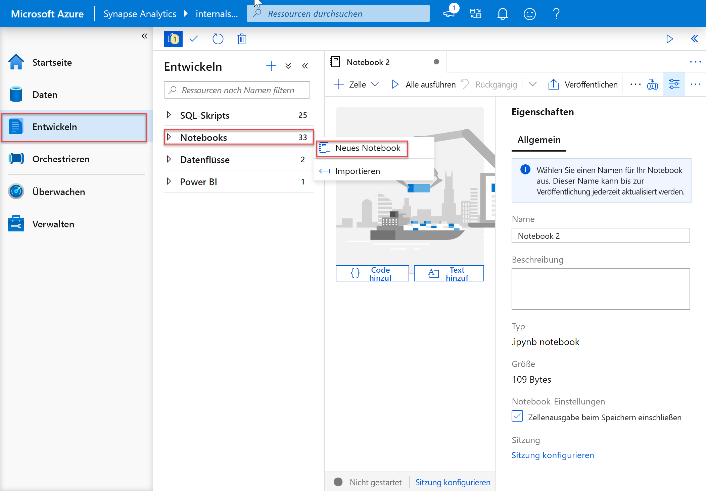
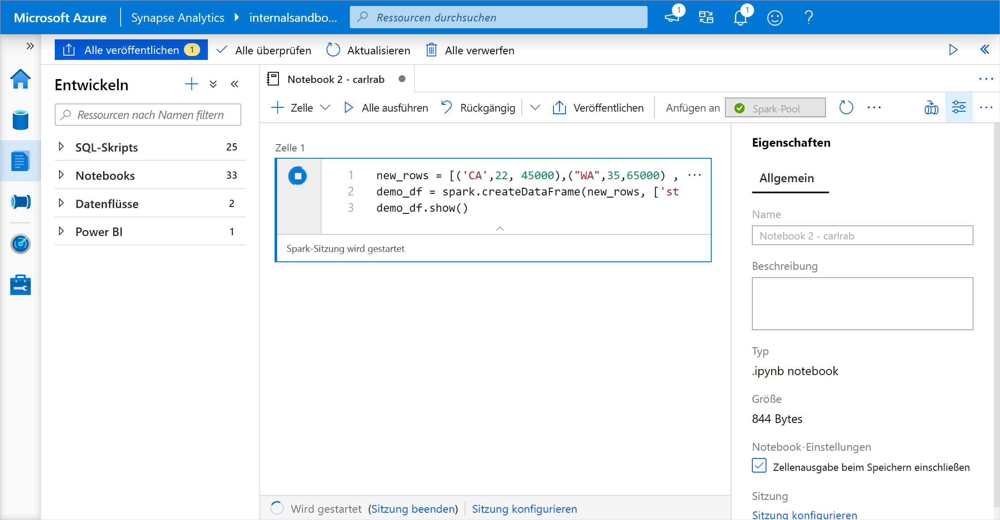
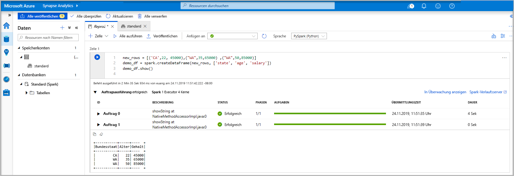
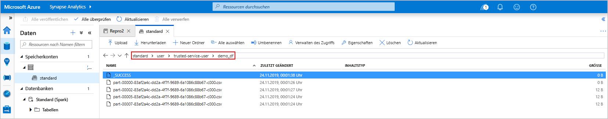
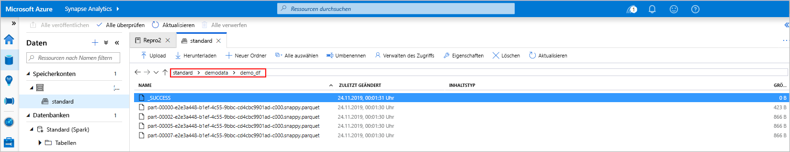
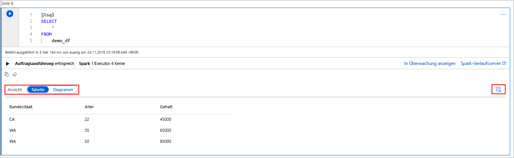
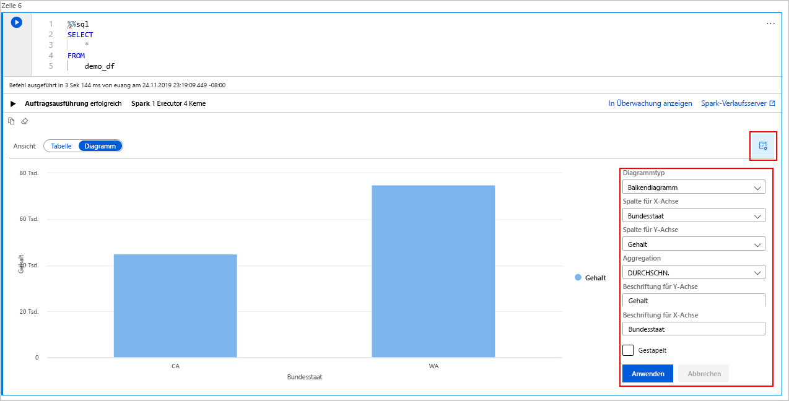

# <a name="quickstart-create-a-serverless-apache-spark-pool-in-azure-synapse-analytics-using-web-tools"></a>Schnellstart: Erstellen eines serverlosen Apache Spark-Pools in Azure Synapse Analytics mithilfe von Webtools

In dieser Schnellstartanleitung erfahren Sie, wie Sie mithilfe von Webtools einen serverlosen Apache Spark-Pool (Vorschauversion) in Azure Synapse erstellen. Anschließend wird gezeigt, wie Sie eine Verbindung mit dem Apache Spark-Pool herstellen und Spark SQL-Abfragen für Dateien und Tabellen ausführen. Apache Spark ermöglicht schnelle Datenanalysen und Clustercomputing mit In-Memory-Verarbeitung. Informationen zu Spark in Azure Synapse finden Sie unter [Was ist Apache Spark in Azure Synapse Analytics?](./spark/apache-spark-overview.md).

> [!IMPORTANT]
> Die Abrechnung für Spark-Instanzen erfolgt anteilsmäßig auf Minutenbasis und ist unabhängig von der Verwendung. Fahren Sie daher Ihre Spark-Instanz herunter, wenn Sie sie nicht mehr benötigen, oder legen Sie ein kurzes Timeout fest. Weitere Informationen finden Sie im Abschnitt **Bereinigen von Ressourcen** in diesem Artikel.

Wenn Sie kein Azure-Abonnement besitzen, können Sie ein [kostenloses Konto](https://azure.microsoft.com/free/) erstellen, bevor Sie beginnen.

## <a name="prerequisites"></a>Voraussetzungen

- Azure-Abonnement – [Erstellen eines kostenlosen Kontos](https://azure.microsoft.com/free/)
- [Synapse Analytics-Arbeitsbereich](quickstart-create-workspace.md)
- [Serverloser Apache Spark-Pool](quickstart-create-apache-spark-pool-studio.md)

## <a name="sign-in-to-the-azure-portal"></a>Melden Sie sich auf dem Azure-Portal an.

Melden Sie sich beim [Azure-Portal](https://portal.azure.com/) an.

Wenn Sie kein Azure-Abonnement besitzen, können Sie ein [kostenloses Konto](https://azure.microsoft.com/free/) erstellen, bevor Sie beginnen.

## <a name="create-a-notebook"></a>Erstellen eines Notebooks

Ein Notebook ist eine interaktive Umgebung, die verschiedene Programmiersprachen unterstützt. Das Notebook ermöglicht es Ihnen, mit Ihren Daten zu interagieren, Code mit Markdowntext zu kombinieren und einfache Visualisierungen durchzuführen.

1. Wählen Sie in der Azure-Portalansicht für den zu verwendenden Azure Synapse-Arbeitsbereich die Option **Synapse Studio starten** aus.
2. Wählen Sie in Synapse Studio die Option **Entwickeln** aus. Wählen Sie dann das Symbol „ **+** “ aus, um eine neue Ressource hinzuzufügen.
3. Wählen Sie dort **Notebook** aus. Ein neues Notebook mit einem automatisch generierten Namen wird erstellt und geöffnet.
 
     

4. Geben Sie im Fenster **Eigenschaften** einen Namen für das Notebook an.
5. Klicken Sie auf der Symbolleiste auf **Veröffentlichen**.
6. Ist im Arbeitsbereich nur ein einzelner Apache Spark-Pool vorhanden, wird er standardmäßig ausgewählt. Sollte kein Apache Spark-Pool ausgewählt sein, wählen Sie mithilfe der Dropdownliste den korrekten Pool aus.
7. Klicken Sie auf **Code hinzufügen**. Die Standardsprache ist `Pyspark`. Da hier eine Mischung aus Pyspark und Spark SQL verwendet wird, können Sie die Standardauswahl beibehalten. Weitere unterstützte Sprachen sind Scala und .NET für Spark.
8. Als Nächstes wird ein einfaches manipulierbares Spark-Objekt vom Typ „DataFrame“ erstellt. In diesem Fall wird es auf der Grundlage von Code erstellt. Es gibt drei Zeilen und drei Spalten:

   ```python
   new_rows = [('CA',22, 45000),("WA",35,65000) ,("WA",50,85000)]
   demo_df = spark.createDataFrame(new_rows, ['state', 'age', 'salary'])
   demo_df.show()
   ```

9. Führen Sie nun die Zelle mithilfe einer der folgenden Methoden aus:

   - Drücken Sie **UMSCHALT+EINGABETASTE**.
   - Wählen Sie auf der linken Seite der Zelle das blaue Wiedergabesymbol aus.
   - Wählen Sie auf der Symbolleiste die Schaltfläche **Alle ausführen** aus.

       

10. Sollte die Instanz des Apache Spark-Pools noch nicht ausgeführt werden, wird sie automatisch gestartet. Der Status der Apache Spark-Poolinstanz wird unterhalb der ausgeführten Zelle sowie im Statusbereich am unteren Rand des Notebooks angezeigt. Je nach Poolgröße dauert der Startvorgang in der Regel zwischen zwei und fünf Minuten. Nach Abschluss der Codeausführung werden unterhalb der Zelle Informationen zur Ausführungsdauer und zur Ausführung angezeigt. Die Ausgabezelle enthält die Ausgabe.

    

11. Die Daten sind jetzt in einem Datenrahmen (DataFrame) vorhanden, von wo aus sie auf unterschiedlichste Weise verwendet werden können. Im weiteren Verlauf dieser Schnellstartanleitung werden sie in unterschiedlichen Formaten benötigt.
12. Geben Sie den folgenden Code in eine andere Zelle ein, und führen Sie ihn aus. Dadurch werden eine Spark-Tabelle, eine CSV-Datei und eine Parquet-Datei mit Kopien der Daten erstellt:

    ```python
     demo_df.createOrReplaceTempView('demo_df')
     demo_df.write.csv('demo_df', mode='overwrite')
     demo_df.write.parquet('abfss://<<TheNameOfAStorageAccountFileSystem>>@<<TheNameOfAStorageAccount>>.dfs.core.windows.net/demodata/demo_df', mode='overwrite')
    ```

    Bei Verwendung des Speicher-Explorers sehen Sie, wie sich die beiden unterschiedlichen Methoden auswirken, die oben zum Schreiben einer Datei verwendet werden. Ohne Angabe eines Dateisystems wird der Standardwert verwendet (in diesem Fall: `default>user>trusted-service-user>demo_df`). Die Daten werden am Speicherort des angegebenen Dateisystems gespeichert.

    Beachten Sie, dass sowohl im CSV- als auch im Parquet-Format bei Schreibvorgängen ein Verzeichnis mit vielen partitionierten Dateien erstellt wird.

    

    

## <a name="run-spark-sql-statements"></a>Ausführen von Spark SQL-Anweisungen

Structured Query Language (SQL) ist die gängigste und am häufigsten verwendete Sprache zum Abfragen und Definieren von Daten. Spark SQL fungiert als Erweiterung von Apache Spark für die Verarbeitung strukturierter Daten mit der vertrauten SQL-Syntax.

1. Fügen Sie den folgenden Code in eine leere Zelle ein, und führen Sie ihn aus. Der Befehl listet die im Pool enthaltenen Tabellen auf.

   ```sql
   %%sql
   SHOW TABLES
   ```

   Wenn Sie ein Notebook mit Ihrem Apache Spark-Pool in Azure Synapse verwenden, erhalten Sie einen vordefinierten SQL-Kontext (`sqlContext`), den Sie zum Ausführen von Abfragen mit Spark SQL verwenden können. Durch `%%sql` wird das Notebook angewiesen, den vordefinierten SQL-Kontext (`sqlContext`) für die Ausführung der Abfrage zu verwenden. Durch die Abfrage werden die ersten zehn Zeilen aus einer Systemtabelle abgerufen, die standardmäßig in allen Apache Spark-Pools in Azure Synapse enthalten ist.

2. Führen Sie eine weitere Abfrage aus, um die Daten in `demo_df` anzuzeigen.

    ```sql
    %%sql
    SELECT * FROM demo_df
    ```

    Durch den Code werden zwei Ausgabezellen erzeugt: eine mit den Datenergebnissen, die andere mit der Auftragsansicht.

    Die Ergebnisansicht wird standardmäßig als Raster dargestellt. Unterhalb des Rasters befindet sich jedoch eine Ansichtsumschaltung, mit der zwischen Raster- und Diagrammansicht gewechselt werden kann.

    

3. Wählen Sie unter **Ansicht** die Option **Diagramm** aus.
4. Wählen Sie ganz rechts das Symbol **Ansichtsoptionen** aus.
5. Wählen Sie im Feld **Diagrammtyp** die Option „Balkendiagramm“ aus.
6. Wählen Sie im Feld „Spalte für X-Achse“ die Option „state“ (Bundesstaat) aus.
7. Wählen Sie im Feld „Spalte für Y-Achse“ die Option „salary“ (Gehalt) aus.
8. Wählen Sie im Feld **Aggregation** die Option „AVG“ (Durchschnitt) aus.
9. Wählen Sie **Übernehmen**.

   

10. Die gleiche Art der SQL-Ausführung ist auch ohne Wechsel der Sprache möglich. Hierzu können Sie oben die SQL-Zelle durch die folgende PySpark-Zelle ersetzen. Aufgrund der Verwendung des Befehls **display** ist die Ausgabe identisch:

    ```python
    display(spark.sql('SELECT * FROM demo_df'))
    ```

11. Bei den zuvor ausgeführten Zellen bestand jeweils die Möglichkeit, zum **Verlaufsserver** und zur **Überwachung** zu wechseln. Durch Klicken auf die Links gelangen Sie zu den verschiedenen Bereichen der Benutzeroberfläche.

> [!NOTE]
> In der [offiziellen Apache Spark-Dokumentation](https://spark.apache.org/docs/latest/) wird teilweise die Spark-Konsole verwendet, diese ist in Synapse Spark jedoch nicht verfügbar. Verwenden Sie stattdessen das [Notebook](quickstart-apache-spark-notebook.md) oder [IntelliJ](./spark/intellij-tool-synapse.md).

## <a name="clean-up-resources"></a>Bereinigen von Ressourcen

Ihre Daten werden von Azure Synapse in Azure Data Lake Storage gespeichert. Nicht genutzte Spark-Instanzen können gefahrlos heruntergefahren werden. Für einen serverlosen Apache Spark-Pool fallen Gebühren an, solange er ausgeführt wird (selbst, wenn er nicht genutzt wird). 

Da die Gebühren für den Pool deutlich höher sind als die Kosten für den Speicher, ist es wirtschaftlich sinnvoll, nicht genutzte Spark-Instanzen herunterzufahren.

Beenden Sie alle verbundenen Sitzungen (Notebooks), um sicherzustellen, dass die Spark-Instanz heruntergefahren wird. Der Pool wird heruntergefahren, wenn die im Apache Spark-Pool angegebene **Leerlaufzeit** erreicht wird. Sie können auch auf der Statusleiste am unteren Rand des Notebooks die Option **Sitzung beenden** auswählen.

## <a name="next-steps"></a>Nächste Schritte

In dieser Schnellstartanleitung haben Sie erfahren, wie Sie einen serverlosen Apache Spark-Pool erstellen und eine einfache Spark SQL-Abfrage ausführen.

- [Azure Synapse Analytics](overview-what-is.md)
- [Dokumentation zu .NET für Apache Spark](/dotnet/spark?toc=/azure/synapse-analytics/toc.json&bc=/azure/synapse-analytics/breadcrumb/toc.json)


