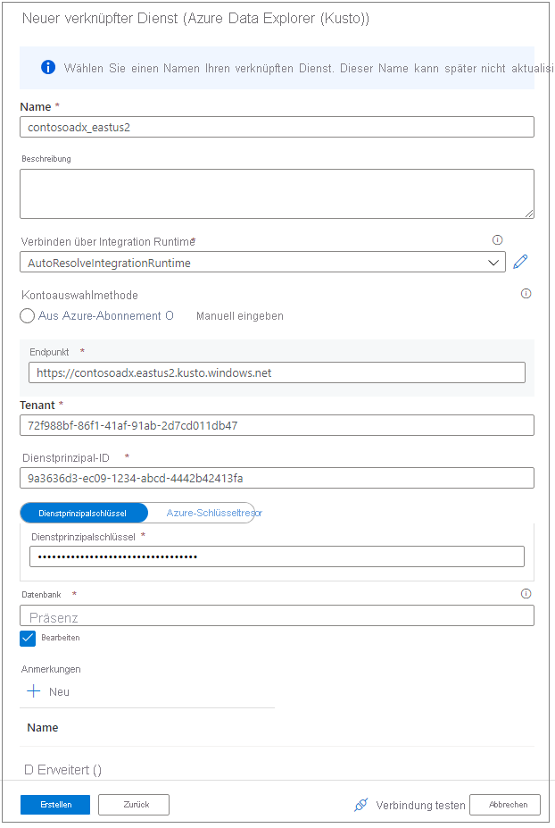
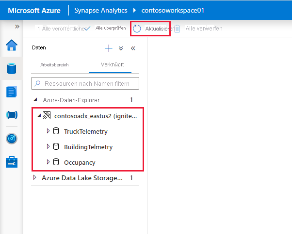

# Verbinden mit Azure Data Explorer mithilfe von Apache Spark für Azure Synapse Analytics

In diesem Artikel wird beschrieben, wie Sie aus Synapse Studio mit Apache Spark für Azure Synapse Analytics auf eine Azure Data Explorer-Datenbank zugreifen.

## Voraussetzungen

* [Erstellen eines Azure Data Explorer-Clusters und einer Datenbank](/azure/data-explorer/create-cluster-database-portal)
* Vorhandensein eines Azure Synapse Analytics-Arbeitsbereichs, oder erstellen Sie einen neuen Arbeitsbereich anhand der Schritte in [Schnellstart: Erstellen eines Azure Synapse-Arbeitsbereichs](./quickstart-create-workspace.md).
* Vorhandensein eines Apache Spark-Pools, oder erstellen Sie einen neuen Pool anhand der Schritte in [Schnellstart: Erstellen eines neuen Apache Spark-Pools (Vorschauversion)](./quickstart-create-apache-spark-pool-portal.md).
* [Erstellen Sie eine Azure Active Directory (Azure AD)-App durch Bereitstellen einer Azure AD-Anwendung](/azure/data-explorer/kusto/management/access-control/how-to-provision-aad-app).
* Gewähren Sie Ihrer Azure AD-App Zugriff auf Ihre Datenbank, indem Sie die Schritte in [Verwalten der Berechtigungen für Datenbanken in Azure Data Explorer](/azure/data-explorer/manage-database-permissions) verwenden.

## Wechseln zu Synapse Studio

Wählen Sie in einem Azure Synapse-Arbeitsbereich die Option **Synapse Studio starten** aus. Wählen Sie auf der Synapse Studio-Homepage die Option **Daten** aus, um zum **Datenobjekt-Explorer** zu gelangen.

## Herstellen einer Verbindung zwischen einer Azure Data Explorer-Datenbank und einem Azure Synapse-Arbeitsbereich

Für die Verbindungsherstellung einer Azure Data Explorer-Datenbank mit einem Arbeitsbereich wird ein verknüpfter Dienst verwendet. Mit einem verknüpften Azure Data Explorer-Dienst können Sie über Apache Spark für Azure Synapse Daten durchsuchen und erkunden sowie lesen und schreiben. Sie können auch Integrationsaufträge in einer Pipeline ausführen.

Führen Sie im Datenobjekt-Explorer die folgenden Schritte aus, um eine direkte Verbindung mit einem Azure Data Explorer-Cluster herzustellen:

1. Wählen Sie neben **Daten** das Symbol **+** aus.
1. Wählen Sie **Verbinden** aus, um eine Verbindung mit externen Daten herzustellen.
1. Select **Azure Data Explorer (Kusto)** aus.
1. Wählen Sie **Weiter**.
1. Verwenden Sie einen aussagekräftigen Anzeigenamen für den verknüpften Dienst. Der Name wird im Datenobjekt-Explorer angezeigt und von Azure Synapse-Laufzeiten verwendet, um eine Verbindung mit der Datenbank herzustellen.
1. Wählen Sie den Azure Data Explorer-Cluster aus Ihrem Abonnement aus, oder geben Sie den URI ein.
1. Geben Sie die **Dienstprinzipal-ID** und den **Dienstprinzipalschlüssel** ein. Stellen Sie sicher, dass dieser Dienstprinzipal über Anzeigezugriff auf die Datenbank für Lesevorgänge und über Erfassungszugriff für die Erfassung von Daten verfügt.
1. Geben Sie den Azure Data Explorer-Datenbanknamen ein.
1. Wählen Sie **Verbindung testen** aus, um sicherzustellen, dass Sie über die richtigen Berechtigungen verfügen.
1. Wählen Sie **Erstellen** aus.

    

    > [!NOTE]
    > (Optional) **Verbindung testen** überprüft nicht den Schreibzugriff. Stellen Sie sicher, dass die Dienstprinzipal-ID über Schreibzugriff auf die Azure Data Explorer-Datenbank verfügt.

1. Azure Data Explorer-Cluster und -Datenbanken werden auf der Registerkarte **Verknüpft** unter dem Abschnitt **Azure Data Explorer** angezeigt.

    

    > [!NOTE]
    > Im aktuellen Release werden die Datenbankobjekte basierend auf Ihren Azure AD-Kontoberechtigungen in den Azure Data Explorer-Datenbanken aufgefüllt. Beim Ausführen der Apache Spark-Notebooks oder -Integrationsaufträge werden die Anmeldeinformationen im Linkdienst (z. B. Dienstprinzipal) verwendet.

## Schnelles Interagieren mit durch Code generierte Aktionen

Wenn Sie mit der rechten Maustaste auf eine Datenbank oder Tabelle klicken, wird eine Liste mit Spark-Beispielnotebooks angezeigt. Wählen Sie eine Option aus, um Daten in Azure Data Explorer zu lesen, zu schreiben oder zu streamen.

Hier sehen Sie ein Beispiel für das Lesen von Daten. Fügen Sie das Notebook an Ihren Spark-Pool an, und führen Sie die Zelle aus.

   > [!NOTE]
   > Bei der erstmaligen Ausführung kann es mehr als drei Minuten dauern, bis die Spark-Sitzung initiiert wurde. Nachfolgende Ausführungen sind dann deutlich schneller.

## Einschränkungen

Der Azure Data Explorer-Connector wird für verwaltete virtuelle Azure Synapse-Netzwerke derzeit nicht unterstützt.

## Nächste Schritte

* [Beispielcode mit erweiterten Optionen](https://github.com/Azure/azure-kusto-spark/blob/master/samples/src/main/python/SynapseSample.py)
* [Azure Data Explorer (Kusto): Spark-Connector](https://github.com/Azure/azure-kusto-spark)