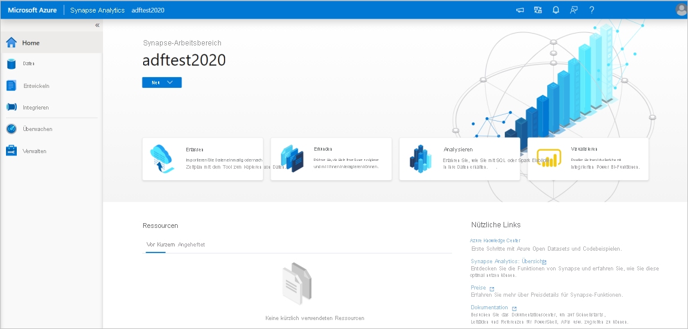
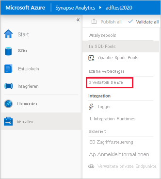
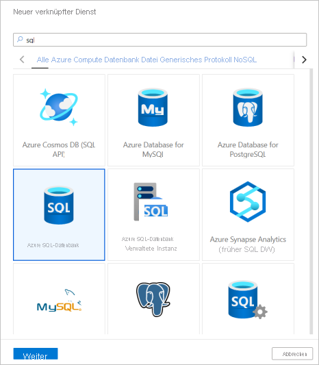

# Schnellstart: Laden von Daten in einen dedizierten SQL-Pool mithilfe der Copy-Aktivität

Azure Synapse Analytics enthält verschiedene Analysemodule, mit denen Sie Ihre Daten erfassen, transformieren, modellieren und analysieren können. Ein dedizierter SQL-Pool bietet T-SQL-basierte Compute- und Speicherfunktionen. Nach der Erstellung eines dedizierten SQL-Pools in Ihrem Synapse-Arbeitsbereich können Daten geladen, modelliert, verarbeitet und für einen schnelleren analytischen Einblick bereitgestellt werden.

In dieser Schnellstartanleitung erfahren Sie, wie Sie *Daten aus Azure SQL-Datenbank in Azure Synapse Analytics laden*. Sie können ähnliche Schritte zum Kopieren von Daten aus anderen Typen von Datenspeichern ausführen. Ähnliche Schritte gelten auch für das Kopieren von Daten für andere Quellen und Senken.

## Voraussetzungen

* Azure-Abonnement: Wenn Sie kein Azure-Abonnement besitzen, können Sie ein [kostenloses Konto](https://azure.microsoft.com/free/) erstellen, bevor Sie beginnen.
* Azure Synapse-Arbeitsbereich: Befolgen Sie zum Erstellen eines Synapse-Arbeitsbereichs mithilfe des Azure-Portals die Anweisungen unter [Schnellstart: Erstellen eines Synapse-Arbeitsbereichs](quickstart-create-workspace.md).
* Azure SQL-Datenbank: In diesem Tutorial werden Daten aus einem Beispieldataset von Adventure Works LT nach Azure SQL-Datenbank kopiert. Sie können diese Beispieldatenbank in SQL-Datenbank erstellen, indem Sie den Anweisungen unter [Schnellstart: Erstellen einer Azure SQL-Einzeldatenbank](../azure-sql/database/single-database-create-quickstart.md) folgen. Sie können auch andere Datenspeicher verwenden, indem Sie ähnliche Schritte ausführen.
* Azure-Speicherkonto: Azure Storage wird im Kopiervorgang als *Stagingbereich* verwendet. Falls Sie noch nicht über ein Azure-Speicherkonto verfügen, finden Sie Anweisungen dazu unter [Erstellen eines Speicherkontos](../storage/common/storage-account-create.md).
* Azure Synapse Analytics: Sie verwenden einen dedizierten SQL-Pool als Senkendatenspeicher. Wenn Sie keine Azure Synapse Analytics-Instanz haben, finden Sie unter [Erstellen eines dedizierten SQL-Pools](quickstart-create-sql-pool-portal.md) die erforderlichen Schritte zum Erstellen einer solchen Instanz.

### Navigieren zu Synapse Studio

Nachdem Ihr Synapse-Arbeitsbereich erstellt wurde, haben Sie zwei Möglichkeiten zum Öffnen von Synapse Studio:

* Öffnen Sie Ihren Synapse-Arbeitsbereich im [Azure-Portal](https://ms.portal.azure.com/#home). Wählen Sie unter „Erste Schritte“ auf der Karte „Synapse Studio öffnen“ die Option **Öffnen** aus.
* Öffnen Sie [Azure Synapse Analytics](https://web.azuresynapse.net/), und melden Sie sich bei Ihrem Arbeitsbereich an.

In dieser Schnellstartanleitung wird der Arbeitsbereich „adftest2020“ als Beispiel verwendet. Sie werden automatisch zur Startseite von Synapse Studio weitergeleitet.

## Erstellen von verknüpften Diensten

In Azure Synapse Analytics definieren Sie in einem verknüpften Dienst Ihre Verbindungsinformationen für andere Dienste. In diesem Abschnitt erstellen Sie die folgenden zwei Arten verknüpfter Dienste: verknüpfter Azure SQL-Datenbank- und verknüpfter Azure Data Lake Storage Gen2-Dienst (ADLS Gen2).

1. Wählen Sie auf der Synapse Studio-Startseite im linken Navigationsbereich die Registerkarte **Verwalten** aus.
1. Wählen Sie unter Externe Verbindungen die Option Verknüpfte Dienste aus.
  
   

1. Klicken Sie auf **Neu**, um einen verknüpften Dienst hinzuzufügen.
1. Wählen Sie im Katalog **Azure SQL-Datenbank** und dann **Weiter** aus. Sie können in das Suchfeld zum Filtern der Connectors „SQL“ eingeben.

   

1. Wählen Sie auf der Seite New Linked Service (Neuer verknüpfter Dienst) in der Dropdownliste Ihren Server- und Datenbanknamen aus, und geben Sie den Benutzernamen und das Kennwort an. Klicken Sie auf **Verbindung testen**, um die Einstellungen zu überprüfen, und wählen Sie dann **Erstellen** aus.

   

1. Wiederholen Sie die Schritte 3 bis 4, wählen Sie jedoch **Azure Data Lake Storage Gen2** aus dem Katalog aus. Wählen Sie auf der Seite „Neuer verknüpfter Dienst“ im Dropdownmenü den Speicherkontonamen aus. Klicken Sie auf **Verbindung testen**, um die Einstellungen zu überprüfen, und wählen Sie dann **Erstellen** aus. 

   
 
## Erstellen einer Pipeline

Eine Pipeline enthält den logischen Ablauf für die Ausführung einer Aktivitätenmenge. In diesem Abschnitt erstellen Sie eine Pipeline mit einer Copy-Aktivität, die Daten aus Azure SQL-Datenbank in einem dedizierten SQL-Pool erfasst.

1. Navigieren Sie zur Registerkarte **Integrieren**. Wählen Sie neben dem Header „Pipelines“ das Pluszeichen und anschließend „Pipeline“ aus.

   

1. Ziehen Sie im Bereich *Aktivitäten* unter *Verschieben und transformieren* den Befehl **Daten kopieren** auf die Pipelinecanvas.
1. Klicken Sie auf die Kopieraktivität, und wechseln Sie zur Registerkarte Quelle. Wählen Sie **Neu** aus, um ein neues Quelldataset zu erstellen.

   

1. Wählen Sie **Azure SQL-Datenbank** als Datenspeicher und anschließend **Weiter** aus.
1. Wählen Sie im Bereich *Eigenschaften festlegen* den in einem früheren Schritt erstellten verknüpften Azure SQL-Datenbank-Dienst aus. 
1. Wählen Sie unter „Tabellenname“ eine Beispieltabelle aus, die in der folgenden Copy-Aktivität verwendet werden soll. In dieser Schnellstartanleitung wird als Beispiel die Tabelle „SalesLT.Customer“ verwendet. 

   
1. Wählen Sie **OK** aus, wenn Sie fertig sind.
1. Wählen Sie die Copy-Aktivität aus, und wechseln Sie zur Registerkarte „Senke“. Klicken Sie auf **Neu**, um ein neues Senkendataset zu erstellen.
1. Wählen Sie **Azure Synapse dedicated SQL pool** (Dedizierter Azure Synapse-SQL-Pool) als Datenspeicher aus und anschließend **Weiter** aus.
1. Wählen Sie im Bereich **Eigenschaften festlegen** den in einem früheren Schritt erstellten SQL Analytics-Pool aus. Wenn Sie in eine vorhandene Tabelle schreiben, wählen Sie sie in der Dropdownliste unter *Tabellenname* aus. Aktivieren Sie andernfalls „Bearbeiten“, und geben Sie Ihren neuen Tabellennamen ein. Wählen Sie **OK** aus, wenn Sie fertig sind.
1. Aktivieren Sie in den Einstellungen für das Senkendataset im Feld „Tabellenoption“ die Option **Auto create table** (Tabelle automatisch erstellen).

   

1. Aktivieren Sie auf der Seite **Einstellungen** das Kontrollkästchen für **Enable Staging** (Staging aktivieren). Diese Option wird angewendet, wenn die Quelldaten nicht mit PolyBase kompatibel sind. Wählen Sie im Abschnitt **Stagingeinstellungen** den verknüpften Azure Data Lake Storage Gen2-Dienst aus, den Sie in einem früheren Schritt als Stagingspeicher erstellt haben. 

    Der Speicher wird für das Staging der Daten verwendet, bevor diese mit PolyBase in Azure Synapse Analytics geladen werden. Nach Abschluss des Kopiervorgangs werden die vorläufigen Daten in Azure Data Lake Storage Gen2 automatisch bereinigt.

   

1. Wählen Sie zum Überprüfen der Pipeline auf der Symbolleiste die Option **Überprüfen** aus. Das Ergebnis der Pipelineüberprüfungsausgabe wird rechts auf der Seite angezeigt. 

## Debuggen und Veröffentlichen der Pipeline

Nach Abschluss der Konfiguration Ihrer Pipeline können Sie einen Debuglauf durchführen, bevor Sie Ihre Artefakte zur Überprüfung veröffentlichen, ob alles einwandfrei ist.

1. Klicken Sie auf der Symbolleiste auf **Debuggen**, um die Pipeline zu debuggen. Der Status der Pipelineausführung wird unten im Fenster auf der Registerkarte **Ausgabe** angezeigt. 

   

1. Wenn die Pipelineausführung erfolgreich war, wählen Sie **Alle veröffentlichen** aus. Mit dieser Aktion werden erstellte Entitäten (Datasets und Pipelines) im Synapse Analytics-Dienst veröffentlicht.
1. Warten Sie, bis die Meldung **Erfolgreich veröffentlicht** angezeigt wird. Wenn Sie Benachrichtigungsmeldungen anzeigen möchten, klicken Sie oben rechts auf die Schaltfläche mit der Glocke. 

## Auslösen und Überwachen der Pipeline

In diesem Abschnitt lösen Sie die im vorherigen Schritt veröffentlichte Pipeline manuell aus. 

1. Wählen Sie in der Symbolleiste die Option **Trigger hinzufügen** und dann **Jetzt auslösen**. Klicken Sie auf der Seite **Pipelineausführung** auf **OK**.  
1. Wechseln Sie in der linken Randleiste zur Registerkarte **Monitor**. Sie sehen eine Pipelineausführung, die von einem manuellen Trigger ausgelöst wird. 
1. Wenn die Pipelineausführung erfolgreich abgeschlossen wurde, wählen Sie den Link unter der Spalte **Pipelinename** aus, um Details zur Aktivitätsausführung anzuzeigen oder die Pipeline erneut auszuführen. Da in diesem Beispiel nur eine Aktivität vorhanden ist, wird in der Liste nur ein Eintrag angezeigt. 
1. Wenn Sie Details zum Kopiervorgang anzeigen möchten, wählen Sie unter der Spalte **Activity name** (Aktivitätsname) den Link **Details** (das Brillensymbol) aus. Sie können Details wie die Menge der Daten, die aus der Quelle in die Senke kopiert wurden, den Datendurchsatz, die Ausführungsschritte mit entsprechender Dauer sowie die verwendeten Konfigurationen überwachen.

   

1. Wählen Sie oben den Link **Alle Pipelineausführungen** aus, um zurück zur Ansicht mit den Pipelineausführungen zu wechseln. Klicken Sie zum Aktualisieren der Liste auf **Aktualisieren**.
1. Vergewissern Sie sich, dass Ihre Daten korrekt in den dedizierten SQL-Pool geschrieben werden.

## Nächste Schritte

Lesen Sie den folgenden Artikel, um mehr über die Unterstützung von Azure Synapse Analytics zu erfahren:

> [!div class="nextstepaction"]
> [Pipelines und Aktivitäten in Azure Data Factory](../data-factory/concepts-pipelines-activities.md?bc=%2fazure%2fsynapse-analytics%2fbreadcrumb%2ftoc.json&toc=%2fazure%2fsynapse-analytics%2ftoc.json)
> [Übersicht über Azure Data Factory-Connectors](../data-factory/connector-overview.md?bc=%2fazure%2fsynapse-analytics%2fbreadcrumb%2ftoc.json&toc=%2fazure%2fsynapse-analytics%2ftoc.json)
> [Kopieraktivität in Azure Data Factory](../data-factory/copy-activity-overview.md?bc=%2fazure%2fsynapse-analytics%2fbreadcrumb%2ftoc.json&toc=%2fazure%2fsynapse-analytics%2ftoc.json)