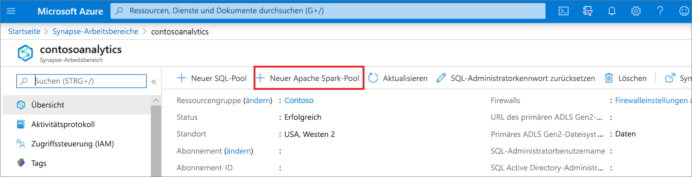
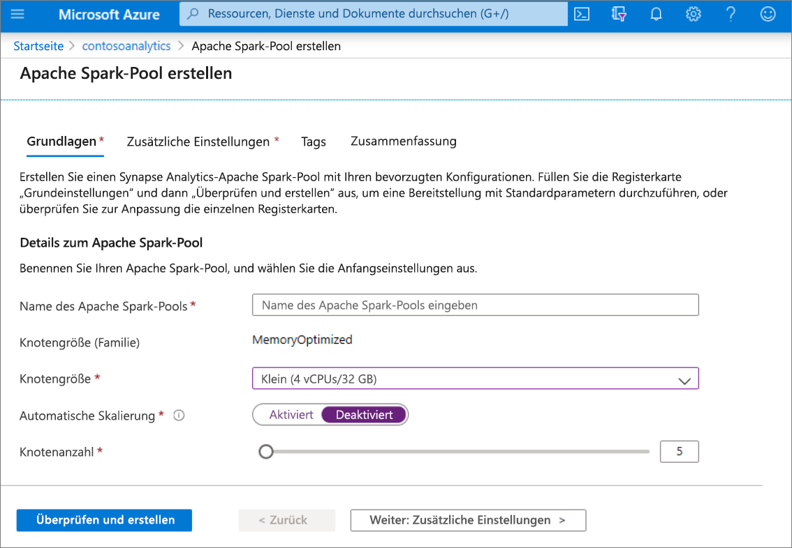
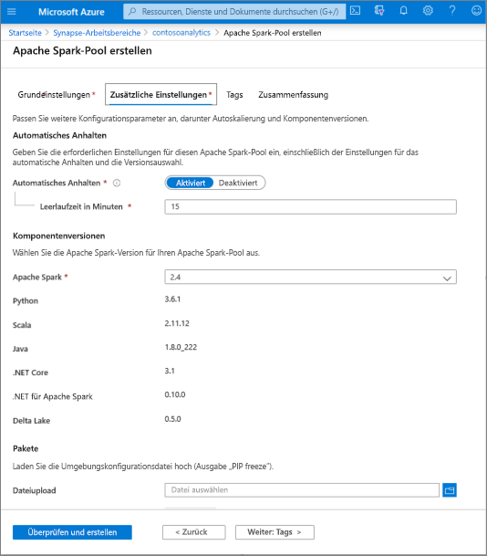
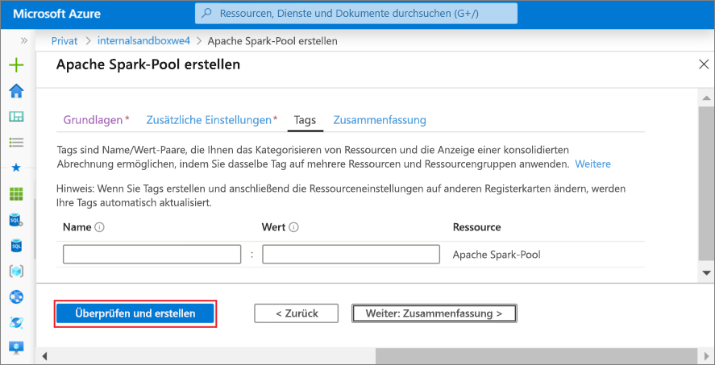
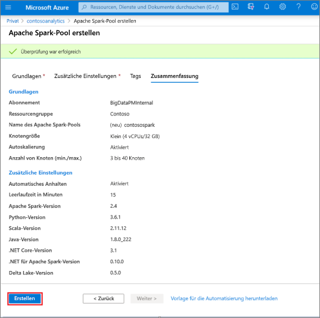
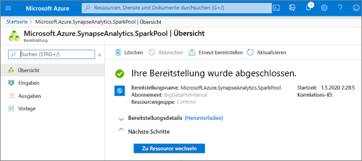
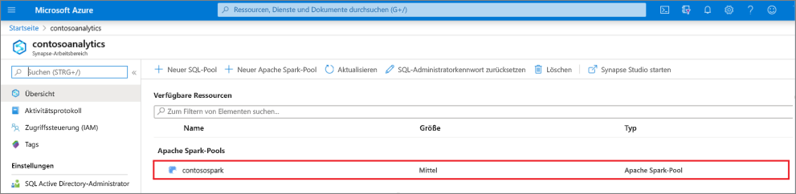
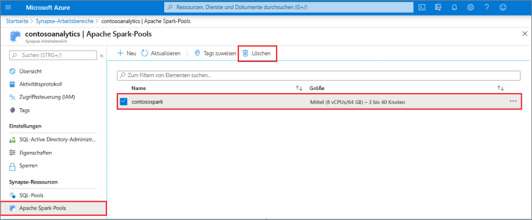
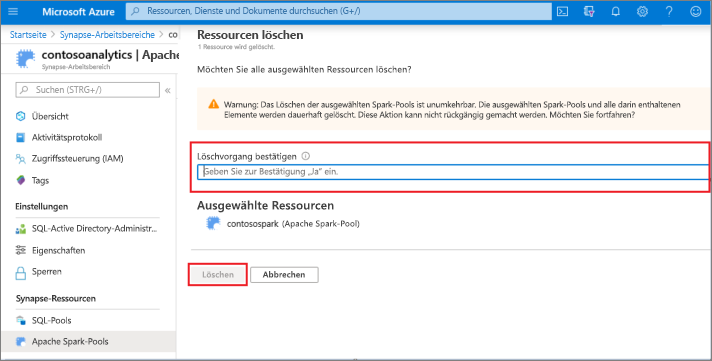

# Schnellstart: Erstellen eines neuen Apache Spark-Pools über das Azure-Portal

Azure Synapse Analytics beinhaltet verschiedene Analysemodule, mit denen Sie Ihre Daten erfassen, transformieren, modellieren, analysieren und verteilen können. Ein Apache Spark-Pool bietet Open-Source-Computefunktionen für Big Data. Nach der Erstellung eines Apache Spark-Pools in Ihrem Synapse-Arbeitsbereich können Daten geladen, modelliert, verarbeitet und verteilt werden, um schneller analytische Erkenntnisse zu gewinnen.

In dieser Schnellstartanleitung erfahren Sie, wie Sie über das Azure-Portal einen Apache Spark-Pool in einem Synapse-Arbeitsbereich erstellen.

> [!IMPORTANT]
> Die Abrechnung für Spark-Instanzen erfolgt anteilsmäßig auf Minutenbasis und ist unabhängig von der Verwendung. Fahren Sie daher Ihre Spark-Instanz herunter, wenn Sie sie nicht mehr benötigen, oder legen Sie ein kurzes Timeout fest. Weitere Informationen finden Sie im Abschnitt **Bereinigen von Ressourcen** in diesem Artikel.

Wenn Sie kein Azure-Abonnement besitzen, können Sie ein [kostenloses Konto](https://azure.microsoft.com/free/) erstellen, bevor Sie beginnen.

## Voraussetzungen

- Azure-Abonnement – [Erstellen eines kostenlosen Kontos](https://azure.microsoft.com/free/)
- [Synapse Analytics-Arbeitsbereich](quickstart-create-workspace.md)

## Melden Sie sich auf dem Azure-Portal an.

Melden Sie sich beim [Azure-Portal](https://portal.azure.com/)

## Navigieren zum Synapse-Arbeitsbereich 
1. Navigieren Sie zum Synapse-Arbeitsbereich, 0in dem der Apache Spark-Pool erstellt werden soll, indem Sie den Dienstnamen (oder direkt den Ressourcennamen) in die Suchleiste eingeben.

1. Geben Sie in der Liste der Arbeitsbereiche den Namen (oder einen Teil des Namens) des zu öffnenden Arbeitsbereichs ein. In diesem Beispiel verwenden wir einen Arbeitsbereich namens **contosoanalytics**.

## Erstellen eines neuen Apache Spark-Pools

1. Wählen Sie in dem Synapse-Arbeitsbereich, in dem Sie den Apache Spark-Pool erstellen möchten, **Neuer Apache Spark-Pool** aus.
    
2. Geben Sie auf der Registerkarte **Grundeinstellungen** die folgenden Informationen ein:

    |Einstellung | Vorgeschlagener Wert | BESCHREIBUNG |
    | :------ | :-------------- | :---------- |
    | **Name des Apache Spark-Pools** | Ein gültiger Poolname | Dies ist der Name des Apache Spark-Pools. |
    | **Knotengröße** | Klein (4 vCPUs/32 GB) | Legen Sie diese Einstellung auf die kleinste Größe fest, um die Kosten für diesen Schnellstart zu senken. |
    | **Automatische Skalierung** | Disabled | Für diesen Schnellstart ist keine Autoskalierung erforderlich. |
    | **Anzahl von Knoten** | 5 | Verwenden Sie eine kleine Größe, um die Kosten für diesen Schnellstart zu begrenzen. |

    
    > [!IMPORTANT]
    > Beachten Sie, dass für die Namen, die von Apache Spark-Pools verwendet werden können, bestimmte Einschränkungen gelten. Namen dürfen nur Buchstaben oder Ziffern enthalten und höchstens 15 Zeichen lang sein, müssen mit einem Buchstaben beginnen, dürfen keine reservierten Wörter enthalten und müssen im Arbeitsbereich eindeutig sein.

3. Wählen Sie **Weiter: Zusätzliche Einstellungen** aus, und überprüfen Sie die Standardeinstellungen. Ändern Sie keine Standardeinstellungen.
    

4. Wählen Sie **Weiter: Tags** aus. Fügen Sie keine Tags hinzu.
    

5. Klicken Sie auf **Überprüfen + erstellen**.

6. Vergewissern Sie sich auf Grundlage der vorherigen Angaben, dass die Details korrekt sind, und wählen Sie **Erstellen** aus.
    

7. Der Flow für die Ressourcenbereitstellung wird nun gestartet. Er zeigt an, wenn er abgeschlossen ist.
    

8. Wenn Sie nach Abschluss der Bereitstellung zurück zum Arbeitsbereich navigieren, wird ein neuer Eintrag für den neu erstellten Apache Spark-Pool angezeigt.
    

9. Zu diesem Zeitpunkt werden keine Ressourcen ausgeführt, und es fallen keine Gebühren für Spark an. Sie haben lediglich Metadaten für die zu erstellenden Spark-Instanzen erstellt.

## Bereinigen von Ressourcen

Führen Sie die folgenden Schritte aus, um den Apache Spark-Pool aus dem Arbeitsbereich zu löschen.
> [!WARNING]
> Wenn Sie einen Apache Spark-Pool löschen, wird die Analyse-Engine aus dem Arbeitsbereich entfernt. Sie können keine Verbindung mehr mit dem Pool herstellen, und Abfragen, Pipelines und Notebooks, die diesen Apache Spark-Pool verwenden, funktionieren nicht mehr.

Gehen Sie zum Löschen des Apache Spark-Pools wie folgt vor:

1. Navigieren Sie im Arbeitsbereich zum Blatt mit den Apache Spark-Pools.
2. Wählen Sie den zu löschenden Apache Spark-Pool aus (in diesem Fall **contosospark**).
3. Klicken Sie auf **Löschen**.
 
4. Bestätigen Sie den Löschvorgang, und klicken Sie auf die Schaltfläche **Löschen**.
 
5. Wenn der Vorgang erfolgreich abgeschlossen wurde, wird der Apache Spark-Pool nicht mehr in den Arbeitsbereichsressourcen aufgeführt.

## Nächste Schritte

- Weitere Informationen finden Sie unter [Schnellstart: Erstellen eines Apache Spark-Notebooks](quickstart-apache-spark-notebook.md).
- Weitere Informationen finden Sie unter [Schnellstart: Erstellen eines Synapse SQL-Pools](quickstart-create-sql-pool-portal.md).
