# Schnellstart: Erstellen eines Apache Spark-Pools (Vorschau) mithilfe von Synapse Studio

Azure Synapse Analytics beinhaltet verschiedene Analysemodule, mit denen Sie Ihre Daten erfassen, transformieren, modellieren, analysieren und bereitstellen können. Ein Apache Spark-Pool bietet Open-Source-Computefunktionen für Big Data. Nach der Erstellung eines Apache Spark-Pools in Ihrem Synapse-Arbeitsbereich können Daten geladen, modelliert, verarbeitet und bereitgestellt werden, um Erkenntnisse zu gewinnen.  

In dieser Schnellstartanleitung werden die Schritte zum Erstellen eines Apache Spark-Pools in einem Synapse-Arbeitsbereich mithilfe von Synapse Studio erläutert.

> [!IMPORTANT]
> Die Abrechnung für Spark-Instanzen erfolgt anteilsmäßig auf Minutenbasis und ist unabhängig von der Verwendung. Fahren Sie daher Ihre Spark-Instanz herunter, wenn Sie sie nicht mehr benötigen, oder legen Sie ein kurzes Timeout fest. Weitere Informationen finden Sie im Abschnitt **Bereinigen von Ressourcen** in diesem Artikel.

Wenn Sie kein Azure-Abonnement besitzen, können Sie ein [kostenloses Konto](https://azure.microsoft.com/free/) erstellen, bevor Sie beginnen.

## Voraussetzungen

- Azure-Abonnement – [Erstellen eines kostenlosen Kontos](https://azure.microsoft.com/free/)
- [Synapse-Arbeitsbereich](./quickstart-create-workspace.md)

## Melden Sie sich auf dem Azure-Portal an.

Melden Sie sich beim [Azure-Portal](https://portal.azure.com/)

## Navigieren zum Synapse-Arbeitsbereich

1. Navigieren Sie zum Synapse-Arbeitsbereich, 0in dem der Apache Spark-Pool erstellt werden soll, indem Sie den Dienstnamen (oder direkt den Ressourcennamen) in die Suchleiste eingeben.

1. Geben Sie in der Liste der Arbeitsbereiche den Namen (oder einen Teil des Namens) des zu öffnenden Arbeitsbereichs ein. In diesem Beispiel verwenden wir einen Arbeitsbereich namens **contosoanalytics**.
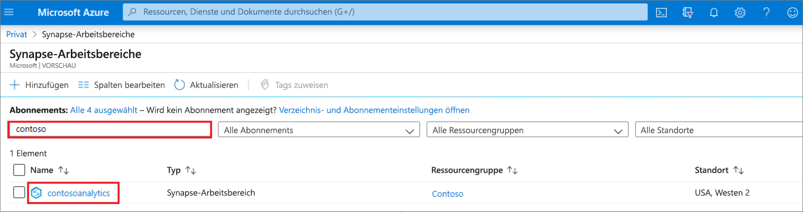

## Starten von Synapse Studio 

1. Wählen Sie in der Arbeitsbereichsübersicht **Synapse Studio starten** aus, um den Speicherort zu öffnen, an dem der Apache Spark-Pool erstellt werden soll. Geben Sie den Dienstnamen oder Ressourcennamen direkt in die Suchleiste ein.
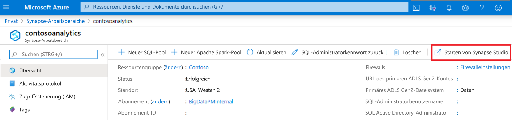

## Erstellen des Apache Spark-Pools in Synapse Studio

1. Navigieren Sie auf der Synapse Studio-Startseite zum **Verwaltungshub** im linken Navigationsbereich, indem Sie das Symbol **Verwalten** auswählen.
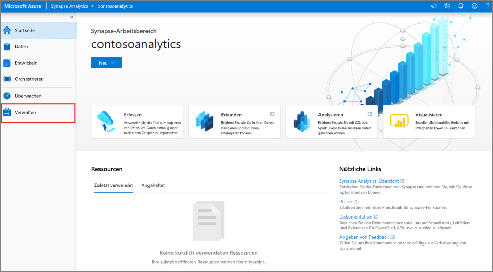

1. Navigieren Sie, nachdem Sie sich im Verwaltungshub befinden, zum Abschnitt **Apache Spark-Pools**, um die aktuelle Liste der Apache Spark-Pools anzuzeigen, die im Arbeitsbereich verfügbar sind.
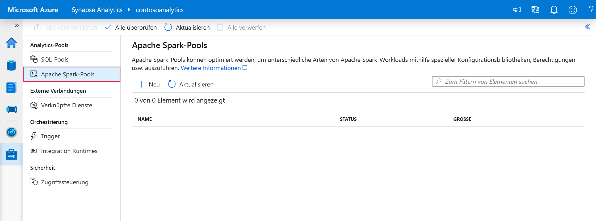

1. Wählen Sie **+ Neu** aus, und der Assistent zum Erstellen eines neuen Apache Spark-Pools wird angezeigt. 
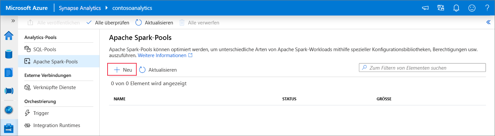

1. Geben Sie auf der Registerkarte **Grundeinstellungen** die folgenden Informationen ein:

    | Einstellung | Vorgeschlagener Wert | BESCHREIBUNG |
    | :------ | :-------------- | :---------- |
    | **Name des Apache Spark-Pools** | contosospark | Dies ist der Name des Apache Spark-Pools. |
    | **Knotengröße** | Klein (4 vCPUs/32 GB) | Legen Sie diese Einstellung auf die kleinste Größe fest, um die Kosten für diesen Schnellstart zu senken. |
    | **Automatische Skalierung** | Disabled | Für diesen Schnellstart ist keine Autoskalierung erforderlich. |
    | **Anzahl von Knoten** | 8 | Verwenden Sie eine kleine Größe, um die Kosten in diesem Schnellstart zu begrenzen.|
    
    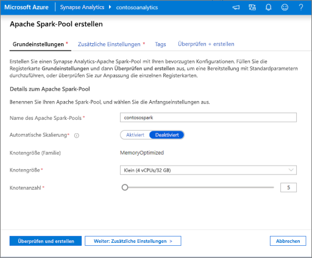
    > [!IMPORTANT]
    > Beachten Sie, dass für die Namen, die von Apache Spark-Pools verwendet werden können, bestimmte Einschränkungen gelten. Namen dürfen nur Buchstaben oder Ziffern enthalten und höchstens 15 Zeichen lang sein, müssen mit einem Buchstaben beginnen, dürfen keine reservierten Wörter enthalten und müssen im Arbeitsbereich eindeutig sein.

1. Übernehmen Sie auf der nächsten Registerkarte (Zusätzliche Einstellungen) alle Standardwerte, und klicken Sie auf **Überprüfen + erstellen** (wir fügen keine Tags hinzu).
 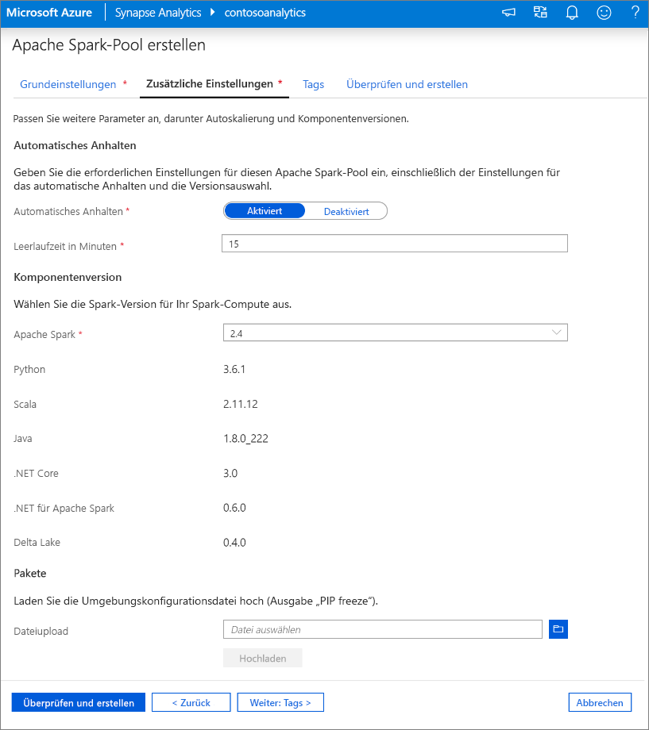

1. Wir fügen vorerst keine Tags hinzu. Wählen Sie also **Überprüfen + erstellen** aus.

1. Vergewissern Sie sich auf Grundlage der vorherigen Eingaben auf der Registerkarte **Überprüfen + erstellen**, dass die Details korrekt sind, und klicken Sie auf **Erstellen**. 
 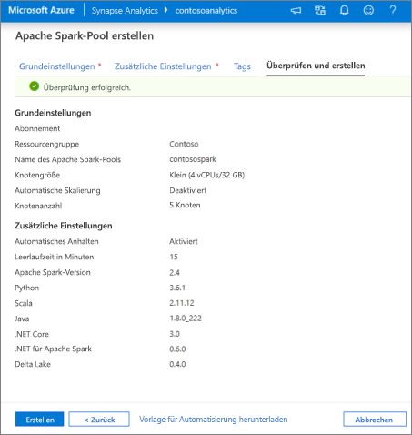

1. Der Apache Spark-Pool startet den Bereitstellungsprozess.
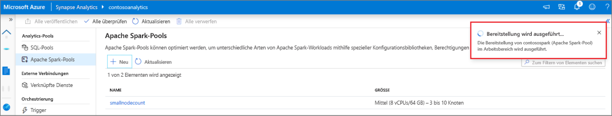

1. Nachdem die Bereitstellung abgeschlossen wurde, wird der neue Apache Spark-Pool in der Liste angezeigt.

## Bereinigen von Apache Spark-Poolressourcen mithilfe von Synapse Studio

Führen Sie die folgenden Schritte aus, um den Apache Spark-Pool mithilfe von Synapse Studio aus dem Arbeitsbereich zu löschen.
> [!WARNING]
> Wenn Sie einen Spark-Pool löschen, wird die Analyse-Engine aus dem Arbeitsbereich entfernt. Sie können keine Verbindung mehr mit dem Pool herstellen, und Abfragen, Pipelines und Notebooks, die diesen Spark-Pool verwenden, funktionieren nicht mehr.

Gehen Sie zum Löschen des Apache Spark-Pools wie folgt vor:

1. Navigieren Sie zu den Apache Spark-Pools im Verwaltungshub in Synapse Studio.
1. Wählen Sie das Auslassungszeichen (drei Punkte) neben dem zu löschenden Apache Spark-Pool aus (in diesem Fall **contosospark**), um die Befehle für den Apache Spark-Pool anzuzeigen.
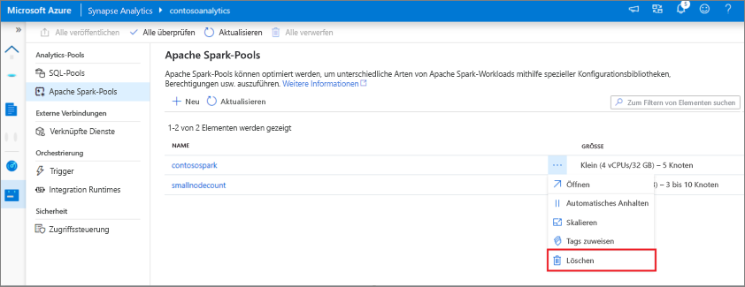
1. Klicken Sie auf **Löschen**.
1. Bestätigen Sie den Löschvorgang, und klicken Sie auf die Schaltfläche **Löschen**.
 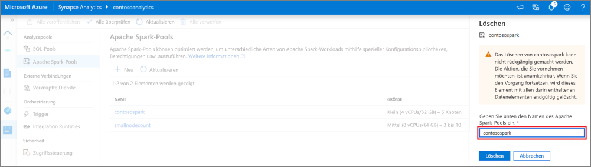
1. Wenn der Vorgang erfolgreich abgeschlossen wurde, wird der Apache Spark-Pool nicht mehr in den Arbeitsbereichsressourcen aufgeführt. 

## Nächste Schritte

- Weitere Informationen finden Sie unter [Schnellstart: Erstellen eines Apache Spark-Pools (Vorschauversion) in Synapse Analytics mithilfe von Webtools](quickstart-apache-spark-notebook.md).
- Weitere Informationen finden Sie unter [Schnellstart: Erstellen eines neuen Apache Spark-Pools (Vorschauversion)](quickstart-create-apache-spark-pool-portal.md).