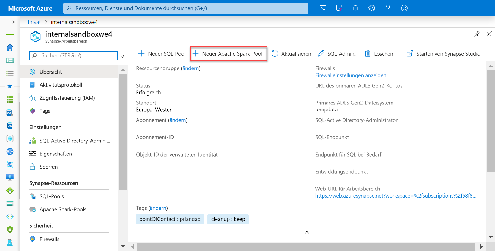
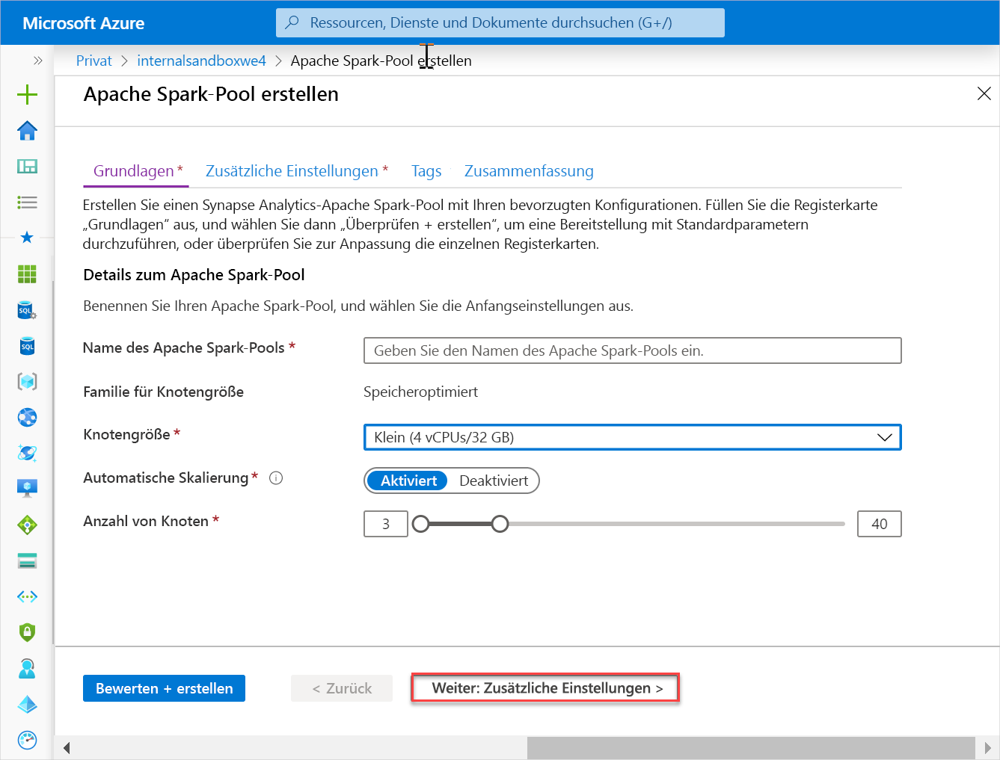
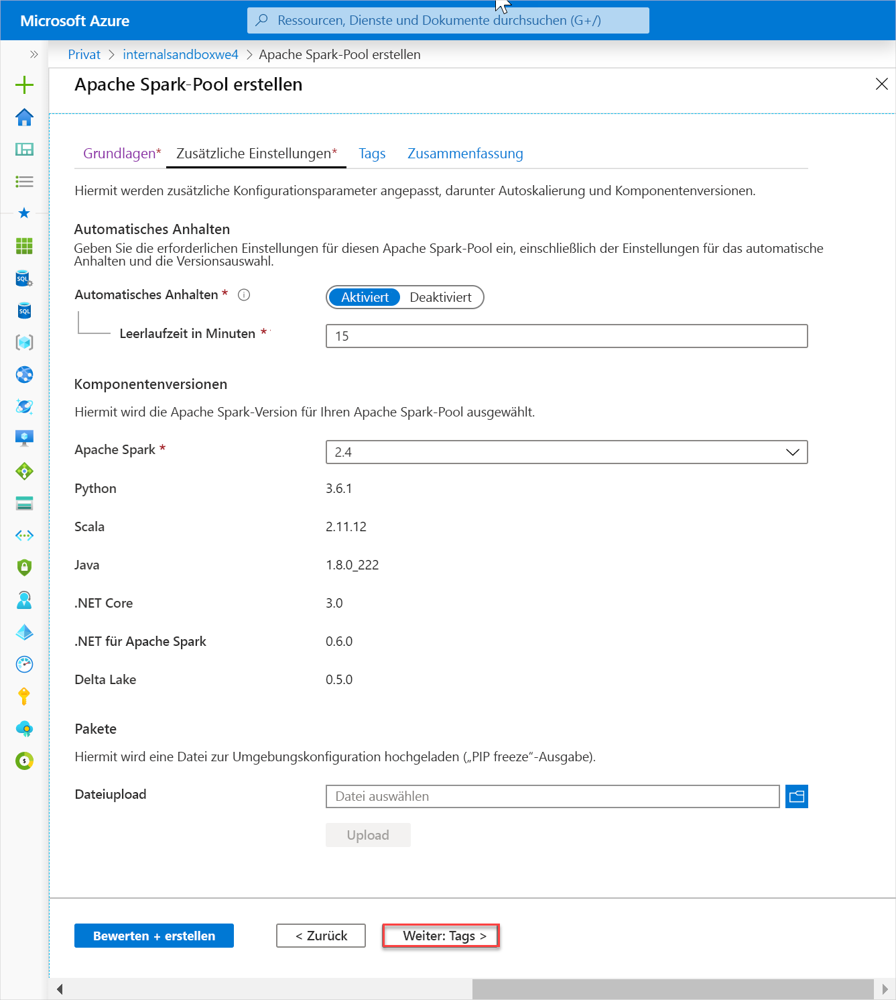
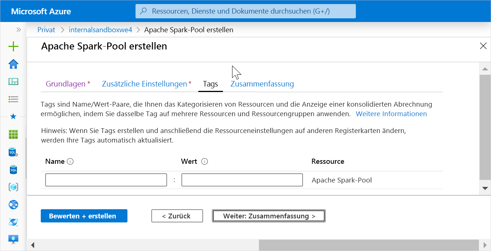
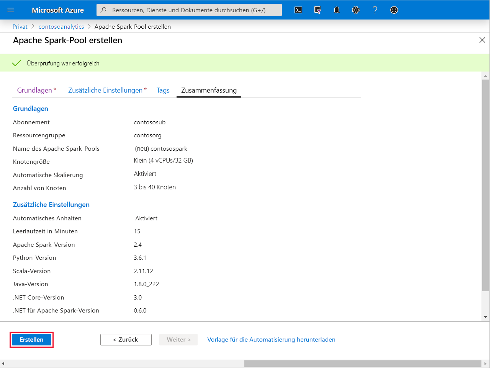
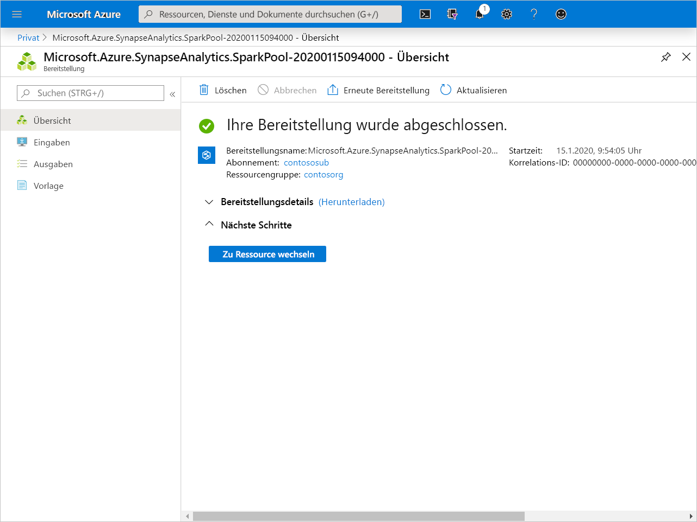
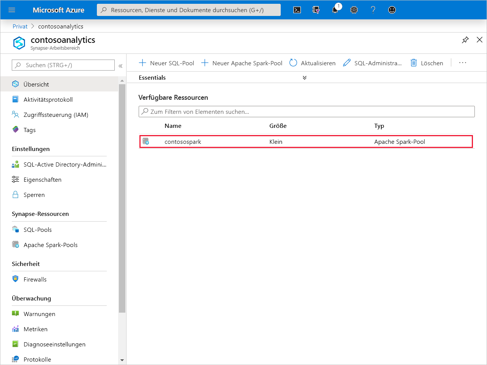
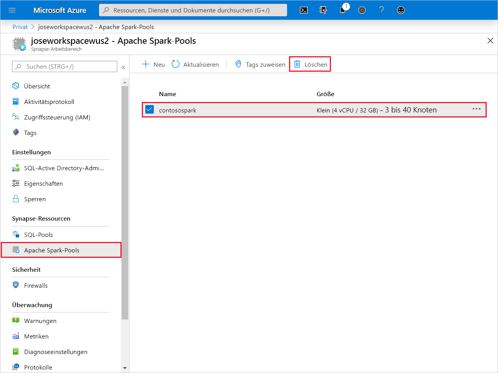
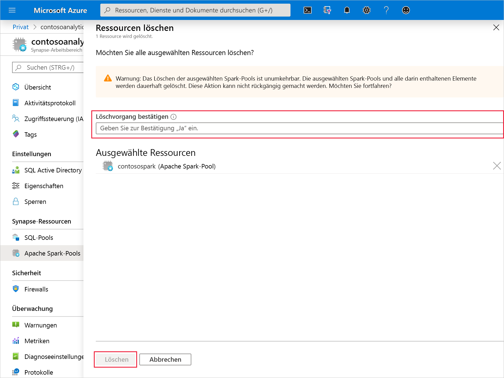

# Schnellstart: Erstellen eines neuen Apache Spark-Pools (Vorschauversion)

Synapse Analytics beinhaltet verschiedene Analysemodule, mit denen Sie Ihre Daten erfassen, transformieren, modellieren, analysieren und bereitstellen können. Ein Apache Spark-Pool bietet Open-Source-Computefunktionen für Big Data. Nach der Erstellung eines Apache Spark-Pools in Ihrem Synapse-Arbeitsbereich können Daten geladen, modelliert, verarbeitet und bereitgestellt werden, um Erkenntnisse zu gewinnen.

In dieser Schnellstartanleitung erfahren Sie, wie Sie über das Azure-Portal einen Apache Spark-Pool in einem Synapse-Arbeitsbereich erstellen.

> [!IMPORTANT]
> Die Abrechnung für Spark-Instanzen erfolgt anteilsmäßig auf Minutenbasis und ist unabhängig von der Verwendung. Fahren Sie daher Ihre Spark-Instanz herunter, wenn Sie sie nicht mehr benötigen, oder legen Sie ein kurzes Timeout fest. Weitere Informationen finden Sie im Abschnitt **Bereinigen von Ressourcen** in diesem Artikel.

Wenn Sie kein Azure-Abonnement besitzen, können Sie ein [kostenloses Konto](https://azure.microsoft.com/free/) erstellen, bevor Sie beginnen.

## Voraussetzungen

- Azure-Abonnement – [Erstellen eines kostenlosen Kontos](https://azure.microsoft.com/free/)
- [Synapse Analytics-Arbeitsbereich](quickstart-create-workspace.md)

## Melden Sie sich auf dem Azure-Portal an.

Melden Sie sich beim [Azure-Portal](https://portal.azure.com/)

## Erstellen eines neuen Apache Spark-Pools

1. Klicken Sie in dem Synapse-Arbeitsbereich, in dem Sie den Apache Spark-Pool erstellen möchten, auf **Neuer Apache Spark-Pool**.

2. Geben Sie auf der Registerkarte **Grundeinstellungen** die folgenden Informationen ein:

    |Einstellung | Vorgeschlagener Wert | BESCHREIBUNG |
    | :------ | :-------------- | :---------- |
    | **Name des Apache Spark-Pools** | Ein gültiger Poolname | Dies ist der Name des Apache Spark-Pools. |
    | **Knotengröße** | Klein (4 vCPUs/32 GB) | Legen Sie diese Einstellung auf die kleinste Größe fest, um die Kosten für diesen Schnellstart zu senken. |
    | **Automatische Skalierung** | Aktiviert | Behalten Sie diese Standardeinstellung bei. |
    | **Anzahl von Knoten** | 3 – 40 | Behalten Sie diese Standardeinstellung bei. |
    ||||

    
    > [!IMPORTANT]
    > Beachten Sie, dass für die Namen, die von Apache Spark-Pools verwendet werden können, bestimmte Einschränkungen gelten. Namen dürfen nur Buchstaben oder Ziffern enthalten und höchstens 15 Zeichen lang sein, müssen mit einem Buchstaben beginnen, dürfen keine reservierten Wörter enthalten und müssen im Arbeitsbereich eindeutig sein.

3. Klicken Sie auf **Weiter: Zusätzliche Einstellungen**, und überprüfen Sie die Standardeinstellungen. Ändern Sie keine Standardeinstellungen.

4. Klicken Sie auf **Weiter: Tags**. Fügen Sie keine Tags hinzu.

5. Klicken Sie auf **Überprüfen + erstellen**.

6. Vergewissern Sie sich auf der Grundlage der vorherigen Angaben, dass die Details korrekt sind, und klicken Sie auf **Erstellen**.

7. Der Flow für die Ressourcenbereitstellung wird nun gestartet. Bei Abschluss des Vorgangs wird ein Hinweis angezeigt. 

8. Wenn Sie nach Abschluss der Bereitstellung zurück zum Arbeitsbereich navigieren, wird ein neuer Eintrag für den neu erstellten Apache Spark-Pool angezeigt.
 

9. Zu diesem Zeitpunkt werden keine Ressourcen ausgeführt, und es fallen keine Gebühren für Spark an. Sie haben lediglich Metadaten für die zu erstellenden Spark-Instanzen erstellt.

## Bereinigen von Ressourcen

Führen Sie die folgenden Schritte aus, um den Apache Spark-Pool aus dem Arbeitsbereich zu löschen.
> [!WARNING]
> Wenn Sie einen Apache Spark-Pool löschen, wird die Analyse-Engine aus dem Arbeitsbereich entfernt. Sie können keine Verbindung mehr mit dem Pool herstellen, und Abfragen, Pipelines und Notebooks, die diesen Apache Spark-Pool verwenden, funktionieren nicht mehr.

Gehen Sie zum Löschen des Apache Spark-Pools wie folgt vor:

1. Navigieren Sie im Arbeitsbereich zum Blatt mit den Apache Spark-Pools.
2. Wählen Sie den zu löschenden Apache-Pool aus (in diesem Fall **contosospark**).
3. Klicken Sie auf **Löschen**.
 
4. Bestätigen Sie den Löschvorgang, und klicken Sie auf die Schaltfläche **Löschen**.
 
5. Wenn der Vorgang erfolgreich abgeschlossen wurde, wird der Apache Spark-Pool nicht mehr in den Arbeitsbereichsressourcen aufgeführt.

Nach der Erstellung des SQL-Pools ist er im Arbeitsbereich zum Laden von Daten, Verarbeiten von Datenströmen, Lesen aus dem Data Lake usw. verfügbar.

## Nächste Schritte

- Weitere Informationen finden Sie unter [Schnellstart: Erstellen eines Apache Spark-Notebooks](quickstart-apache-spark-notebook.md).
- Weitere Informationen finden Sie unter [Schnellstart: Erstellen eines Synapse SQL-Pools](quickstart-create-sql-pool.md).
