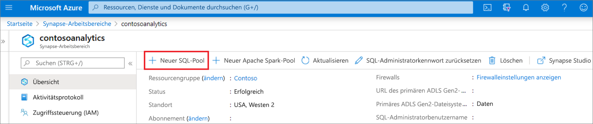
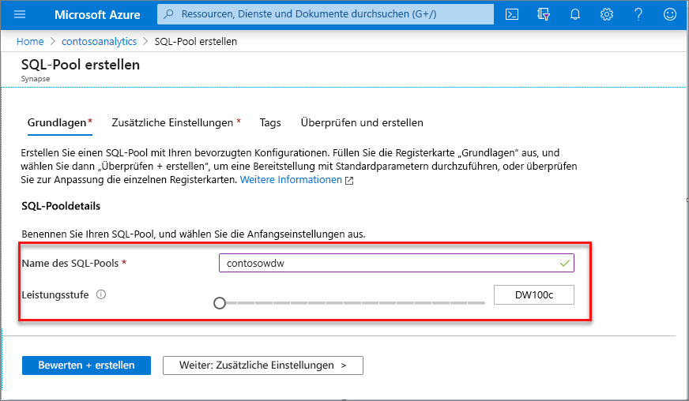
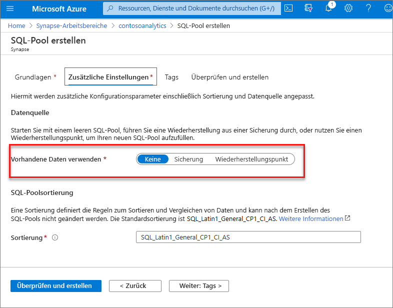
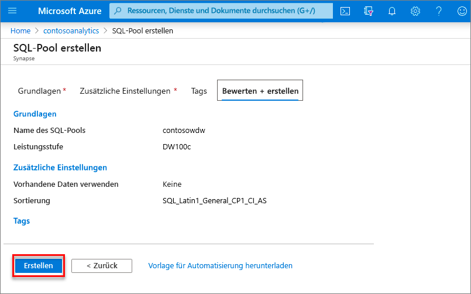
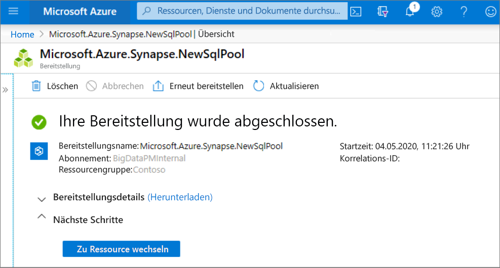
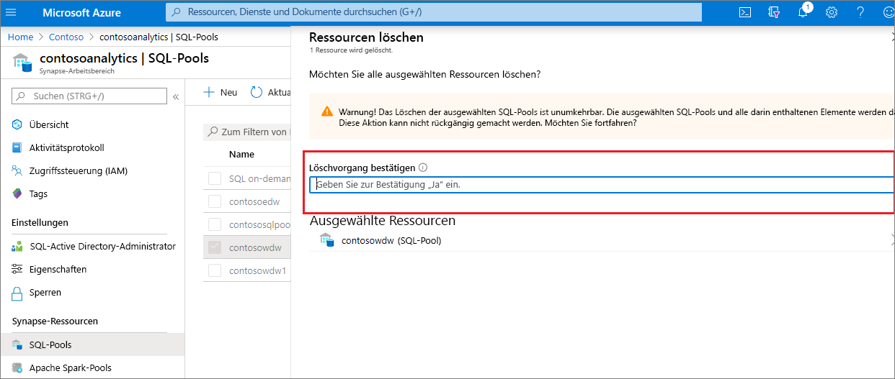

# Schnellstart: Erstellen eines dedizierten SQL-Pools (Vorschau) über das Azure-Portal

Azure Synapse Analytics enthält verschiedene Analysemodule, mit denen Sie Ihre Daten erfassen, transformieren, modellieren und analysieren können. Ein dedizierter SQL-Pool bietet T-SQL-basierte Compute- und Speicherfunktionen. Nach der Erstellung eines dedizierten SQL-Pools in Ihrem Synapse-Arbeitsbereich können Daten geladen, modelliert, verarbeitet und für einen schnelleren analytischen Einblick bereitgestellt werden.

In dieser Schnellstartanleitung erfahren Sie, wie Sie über das Azure-Portal einen dedizierten SQL-Pool in einem Synapse-Arbeitsbereich erstellen.

Wenn Sie kein Azure-Abonnement besitzen, können Sie ein [kostenloses Konto](https://azure.microsoft.com/free/) erstellen, bevor Sie beginnen.

## Voraussetzungen

- Azure-Abonnement – [Erstellen eines kostenlosen Kontos](https://azure.microsoft.com/free/)
- [Synapse-Arbeitsbereich](./quickstart-create-workspace.md)

## Melden Sie sich auf dem Azure-Portal an.

Melden Sie sich beim [Azure-Portal](https://portal.azure.com/)

## Navigieren zum Synapse-Arbeitsbereich

1. Navigieren Sie zu dem Synapse-Arbeitsbereich, in dem der dedizierte SQL-Pool erstellt werden soll, indem Sie in die Suchleiste den Dienstnamen (oder direkt den Ressourcennamen) eingeben.
 
1. Geben Sie in der Liste der Arbeitsbereiche den Namen (oder einen Teil des Namens) des zu öffnenden Arbeitsbereichs ein. In diesem Beispiel verwenden wir einen Arbeitsbereich namens **contosoanalytics**.

## Erstellen eines neuen dedizierten SQL-Pools

1. Wählen Sie in dem Synapse-Arbeitsbereich, in dem Sie den dedizierten SQL-Pool erstellen möchten, auf der oberen Leiste den Befehl **New dedicated SQL pool** (Neuer dedizierter SQL-Pool) aus.

2. Geben Sie auf der Registerkarte **Grundeinstellungen** die folgenden Informationen ein:

    | Einstellung | Vorgeschlagener Wert | BESCHREIBUNG |
    | :------ | :-------------- | :---------- |
    | **dedicated SQL pool name** (Name des dedizierten SQL-Pools) | Ein gültiger Name | Name des dedizierten SQL-Pools |
    | **Leistungsstufe** | DW100c | Legen Sie die kleinste Größe fest, um die Kosten für diesen Schnellstart zu senken. |

  
    

    > [!IMPORTANT]
    > Beachten Sie, dass für die Namen, die für dedizierte SQL-Pools verwendet werden können, bestimmte Einschränkungen gelten. Namen dürfen keine Sonderzeichen enthalten, höchstens 15 Zeichen lang sein und keine reservierten Wörter enthalten und müssen im Arbeitsbereich eindeutig sein.

3. Klicken Sie auf **Weiter: Zusätzliche Einstellungen**.
4. Wählen Sie **Keine** aus, um den dedizierten SQL-Pool ohne Daten bereitzustellen. Übernehmen Sie die ausgewählte Standardsortierung.

5. Klicken Sie auf **Überprüfen + erstellen**.
6. Vergewissern Sie sich anhand der vorherigen Eingaben, dass die Details korrekt sind. Klicken Sie auf **Erstellen**.

7. Der Flow für die Ressourcenbereitstellung wird nun gestartet.
 

8. Wenn Sie nach Abschluss der Bereitstellung zurück zum Arbeitsbereich navigieren, wird ein neuer Eintrag für den neu erstellten dedizierten SQL-Pool angezeigt.
 

Nach der Erstellung des dedizierten SQL-Pools ist er im Arbeitsbereich zum Laden von Daten, Verarbeiten von Datenströmen, Lesen aus dem Data Lake usw. verfügbar.

## Bereinigen von Ressourcen

Führen Sie die folgenden Schritte aus, um den dedizierten SQL-Pool aus dem Arbeitsbereich zu löschen.
> [!WARNING]
> Wenn Sie einen dedizierten SQL-Pool löschen, werden die Analyse-Engine und die in der Datenbank des gelöschten dedizierten SQL-Pools gespeicherten Daten aus dem Arbeitsbereich entfernt. Sie können keine Verbindung mehr mit dem dedizierten SQL-Pool herstellen, und alle Abfragen, Pipelines und Notebooks, die aus diesem SQL-Pool lesen oder in diesen dedizierten SQL-Pool schreiben, funktionieren nicht mehr.

Führen Sie die folgenden Schritte aus, wenn Sie den dedizierten SQL-Pool löschen möchten:

1. Navigieren Sie auf dem Blatt des Arbeitsbereichs zum Blatt mit den SQL-Pools.
1. Wählen Sie den zu löschenden dedizierten SQL-Pool aus (in diesem Fall **contosowdw** ).
1. Klicken Sie nach der Auswahl auf **Löschen**.
1. Bestätigen Sie den Löschvorgang, und klicken Sie auf die Schaltfläche **Löschen** : 
1. Wenn der Vorgang erfolgreich abgeschlossen wurde, wird der dedizierte SQL-Pool nicht mehr in den Arbeitsbereichsressourcen aufgeführt.

## Nächste Schritte

- Weitere Informationen finden Sie unter [Schnellstart: Erstellen eines Apache Spark-Pools in Azure Synapse Analytics mithilfe von Webtools](quickstart-apache-spark-notebook.md).
- Weitere Informationen finden Sie unter [Schnellstart: Erstellen eines serverlosen Apache Spark-Pools über das Azure-Portal](quickstart-create-apache-spark-pool-portal.md).
