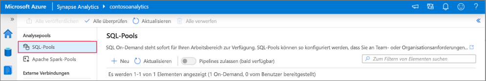
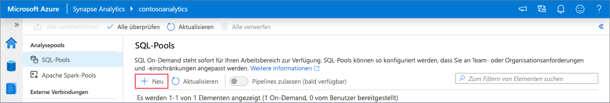
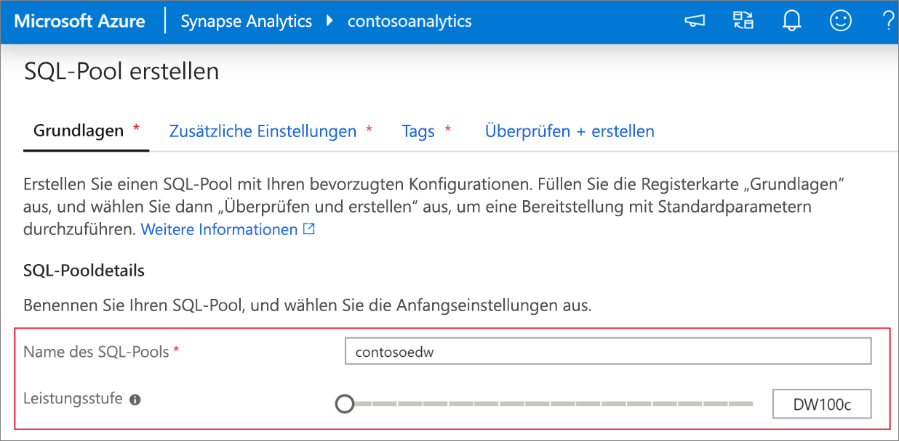
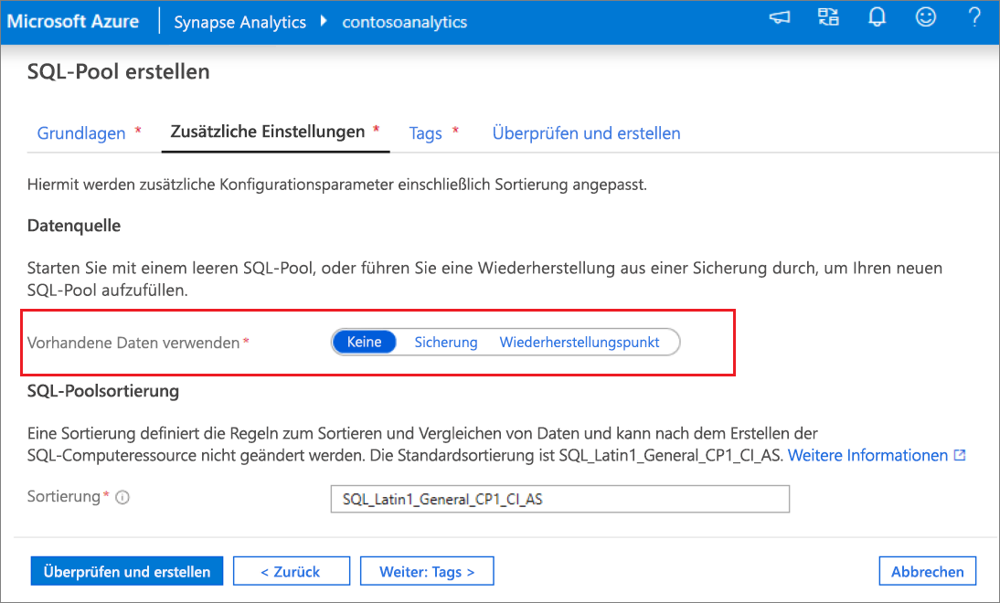
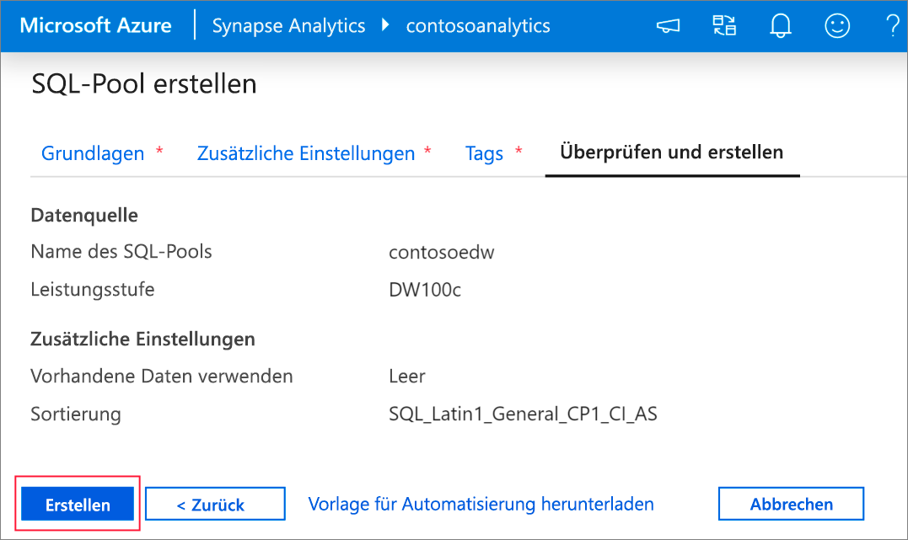
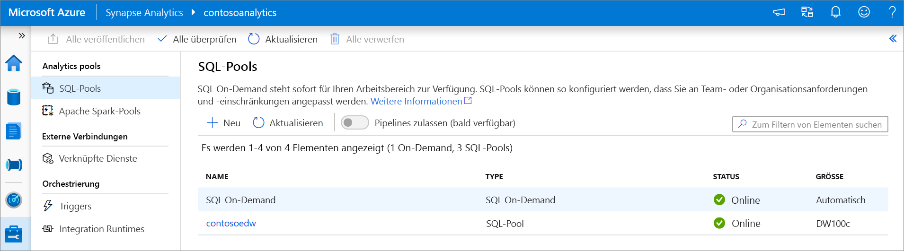
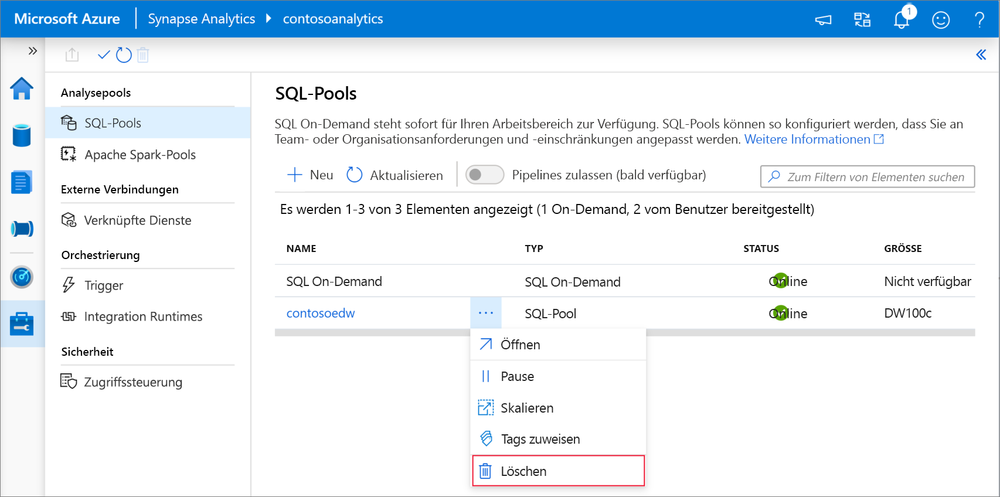

# Schnellstart: Erstellen eines dedizierten SQL-Pools mithilfe von Synapse Studio

Azure Synapse Analytics enthält verschiedene Analysemodule, mit denen Sie Ihre Daten erfassen, transformieren, modellieren und analysieren können. Ein dedizierter SQL-Pool bietet T-SQL-basierte Compute- und Speicherfunktionen. Nach der Erstellung eines dedizierten SQL-Pools in Ihrem Synapse-Arbeitsbereich können Daten geladen, modelliert, verarbeitet und für einen schnelleren analytischen Einblick bereitgestellt werden.

In dieser Schnellstartanleitung werden die Schritte zum Erstellen eines dedizierten SQL-Pools in einem Synapse-Arbeitsbereich mithilfe von Synapse Studio erläutert.

Wenn Sie kein Azure-Abonnement besitzen, können Sie ein [kostenloses Konto](https://azure.microsoft.com/free/) erstellen, bevor Sie beginnen.

## Voraussetzungen

- Azure-Abonnement – [Erstellen eines kostenlosen Kontos](https://azure.microsoft.com/free/)
- [Synapse-Arbeitsbereich](quickstart-create-workspace.md)

## Melden Sie sich auf dem Azure-Portal an.

Melden Sie sich beim [Azure-Portal](https://portal.azure.com/)

## Navigieren zum Synapse-Arbeitsbereich

1. Navigieren Sie zu dem Synapse-Arbeitsbereich, in dem der dedizierte SQL-Pool erstellt werden soll, indem Sie in die Suchleiste den Dienstnamen (oder direkt den Ressourcennamen) eingeben.

    
1. Geben Sie in der Liste der Arbeitsbereiche den Namen (oder einen Teil des Namens) des zu öffnenden Arbeitsbereichs ein. In diesem Beispiel verwenden wir einen Arbeitsbereich namens **contosoanalytics**.

    

## Starten von Synapse Studio

1. Wählen Sie in der Arbeitsbereichsübersicht die **Web-URL für den Arbeitsbereich** aus, um Synapse Studio zu starten.

    

## Erstellen eines dedizierten SQL-Pools in Synapse Studio

1. Navigieren Sie auf der Synapse Studio-Startseite im linken Navigationsbereich zum **Verwaltungshub**, indem Sie das Symbol **Verwalten** auswählen.

    

1. Sobald Sie sich im Verwaltungshub befinden, navigieren Sie zum Abschnitt **SQL-Pools**, um die aktuelle Liste der SQL-Pools anzuzeigen, die im Arbeitsbereich verfügbar sind.

    

1. Wählen Sie den Befehl **+ Neu** aus. Dann wird der Assistent zum Erstellen eines neuen SQL-Pools angezeigt. 

    

1. Geben Sie auf der Registerkarte **Grundeinstellungen** die folgenden Informationen ein:

    | Einstellung | Vorgeschlagener Wert | BESCHREIBUNG |
    | :------ | :-------------- | :---------- |
    | **Name des SQL-Pools** | contosoedw | Dies ist der vorgesehene Name für den dedizierten SQL-Pool. |
    | **Leistungsstufe** | DW100c | Legen Sie diese Einstellung auf die kleinste Größe fest, um die Kosten für diesen Schnellstart zu senken. |

    
    > [!IMPORTANT]
    > Beachten Sie, dass für die Namen, die für dedizierte SQL-Pools verwendet werden können, bestimmte Einschränkungen gelten. Namen dürfen keine Sonderzeichen enthalten, höchstens 15 Zeichen lang sein und keine reservierten Wörter enthalten und müssen im Arbeitsbereich eindeutig sein.

4. Wählen Sie auf der nächsten Registerkarte, **Zusätzliche Einstellungen**, die Option **Keine** aus, um den SQL-Pool ohne Daten bereitzustellen. Übernehmen Sie die bereits ausgewählte Standardsortierung.

    Wenn Sie Ihren dedizierten SQL-Pool von einem Wiederherstellungspunkt wiederherstellen möchten, wählen Sie **Wiederherstellungspunkt** aus. Weitere Informationen zum Ausführen einer Wiederherstellung finden Sie unter [Gewusst wie: Wiederherstellen eines vorhandenen dedizierten SQL-Pools](backuprestore/restore-sql-pool.md)

    

1. Wir fügen vorerst keine Tags hinzu. Wählen Sie also als Nächstes **Überprüfen + erstellen** aus.

1. Vergewissern Sie sich auf der Grundlage der vorherigen Eingaben auf der Registerkarte **Überprüfen + erstellen**, dass die Details korrekt sind, und klicken Sie auf **Erstellen**. 

    

1. Der Flow für die Ressourcenbereitstellung wird nun gestartet.

1. Wenn Sie nach Abschluss der Bereitstellung zurück zum Arbeitsbereich navigieren, wird ein neuer Eintrag für den neu erstellten SQL-Pool angezeigt.

    

1. Nach der Erstellung des dedizierten SQL-Pools ist er im Arbeitsbereich zum Laden von Daten, Verarbeiten von Datenströmen, Lesen aus dem Data Lake usw. verfügbar.

## Bereinigen eines dedizierten SQL-Pools mithilfe von Synapse Studio    

Führen Sie die folgenden Schritte aus, um den dedizierten SQL-Pool mithilfe von Synapse Studio aus dem Arbeitsbereich zu löschen.
> [!WARNING]
> Wenn Sie einen dedizierten SQL-Pool löschen, wird das Analysemodul aus dem Arbeitsbereich entfernt. Sie können keine Verbindung mehr mit dem Pool herstellen, und alle Abfragen, Pipelines und Skripts, die diesen dedizierten SQL-Pool verwenden, funktionieren nicht mehr.

Wenn Sie den dedizierten SQL-Pool löschen möchten, führen Sie die folgenden Schritte aus:

1. Navigieren Sie in Synapse Studio im Verwaltungshub zu den SQL-Pools.
1. Wählen Sie die Auslassungspunkte in dem zu löschenden dedizierten SQL-Pool (in diesem Fall **contosoedw**) aus, um die Befehle für den dedizierten SQL-Pool anzuzeigen:

    
1. Klicken Sie auf **Löschen**.
1. Bestätigen Sie den Löschvorgang, und klicken Sie auf die Schaltfläche **Löschen**.
1. Wenn der Vorgang erfolgreich abgeschlossen wurde, wird der dedizierte SQL-Pool nicht mehr in den Arbeitsbereichsressourcen aufgeführt.

## Nächste Schritte
 
- Weitere Informationen finden Sie unter [Schnellstart: Erstellen eines Apache Spark-Notebooks](quickstart-apache-spark-notebook.md).
- Weitere Informationen finden Sie unter [Schnellstart: Erstellen eines dedizierten SQL-Pools mithilfe des Azure-Portals](quickstart-create-sql-pool-portal.md).
