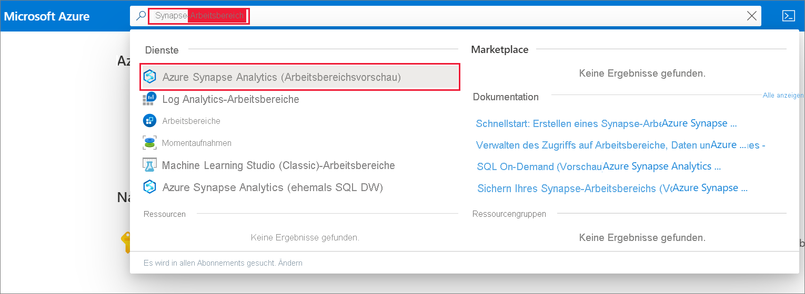
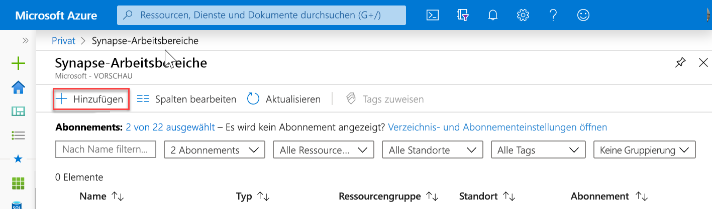
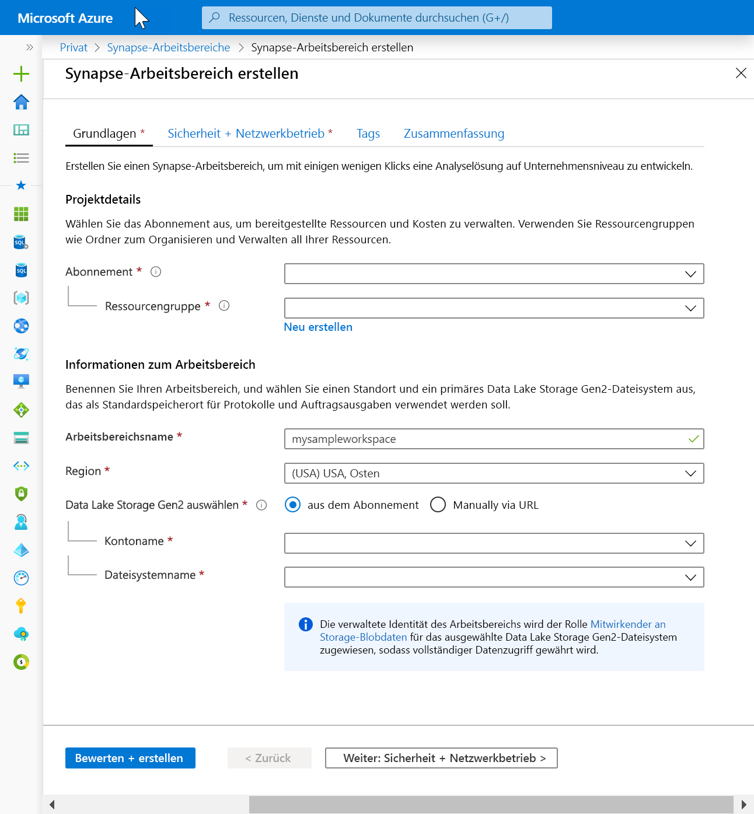
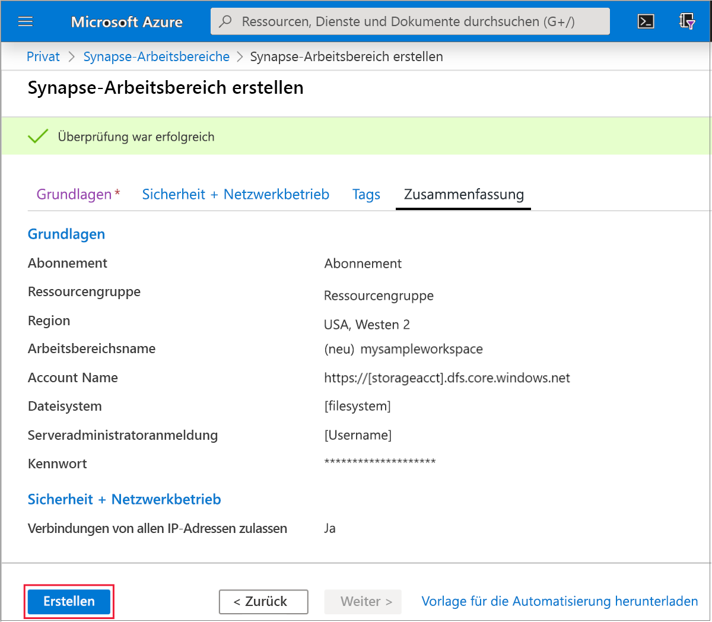
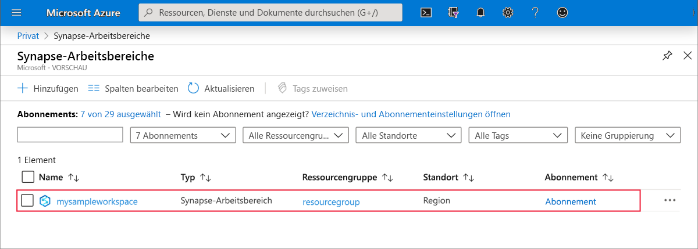
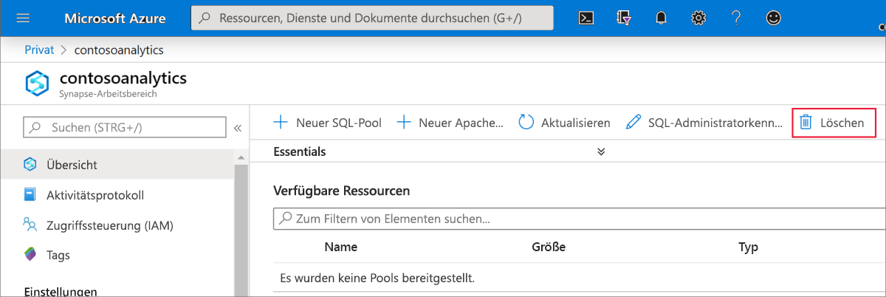
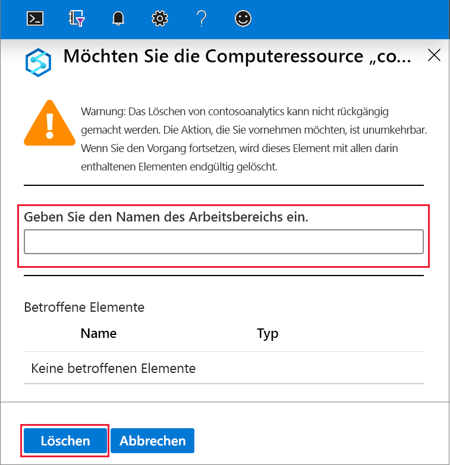

# Schnellstart: Erstellen eines Azure Synapse Analytics-Arbeitsbereichs (Vorschauversion)

In dieser Schnellstartanleitung werden die Schritte zum Erstellen eines Azure Synapse-Arbeitsbereichs über das Azure-Portal erläutert.

Wenn Sie kein Azure-Abonnement besitzen, können Sie ein [kostenloses Konto](https://azure.microsoft.com/free/) erstellen, bevor Sie beginnen.

## Voraussetzungen

- [Azure Data Lake Storage Gen2-Speicherkonto](../storage/common/storage-account-create.md?toc=/azure/synapse-analytics/toc.json&bc=/azure/synapse-analytics/breadcrumb/toc.json)

## Melden Sie sich auf dem Azure-Portal an.

Melden Sie sich beim [Azure-Portal](https://portal.azure.com/)

## Erstellen eines Azure Synapse-Arbeitsbereichs über das Azure-Portal

1. Geben Sie im Suchbereich von Microsoft Azure den Suchbegriff **Synapse-Arbeitsbereiche** ein, und wählen Sie dann diesen Dienst aus.

2. Klicken Sie auf der Seite **Synapse workspaces** (Synapse-Arbeitsbereiche) auf **+ Hinzufügen**.

3. Füllen Sie das Formular für den **Azure Synapse-Arbeitsbereich** mit den folgenden Informationen aus:

    | Einstellung | Vorgeschlagener Wert | BESCHREIBUNG |
    | :------ | :-------------- | :---------- |
    | **Abonnement** | *Ihr Abonnement* | Ausführliche Informationen zu Ihren Abonnements finden Sie unter [Abonnements](https://account.windowsazure.com/Subscriptions). |
    | **Ressourcengruppe** | *Beliebige Ressourcengruppe* | Gültige Ressourcengruppennamen finden Sie unter [Naming rules and restrictions](/azure/architecture/best-practices/resource-naming.md?toc=/azure/synapse-analytics/toc.json&bc=/azure/synapse-analytics/breadcrumb/toc.json&view=azure-sqldw-latest) (Benennungsregeln und Einschränkungen). |
    | **Arbeitsbereichsname** | mysampleworkspace | Gibt den Namen des Arbeitsbereichs an, der auch für Verbindungsendpunkte verwendet wird.|
    | **Region** | USA (Ost 2) | Gibt den Standort des Arbeitsbereichs an.|
    | **Data Lake Storage Gen2** | Konto: `storage account name`   Dateisystem: `root file system to use` | Gibt den Namen des ADLS Gen2-Speicherkontos, das als primärer Speicher verwendet werden soll, sowie das zu verwendende Dateisystem an.|
    ||||

    erforderlich.

    Das Speicherkonto kann wie folgt angegeben werden:
    - Über eine Liste der ADLS Gen2-Konten, die in Ihrem Abonnement verfügbar sind
    - Manuelle Eingabe unter Verwendung des Kontonamens

    > [!IMPORTANT]
    > Der Azure Synapse-Arbeitsbereich muss Lese- und Schreibvorgänge im ausgewählten ADLS Gen2-Konto ausführen können. Darüber hinaus müssen Sie für jedes Speicherkonto, das Sie als primäres Speicherkonto verknüpfen, bei der Erstellung des Speicherkontos den **hierarchischen Namespace** aktiviert haben.
    >
    > Unterhalb der ADLS Gen2-Auswahlfelder wird ein Hinweis angezeigt, dass der verwalteten Identität des Arbeitsbereichs die Rolle **Mitwirkender an Storage-Blobdaten** für das Data Lake Storage Gen2-Dateisystem zugewiesen und ihm dadurch Vollzugriff gewährt wird.

4. (Optional) Ändern Sie ggf. die Standardeinstellungen auf der Registerkarte **Sicherheit + Netzwerkbetrieb**:
5. (Optional) Fügen Sie Tags auf der Registerkarte **Tags** hinzu.
6. Auf der Registerkarte **Zusammenfassung** werden die erforderlichen Überprüfungen ausgeführt, um sicherzustellen, dass der Arbeitsbereich erfolgreich erstellt werden kann. Klicken Sie nach der Überprüfung auf **Erstellen**. 
7. Wenn die Ressourcenerstellung erfolgreich abgeschlossen wurde, wird in der Liste der Synapse-Arbeitsbereiche ein Eintrag für den erstellten Arbeitsbereich angezeigt. erforderlich.

## Bereinigen von Ressourcen

Führen Sie die folgenden Schritte aus, um den Azure Synapse-Arbeitsbereich zu löschen.
> [!WARNING]
> Wenn Sie einen Azure Synapse-Arbeitsbereich löschen, werden die Analyse-Engines und die Daten, die in der Datenbank der enthaltenen SQL-Pools gespeichert sind, sowie die Arbeitsbereichsmetadaten entfernt. Es kann keine Verbindung mehr mit den SQL-Endpunkten und den Apache Spark-Endpunkten hergestellt werden. Alle Codeartefakte werden gelöscht (Abfragen, Notebooks, Auftragsdefinitionen und Pipelines).
>
> Das Löschen des Arbeitsbereichs wirkt sich **nicht** auf die Daten in der Data Lake Store Gen2-Instanz aus, die mit dem Arbeitsbereich verknüpft ist.

Führen Sie die folgenden Schritte aus, wenn Sie den Azure Synapse-Arbeitsbereich löschen möchten:

1. Navigieren Sie zu dem Azure Synapse-Arbeitsbereich, der gelöscht werden soll.
1. Klicken Sie auf der Befehlsleiste auf **Löschen**.
 
1. Bestätigen Sie den Löschvorgang, und klicken Sie auf die Schaltfläche **Löschen**.
 
1. Wenn der Vorgang erfolgreich abgeschlossen wurde, wird der Azure Synapse-Arbeitsbereich nicht mehr in der Liste der Arbeitsbereiche aufgeführt.

## Nächste Schritte

Als Nächstes können Sie [SQL-Pools](quickstart-create-sql-pool.md) oder [Apache Spark-Pools](quickstart-create-apache-spark-pool.md) erstellen, um mit der Analyse und Untersuchung Ihrer Daten zu beginnen.
