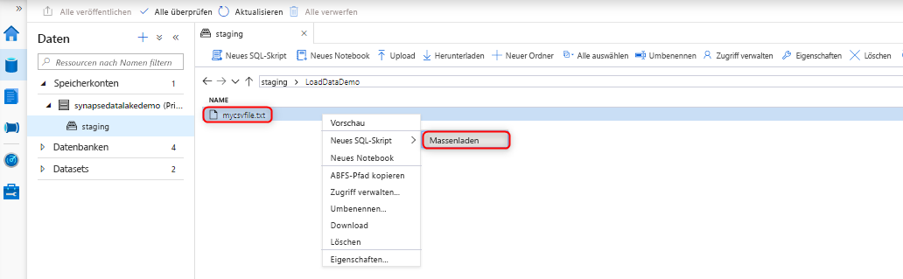
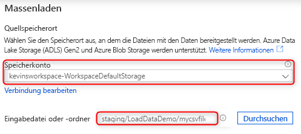
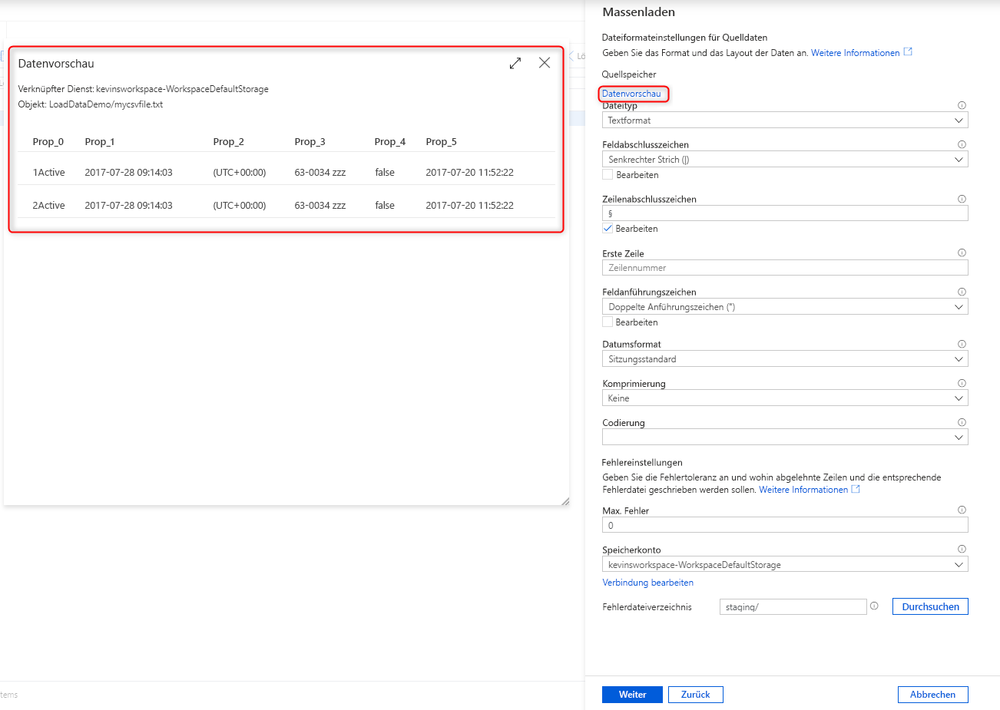
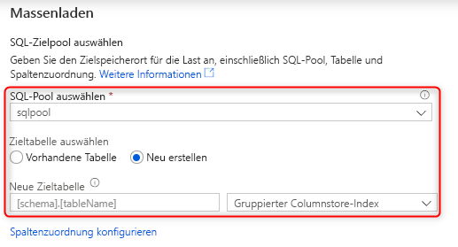
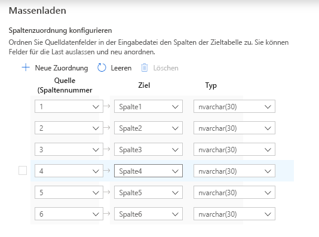
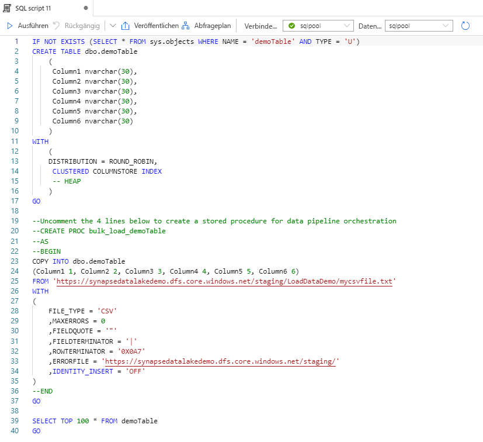

# Schnellstart: Massenladen mit Synapse SQL

Das Laden von Daten ist mit dem Massenladen-Assistenten in Synapse Studio ganz einfach. Der Massenladen-Assistent führt Sie durch die Erstellung eines T-SQL-Skripts mit der [COPY-Anweisung](/sql/t-sql/statements/copy-into-transact-sql?view=azure-sqldw-latest&preserve-view=true) zum Massenladen von Daten. 

## Einstiegspunkte für den Massenladen-Assistenten

Das Massenladen von Daten unter Verwendung von dedizierten SQL-Pools ist ganz einfach und kann mit einem Rechtsklick auf die folgenden Bereiche in Synapse Studio durchgeführt werden:

- Eine Datei oder ein Ordner aus einem mit Ihrem Arbeitsbereich verknüpften Azure-Speicherkonto 

## Voraussetzungen

- Dieser Assistent generiert eine COPY-Anweisung, die AAD-Passthrough für die Authentifizierung verwendet. Ihr [Azure AD-Benutzer benötigt Zugriff](
./sql-data-warehouse/quickstart-bulk-load-copy-tsql-examples.md#d-azure-active-directory-authentication) auf den Arbeitsbereich. Dazu muss ihm mindestens die Azure-Rolle „Mitwirkender an Storage-Blobdaten“ für das ADLS Gen2-Konto zugewiesen sein. 

- Falls Sie als Ziel für den Ladevorgang eine neue Tabelle erstellen, müssen Sie über die erforderlichen [Berechtigungen für die Verwendung der COPY-Anweisung](/sql/t-sql/statements/copy-into-transact-sql?view=azure-sqldw-latest&preserve-view=true#permissions) sowie über Berechtigungen für die Tabellenerstellung verfügen.

- Der verknüpfte Dienst, der dem ADLS Gen2-Konto zugeordnet ist, muss über **Zugriff auf die Datei**/**den Ordner** verfügen. Wenn für den verknüpften Dienst beispielsweise „Verwaltete Identität“ als Authentifizierungsmechanismus verwendet wird, muss die verwaltete Identität für den Arbeitsbereich mindestens über Speicherblob-Leseberechtigung für das Speicherkonto verfügen.

- Wenn für Ihren Arbeitsbereich ein VNET aktiviert ist, stellen Sie sicher, dass für die integrierte Laufzeit, die den verknüpften Diensten des ADLS Gen2-Kontos für den Speicherort der Quelldaten und der Fehlerdatei zugeordnet ist, die interaktive Erstellung aktiviert ist. Die interaktive Erstellung ist für die automatische Schemaerkennung sowie zum Anzeigen einer Vorschau der Quelldateiinhalte und zum Durchsuchen von ADLS Gen2-Speicherkonten innerhalb des Assistenten erforderlich.

### Schritte

1. Wählen Sie im Bereich für den Quellspeicherort das Speicherkonto und die Datei bzw. den Ordner aus, die bzw. den Sie als Quelle für den Ladevorgang verwenden möchten. Der Assistent versucht automatisch, Parquet-Dateien und CSV-Dateien (durch Trennzeichen getrennte Textdateien) zu erkennen, einschließlich der Zuordnung der Quellfelder aus der Datei zu den entsprechenden SQL-Zieldatentypen. 

   

2. Wählen Sie die Dateiformateinstellungen einschließlich Ihrer Fehlereinstellungen für den Fall aus, dass es während des Massenladevorgangs abgelehnte Zeilen gibt. Sie können „Datenvorschau“ auswählen, um zu sehen, wie die Datei von der COPY-Anweisung analysiert wird. Dies ist hilfreich beim Konfigurieren der Dateiformateinstellungen. Wählen Sie nach jeder Änderung einer Dateiformateinstellung „Datenvorschau“ aus, um zu sehen, wie die Datei mit der aktualisierten Einstellung von der COPY-Anweisung analysiert wird:

    

> [!NOTE]  
>
> - Das Anzeigen einer Vorschau für die Daten mit mehrstelligen Feldabschlusszeichen wird im Massenladen-Assistenten nicht unterstützt. Der Massenladen-Assistent zeigt eine Vorschau der Daten in einer einzelnen Spalte an, wenn ein mehrstelliges Feldabschlusszeichen angegeben wird. 
> - Bei Auswahl von „Infer column names“ (Spaltennamen ableiten) analysiert der Assistent zum Massenladen die Spaltennamen aus der ersten Zeile, die durch das Feld „Erste Zeile“ angegeben wird. Der Assistent zum Massenladen erhöht automatisch den Wert von „FIRSTROW“ in der COPY-Anweisung um „1“, damit diese Kopfzeile ignoriert wird. 
> - Die Angabe von mehrstelligen Zeilenabschlusszeichen wird in der COPY-Anweisung unterstützt. Im Assistenten zum Massenladen wird dies jedoch nicht unterstützt, wodurch ein Fehler ausgelöst wird.

3. Wählen Sie den zum Laden verwendeten dedizierten SQL-Pool aus, und geben Sie an, ob es sich um einen Ladevorgang für eine bereits vorhandene oder für eine neue Tabelle handelt: 
4. Wählen Sie die Option zum Konfigurieren der Spaltenzuordnung aus, und vergewissern Sie sich, dass die Spaltenzuordnung korrekt ist. Beachten Sie, dass Spaltennamen automatisch erkannt werden, wenn „Infer column names“ (Spaltennamen ableiten) aktiviert wurde. Bei neuen Tabellen muss die Spaltenzuordnung unbedingt konfiguriert werden, um die Datentypen der Zielspalten zu aktualisieren:

   
5. Wählen Sie die Option zum Öffnen des Skripts aus. Daraufhin wird ein T-SQL-Skript mit der COPY-Anweisung generiert, um Daten aus Ihrem Data Lake zu laden: 

## Nächste Schritte

- Lesen Sie den [Artikel zur COPY-Anweisung](/sql/t-sql/statements/copy-into-transact-sql?view=azure-sqldw-latest&preserve-view=true#syntax), um weitere Informationen zu Kopierfunktionen zu erhalten.
- Lesen Sie den [Übersichtsartikel zum Laden von Daten](./sql-data-warehouse/design-elt-data-loading.md#what-is-elt).
