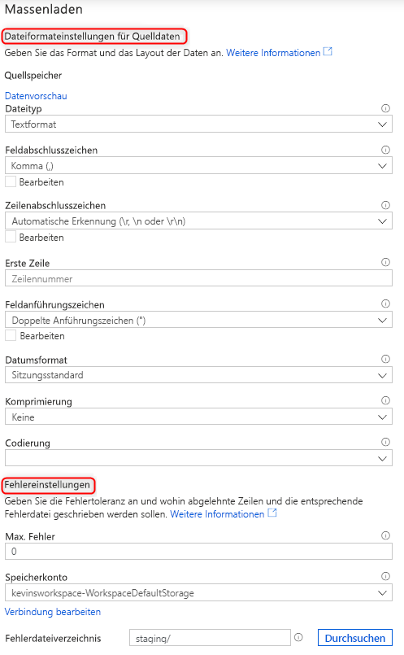

# Massenladen mit Synapse SQL

Der Massenladen-Assistent in Synapse Studio macht das Laden von Daten so einfach wie nie. Dieser Assistent führt Sie durch die Erstellung eines T-SQL-Skripts mit der [COPY-Anweisung](https://docs.microsoft.com/sql/t-sql/statements/copy-into-transact-sql?view=azure-sqldw-latest) zum Massenladen von Daten. 

## Einstiegspunkte für den Massenladen-Assistenten

Das Massenladen von Daten unter Verwendung von SQL-Pools ist jetzt ganz einfach und kann mit einem Rechtsklick auf die folgenden Bereiche in Synapse Studio durchgeführt werden:

- Eine Datei oder ein Ordner aus einem mit Ihrem Arbeitsbereich verknüpften Azure-Speicherkonto 

## Voraussetzungen

- Dieser Assistent generiert eine COPY-Anweisung, die AAD-Pass-Through für die Autorisierung verwendet. Der [AAD-Benutzer muss Zugriff](https://docs.microsoft.com/azure/synapse-analytics/sql-data-warehouse/quickstart-bulk-load-copy-tsql-examples#d-azure-active-directory-authentication-aad) auf den Arbeitsbereich mindestens über die RBAC-Rolle „Mitwirkender an Storage-Blobdaten“ für das ADLS Gen2-Konto haben.

- Falls Sie als Ziel für den Ladevorgang eine neue Tabelle erstellen, müssen Sie über die erforderlichen [Berechtigungen für die Verwendung der COPY-Anweisung](https://docs.microsoft.com/sql/t-sql/statements/copy-into-transact-sql?view=azure-sqldw-latest#permissions) sowie über Berechtigungen für die Tabellenerstellung verfügen.

- Der verknüpfte Dienst, der dem ADLS Gen2-Konto zugeordnet ist, muss über **Zugriff auf die Datei**/**den Ordner** verfügen. Wenn für den verknüpften Dienst beispielsweise „Verwaltete Identität“ als Authentifizierungsmechanismus verwendet wird, muss die verwaltete Identität für den Arbeitsbereich mindestens über Speicherblob-Leseberechtigung für das Speicherkonto verfügen.

- Wenn für Ihren Arbeitsbereich ein VNET aktiviert ist, stellen Sie sicher, dass für die integrierte Laufzeit, die den verknüpften Diensten des ADLS Gen2-Kontos für den Speicherort der Quelldaten und der Fehlerdatei zugeordnet ist, die interaktive Erstellung aktiviert ist. Die interaktive Erstellung ist für die automatische Schemaerkennung sowie zum Anzeigen einer Vorschau der Quelldateiinhalte und zum Durchsuchen von ADLS Gen2-Speicherkonten innerhalb des Assistenten erforderlich.

### Schritte

1. Wählen Sie im Bereich für den Quellspeicherort das Speicherkonto und die Datei bzw. den Ordner aus, die bzw. den Sie als Quelle für den Ladevorgang verwenden möchten: 

2. Wählen Sie die Dateiformateinstellungen einschließlich des Speicherkontos aus, in das abgelehnte Zeilen geschrieben werden sollen (Fehlerdatei). Aktuell werden nur CSV- und Parquet-Dateien unterstützt.

    

3. Sie können auf „Datenvorschau“ klicken, um zu sehen, wie die Datei von der COPY-Anweisung analysiert wird, was beim Konfigurieren der Dateiformateinstellungen hilfreich ist. Klicken Sie nach jeder Änderung einer Dateiformateinstellung auf „Datenvorschau“, um zu sehen, wie die Datei mit der aktualisierten Einstellung von der COPY-Anweisung analysiert wird:  

4. Wählen Sie den zum Laden verwendeten SQL-Pool aus, und geben Sie an, ob es sich um einen Ladevorgang für eine bereits vorhandene oder für eine neue Tabelle handelt: 

5. Klicken Sie auf die Option zum Konfigurieren der Spaltenzuordnung, und vergewissern Sie sich, dass die Spaltenzuordnung korrekt ist. Bei neuen Tabellen muss die Spaltenzuordnung unbedingt konfiguriert werden, um die Datentypen der Zielspalten zu aktualisieren: 

6. Klicken Sie auf die Option zum Öffnen des Skripts. Daraufhin wird ein T-SQL-Skript mit der COPY-Anweisung generiert, um Daten aus Ihrem Data Lake zu laden: 

## Nächste Schritte

- Lesen Sie den [Artikel zur COPY-Anweisung](https://docs.microsoft.com/sql/t-sql/statements/copy-into-transact-sql?view=azure-sqldw-latest#syntax), um weitere Informationen zu Kopierfunktionen zu erhalten.
- Lesen Sie den [Übersichtsartikel zum Laden von Daten](https://docs.microsoft.com/azure/synapse-analytics/sql-data-warehouse/design-elt-data-loading#what-is-elt).
