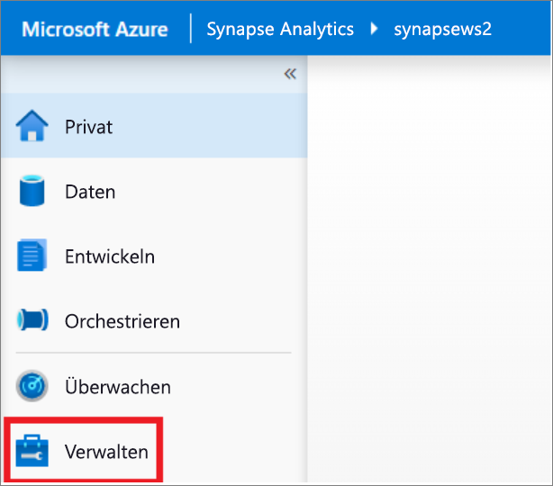
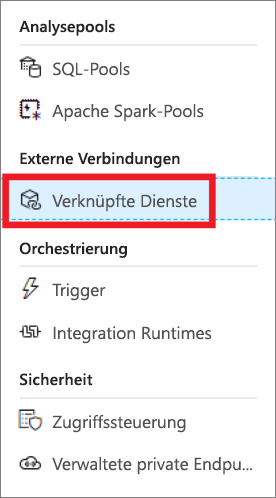
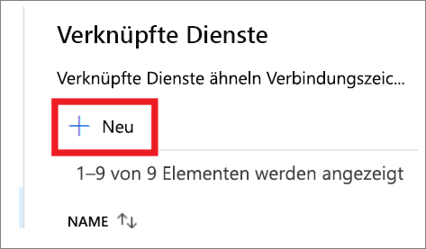
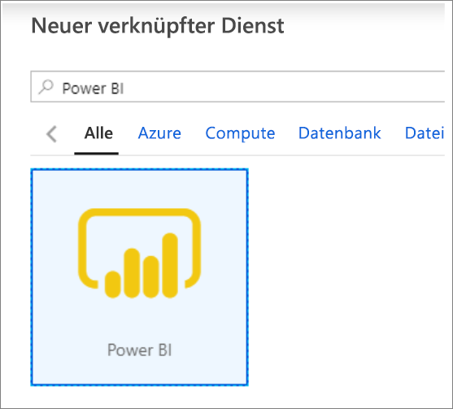
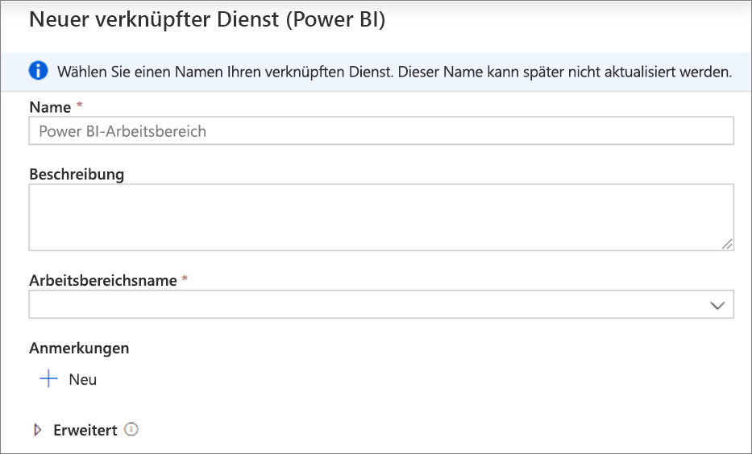
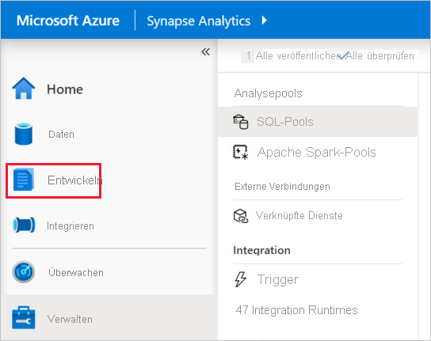
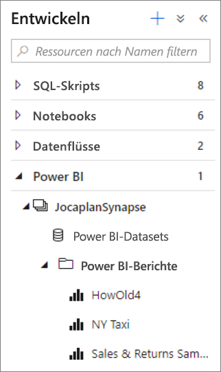
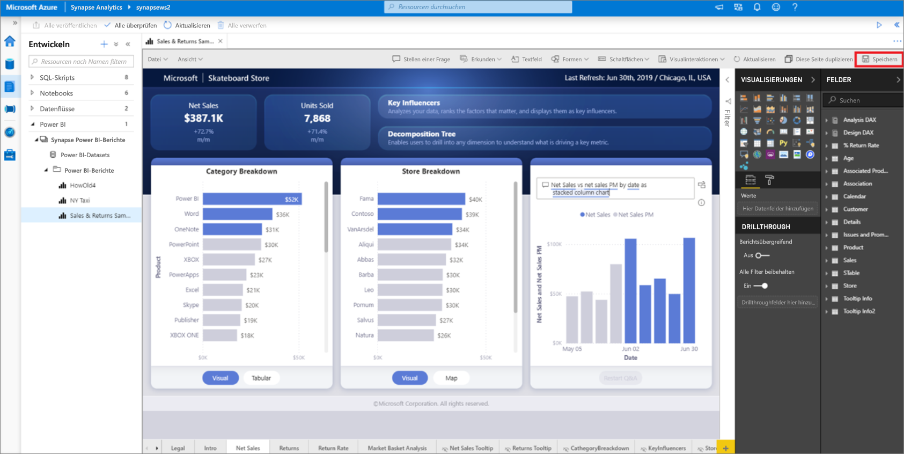

# Schnellstart: Verknüpfen eines Power BI-Arbeitsbereichs mit einem Synapse-Arbeitsbereich

In dieser Schnellstartanleitung erfahren Sie, wie Sie einen Power BI-Arbeitsbereich mit einem Azure Synapse Analytics-Arbeitsbereich verbinden, um neue Power BI-Berichte und -Datasets aus Synapse Studio zu erstellen.

Wenn Sie kein Azure-Abonnement besitzen, können Sie ein [kostenloses Konto](https://azure.microsoft.com/free/) erstellen, bevor Sie beginnen.

## Voraussetzungen

- [Erstellen eines Azure Synapse-Arbeitsbereichs und eines zugehörigen Speicherkontos](quickstart-create-workspace.md)
- [Ein Power BI Professional- oder Premium-Arbeitsbereich](/power-bi/service-create-the-new-workspaces)

## Verknüpfen eines Power BI-Arbeitsbereichs mit Ihrem Synapse-Arbeitsbereich

1. Klicken Sie, beginnend in Synapse Studio, auf **Verwalten**.

    

2. Klicken Sie unter **Externe Verbindungen** auf **Verknüpfte Dienste**.

    

3. Klicken Sie auf **+ NEU**.

    

4. Klicken Sie auf **Power BI** und dann auf **Weiter**.

    

5. Geben Sie einen Namen für den verknüpften Dienst ein, und wählen Sie einen Arbeitsbereich aus der Dropdownliste aus.

    

6. Klicken Sie auf **Erstellen**.

## Anzeigen des Power BI-Arbeitsbereichs in Synapse Studio

Nachdem Ihre Arbeitsbereiche verknüpft sind, können Sie Ihre Power BI-Datasets durchsuchen und neue Power BI-Berichte in Synapse Studio bearbeiten/erstellen.

1. Klicken Sie auf **Entwickeln**.

    

2. Erweitern Sie Power BI und den Arbeitsbereich, den Sie verwenden möchten.

    

Neue Berichte können erstellt werden, indem Sie auf oben auf der Registerkarte **Entwickeln** auf **+** klicken. Vorhandene Berichte können bearbeitet werden, indem Sie auf den Berichtsnamen klicken. Alle gespeicherten Änderungen werden in den Power BI-Arbeitsbereich zurückgeschrieben.

## Nächste Schritte

Weitere Informationen finden Sie unter [Erstellen eines Power BI-Berichts für in Azure Storage gespeicherte Dateien](sql/tutorial-connect-power-bi-desktop.md).