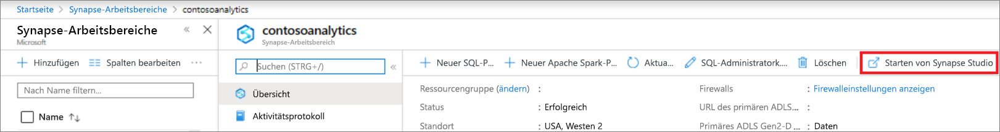
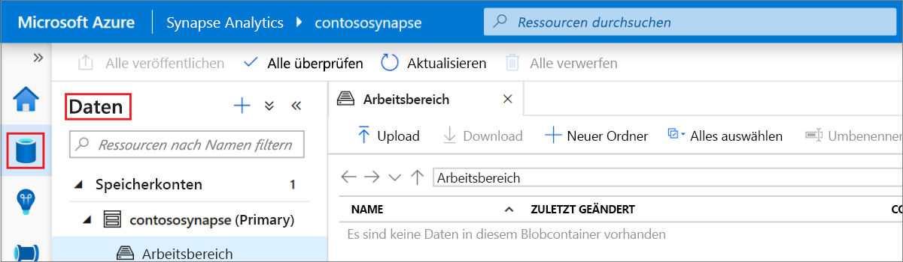
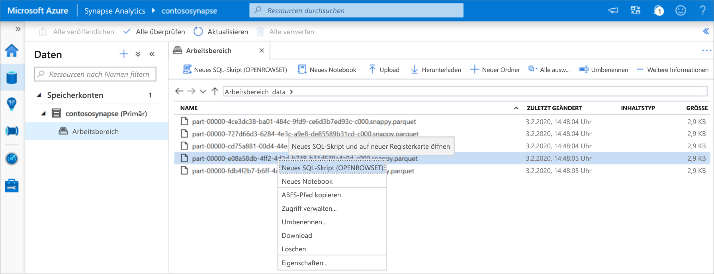
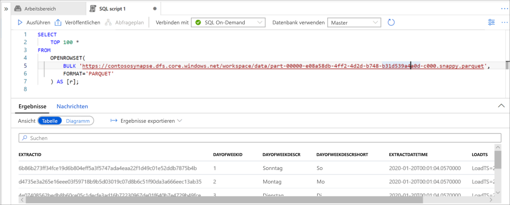

# Schnellstart: Verwenden von Synapse Studio (Vorschauversion)

In dieser Schnellstartanleitung erfahren Sie, wie Sie Dateien mithilfe von Synapse Studio abfragen.

Wenn Sie kein Azure-Abonnement besitzen, können Sie ein [kostenloses Konto](https://azure.microsoft.com/free/) erstellen, bevor Sie beginnen.

## Melden Sie sich auf dem Azure-Portal an.

Melden Sie sich beim [Azure-Portal](https://portal.azure.com/) an.

## Voraussetzungen

[Erstellen Sie einen Azure Synapse-Arbeitsbereich und ein zugehöriges Speicherkonto.](quickstart-create-workspace.md)

## Starten von Synapse Studio

Klicken Sie in Ihrem Azure Synapse-Arbeitsbereich im Azure-Portal auf **Synapse Studio starten**.

Alternativ dazu können Sie Synapse Studio starten, indem Sie auf [Azure Synapse Analytics](https://web.azuresynapse.net) klicken und die entsprechenden Werte für Mandant, Abonnement und Arbeitsbereich eingeben.

## Durchsuchen von Speicherkonten

Navigieren Sie nach dem Öffnen von Synapse Studio zu **Daten**, und erweitern Sie dann **Speicherkonten**, um das Speicherkonto im Arbeitsbereich anzuzeigen.

Mithilfe der Links auf der Symbolleiste können Sie neue Ordner erstellen und Dateien hochladen, um Ihre Dateien zu organisieren.

## Abfragen von Dateien im Speicherkonto

> [!IMPORTANT]
> Sie müssen ein Mitglied der Rolle `Storage Blob Reader` im zugrunde liegenden Speicher sein, um die Dateien abfragen zu können. Lesen Sie, wie Sie die [RBAC-Berechtigung **Storage-Blobdatenleser** oder **Mitwirkender an Storage-Blobdaten** für Azure Storage zuweisen](../storage/common/storage-auth-aad-rbac-portal.md?toc=/azure/synapse-analytics/toc.json&bc=/azure/synapse-analytics/breadcrumb/toc.json#assign-a-built-in-rbac-role).

1. Laden Sie einige `PARQUET`-Dateien hoch.
2. Wählen Sie mindestens eine Datei aus, und erstellen Sie dann ein neues SQL-Skript oder ein Spark-Notebook, um den Inhalt der Dateien anzuzeigen. Wenn Sie ein Notebook erstellen möchten, müssen Sie einen [Apache Spark-Pool im Arbeitsbereich](spark/apache-spark-notebook-create-spark-use-sql.md) erstellen.

   

3. Führen Sie die generierte Abfrage oder das generierte Notebook aus, um den Inhalt der Datei anzuzeigen:

   

4. Sie können die Abfrage ändern, um Ergebnisse zu filtern und zu sortieren. In der [Übersicht über SQL-Features](sql/overview-features.md) finden Sie Informationen zu den in SQL On-Demand verfügbaren Sprachfeatures.

## Nächste Schritte

- Ermöglichen Sie Azure AD-Benutzern das Abfragen von Dateien, indem Sie die [RBAC-Berechtigung **Storage-Blobdatenleser** oder **Mitwirkender an Storage-Blobdaten** für Azure Storage zuweisen](../storage/common/storage-auth-aad-rbac-portal.md?toc=/azure/synapse-analytics/toc.json&bc=/azure/synapse-analytics/breadcrumb/toc.json#assign-a-built-in-rbac-role).
- [Abfragen von Dateien in Azure Storage mithilfe von SQL On-Demand](sql/on-demand-workspace-overview.md)
- [Erstellen eines Apache Spark-Pools](spark/apache-spark-notebook-create-spark-use-sql.md)
- [Erstellen eines Power BI-Berichts für in Azure Storage gespeicherte Dateien](sql/tutorial-connect-power-bi-desktop.md)
